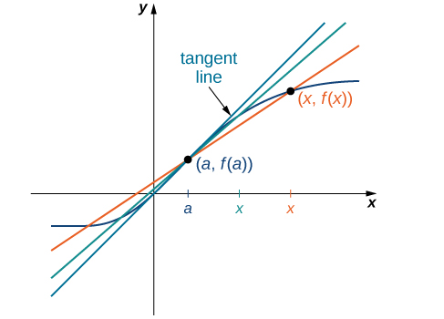
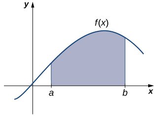

* Describe the tangent problem and how it led to the idea of a derivative.
* Explain how the idea of a limit is involved in solving the tangent problem.
* Recognize a tangent to a curve at a point as the limit of secant lines.
* Identify instantaneous velocity as the limit of average velocity over a small time interval.
* Describe the area problem and how it was solved by the integral.
* Explain how the idea of a limit is involved in solving the area problem.
* Recognize how the ideas of limit, derivative, and integral led to the studies of infinite series and multivariable calculus.

As we embark on our study of calculus, we shall see how its development arose from common solutions to practical problems in areas such as engineering physics—like the space travel problem posed in the chapter opener. Two key problems led to the initial formulation of calculus: (1) the tangent problem, or how to determine the slope of a line tangent to a curve at a point; and (2) the area problem, or how to determine the area under a curve.

# The Tangent Problem and Differential Calculus

Rate of change is one of the most critical concepts in calculus. We begin our investigation of rates of change by looking at the graphs of the three lines <math xmlns="http://www.w3.org/1998/Math/MathML"><mrow><mi>f</mi><mrow><mo>(</mo><mi>x</mi><mo>)</mo></mrow><mo>=</mo><mn>−2</mn><mi>x</mi><mo>−</mo><mn>3</mn><mo>,</mo><mi>g</mi><mrow><mo>(</mo><mi>x</mi><mo>)</mo></mrow><mo>=</mo><mfrac><mn>1</mn><mn>2</mn></mfrac><mi>x</mi><mo>+</mo><mn>1</mn><mo>,</mo></mrow></math>

 and <math xmlns="http://www.w3.org/1998/Math/MathML"><mrow><mi>h</mi><mrow><mo>(</mo><mi>x</mi><mo>)</mo></mrow><mo>=</mo><mn>2</mn><mo>,</mo></mrow></math>

 shown in [\[link\]](#CNX_Calc_Figure_02_01_001).

 {: #CNX_Calc_Figure_02_01_001}

As we move from left to right along the graph of <math xmlns="http://www.w3.org/1998/Math/MathML"><mrow><mi>f</mi><mrow><mo>(</mo><mi>x</mi><mo>)</mo></mrow><mo>=</mo><mn>−2</mn><mi>x</mi><mo>−</mo><mn>3</mn><mo>,</mo></mrow></math>

 we see that the graph decreases at a constant rate. For every 1 unit we move to the right along the *x*-axis, the *y*-coordinate decreases by 2 units. This **rate of change**{: data-type="term" .no-emphasis} is determined by the slope (−2) of the line. Similarly, the slope of 1/2 in the function <math xmlns="http://www.w3.org/1998/Math/MathML"><mrow><mi>g</mi><mrow><mo>(</mo><mi>x</mi><mo>)</mo></mrow></mrow></math>

 tells us that for every change in *x* of 1 unit there is a corresponding change in *y* of 1/2 unit. The function <math xmlns="http://www.w3.org/1998/Math/MathML"><mrow><mi>h</mi><mrow><mo>(</mo><mi>x</mi><mo>)</mo></mrow><mo>=</mo><mn>2</mn></mrow></math>

 has a slope of zero, indicating that the values of the function remain constant. We see that the slope of each linear function indicates the rate of change of the function.

Compare the graphs of these three functions with the graph of <math xmlns="http://www.w3.org/1998/Math/MathML"><mrow><mi>k</mi><mrow><mo>(</mo><mi>x</mi><mo>)</mo></mrow><mo>=</mo><msup><mi>x</mi><mn>2</mn></msup></mrow></math>

 ([\[link\]](#CNX_Calc_Figure_02_01_002)). The graph of <math xmlns="http://www.w3.org/1998/Math/MathML"><mrow><mi>k</mi><mrow><mo>(</mo><mi>x</mi><mo>)</mo></mrow><mo>=</mo><msup><mi>x</mi><mn>2</mn></msup></mrow></math>

 starts from the left by decreasing rapidly, then begins to decrease more slowly and level off, and then finally begins to increase—slowly at first, followed by an increasing rate of increase as it moves toward the right. Unlike a linear function, no single number represents the rate of change for this function. We quite naturally ask: How do we measure the rate of change of a nonlinear function?

 =x2 does not have a constant rate of change."){: #CNX_Calc_Figure_02_01_002}

We can approximate the rate of change of a function <math xmlns="http://www.w3.org/1998/Math/MathML"><mrow><mi>f</mi><mrow><mo>(</mo><mi>x</mi><mo>)</mo></mrow></mrow></math>

 at a point <math xmlns="http://www.w3.org/1998/Math/MathML"><mrow><mrow><mo>(</mo><mrow><mi>a</mi><mo>,</mo><mi>f</mi><mrow><mo>(</mo><mi>a</mi><mo>)</mo></mrow></mrow><mo>)</mo></mrow></mrow></math>

 on its graph by taking another point <math xmlns="http://www.w3.org/1998/Math/MathML"><mrow><mrow><mo>(</mo><mrow><mi>x</mi><mo>,</mo><mi>f</mi><mrow><mo>(</mo><mi>x</mi><mo>)</mo></mrow></mrow><mo>)</mo></mrow></mrow></math>

 on the graph of <math xmlns="http://www.w3.org/1998/Math/MathML"><mrow><mi>f</mi><mrow><mo>(</mo><mi>x</mi><mo>)</mo></mrow><mo>,</mo></mrow></math>

 drawing a line through the two points, and calculating the slope of the resulting line. Such a line is called a **secant**{: data-type="term"} line. [\[link\]](#CNX_Calc_Figure_02_01_003) shows a secant line to a function <math xmlns="http://www.w3.org/1998/Math/MathML"><mrow><mi>f</mi><mrow><mo>(</mo><mi>x</mi><mo>)</mo></mrow></mrow></math>

 at a point <math xmlns="http://www.w3.org/1998/Math/MathML"><mrow><mrow><mo>(</mo><mrow><mi>a</mi><mo>,</mo><mi>f</mi><mrow><mo>(</mo><mi>a</mi><mo>)</mo></mrow></mrow><mo>)</mo></mrow><mo>.</mo></mrow></math>

 ) estimates the rate of change of the function at the point (a,f(a))."){: #CNX_Calc_Figure_02_01_003}

We formally define a secant line as follows:

Definition

The **secant** to the function <math xmlns="http://www.w3.org/1998/Math/MathML"><mrow><mi>f</mi><mrow><mo>(</mo><mi>x</mi><mo>)</mo></mrow></mrow></math>

 through the points <math xmlns="http://www.w3.org/1998/Math/MathML"><mrow><mrow><mo>(</mo><mrow><mi>a</mi><mo>,</mo><mi>f</mi><mrow><mo>(</mo><mi>a</mi><mo>)</mo></mrow></mrow><mo>)</mo></mrow></mrow></math>

 and <math xmlns="http://www.w3.org/1998/Math/MathML"><mrow><mrow><mo>(</mo><mrow><mi>x</mi><mo>,</mo><mi>f</mi><mrow><mo>(</mo><mi>x</mi><mo>)</mo></mrow></mrow><mo>)</mo></mrow></mrow></math>

 is the line passing through these points. Its slope is given by

<math xmlns="http://www.w3.org/1998/Math/MathML"><mrow><msub><mi>m</mi><mrow><mtext>sec</mtext></mrow></msub><mo>=</mo><mfrac><mrow><mi>f</mi><mrow><mo>(</mo><mi>x</mi><mo>)</mo></mrow><mo>−</mo><mi>f</mi><mrow><mo>(</mo><mi>a</mi><mo>)</mo></mrow></mrow><mrow><mi>x</mi><mo>−</mo><mi>a</mi></mrow></mfrac><mo>.</mo></mrow></math>

The accuracy of approximating the rate of change of the function with a secant line depends on how close *x* is to *a*. As we see in [\[link\]](#CNX_Calc_Figure_02_01_004), if *x* is closer to *a*, the slope of the secant line is a better measure of the rate of change of <math xmlns="http://www.w3.org/1998/Math/MathML"><mrow><mi>f</mi><mrow><mo>(</mo><mi>x</mi><mo>)</mo></mrow></mrow></math>

 at *a*.

  at a."){: #CNX_Calc_Figure_02_01_004}

The secant lines themselves approach a line that is called the **tangent**{: data-type="term"} to the function <math xmlns="http://www.w3.org/1998/Math/MathML"><mrow><mi>f</mi><mrow><mo>(</mo><mi>x</mi><mo>)</mo></mrow></mrow></math>

 at *a* ([\[link\]](#CNX_Calc_Figure_02_01_005)). The slope of the tangent line to the graph at *a* measures the rate of change of the function at *a*. This value also represents the derivative of the function <math xmlns="http://www.w3.org/1998/Math/MathML"><mrow><mi>f</mi><mrow><mo>(</mo><mi>x</mi><mo>)</mo></mrow></mrow></math>

 at *a*, or the rate of change of the function at *a*. This derivative is denoted by <math xmlns="http://www.w3.org/1998/Math/MathML"><mrow><msup><mi>f</mi><mo>′</mo></msup><mrow><mo>(</mo><mi>a</mi><mo>)</mo></mrow><mo>.</mo></mrow></math>

 **Differential calculus**{: data-type="term"} is the field of calculus concerned with the study of derivatives and their applications.

For an interactive demonstration of the slope of a secant line that you can manipulate yourself, visit this applet (*Note:* this site requires a Java browser plugin): [Math Insight][1].

 {: #CNX_Calc_Figure_02_01_005}

[\[link\]](#fs-id1170573387465) illustrates how to find slopes of secant lines. These slopes estimate the slope of the tangent line or, equivalently, the rate of change of the function at the point at which the slopes are calculated.

Finding Slopes of Secant Lines

Estimate the slope of the tangent line (rate of change) to <math xmlns="http://www.w3.org/1998/Math/MathML"><mrow><mi>f</mi><mrow><mo>(</mo><mi>x</mi><mo>)</mo></mrow><mo>=</mo><msup><mi>x</mi><mn>2</mn></msup></mrow></math>

 at <math xmlns="http://www.w3.org/1998/Math/MathML"><mrow><mi>x</mi><mo>=</mo><mn>1</mn></mrow></math>

 by finding slopes of secant lines through <math xmlns="http://www.w3.org/1998/Math/MathML"><mrow><mrow><mo>(</mo><mrow><mn>1</mn><mo>,</mo><mn>1</mn></mrow><mo>)</mo></mrow></mrow></math>

 and each of the following points on the graph of <math xmlns="http://www.w3.org/1998/Math/MathML"><mrow><mi>f</mi><mrow><mo>(</mo><mi>x</mi><mo>)</mo></mrow><mo>=</mo><msup><mi>x</mi><mn>2</mn></msup><mo>.</mo></mrow></math>

1.  <math xmlns="http://www.w3.org/1998/Math/MathML"><mrow><mrow><mo>(</mo><mrow><mn>2</mn><mo>,</mo><mn>4</mn></mrow><mo>)</mo></mrow></mrow></math>

2.  <math xmlns="http://www.w3.org/1998/Math/MathML"><mrow><mrow><mo>(</mo><mrow><mfrac><mn>3</mn><mn>2</mn></mfrac><mo>,</mo><mfrac><mn>9</mn><mn>4</mn></mfrac></mrow><mo>)</mo></mrow></mrow></math>
{: data-number-style="lower-alpha"}

Use the formula for the slope of a secant line from the definition.

1.  <math xmlns="http://www.w3.org/1998/Math/MathML"><mrow><msub><mi>m</mi><mrow><mtext>sec</mtext></mrow></msub><mo>=</mo><mfrac><mrow><mn>4</mn><mo>−</mo><mn>1</mn></mrow><mrow><mn>2</mn><mo>−</mo><mn>1</mn></mrow></mfrac><mo>=</mo><mn>3</mn></mrow></math>

2.  <math xmlns="http://www.w3.org/1998/Math/MathML"><mrow><msub><mi>m</mi><mrow><mtext>sec</mtext></mrow></msub><mo>=</mo><mfrac><mrow><mfrac><mn>9</mn><mn>4</mn></mfrac><mo>−</mo><mn>1</mn></mrow><mrow><mfrac><mn>3</mn><mn>2</mn></mfrac><mo>−</mo><mn>1</mn></mrow></mfrac><mo>=</mo><mfrac><mn>5</mn><mn>2</mn></mfrac><mo>=</mo><mn>2.5</mn></mrow></math>
{: data-number-style="lower-alpha"}

The point in part b. is closer to the point <math xmlns="http://www.w3.org/1998/Math/MathML"><mrow><mrow><mo>(</mo><mrow><mn>1</mn><mo>,</mo><mn>1</mn></mrow><mo>)</mo></mrow><mo>,</mo></mrow></math>

 so the slope of 2.5 is closer to the slope of the tangent line. A good estimate for the slope of the tangent would be in the range of 2 to 2.5 ([[link]](#CNX_Calc_Figure_02_01_011)).

=x2 at (1,1) through (a) (2,4) and (b) (32,94) provide successively closer approximations to the tangent line to f(x)=x2 at (1,1)."){: #CNX_Calc_Figure_02_01_011}

Estimate the slope of the tangent line (rate of change) to <math xmlns="http://www.w3.org/1998/Math/MathML"><mrow><mi>f</mi><mrow><mo>(</mo><mi>x</mi><mo>)</mo></mrow><mo>=</mo><msup><mi>x</mi><mn>2</mn></msup></mrow></math>

 at <math xmlns="http://www.w3.org/1998/Math/MathML"><mrow><mi>x</mi><mo>=</mo><mn>1</mn></mrow></math>

 by finding slopes of secant lines through <math xmlns="http://www.w3.org/1998/Math/MathML"><mrow><mrow><mo>(</mo><mrow><mn>1</mn><mo>,</mo><mn>1</mn></mrow><mo>)</mo></mrow></mrow></math>

 and the point <math xmlns="http://www.w3.org/1998/Math/MathML"><mrow><mrow><mo>(</mo><mrow><mfrac><mn>5</mn><mn>4</mn></mfrac><mo>,</mo><mfrac><mrow><mn>25</mn></mrow><mrow><mn>16</mn></mrow></mfrac></mrow><mo>)</mo></mrow></mrow></math>

 on the graph of <math xmlns="http://www.w3.org/1998/Math/MathML"><mrow><mi>f</mi><mrow><mo>(</mo><mi>x</mi><mo>)</mo></mrow><mo>=</mo><msup><mi>x</mi><mn>2</mn></msup><mo>.</mo></mrow></math>

2\.25

Hint

Use [[link]](#fs-id1170573387465) and [[link]](#CNX_Calc_Figure_02_01_011) as a solving guide.

We continue our investigation by exploring a related question. Keeping in mind that velocity may be thought of as the rate of change of position, suppose that we have a function, <math xmlns="http://www.w3.org/1998/Math/MathML"><mrow><mi>s</mi><mrow><mo>(</mo><mi>t</mi><mo>)</mo></mrow><mo>,</mo></mrow></math>

 that gives the position of an object along a coordinate axis at any given time *t*. Can we use these same ideas to create a reasonable definition of the instantaneous velocity at a given time <math xmlns="http://www.w3.org/1998/Math/MathML"><mrow><mi>t</mi><mo>=</mo><mi>a</mi><mo>?</mo></mrow></math>

 We start by approximating the instantaneous velocity with an average velocity. First, recall that the speed of an object traveling at a constant rate is the ratio of the distance traveled to the length of time it has traveled. We define the **average velocity**{: data-type="term"} of an object over a time period to be the change in its position divided by the length of the time period.

Definition

Let <math xmlns="http://www.w3.org/1998/Math/MathML"><mrow><mi>s</mi><mrow><mo>(</mo><mi>t</mi><mo>)</mo></mrow></mrow></math>

 be the position of an object moving along a coordinate axis at time *t*. The **average velocity** of the object over a time interval <math xmlns="http://www.w3.org/1998/Math/MathML"><mrow><mrow><mo>[</mo><mrow><mi>a</mi><mo>,</mo><mi>t</mi></mrow><mo>]</mo></mrow></mrow></math>

 where <math xmlns="http://www.w3.org/1998/Math/MathML"><mrow><mi>a</mi><mo>&lt;</mo><mi>t</mi></mrow></math>

 (or <math xmlns="http://www.w3.org/1998/Math/MathML"><mrow><mrow><mo>[</mo><mrow><mi>t</mi><mo>,</mo><mi>a</mi></mrow><mo>]</mo></mrow></mrow></math>

 if <math xmlns="http://www.w3.org/1998/Math/MathML"><mrow><mi>t</mi><mo>&lt;</mo><mi>a</mi><mo>)</mo></mrow></math>

 is

<math xmlns="http://www.w3.org/1998/Math/MathML"><mrow><msub><mi>v</mi><mrow><mtext>ave</mtext></mrow></msub><mo>=</mo><mfrac><mrow><mi>s</mi><mrow><mo>(</mo><mi>t</mi><mo>)</mo></mrow><mo>−</mo><mi>s</mi><mrow><mo>(</mo><mi>a</mi><mo>)</mo></mrow></mrow><mrow><mi>t</mi><mo>−</mo><mi>a</mi></mrow></mfrac><mo>.</mo></mrow></math>

As *t* is chosen closer to *a*, the average velocity becomes closer to the instantaneous velocity. Note that finding the average velocity of a position function over a time interval is essentially the same as finding the slope of a secant line to a function. Furthermore, to find the slope of a tangent line at a point *a*, we let the *x*-values approach *a* in the slope of the secant line. Similarly, to find the instantaneous velocity at time *a*, we let the *t*-values approach *a* in the average velocity. This process of letting *x* or *t* approach *a* in an expression is called taking a **limit**{: data-type="term"}. Thus, we may define the **instantaneous velocity**{: data-type="term"} as follows.

Definition

For a position function <math xmlns="http://www.w3.org/1998/Math/MathML"><mrow><mi>s</mi><mrow><mo>(</mo><mi>t</mi><mo>)</mo></mrow><mo>,</mo></mrow></math>

 the **instantaneous velocity** at a time <math xmlns="http://www.w3.org/1998/Math/MathML"><mrow><mi>t</mi><mo>=</mo><mi>a</mi></mrow></math>

 is the value that the average velocities approach on intervals of the form <math xmlns="http://www.w3.org/1998/Math/MathML"><mrow><mrow><mo>[</mo><mrow><mi>a</mi><mo>,</mo><mi>t</mi></mrow><mo>]</mo></mrow></mrow></math>

 and <math xmlns="http://www.w3.org/1998/Math/MathML"><mrow><mrow><mo>[</mo><mrow><mi>t</mi><mo>,</mo><mi>a</mi></mrow><mo>]</mo></mrow></mrow></math>

 as the values of *t* become closer to *a*, provided such a value exists.

[\[link\]](#fs-id1170573397285) illustrates this concept of limits and average velocity.

Finding Average Velocity

A rock is dropped from a height of 64 ft. It is determined that its height (in feet) above ground *t* seconds later (for <math xmlns="http://www.w3.org/1998/Math/MathML"><mrow><mn>0</mn><mo>≤</mo><mi>t</mi><mo>≤</mo><mn>2</mn><mo>)</mo></mrow></math>

 is given by <math xmlns="http://www.w3.org/1998/Math/MathML"><mrow><mi>s</mi><mrow><mo>(</mo><mi>t</mi><mo>)</mo></mrow><mo>=</mo><mn>−16</mn><msup><mi>t</mi><mn>2</mn></msup><mo>+</mo><mn>64</mn><mo>.</mo></mrow></math>

 Find the average velocity of the rock over each of the given time intervals. Use this information to guess the instantaneous velocity of the rock at time <math xmlns="http://www.w3.org/1998/Math/MathML"><mrow><mi>t</mi><mo>=</mo><mn>0.5</mn><mo>.</mo></mrow></math>

1.  <math xmlns="http://www.w3.org/1998/Math/MathML"><mrow><mrow><mo>[</mo><mrow><mn>0.49</mn><mo>,</mo><mn>0.5</mn></mrow><mo>]</mo></mrow></mrow></math>

2.  <math xmlns="http://www.w3.org/1998/Math/MathML"><mrow><mrow><mo>[</mo><mrow><mn>0.5</mn><mo>,</mo><mn>0.51</mn></mrow><mo>]</mo></mrow></mrow></math>
{: data-number-style="lower-alpha"}

Substitute the data into the formula for the definition of average velocity.

1.  <math xmlns="http://www.w3.org/1998/Math/MathML"><mrow><msub><mi>v</mi><mrow><mtext>ave</mtext></mrow></msub><mo>=</mo><mfrac><mrow><mi>s</mi><mrow><mo>(</mo><mrow><mn>0.49</mn></mrow><mo>)</mo></mrow><mo>−</mo><mi>s</mi><mrow><mo>(</mo><mrow><mn>0.5</mn></mrow><mo>)</mo></mrow></mrow><mrow><mn>0.49</mn><mo>−</mo><mn>0.5</mn></mrow></mfrac><mo>=</mo><mn>−15.84</mn></mrow></math>

2.  <math xmlns="http://www.w3.org/1998/Math/MathML"><mrow><msub><mi>v</mi><mrow><mtext>ave</mtext></mrow></msub><mo>=</mo><mfrac><mrow><mi>s</mi><mrow><mo>(</mo><mrow><mn>0.51</mn></mrow><mo>)</mo></mrow><mo>−</mo><mi>s</mi><mrow><mo>(</mo><mrow><mn>0.5</mn></mrow><mo>)</mo></mrow></mrow><mrow><mn>0.51</mn><mo>−</mo><mn>0.5</mn></mrow></mfrac><mo>=</mo><mn>−16.016</mn></mrow></math>
{: data-number-style="lower-alpha"}

The instantaneous velocity is somewhere between −15.84 and −16.16 ft/sec. A good guess might be −16 ft/sec.

An object moves along a coordinate axis so that its position at time *t* is given by <math xmlns="http://www.w3.org/1998/Math/MathML"><mrow><mi>s</mi><mrow><mo>(</mo><mi>t</mi><mo>)</mo></mrow><mo>=</mo><msup><mi>t</mi><mn>3</mn></msup><mo>.</mo></mrow></math>

 Estimate its instantaneous velocity at time <math xmlns="http://www.w3.org/1998/Math/MathML"><mrow><mi>t</mi><mo>=</mo><mn>2</mn></mrow></math>

 by computing its average velocity over the time interval <math xmlns="http://www.w3.org/1998/Math/MathML"><mrow><mrow><mo>[</mo><mrow><mn>2</mn><mo>,</mo><mn>2.001</mn></mrow><mo>]</mo></mrow><mo>.</mo></mrow></math>

12\.006001

Hint

Use <math xmlns="http://www.w3.org/1998/Math/MathML"><mrow><msub><mi>v</mi><mrow><mtext>ave</mtext></mrow></msub><mo>=</mo><mfrac><mrow><mi>s</mi><mrow><mo>(</mo><mrow><mn>2.001</mn></mrow><mo>)</mo></mrow><mo>−</mo><mi>s</mi><mrow><mo>(</mo><mn>2</mn><mo>)</mo></mrow></mrow><mrow><mn>2.001</mn><mo>−</mo><mn>2</mn></mrow></mfrac><mo>.</mo></mrow></math>

# The Area Problem and Integral Calculus

We now turn our attention to a classic question from calculus. Many quantities in physics—for example, quantities of work—may be interpreted as the area under a curve. This leads us to ask the question: How can we find the area between the graph of a function and the *x*-axis over an interval ([\[link\]](#CNX_Calc_Figure_02_01_006))?

 {: #CNX_Calc_Figure_02_01_006}

As in the answer to our previous questions on velocity, we first try to approximate the solution. We approximate the area by dividing up the interval <math xmlns="http://www.w3.org/1998/Math/MathML"><mrow><mrow><mo>[</mo><mrow><mi>a</mi><mo>,</mo><mi>b</mi></mrow><mo>]</mo></mrow></mrow></math>

 into smaller intervals in the shape of rectangles. The approximation of the area comes from adding up the areas of these rectangles ([\[link\]](#CNX_Calc_Figure_02_01_007)).

 ![The graph is the same as the previous image, with one difference. Instead of the area completely shaded under the curved function, the interval \[a, b\] is divided into smaller intervals in the shape of rectangles. The rectangles have the same small width. The height of each rectangle is the height of the function at the midpoint of the base of that specific rectangle.](../resources/CNX_Calc_Figure_02_01_007.jpg "The area of the region under the curve is approximated by summing the areas of thin rectangles."){: #CNX_Calc_Figure_02_01_007}

As the widths of the rectangles become smaller (approach zero), the sums of the areas of the rectangles approach the area between the graph of <math xmlns="http://www.w3.org/1998/Math/MathML"><mrow><mi>f</mi><mrow><mo>(</mo><mi>x</mi><mo>)</mo></mrow></mrow></math>

 and the *x*-axis over the interval <math xmlns="http://www.w3.org/1998/Math/MathML"><mrow><mrow><mo>[</mo><mrow><mi>a</mi><mo>,</mo><mi>b</mi></mrow><mo>]</mo></mrow><mo>.</mo></mrow></math>

 Once again, we find ourselves taking a limit. Limits of this type serve as a basis for the definition of the definite integral. **Integral calculus**{: data-type="term"} is the study of integrals and their applications.

Estimation Using Rectangles

Estimate the area between the *x*-axis and the graph of <math xmlns="http://www.w3.org/1998/Math/MathML"><mrow><mi>f</mi><mrow><mo>(</mo><mi>x</mi><mo>)</mo></mrow><mo>=</mo><msup><mi>x</mi><mn>2</mn></msup><mo>+</mo><mn>1</mn></mrow></math>

 over the interval <math xmlns="http://www.w3.org/1998/Math/MathML"><mrow><mrow><mo>[</mo><mrow><mn>0</mn><mo>,</mo><mn>3</mn></mrow><mo>]</mo></mrow></mrow></math>

 by using the three rectangles shown in [[link]](#CNX_Calc_Figure_02_01_008).

![A graph of the parabola f(x) &#x2013; x^2 + 1 drawn on graph paper with all units shown. The rectangles completely contained under the function and above the x-axis in the interval \[0,3\] are shaded. This strategy sets the heights of the rectangles as the smaller of the two corners that could intersect with the function. As such, the rectangles are shorter than the height of the function.](../resources/CNX_Calc_Figure_02_01_008.jpg "The area of the region under the curve of f(x)=x2+1 can be estimated using rectangles."){: #CNX_Calc_Figure_02_01_008}

The areas of the three rectangles are 1 unit2, 2 unit2, and 5 unit2. Using these rectangles, our area estimate is 8 unit2.

Estimate the area between the *x*-axis and the graph of <math xmlns="http://www.w3.org/1998/Math/MathML"><mrow><mi>f</mi><mrow><mo>(</mo><mi>x</mi><mo>)</mo></mrow><mo>=</mo><msup><mi>x</mi><mn>2</mn></msup><mo>+</mo><mn>1</mn></mrow></math>

 over the interval <math xmlns="http://www.w3.org/1998/Math/MathML"><mrow><mrow><mo>[</mo><mrow><mn>0</mn><mo>,</mo><mn>3</mn></mrow><mo>]</mo></mrow></mrow></math>

 by using the three rectangles shown here:

 ![A graph of the same parabola f(x) = x^2 + 1, but with a different shading strategy over the interval \[0,3\]. This time, the shaded rectangles are given the height of the taller corner that could intersect with the function. As such, the rectangles go higher than the height of the function.](../resources/CNX_Calc_Figure_02_01_009.jpg) 

16 unit2

Hint

Use [[link]](#fs-id1170573406196) as a guide.

# Other Aspects of Calculus

So far, we have studied functions of one variable only. Such functions can be represented visually using graphs in two dimensions; however, there is no good reason to restrict our investigation to two dimensions. Suppose, for example, that instead of determining the velocity of an object moving along a coordinate axis, we want to determine the velocity of a rock fired from a catapult at a given time, or of an airplane moving in three dimensions. We might want to graph real-value functions of two variables or determine volumes of solids of the type shown in [\[link\]](#CNX_Calc_Figure_02_01_010). These are only a few of the types of questions that can be asked and answered using **multivariable calculus**{: data-type="term"}. Informally, multivariable calculus can be characterized as the study of the calculus of functions of two or more variables. However, before exploring these and other ideas, we must first lay a foundation for the study of calculus in one variable by exploring the concept of a limit.

 ![A diagram in three dimensional space, over the x, y, and z axis where z = f(x,y). The base is the x,y axis, and the height is the z axis. The base is a rectangle contained in the x,y axis plane. The top is a surface of changing height with corners located directly above those of the rectangle in the x,y plane.. The highest point is above the corner at x=0, y=0. The lowest point is at the corner somewhere in the first quadrant of the x, y plane. The other two points are roughly the same height and located above the corners on the x axis and y axis. Lines are drawn connecting the corners of the rectangle to those of the surface.](../resources/CNX_Calc_Figure_02_01_010.jpg "We can use multivariable calculus to find the volume between a surface defined by a function of two variables and a plane."){: #CNX_Calc_Figure_02_01_010}

# Key Concepts

* Differential calculus arose from trying to solve the problem of determining the slope of a line tangent to a curve at a point. The slope of the tangent line indicates the rate of change of the function, also called the *derivative*. Calculating a derivative requires finding a limit.
* Integral calculus arose from trying to solve the problem of finding the area of a region between the graph of a function and the *x*-axis. We can approximate the area by dividing it into thin rectangles and summing the areas of these rectangles. This summation leads to the value of a function called the *integral*. The integral is also calculated by finding a limit and, in fact, is related to the derivative of a function.
* Multivariable calculus enables us to solve problems in three-dimensional space, including determining motion in space and finding volumes of solids.
{: data-bullet-style="bullet"}

# Key Equations

* **Slope of a Secant Line**
  * * *
  {: data-type="newline"}
  
  <math xmlns="http://www.w3.org/1998/Math/MathML"><mrow><msub><mi>m</mi><mrow><mtext>sec</mtext></mrow></msub><mo>=</mo><mfrac><mrow><mi>f</mi><mrow><mo>(</mo><mi>x</mi><mo>)</mo></mrow><mo>−</mo><mi>f</mi><mrow><mo>(</mo><mi>a</mi><mo>)</mo></mrow></mrow><mrow><mi>x</mi><mo>−</mo><mi>a</mi></mrow></mfrac></mrow></math>

* **Average Velocity over Interval**
  <math xmlns="http://www.w3.org/1998/Math/MathML"><mrow><mrow><mo>[</mo><mrow><mi>a</mi><mo>,</mo><mi>t</mi></mrow><mo>]</mo></mrow></mrow></math>
  
  * * *
  {: data-type="newline"}
  
  <math xmlns="http://www.w3.org/1998/Math/MathML"><mrow><msub><mi>v</mi><mrow><mtext>ave</mtext></mrow></msub><mo>=</mo><mfrac><mrow><mi>s</mi><mrow><mo>(</mo><mi>t</mi><mo>)</mo></mrow><mo>−</mo><mi>s</mi><mrow><mo>(</mo><mi>a</mi><mo>)</mo></mrow></mrow><mrow><mi>t</mi><mo>−</mo><mi>a</mi></mrow></mfrac></mrow></math>
{: data-bullet-style="bullet"}

<section data-depth="1" class="section-exercises" markdown="1">
For the following exercises, points <math xmlns="http://www.w3.org/1998/Math/MathML"><mrow><mi>P</mi><mrow><mo>(</mo><mrow><mn>1</mn><mo>,</mo><mn>2</mn></mrow><mo>)</mo></mrow></mrow></math>

 and <math xmlns="http://www.w3.org/1998/Math/MathML"><mrow><mi>Q</mi><mrow><mo>(</mo><mrow><mi>x</mi><mo>,</mo><mi>y</mi></mrow><mo>)</mo></mrow></mrow></math>

 are on the graph of the function <math xmlns="http://www.w3.org/1998/Math/MathML"><mrow><mi>f</mi><mrow><mo>(</mo><mi>x</mi><mo>)</mo></mrow><mo>=</mo><msup><mi>x</mi><mn>2</mn></msup><mo>+</mo><mn>1</mn><mo>.</mo></mrow></math>

**[T]** Complete the following table with the appropriate values: *y*-coordinate of *Q*, the point <math xmlns="http://www.w3.org/1998/Math/MathML"><mrow><mi>Q</mi><mrow><mo>(</mo><mrow><mi>x</mi><mo>,</mo><mi>y</mi></mrow><mo>)</mo></mrow><mo>,</mo></mrow></math>

 and the slope of the secant line passing through points *P* and *Q*. Round your answer to eight significant digits.

| *x* | *y* | <math xmlns="http://www.w3.org/1998/Math/MathML"><mrow><mi>Q</mi><mrow><mo>(</mo><mrow><mi>x</mi><mo>,</mo><mi>y</mi></mrow><mo>)</mo></mrow></mrow></math>

 | *m*sec |
{: valign="top"}|----------
| 1.1 | a. | e. | i. |
{: valign="top"}| 1.01 | b. | f. | j. |
{: valign="top"}| 1.001 | c. | g. | k. |
{: valign="top"}| 1.0001 | d. | h. | l. |
{: valign="top"}{: summary="A table with four columns and five rows. The first row has the headings x, y, Q(x,y), and msec, the slope of the secant line. The values under x are 1.1, 1.01, 1.001, and 1.0001. The values under y are a, b, c, and d. The values under Q(x,y) are e, f, g, and h. The values under msec&#xAC;  are i, j, k, and l." .unnumbered}

a. 2.2100000; b. 2.0201000; c. 2.0020010; d. 2.0002000; e. (1.1000000, 2.2100000); f. (1.0100000, 2.0201000); g. (1.0010000, 2.0020010); h. (1.0001000, 2.0002000); i. 2.1000000; j. 2.0100000; k. 2.0010000; l. 2.0001000

Use the values in the right column of the table in the preceding exercise to guess the value of the slope of the line tangent to *f* at <math xmlns="http://www.w3.org/1998/Math/MathML"><mrow><mi>x</mi><mo>=</mo><mn>1</mn><mo>.</mo></mrow></math>

Use the value in the preceding exercise to find the equation of the tangent line at point *P*. Graph <math xmlns="http://www.w3.org/1998/Math/MathML"><mrow><mi>f</mi><mrow><mo>(</mo><mi>x</mi><mo>)</mo></mrow></mrow></math>

 and the tangent line.

<math xmlns="http://www.w3.org/1998/Math/MathML"><mrow><mi>y</mi><mo>=</mo><mn>2</mn><mi>x</mi></mrow></math>

For the following exercises, points <math xmlns="http://www.w3.org/1998/Math/MathML"><mrow><mi>P</mi><mrow><mo>(</mo><mrow><mn>1</mn><mo>,</mo><mn>1</mn></mrow><mo>)</mo></mrow></mrow></math>

 and <math xmlns="http://www.w3.org/1998/Math/MathML"><mrow><mi>Q</mi><mrow><mo>(</mo><mrow><mi>x</mi><mo>,</mo><mi>y</mi></mrow><mo>)</mo></mrow></mrow></math>

 are on the graph of the function <math xmlns="http://www.w3.org/1998/Math/MathML"><mrow><mi>f</mi><mrow><mo>(</mo><mi>x</mi><mo>)</mo></mrow><mo>=</mo><msup><mi>x</mi><mn>3</mn></msup><mo>.</mo></mrow></math>

**[T]** Complete the following table with the appropriate values: *y*-coordinate of *Q*, the point <math xmlns="http://www.w3.org/1998/Math/MathML"><mrow><mi>Q</mi><mrow><mo>(</mo><mrow><mi>x</mi><mo>,</mo><mi>y</mi></mrow><mo>)</mo></mrow><mo>,</mo></mrow></math>

 and the slope of the secant line passing through points *P* and *Q*. Round your answer to eight significant digits.

| *x* | *y* | <math xmlns="http://www.w3.org/1998/Math/MathML"><mrow><mi>Q</mi><mrow><mo>(</mo><mrow><mi>x</mi><mo>,</mo><mi>y</mi></mrow><mo>)</mo></mrow></mrow></math>

 | *m*sec |
{: valign="top"}|----------
| 1.1 | a. | e. | i. |
{: valign="top"}| 1.01 | b. | f. | j. |
{: valign="top"}| 1.001 | c. | g. | k. |
{: valign="top"}| 1.0001 | d. | h. | l. |
{: valign="top"}{: summary="A table with four columns and five rows. The first row has the headings x, y, Q(x,y), and msec, the slope of the secant line. The values under x are 1.1, 1.01, 1.001, and 1.0001. The values under y are a, b, c, and d. The values under Q(x,y) are e, f, g, and h. The values under msec&#xAC;  are i, j, k, and l." .unnumbered}

Use the values in the right column of the table in the preceding exercise to guess the value of the slope of the tangent line to *f* at <math xmlns="http://www.w3.org/1998/Math/MathML"><mrow><mi>x</mi><mo>=</mo><mn>1</mn><mo>.</mo></mrow></math>

3

Use the value in the preceding exercise to find the equation of the tangent line at point *P*. Graph <math xmlns="http://www.w3.org/1998/Math/MathML"><mrow><mi>f</mi><mrow><mo>(</mo><mi>x</mi><mo>)</mo></mrow></mrow></math>

 and the tangent line.

For the following exercises, points <math xmlns="http://www.w3.org/1998/Math/MathML"><mrow><mi>P</mi><mrow><mo>(</mo><mrow><mn>4</mn><mo>,</mo><mn>2</mn></mrow><mo>)</mo></mrow></mrow></math>

 and <math xmlns="http://www.w3.org/1998/Math/MathML"><mrow><mi>Q</mi><mrow><mo>(</mo><mrow><mi>x</mi><mo>,</mo><mi>y</mi></mrow><mo>)</mo></mrow></mrow></math>

 are on the graph of the function <math xmlns="http://www.w3.org/1998/Math/MathML"><mrow><mi>f</mi><mrow><mo>(</mo><mi>x</mi><mo>)</mo></mrow><mo>=</mo><msqrt><mi>x</mi></msqrt><mo>.</mo></mrow></math>

**[T]** Complete the following table with the appropriate values: *y*-coordinate of *Q*, the point <math xmlns="http://www.w3.org/1998/Math/MathML"><mrow><mi>Q</mi><mrow><mo>(</mo><mrow><mi>x</mi><mo>,</mo><mi>y</mi></mrow><mo>)</mo></mrow><mo>,</mo></mrow></math>

 and the slope of the secant line passing through points *P* and *Q*. Round your answer to eight significant digits.

| *x* | *y* | <math xmlns="http://www.w3.org/1998/Math/MathML"><mrow><mi>Q</mi><mrow><mo>(</mo><mrow><mi>x</mi><mo>,</mo><mi>y</mi></mrow><mo>)</mo></mrow></mrow></math>

 | *m*sec |
{: valign="top"}|----------
| 4.1 | a. | e. | i. |
{: valign="top"}| 4.01 | b. | f. | j. |
{: valign="top"}| 4.001 | c. | g. | k. |
{: valign="top"}| 4.0001 | d. | h. | l. |
{: valign="top"}{: summary="A table with four columns and five rows. The first row has the headings x, y, Q(x,y), and msec, the slope of the secant line. The values under x are 4.1, 4.01, 4.001, and 4.0001. The values under y are a, b, c, and d. The values under Q(x,y) are e, f, g, and h. The values under msec&#xAC;  are i, j, k, and l." .unnumbered}

a. 2.0248457; b. 2.0024984; c. 2.0002500; d. 2.0000250; e. (4.1000000,2.0248457); f. (4.0100000,2.0024984); g. (4.0010000,2.0002500); h. (4.00010000,2.0000250); i. 0.24845673; j. 0.24984395; k. 0.24998438; l. 0.24999844

Use the values in the right column of the table in the preceding exercise to guess the value of the slope of the tangent line to *f* at <math xmlns="http://www.w3.org/1998/Math/MathML"><mrow><mi>x</mi><mo>=</mo><mn>4</mn><mo>.</mo></mrow></math>

Use the value in the preceding exercise to find the equation of the tangent line at point *P*.

<math xmlns="http://www.w3.org/1998/Math/MathML"><mrow><mi>y</mi><mo>=</mo><mfrac><mi>x</mi><mn>4</mn></mfrac><mo>+</mo><mn>1</mn></mrow></math>

For the following exercises, points <math xmlns="http://www.w3.org/1998/Math/MathML"><mrow><mi>P</mi><mrow><mo>(</mo><mrow><mn>1.5</mn><mo>,</mo><mn>0</mn></mrow><mo>)</mo></mrow></mrow></math>

 and <math xmlns="http://www.w3.org/1998/Math/MathML"><mrow><mi>Q</mi><mrow><mo>(</mo><mrow><mi>ϕ</mi><mo>,</mo><mi>y</mi></mrow><mo>)</mo></mrow></mrow></math>

 are on the graph of the function <math xmlns="http://www.w3.org/1998/Math/MathML"><mrow><mi>f</mi><mrow><mo>(</mo><mi>ϕ</mi><mo>)</mo></mrow><mo>=</mo><mtext>cos</mtext><mspace width="0.1em" /><mrow><mo>(</mo><mrow><mi>π</mi><mi>ϕ</mi></mrow><mo>)</mo></mrow><mo>.</mo></mrow></math>

**[T]** Complete the following table with the appropriate values: *y*-coordinate of *Q*, the point <math xmlns="http://www.w3.org/1998/Math/MathML"><mrow><mi>Q</mi><mrow><mo>(</mo><mrow><mi>x</mi><mo>,</mo><mi>y</mi></mrow><mo>)</mo></mrow><mo>,</mo></mrow></math>

 and the slope of the secant line passing through points *P* and *Q*. Round your answer to eight significant digits.

| *x* | *y* | <math xmlns="http://www.w3.org/1998/Math/MathML"><mrow><mi>Q</mi><mrow><mo>(</mo><mrow><mi>ϕ</mi><mo>,</mo><mi>y</mi></mrow><mo>)</mo></mrow></mrow></math>

 | *m*sec |
{: valign="top"}|----------
| 1.4 | a. | e. | i. |
{: valign="top"}| 1.49 | b. | f. | j. |
{: valign="top"}| 1.499 | c. | g. | k. |
{: valign="top"}| 1.4999 | d. | h. | l. |
{: valign="top"}{: summary="A table with four columns and five rows. The first row has the headings x, y, Q(phi,y), and msec, the slope of the secant line. The values under x are 1.4, 1.49, 1.499, and 1.4999. The values under y are a, b, c, and d. The values under Q(phi,y) are e, f, g, and h. The values under msec&#xAC;  are i, j, k, and l." .unnumbered}

Use the values in the right column of the table in the preceding exercise to guess the value of the slope of the tangent line to *f* at <math xmlns="http://www.w3.org/1998/Math/MathML"><mrow><mi>x</mi><mo>=</mo><mn>4</mn><mo>.</mo></mrow></math>

*π*

Use the value in the preceding exercise to find the equation of the tangent line at point *P*.

For the following exercises, points <math xmlns="http://www.w3.org/1998/Math/MathML"><mrow><mi>P</mi><mrow><mo>(</mo><mrow><mn>−1</mn><mo>,</mo><mn>−1</mn></mrow><mo>)</mo></mrow></mrow></math>

 and <math xmlns="http://www.w3.org/1998/Math/MathML"><mrow><mi>Q</mi><mrow><mo>(</mo><mrow><mi>x</mi><mo>,</mo><mi>y</mi></mrow><mo>)</mo></mrow></mrow></math>

 are on the graph of the function <math xmlns="http://www.w3.org/1998/Math/MathML"><mrow><mi>f</mi><mrow><mo>(</mo><mi>x</mi><mo>)</mo></mrow><mo>=</mo><mfrac><mn>1</mn><mi>x</mi></mfrac><mo>.</mo></mrow></math>

**[T]** Complete the following table with the appropriate values: *y*-coordinate of *Q*, the point <math xmlns="http://www.w3.org/1998/Math/MathML"><mrow><mi>Q</mi><mrow><mo>(</mo><mrow><mi>x</mi><mo>,</mo><mi>y</mi></mrow><mo>)</mo></mrow><mo>,</mo></mrow></math>

 and the slope of the secant line passing through points *P* and *Q*. Round your answer to eight significant digits.

| *x* | *y* | <math xmlns="http://www.w3.org/1998/Math/MathML"><mrow><mi>Q</mi><mrow><mo>(</mo><mrow><mi>x</mi><mo>,</mo><mi>y</mi></mrow><mo>)</mo></mrow></mrow></math>

 | *m*sec |
{: valign="top"}|----------
| −1.05 | a. | e. | i. |
{: valign="top"}| −1.01 | b. | f. | j. |
{: valign="top"}| −1.005 | c. | g. | k. |
{: valign="top"}| −1.001 | d. | h. | l. |
{: valign="top"}{: summary="A table with four columns and five rows. The first row has the headings x, y, Q(x,y), and msec, the slope of the secant line. The values under x are -1.05, -1.01, -1.005, and -1.001. The values under y are a, b, c, and d. The values under Q(x,y) are e, f, g, and h. The values under msec&#xAC;  are i, j, k, and l." .unnumbered}

a. −0.95238095; b. −0.99009901; c. −0.99502488; d. −0.99900100; e. (−1;.0500000,−0;.95238095); f. (−1;.0100000,−0;.9909901); g. (−1;.0050000,−0;.99502488); h. (1.0010000,−0;.99900100); i. −0.95238095; j. −0.99009901; k. −0.99502488; l. −0.99900100

Use the values in the right column of the table in the preceding exercise to guess the value of the slope of the line tangent to *f* at <math xmlns="http://www.w3.org/1998/Math/MathML"><mrow><mi>x</mi><mo>=</mo><mn>−1</mn><mo>.</mo></mrow></math>

Use the value in the preceding exercise to find the equation of the tangent line at point *P*.

<math xmlns="http://www.w3.org/1998/Math/MathML"><mrow><mi>y</mi><mo>=</mo><mtext>−</mtext><mi>x</mi><mo>−</mo><mn>2</mn></mrow></math>

For the following exercises, the position function of a ball dropped from the top of a 200-meter tall building is given by <math xmlns="http://www.w3.org/1998/Math/MathML"><mrow><mi>s</mi><mrow><mo>(</mo><mi>t</mi><mo>)</mo></mrow><mo>=</mo><mn>200</mn><mo>−</mo><mn>4.9</mn><msup><mi>t</mi><mn>2</mn></msup><mo>,</mo></mrow></math>

 where position *s* is measured in meters and time *t* is measured in seconds. Round your answer to eight significant digits.

**[T]** Compute the average velocity of the ball over the given time intervals.

1.  <math xmlns="http://www.w3.org/1998/Math/MathML"><mrow><mrow><mo>[</mo><mrow><mn>4.99</mn><mo>,</mo><mn>5</mn></mrow><mo>]</mo></mrow></mrow></math>

2.  <math xmlns="http://www.w3.org/1998/Math/MathML"><mrow><mrow><mo>[</mo><mrow><mn>5</mn><mo>,</mo><mn>5.01</mn></mrow><mo>]</mo></mrow></mrow></math>

3.  <math xmlns="http://www.w3.org/1998/Math/MathML"><mrow><mrow><mo>[</mo><mrow><mn>4.999</mn><mo>,</mo><mn>5</mn></mrow><mo>]</mo></mrow></mrow></math>

4.  <math xmlns="http://www.w3.org/1998/Math/MathML"><mrow><mrow><mo>[</mo><mrow><mn>5</mn><mo>,</mo><mn>5.001</mn></mrow><mo>]</mo></mrow></mrow></math>
{: data-number-style="lower-alpha"}

Use the preceding exercise to guess the instantaneous velocity of the ball at <math xmlns="http://www.w3.org/1998/Math/MathML"><mrow><mi>t</mi><mo>=</mo><mn>5</mn></mrow></math>

 sec.

−49 m/sec (velocity of the ball is 49 m/sec downward)

For the following exercises, consider a stone tossed into the air from ground level with an initial velocity of 15 m/sec. Its height in meters at time *t* seconds is <math xmlns="http://www.w3.org/1998/Math/MathML"><mrow><mi>h</mi><mrow><mo>(</mo><mi>t</mi><mo>)</mo></mrow><mo>=</mo><mn>15</mn><mi>t</mi><mo>−</mo><mn>4.9</mn><msup><mi>t</mi><mn>2</mn></msup><mo>.</mo></mrow></math>

**[T]** Compute the average velocity of the stone over the given time intervals.

1.  <math xmlns="http://www.w3.org/1998/Math/MathML"><mrow><mrow><mo>[</mo><mrow><mn>1</mn><mo>,</mo><mn>1.05</mn></mrow><mo>]</mo></mrow></mrow></math>

2.  <math xmlns="http://www.w3.org/1998/Math/MathML"><mrow><mrow><mo>[</mo><mrow><mn>1</mn><mo>,</mo><mn>1.01</mn></mrow><mo>]</mo></mrow></mrow></math>

3.  <math xmlns="http://www.w3.org/1998/Math/MathML"><mrow><mrow><mo>[</mo><mrow><mn>1</mn><mo>,</mo><mn>1.005</mn></mrow><mo>]</mo></mrow></mrow></math>

4.  <math xmlns="http://www.w3.org/1998/Math/MathML"><mrow><mrow><mo>[</mo><mrow><mn>1</mn><mo>,</mo><mn>1.001</mn></mrow><mo>]</mo></mrow></mrow></math>
{: data-number-style="lower-alpha"}

Use the preceding exercise to guess the instantaneous velocity of the stone at <math xmlns="http://www.w3.org/1998/Math/MathML"><mrow><mi>t</mi><mo>=</mo><mn>1</mn></mrow></math>

 sec.

5\.2 m/sec

For the following exercises, consider a rocket shot into the air that then returns to Earth. The height of the rocket in meters is given by <math xmlns="http://www.w3.org/1998/Math/MathML"><mrow><mi>h</mi><mrow><mo>(</mo><mi>t</mi><mo>)</mo></mrow><mo>=</mo><mn>600</mn><mo>+</mo><mn>78.4</mn><mi>t</mi><mo>−</mo><mn>4.9</mn><msup><mi>t</mi><mn>2</mn></msup><mo>,</mo></mrow></math>

 where *t* is measured in seconds.

**[T]** Compute the average velocity of the rocket over the given time intervals.

1.  <math xmlns="http://www.w3.org/1998/Math/MathML"><mrow><mrow><mo>[</mo><mrow><mn>9</mn><mo>,</mo><mn>9.01</mn></mrow><mo>]</mo></mrow></mrow></math>

2.  <math xmlns="http://www.w3.org/1998/Math/MathML"><mrow><mrow><mo>[</mo><mrow><mn>8.99</mn><mo>,</mo><mn>9</mn></mrow><mo>]</mo></mrow></mrow></math>

3.  <math xmlns="http://www.w3.org/1998/Math/MathML"><mrow><mrow><mo>[</mo><mrow><mn>9</mn><mo>,</mo><mn>9.001</mn></mrow><mo>]</mo></mrow></mrow></math>

4.  <math xmlns="http://www.w3.org/1998/Math/MathML"><mrow><mrow><mo>[</mo><mrow><mn>8.999</mn><mo>,</mo><mn>9</mn></mrow><mo>]</mo></mrow></mrow></math>
{: data-number-style="lower-alpha"}

Use the preceding exercise to guess the instantaneous velocity of the rocket at <math xmlns="http://www.w3.org/1998/Math/MathML"><mrow><mi>t</mi><mo>=</mo><mn>9</mn></mrow></math>

 sec.

−9.8 m/sec

For the following exercises, consider an athlete running a 40-m dash. The position of the athlete is given by <math xmlns="http://www.w3.org/1998/Math/MathML"><mrow><mi>d</mi><mrow><mo>(</mo><mi>t</mi><mo>)</mo></mrow><mo>=</mo><mfrac><mrow><msup><mi>t</mi><mn>3</mn></msup></mrow><mn>6</mn></mfrac><mo>+</mo><mn>4</mn><mi>t</mi><mo>,</mo></mrow></math>

 where *d* is the position in meters and *t* is the time elapsed, measured in seconds.

**[T]** Compute the average velocity of the runner over the given time intervals.

1.  <math xmlns="http://www.w3.org/1998/Math/MathML"><mrow><mrow><mo>[</mo><mrow><mn>1.95</mn><mo>,</mo><mn>2.05</mn></mrow><mo>]</mo></mrow></mrow></math>

2.  <math xmlns="http://www.w3.org/1998/Math/MathML"><mrow><mrow><mo>[</mo><mrow><mn>1.995</mn><mo>,</mo><mn>2.005</mn></mrow><mo>]</mo></mrow></mrow></math>

3.  <math xmlns="http://www.w3.org/1998/Math/MathML"><mrow><mrow><mo>[</mo><mrow><mn>1.9995</mn><mo>,</mo><mn>2.0005</mn></mrow><mo>]</mo></mrow></mrow></math>

4.  <math xmlns="http://www.w3.org/1998/Math/MathML"><mrow><mrow><mo>[</mo><mrow><mn>2</mn><mo>,</mo><mn>2.00001</mn></mrow><mo>]</mo></mrow></mrow></math>
{: data-number-style="lower-alpha"}

Use the preceding exercise to guess the instantaneous velocity of the runner at <math xmlns="http://www.w3.org/1998/Math/MathML"><mrow><mi>t</mi><mo>=</mo><mn>2</mn></mrow></math>

 sec.

6 m/sec

For the following exercises, consider the function <math xmlns="http://www.w3.org/1998/Math/MathML"><mrow><mi>f</mi><mrow><mo>(</mo><mi>x</mi><mo>)</mo></mrow><mo>=</mo><mrow><mo>\|</mo><mi>x</mi><mo>\|</mo></mrow><mo>.</mo></mrow></math>

Sketch the graph of *f* over the interval <math xmlns="http://www.w3.org/1998/Math/MathML"><mrow><mrow><mo>[</mo><mrow><mn>−1</mn><mo>,</mo><mn>2</mn></mrow><mo>]</mo></mrow></mrow></math>

 and shade the region above the *x*-axis.

Use the preceding exercise to find the exact value of the area between the *x*-axis and the graph of *f* over the interval <math xmlns="http://www.w3.org/1998/Math/MathML"><mrow><mrow><mo>[</mo><mrow><mn>−1</mn><mo>,</mo><mn>2</mn></mrow><mo>]</mo></mrow></mrow></math>

 using rectangles. For the rectangles, use the square units, and approximate both above and below the lines. Use geometry to find the exact answer.

Under, 1 unit2; over: 4 unit2. The exact area of the two triangles is <math xmlns="http://www.w3.org/1998/Math/MathML"><mrow><mfrac><mn>1</mn><mn>2</mn></mfrac><mrow><mo>(</mo><mn>1</mn><mo>)</mo></mrow><mrow><mo>(</mo><mn>1</mn><mo>)</mo></mrow><mo>+</mo><mfrac><mn>1</mn><mn>2</mn></mfrac><mrow><mo>(</mo><mn>2</mn><mo>)</mo></mrow><mrow><mo>(</mo><mn>2</mn><mo>)</mo></mrow><mo>=</mo><mn>2.5</mn><msup><mrow><mspace width="0.2em" /><mtext>units</mtext></mrow><mn>2</mn></msup><mo>.</mo></mrow></math>

For the following exercises, consider the function <math xmlns="http://www.w3.org/1998/Math/MathML"><mrow><mi>f</mi><mrow><mo>(</mo><mi>x</mi><mo>)</mo></mrow><mo>=</mo><msqrt><mrow><mn>1</mn><mo>−</mo><msup><mi>x</mi><mn>2</mn></msup></mrow></msqrt><mo>.</mo></mrow></math>

 (*Hint*\: This is the upper half of a circle of radius 1 positioned at <math xmlns="http://www.w3.org/1998/Math/MathML"><mrow><mrow><mo>(</mo><mrow><mn>0</mn><mo>,</mo><mn>0</mn></mrow><mo>)</mo></mrow><mtext>.)</mtext></mrow></math>

Sketch the graph of *f* over the interval <math xmlns="http://www.w3.org/1998/Math/MathML"><mrow><mrow><mo>[</mo><mrow><mn>−1</mn><mo>,</mo><mn>1</mn></mrow><mo>]</mo></mrow><mo>.</mo></mrow></math>

Use the preceding exercise to find the exact area between the *x*-axis and the graph of *f* over the interval <math xmlns="http://www.w3.org/1998/Math/MathML"><mrow><mrow><mo>[</mo><mrow><mn>−1</mn><mo>,</mo><mn>1</mn></mrow><mo>]</mo></mrow></mrow></math>

 using rectangles. For the rectangles, use squares 0.4 by 0.4 units, and approximate both above and below the lines. Use geometry to find the exact answer.

Under, 0.96 unit2; over, 1.92 unit2. The exact area of the semicircle with radius 1 is <math xmlns="http://www.w3.org/1998/Math/MathML"><mrow><mfrac><mrow><mi>π</mi><msup><mrow><mrow><mo>(</mo><mn>1</mn><mo>)</mo></mrow></mrow><mn>2</mn></msup></mrow><mn>2</mn></mfrac><mo>=</mo><mfrac><mi>π</mi><mn>2</mn></mfrac></mrow></math>

 unit2.

For the following exercises, consider the function <math xmlns="http://www.w3.org/1998/Math/MathML"><mrow><mi>f</mi><mrow><mo>(</mo><mi>x</mi><mo>)</mo></mrow><mo>=</mo><mtext>−</mtext><msup><mi>x</mi><mn>2</mn></msup><mo>+</mo><mn>1</mn><mo>.</mo></mrow></math>

Sketch the graph of *f* over the interval <math xmlns="http://www.w3.org/1998/Math/MathML"><mrow><mrow><mo>[</mo><mrow><mn>−1</mn><mo>,</mo><mn>1</mn></mrow><mo>]</mo></mrow><mo>.</mo></mrow></math>

Approximate the area of the region between the *x*-axis and the graph of *f* over the interval <math xmlns="http://www.w3.org/1998/Math/MathML"><mrow><mrow><mo>[</mo><mrow><mn>−1</mn><mo>,</mo><mn>1</mn></mrow><mo>]</mo></mrow><mo>.</mo></mrow></math>

Approximately 1.3333333 unit2

</section>

[1]: http://www.openstaxcollege.org/l/20_mathinsight
