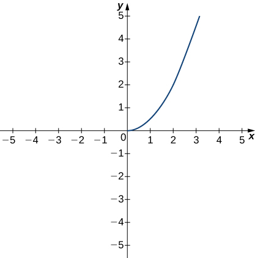
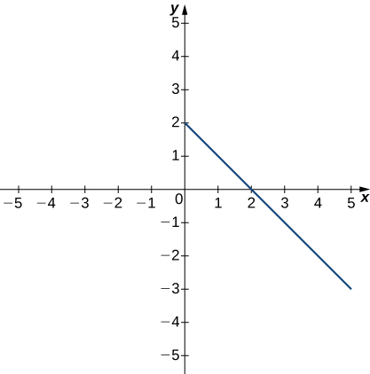
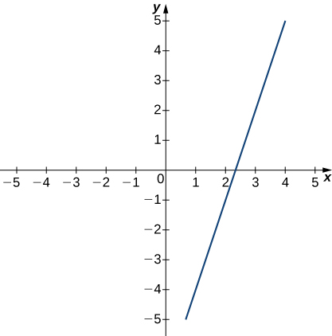

* Describe the epsilon-delta definition of a limit.
* Apply the epsilon-delta definition to find the limit of a function.
* Describe the epsilon-delta definitions of one-sided limits and infinite limits.
* Use the epsilon-delta definition to prove the limit laws.

By now you have progressed from the very informal definition of a limit in the introduction of this chapter to the intuitive understanding of a limit. At this point, you should have a very strong intuitive sense of what the limit of a function means and how you can find it. In this section, we convert this intuitive idea of a limit into a formal definition using precise mathematical language. The formal definition of a limit is quite possibly one of the most challenging definitions you will encounter early in your study of calculus; however, it is well worth any effort you make to reconcile it with your intuitive notion of a limit. Understanding this definition is the key that opens the door to a better understanding of calculus.

### Quantifying Closeness

Before stating the formal definition of a limit, we must introduce a few preliminary ideas. Recall that the distance between two points *a* and *b* on a number line is given by <math xmlns="http://www.w3.org/1998/Math/MathML"><mrow><mrow><mo>\|</mo><mrow><mi>a</mi><mo>−</mo><mi>b</mi></mrow><mo>\|</mo></mrow><mo>.</mo></mrow></math>

* The statement
  <math xmlns="http://www.w3.org/1998/Math/MathML"><mrow><mrow><mo>\|</mo><mrow><mi>f</mi><mrow><mo>(</mo><mi>x</mi><mo>)</mo></mrow><mo>−</mo><mi>L</mi></mrow><mo>\|</mo></mrow><mo>&lt;</mo><mi>ε</mi></mrow></math>
  
  may be interpreted as: *The distance between <math xmlns="http://www.w3.org/1998/Math/MathML"><mrow><mi>f</mi><mrow><mo>(</mo><mi>x</mi><mo>)</mo></mrow></mrow></math>
  
   and L is less than ε.*
* The statement
  <math xmlns="http://www.w3.org/1998/Math/MathML"><mrow><mn>0</mn><mo>&lt;</mo><mrow><mo>\|</mo><mrow><mi>x</mi><mo>−</mo><mi>a</mi></mrow><mo>\|</mo></mrow><mo>&lt;</mo><mi>δ</mi></mrow></math>
  
  may be interpreted as:
  <math xmlns="http://www.w3.org/1998/Math/MathML"><mrow><mi>x</mi><mo>≠</mo><mi>a</mi></mrow></math>
  
  *and the distance between x and a is less than δ.*
{: data-bullet-style="bullet"}

It is also important to look at the following equivalences for absolute value:

* The statement
  <math xmlns="http://www.w3.org/1998/Math/MathML"><mrow><mrow><mo>\|</mo><mrow><mi>f</mi><mrow><mo>(</mo><mi>x</mi><mo>)</mo></mrow><mo>−</mo><mi>L</mi></mrow><mo>\|</mo></mrow><mo>&lt;</mo><mi>ε</mi></mrow></math>
  
  is equivalent to the statement
  <math xmlns="http://www.w3.org/1998/Math/MathML"><mrow><mi>L</mi><mo>−</mo><mi>ε</mi><mo>&lt;</mo><mi>f</mi><mrow><mo>(</mo><mi>x</mi><mo>)</mo></mrow><mo>&lt;</mo><mi>L</mi><mo>+</mo><mi>ε</mi><mo>.</mo></mrow></math>

* The statement
  <math xmlns="http://www.w3.org/1998/Math/MathML"><mrow><mn>0</mn><mo>&lt;</mo><mrow><mo>\|</mo><mrow><mi>x</mi><mo>−</mo><mi>a</mi></mrow><mo>\|</mo></mrow><mo>&lt;</mo><mi>δ</mi></mrow></math>
  
  is equivalent to the statement
  <math xmlns="http://www.w3.org/1998/Math/MathML"><mrow><mi>a</mi><mo>−</mo><mi>δ</mi><mo>&lt;</mo><mi>x</mi><mo>&lt;</mo><mi>a</mi><mo>+</mo><mi>δ</mi></mrow></math>
  
  and
  <math xmlns="http://www.w3.org/1998/Math/MathML"><mrow><mi>x</mi><mo>≠</mo><mi>a</mi><mo>.</mo></mrow></math>
{: data-bullet-style="bullet"}

With these clarifications, we can state the formal **epsilon-delta definition of the limit**{: data-type="term"}.

Definition

Let <math xmlns="http://www.w3.org/1998/Math/MathML"><mrow><mi>f</mi><mo stretchy="false">(</mo><mi>x</mi><mo stretchy="false">)</mo></mrow></math>

 be defined for all <math xmlns="http://www.w3.org/1998/Math/MathML"><mrow><mi>x</mi><mo>≠</mo><mi>a</mi></mrow></math>

 over an open interval containing *a*. Let *L* be a real number. Then

<math xmlns="http://www.w3.org/1998/Math/MathML"><mrow><munder><mrow><mtext>lim</mtext></mrow><mrow><mi>x</mi><mo stretchy="false">→</mo><mi>a</mi></mrow></munder><mi>f</mi><mo stretchy="false">(</mo><mi>x</mi><mo stretchy="false">)</mo><mo>=</mo><mi>L</mi></mrow></math>

if, for every <math xmlns="http://www.w3.org/1998/Math/MathML"><mrow><mi>ε</mi><mo>&gt;</mo><mn>0</mn><mo>,</mo></mrow></math>

 there exists a <math xmlns="http://www.w3.org/1998/Math/MathML"><mrow><mi>δ</mi><mo>&gt;</mo><mn>0</mn><mo>,</mo></mrow></math>

 such that if <math xmlns="http://www.w3.org/1998/Math/MathML"><mrow><mn>0</mn><mo>&lt;</mo><mo>\|</mo><mi>x</mi><mo>−</mo><mi>a</mi><mo>\|</mo><mo>&lt;</mo><mi>δ</mi><mo>,</mo></mrow></math>

 then <math xmlns="http://www.w3.org/1998/Math/MathML"><mrow><mo>\|</mo><mi>f</mi><mo stretchy="false">(</mo><mi>x</mi><mo stretchy="false">)</mo><mo>−</mo><mi>L</mi><mo>\|</mo><mo>&lt;</mo><mi>ε</mi><mo>.</mo></mrow></math>

This definition may seem rather complex from a mathematical point of view, but it becomes easier to understand if we break it down phrase by phrase. The statement itself involves something called a ***universal quantifier***{: data-type="term" .no-emphasis} (for every <math xmlns="http://www.w3.org/1998/Math/MathML"><mrow><mi>ε</mi><mo>&gt;</mo><mn>0</mn><mtext>),</mtext></mrow></math>

 an ***existential quantifier***{: data-type="term" .no-emphasis} (there exists a <math xmlns="http://www.w3.org/1998/Math/MathML"><mrow><mi>δ</mi><mo>&gt;</mo><mn>0</mn><mtext>),</mtext></mrow></math>

 and, last, a ***conditional statement***{: data-type="term" .no-emphasis} (if <math xmlns="http://www.w3.org/1998/Math/MathML"><mrow><mn>0</mn><mo>&lt;</mo><mrow><mo>\|</mo><mrow><mi>x</mi><mo>−</mo><mi>a</mi></mrow><mo>\|</mo></mrow><mo>&lt;</mo><mi>δ</mi><mo>,</mo></mrow></math>

 then <math xmlns="http://www.w3.org/1998/Math/MathML"><mrow><mrow><mo>\|</mo><mrow><mi>f</mi><mrow><mo>(</mo><mi>x</mi><mo>)</mo></mrow><mo>−</mo><mi>L</mi></mrow><mo>\|</mo></mrow><mo>&lt;</mo><mi>ε</mi><mtext>).</mtext></mrow></math>

 Let’s take a look at [\[link\]](#fs-id1170572305874), which breaks down the definition and translates each part.

<table summary="A table with two columns and five rows. The first row has the headers &#x201C;definition&#x201D; and &#x201C;translation,&#x201D; from mathematical symbols to words. The second row has defines &#x201C;for every epsilon less than 0&#x201D; as &#x201C;for every positive distance epsilon from L,&#x201D; the third row defines &#x201C;there exists a delta less than 0&#x201D; as &#x201C;there is a positive difference delta from a,&#x201D; and the fourth row defines &#x201C;if 0 is less than the absolute value of x &#x2013;a, and that is less than delta, then the absolute value of the function of x minus L is less than epsilon&#x201D; as &#x201C;if x is closer than delta to a and x is not equal to a, then the function of x is closer than epsilon to L.&#x201D;"><caption>Translation of the Epsilon-Delta Definition of the Limit</caption><thead>
<tr valign="top">
<th data-align="left">Definition</th>
<th data-align="left">Translation</th>
</tr>
</thead><tbody>
<tr valign="top">
<td data-align="left">1. For every <math xmlns="http://www.w3.org/1998/Math/MathML"><mrow><mi>ε</mi><mo>&gt;</mo><mn>0</mn><mo>,</mo></mrow></math></td>
<td data-align="left">1. For every positive distance <em>ε</em> from <em>L</em>,</td>
</tr>
<tr valign="top">
<td data-align="left">2. there exists a <math xmlns="http://www.w3.org/1998/Math/MathML"><mrow><mi>δ</mi><mo>&gt;</mo><mn>0</mn><mo>,</mo></mrow></math></td>
<td data-align="left">2. There is a positive distance <math xmlns="http://www.w3.org/1998/Math/MathML"><mrow><mi>δ</mi></mrow></math> from <em>a</em>,</td>
</tr>
<tr valign="top">
<td data-align="left">3. such that</td>
<td data-align="left">3. such that</td>
</tr>
<tr valign="top">
<td data-align="left">4. if <math xmlns="http://www.w3.org/1998/Math/MathML"><mrow><mn>0</mn><mo>&lt;</mo><mrow><mo>\|</mo><mrow><mi>x</mi><mo>−</mo><mi>a</mi></mrow><mo>\|</mo></mrow><mo>&lt;</mo><mi>δ</mi><mo>,</mo></mrow></math> then <math xmlns="http://www.w3.org/1998/Math/MathML"><mrow><mrow><mo>\|</mo><mrow><mi>f</mi><mrow><mo>(</mo><mi>x</mi><mo>)</mo></mrow><mo>−</mo><mi>L</mi></mrow><mo>\|</mo></mrow><mo>&lt;</mo><mi>ε</mi><mo>.</mo></mrow></math></td>
<td data-align="left">4. if <em>x</em> is closer than <math xmlns="http://www.w3.org/1998/Math/MathML"><mrow><mi>δ</mi></mrow></math> to <em>a</em> and <math xmlns="http://www.w3.org/1998/Math/MathML"><mrow><mi>x</mi><mo>≠</mo><mi>a</mi><mo>,</mo></mrow></math> then <math xmlns="http://www.w3.org/1998/Math/MathML"><mrow><mi>f</mi><mrow><mo>(</mo><mi>x</mi><mo>)</mo></mrow></mrow></math> is closer than <em>ε</em> to <em>L</em>.</td>
</tr>
</tbody></table>

We can get a better handle on this definition by looking at the definition geometrically. [\[link\]](#CNX_Calc_Figure_02_05_001) shows possible values of <math xmlns="http://www.w3.org/1998/Math/MathML"><mrow><mi>δ</mi></mrow></math>

 for various choices of <math xmlns="http://www.w3.org/1998/Math/MathML"><mrow><mi>ε</mi><mo>&gt;</mo><mn>0</mn></mrow></math>

 for a given function <math xmlns="http://www.w3.org/1998/Math/MathML"><mrow><mi>f</mi><mrow><mo>(</mo><mi>x</mi><mo>)</mo></mrow><mo>,</mo></mrow></math>

 a number *a*, and a limit *L* at *a*. Notice that as we choose smaller values of *ε* (the distance between the function and the limit), we can always find a <math xmlns="http://www.w3.org/1998/Math/MathML"><mrow><mi>δ</mi></mrow></math>

 small enough so that if we have chosen an *x* value within <math xmlns="http://www.w3.org/1998/Math/MathML"><mrow><mi>δ</mi></mrow></math>

 of *a*, then the value of <math xmlns="http://www.w3.org/1998/Math/MathML"><mrow><mi>f</mi><mrow><mo>(</mo><mi>x</mi><mo>)</mo></mrow></mrow></math>

 is within *ε* of the limit *L*.

 ![There are three graphs side by side showing possible values of delta, given successively smaller choices of epsilon. Each graph has a decreasing, concave down curve in quadrant one. Each graph has the point (a, L) marked on the curve, where L is the limit of the function at the point where x=a. On either side of L on the y axis, a distance epsilon is marked off  - namely, a line is drawn through the function at y = L + epsilon and L &#x2013; epsilon. As smaller values of epsilon are chosen going from graph one to graph three, smaller values of delta to the left and right of point a can be found so that if we have chosen an x value within delta of a, then the value of f(x) is within epsilon of the limit L.](../resources/CNX_Calc_Figure_02_05_001.jpg "These graphs show possible values of &#x3B4;, given successively smaller choices of &#x3B5;."){: #CNX_Calc_Figure_02_05_001}

Visit the following applet to experiment with finding values of <math xmlns="http://www.w3.org/1998/Math/MathML"><mrow><mi>δ</mi></mrow></math>

 for selected values of *ε*\:

* [The epsilon-delta definition of limit][1]
{: data-display="block"}

[\[link\]](#fs-id1170572333023) shows how you can use this definition to prove a statement about the limit of a specific function at a specified value.

Proving a Statement about the Limit of a Specific Function

Prove that <math xmlns="http://www.w3.org/1998/Math/MathML"><mrow><munder><mrow><mtext>lim</mtext></mrow><mrow><mi>x</mi><mo stretchy="false">→</mo><mn>1</mn></mrow></munder><mrow><mo>(</mo><mrow><mn>2</mn><mi>x</mi><mo>+</mo><mn>1</mn></mrow><mo>)</mo></mrow><mo>=</mo><mn>3</mn><mo>.</mo></mrow></math>

Let <math xmlns="http://www.w3.org/1998/Math/MathML"><mrow><mi>ε</mi><mo>&gt;</mo><mn>0</mn><mo>.</mo></mrow></math>

The first part of the definition begins “For every <math xmlns="http://www.w3.org/1998/Math/MathML"><mrow><mi>ε</mi><mo>&gt;</mo><mn>0</mn><mtext>.”</mtext></mrow></math>

 This means we must prove that whatever follows is true no matter what positive value of *ε* is chosen. By stating “Let <math xmlns="http://www.w3.org/1998/Math/MathML"><mrow><mi>ε</mi><mo>&gt;</mo><mn>0</mn><mtext>,”</mtext></mrow></math>

 we signal our intent to do so.

Choose <math xmlns="http://www.w3.org/1998/Math/MathML"><mrow><mi>δ</mi><mo>=</mo><mfrac><mi>ε</mi><mn>2</mn></mfrac><mo>.</mo></mrow></math>

The definition continues with “there exists a <math xmlns="http://www.w3.org/1998/Math/MathML"><mrow><mi>δ</mi><mo>&gt;</mo><mn>0</mn><mo>.</mo></mrow></math>

” The phrase “there exists” in a mathematical statement is always a signal for a scavenger hunt. In other words, we must go and find <math xmlns="http://www.w3.org/1998/Math/MathML"><mrow><mi>δ</mi><mo>.</mo></mrow></math>

 So, where exactly did <math xmlns="http://www.w3.org/1998/Math/MathML"><mrow><mi>δ</mi><mo>=</mo><mrow><mi>ε</mi><mtext>/</mtext><mn>2</mn></mrow></mrow></math>

 come from? There are two basic approaches to tracking down <math xmlns="http://www.w3.org/1998/Math/MathML"><mrow><mi>δ</mi><mo>.</mo></mrow></math>

 One method is purely algebraic and the other is geometric.

We begin by tackling the problem from an algebraic point of view. Since ultimately we want <math xmlns="http://www.w3.org/1998/Math/MathML"><mrow><mrow><mo>\|</mo><mrow><mrow><mo>(</mo><mrow><mn>2</mn><mi>x</mi><mo>+</mo><mn>1</mn></mrow><mo>)</mo></mrow><mo>−</mo><mn>3</mn></mrow><mo>\|</mo></mrow><mo>&lt;</mo><mi>ε</mi><mo>,</mo></mrow></math>

 we begin by manipulating this expression: <math xmlns="http://www.w3.org/1998/Math/MathML"><mrow><mrow><mo>\|</mo><mrow><mrow><mo>(</mo><mrow><mn>2</mn><mi>x</mi><mo>+</mo><mn>1</mn></mrow><mo>)</mo></mrow><mo>−</mo><mn>3</mn></mrow><mo>\|</mo></mrow><mo>&lt;</mo><mi>ε</mi></mrow></math>

 is equivalent to <math xmlns="http://www.w3.org/1998/Math/MathML"><mrow><mrow><mo>\|</mo><mrow><mn>2</mn><mi>x</mi><mo>−</mo><mn>2</mn></mrow><mo>\|</mo></mrow><mo>&lt;</mo><mi>ε</mi><mo>,</mo></mrow></math>

 which in turn is equivalent to <math xmlns="http://www.w3.org/1998/Math/MathML"><mrow><mrow><mo>\|</mo><mn>2</mn><mo>\|</mo></mrow><mrow><mo>\|</mo><mrow><mi>x</mi><mo>−</mo><mn>1</mn></mrow><mo>\|</mo></mrow><mo>&lt;</mo><mi>ε</mi><mo>.</mo></mrow></math>

 Last, this is equivalent to <math xmlns="http://www.w3.org/1998/Math/MathML"><mrow><mrow><mo>\|</mo><mrow><mi>x</mi><mo>−</mo><mn>1</mn></mrow><mo>\|</mo></mrow><mo>&lt;</mo><mrow><mi>ε</mi><mtext>/</mtext><mn>2</mn></mrow><mo>.</mo></mrow></math>

 Thus, it would seem that <math xmlns="http://www.w3.org/1998/Math/MathML"><mrow><mi>δ</mi><mo>=</mo><mrow><mi>ε</mi><mtext>/</mtext><mn>2</mn></mrow></mrow></math>

 is appropriate.

We may also find <math xmlns="http://www.w3.org/1998/Math/MathML"><mrow><mi>δ</mi></mrow></math>

 through geometric methods. [[link]](#CNX_Calc_Figure_02_05_002) demonstrates how this is done.

![This graph shows how to find delta geometrically. The function 2x + 1 is drawn in red from x=0 to 2. A straight line is drawn at y=3 in green, which intersects the function at (1,3). Two blues lines are drawn at 3 + epsilon and 3 &#x2013; epsilon, which are graphed here between 5 and 6 and between 0 and 1, respectively. Finally, two pink lines are drawn down from the points of intersection of the function and the blue lines &#x2013; the taller between 1 and 2, and the shorter between 0 and 1. Since the blue lines and the function intersect, we can solve for x. For the shorter, corresponding to the line y = 3 &#x2013; epsilon, we have 3 &#x2013; epsilon = 2x + 1, which simplifies to x = 1 &#x2013; epsilon / 2. For the taller, corresponding to the line y = 3 + epsilon, we have 3 + epsilon = 2x + 1, which simplifies to x = 1 + epsilon / 2. Delta is the smaller of the two distances between 1 and where the pink lines intersect with the x axis. We have delta is the min of 1 + epsilon / 2 -1 and 1 &#x2013; (1 &#x2013; epsilon / 2), which is the min of epsilon / 2 and epsilon / 2, which is simply epsilon / 2.](../resources/CNX_Calc_Figure_02_05_002.jpg "This graph shows how we find &#x3B4; geometrically."){: #CNX_Calc_Figure_02_05_002}

Assume <math xmlns="http://www.w3.org/1998/Math/MathML"><mrow><mn>0</mn><mo>&lt;</mo><mrow><mo>\|</mo><mrow><mi>x</mi><mo>−</mo><mn>1</mn></mrow><mo>\|</mo></mrow><mo>&lt;</mo><mi>δ</mi><mo>.</mo></mrow></math>

 When <math xmlns="http://www.w3.org/1998/Math/MathML"><mrow><mi>δ</mi></mrow></math>

 has been chosen, our goal is to show that if <math xmlns="http://www.w3.org/1998/Math/MathML"><mrow><mn>0</mn><mo>&lt;</mo><mrow><mo>\|</mo><mrow><mi>x</mi><mo>−</mo><mn>1</mn></mrow><mo>\|</mo></mrow><mo>&lt;</mo><mi>δ</mi><mo>,</mo></mrow></math>

 then <math xmlns="http://www.w3.org/1998/Math/MathML"><mrow><mrow><mo>\|</mo><mrow><mrow><mo>(</mo><mrow><mn>2</mn><mi>x</mi><mo>+</mo><mn>1</mn></mrow><mo>)</mo></mrow><mo>−</mo><mn>3</mn></mrow><mo>\|</mo></mrow><mo>&lt;</mo><mi>ε</mi><mo>.</mo></mrow></math>

 To prove any statement of the form “If this, then that,” we begin by assuming “this” and trying to get “that.”

Thus,

<math xmlns="http://www.w3.org/1998/Math/MathML"><mrow><mtable><mtr><mtd columnalign="left"><mrow><mo>\|</mo><mrow><mrow><mo>(</mo><mrow><mn>2</mn><mi>x</mi><mo>+</mo><mn>1</mn></mrow><mo>)</mo></mrow><mo>−</mo><mn>3</mn></mrow><mo>\|</mo></mrow></mtd><mtd columnalign="left"><mo>=</mo><mrow><mo>\|</mo><mrow><mn>2</mn><mi>x</mi><mo>−</mo><mn>2</mn></mrow><mo>\|</mo></mrow></mtd><mtd /><mtd /><mtd columnalign="left"><mtext>property of absolute value</mtext></mtd></mtr><mtr><mtd /><mtd columnalign="left"><mo>=</mo><mrow><mo>\|</mo><mrow><mn>2</mn><mrow><mo>(</mo><mrow><mi>x</mi><mo>−</mo><mn>1</mn></mrow><mo>)</mo></mrow></mrow><mo>\|</mo></mrow></mtd></mtr><mtr><mtd /><mtd columnalign="left"><mo>=</mo><mrow><mo>\|</mo><mn>2</mn><mo>\|</mo></mrow><mrow><mo>\|</mo><mrow><mi>x</mi><mo>−</mo><mn>1</mn></mrow><mo>\|</mo></mrow></mtd><mtd /><mtd /><mtd columnalign="left"><mo>\|</mo><mn>2</mn><mo>\|</mo><mo>=</mo><mn>2</mn></mtd></mtr><mtr><mtd /><mtd columnalign="left"><mo>=</mo><mn>2</mn><mrow><mo>\|</mo><mrow><mi>x</mi><mo>−</mo><mn>1</mn></mrow><mo>\|</mo></mrow></mtd><mtd /><mtd /><mtd /></mtr><mtr><mtd /><mtd columnalign="left"><mo>&lt;</mo><mn>2</mn><mo>·</mo><mi>δ</mi></mtd><mtd /><mtd /><mtd columnalign="left"><mtext>here’s where we use the assumption that</mtext><mspace width="0.2em" /><mn>0</mn><mo>&lt;</mo><mrow><mo>\|</mo><mrow><mi>x</mi><mo>−</mo><mn>1</mn></mrow><mo>\|</mo></mrow><mo>&lt;</mo><mi>δ</mi></mtd></mtr><mtr><mtd /><mtd columnalign="left"><mo>=</mo><mn>2</mn><mo>·</mo><mfrac><mi>ε</mi><mn>2</mn></mfrac><mo>=</mo><mi>ε</mi></mtd><mtd /><mtd /><mtd columnalign="left"><mtext>here’s where we use our choice of</mtext><mspace width="0.2em" /><mi>δ</mi><mo>=</mo><mrow><mi>ε</mi><mtext>/</mtext><mn>2</mn></mrow></mtd></mtr></mtable></mrow></math>

Analysis

In this part of the proof, we started with <math xmlns="http://www.w3.org/1998/Math/MathML"><mrow><mrow><mo>\|</mo><mrow><mrow><mo>(</mo><mrow><mn>2</mn><mi>x</mi><mo>+</mo><mn>1</mn></mrow><mo>)</mo></mrow><mo>−</mo><mn>3</mn></mrow><mo>\|</mo></mrow></mrow></math>

 and used our assumption <math xmlns="http://www.w3.org/1998/Math/MathML"><mrow><mn>0</mn><mo>&lt;</mo><mrow><mo>\|</mo><mrow><mi>x</mi><mo>−</mo><mn>1</mn></mrow><mo>\|</mo></mrow><mo>&lt;</mo><mi>δ</mi></mrow></math>

 in a key part of the chain of inequalities to get <math xmlns="http://www.w3.org/1998/Math/MathML"><mrow><mrow><mo>\|</mo><mrow><mrow><mo>(</mo><mrow><mn>2</mn><mi>x</mi><mo>+</mo><mn>1</mn></mrow><mo>)</mo></mrow><mo>−</mo><mn>3</mn></mrow><mo>\|</mo></mrow></mrow></math>

 to be less than *ε*. We could just as easily have manipulated the assumed inequality <math xmlns="http://www.w3.org/1998/Math/MathML"><mrow><mn>0</mn><mo>&lt;</mo><mrow><mo>\|</mo><mrow><mi>x</mi><mo>−</mo><mn>1</mn></mrow><mo>\|</mo></mrow><mo>&lt;</mo><mi>δ</mi></mrow></math>

 to arrive at <math xmlns="http://www.w3.org/1998/Math/MathML"><mrow><mrow><mo>\|</mo><mrow><mrow><mo>(</mo><mrow><mn>2</mn><mi>x</mi><mo>+</mo><mn>1</mn></mrow><mo>)</mo></mrow><mo>−</mo><mn>3</mn></mrow><mo>\|</mo></mrow><mo>&lt;</mo><mi>ε</mi></mrow></math>

 as follows:

<math xmlns="http://www.w3.org/1998/Math/MathML"><mtable columnalign="left"><mtr><mtd columnalign="right"><mn>0</mn><mo>&lt;</mo><mrow><mo>\|</mo><mrow><mi>x</mi><mo>−</mo><mn>1</mn></mrow><mo>\|</mo></mrow><mo>&lt;</mo><mi>δ</mi></mtd><mtd columnalign="left"><mo stretchy="false">⇒</mo><mrow><mo>\|</mo><mrow><mi>x</mi><mo>−</mo><mn>1</mn></mrow><mo>\|</mo></mrow><mo>&lt;</mo><mi>δ</mi></mtd></mtr><mtr><mtd /><mtd columnalign="left"><mo stretchy="false">⇒</mo><mo>−</mo><mi>δ</mi><mo>&lt;</mo><mi>x</mi><mo>−</mo><mn>1</mn><mo>&lt;</mo><mi>δ</mi></mtd></mtr><mtr><mtd /><mtd columnalign="left"><mo stretchy="false">⇒</mo><mo>−</mo><mfrac><mi>ε</mi><mn>2</mn></mfrac><mo>&lt;</mo><mi>x</mi><mo>−</mo><mn>1</mn><mo>&lt;</mo><mfrac><mi>ε</mi><mn>2</mn></mfrac></mtd></mtr><mtr><mtd /><mtd columnalign="left"><mo stretchy="false">⇒</mo><mo>−</mo><mi>ε</mi><mo>&lt;</mo><mn>2</mn><mi>x</mi><mo>−</mo><mn>2</mn><mo>&lt;</mo><mi>ε</mi></mtd></mtr><mtr><mtd /><mtd columnalign="left"><mo stretchy="false">⇒</mo><mo>−</mo><mi>ε</mi><mo>&lt;</mo><mn>2</mn><mi>x</mi><mo>−</mo><mn>2</mn><mo>&lt;</mo><mi>ε</mi></mtd></mtr><mtr><mtd /><mtd columnalign="left"><mo stretchy="false">⇒</mo><mrow><mo>\|</mo><mrow><mn>2</mn><mi>x</mi><mo>−</mo><mn>2</mn></mrow><mo>\|</mo></mrow><mo>&lt;</mo><mi>ε</mi></mtd></mtr><mtr><mtd /><mtd columnalign="left"><mo stretchy="false">⇒</mo><mrow><mo>\|</mo><mrow><mrow><mo>(</mo><mrow><mn>2</mn><mi>x</mi><mo>+</mo><mn>1</mn></mrow><mo>)</mo></mrow><mo>−</mo><mn>3</mn></mrow><mo>\|</mo></mrow><mo>&lt;</mo><mi>ε</mi><mo>.</mo></mtd></mtr></mtable></math>

Therefore, <math xmlns="http://www.w3.org/1998/Math/MathML"><mrow><munder><mrow><mtext>lim</mtext></mrow><mrow><mi>x</mi><mo stretchy="false">→</mo><mn>1</mn></mrow></munder><mrow><mo>(</mo><mrow><mn>2</mn><mi>x</mi><mo>+</mo><mn>1</mn></mrow><mo>)</mo></mrow><mo>=</mo><mn>3</mn><mo>.</mo></mrow></math>

 (Having completed the proof, we state what we have accomplished.)

After removing all the remarks, here is a final version of the proof:

Let <math xmlns="http://www.w3.org/1998/Math/MathML"><mrow><mi>ε</mi><mo>&gt;</mo><mn>0</mn><mo>.</mo></mrow></math>

Choose <math xmlns="http://www.w3.org/1998/Math/MathML"><mrow><mi>δ</mi><mo>=</mo><mrow><mi>ε</mi><mtext>/</mtext><mn>2</mn></mrow><mo>.</mo></mrow></math>

Assume <math xmlns="http://www.w3.org/1998/Math/MathML"><mrow><mn>0</mn><mo>&lt;</mo><mrow><mo>\|</mo><mrow><mi>x</mi><mo>−</mo><mn>1</mn></mrow><mo>\|</mo></mrow><mo>&lt;</mo><mi>δ</mi><mo>.</mo></mrow></math>

Thus,

<math xmlns="http://www.w3.org/1998/Math/MathML"><mtable><mtr><mtd columnalign="right"><mrow><mo>\|</mo><mrow><mrow><mo>(</mo><mrow><mn>2</mn><mi>x</mi><mo>+</mo><mn>1</mn></mrow><mo>)</mo></mrow><mo>−</mo><mn>3</mn></mrow><mo>\|</mo></mrow></mtd><mtd columnalign="left"><mo>=</mo><mrow><mo>\|</mo><mrow><mn>2</mn><mi>x</mi><mo>−</mo><mn>2</mn></mrow><mo>\|</mo></mrow></mtd></mtr><mtr><mtd /><mtd columnalign="left"><mo>=</mo><mrow><mo>\|</mo><mrow><mn>2</mn><mrow><mo>(</mo><mrow><mi>x</mi><mo>−</mo><mn>1</mn></mrow><mo>)</mo></mrow></mrow><mo>\|</mo></mrow></mtd></mtr><mtr><mtd /><mtd columnalign="left"><mo>=</mo><mrow><mo>\|</mo><mn>2</mn><mo>\|</mo></mrow><mrow><mo>\|</mo><mrow><mi>x</mi><mo>−</mo><mn>1</mn></mrow><mo>\|</mo></mrow></mtd></mtr><mtr><mtd /><mtd columnalign="left"><mo>=</mo><mn>2</mn><mrow><mo>\|</mo><mrow><mi>x</mi><mo>−</mo><mn>1</mn></mrow><mo>\|</mo></mrow></mtd></mtr><mtr><mtd /><mtd columnalign="left"><mo>&lt;</mo><mn>2</mn><mo>·</mo><mi>δ</mi></mtd></mtr><mtr><mtd /><mtd columnalign="left"><mo>=</mo><mn>2</mn><mo>·</mo><mfrac><mi>ε</mi><mn>2</mn></mfrac></mtd></mtr><mtr><mtd /><mtd columnalign="left"><mo>=</mo><mi>ε</mi><mo>.</mo></mtd></mtr></mtable></math>

Therefore, <math xmlns="http://www.w3.org/1998/Math/MathML"><mrow><munder><mrow><mtext>lim</mtext></mrow><mrow><mi>x</mi><mo stretchy="false">→</mo><mn>1</mn></mrow></munder><mrow><mo>(</mo><mrow><mn>2</mn><mi>x</mi><mo>+</mo><mn>1</mn></mrow><mo>)</mo></mrow><mo>=</mo><mn>3</mn><mo>.</mo></mrow></math>

The following Problem-Solving Strategy summarizes the type of proof we worked out in [\[link\]](#fs-id1170572333023).

Problem-Solving Strategy: Proving That
<math xmlns="http://www.w3.org/1998/Math/MathML"><mrow><munder><mrow><mtext>lim</mtext></mrow><mrow><mi>x</mi><mo stretchy="false">→</mo><mi>a</mi></mrow></munder><mi>f</mi><mrow><mo>(</mo><mi>x</mi><mo>)</mo></mrow><mo>=</mo><mi>L</mi></mrow></math>
for a Specific Function
<math xmlns="http://www.w3.org/1998/Math/MathML"><mrow><mi>f</mi><mrow><mo>(</mo><mi>x</mi><mo>)</mo></mrow></mrow></math>

1.  Let’s begin the proof with the following statement: Let
    <math xmlns="http://www.w3.org/1998/Math/MathML"><mrow><mi>ε</mi><mo>&gt;</mo><mn>0</mn><mo>.</mo></mrow></math>

2.  Next, we need to obtain a value for
    <math xmlns="http://www.w3.org/1998/Math/MathML"><mrow><mi>δ</mi><mo>.</mo></mrow></math>
    
    After we have obtained this value, we make the following statement, filling in the blank with our choice of
    <math xmlns="http://www.w3.org/1998/Math/MathML"><mrow><mi>δ</mi></mrow></math>
    
    \: Choose
    <math xmlns="http://www.w3.org/1998/Math/MathML"><mrow><mi>δ</mi><mo>=</mo><mtext>\_\_\_\_\_\_\_.</mtext></mrow></math>

3.  The next statement in the proof should be (at this point, we fill in our given value for *a*):
    * * *
    {: data-type="newline"}
    
    Assume
    <math xmlns="http://www.w3.org/1998/Math/MathML"><mrow><mn>0</mn><mo>&lt;</mo><mrow><mo>\|</mo><mrow><mi>x</mi><mo>−</mo><mi>a</mi></mrow><mo>\|</mo></mrow><mo>&lt;</mo><mi>δ</mi><mo>.</mo></mrow></math>

4.  Next, based on this assumption, we need to show that
    <math xmlns="http://www.w3.org/1998/Math/MathML"><mrow><mrow><mo>\|</mo><mrow><mi>f</mi><mrow><mo>(</mo><mi>x</mi><mo>)</mo></mrow><mo>−</mo><mi>L</mi></mrow><mo>\|</mo></mrow><mo>&lt;</mo><mi>ε</mi><mo>,</mo></mrow></math>
    
    where
    <math xmlns="http://www.w3.org/1998/Math/MathML"><mrow><mi>f</mi><mrow><mo>(</mo><mi>x</mi><mo>)</mo></mrow></mrow></math>
    
    and *L* are our function
    <math xmlns="http://www.w3.org/1998/Math/MathML"><mrow><mi>f</mi><mrow><mo>(</mo><mi>x</mi><mo>)</mo></mrow></mrow></math>
    
    and our limit *L*. At some point, we need to use
    <math xmlns="http://www.w3.org/1998/Math/MathML"><mrow><mn>0</mn><mo>&lt;</mo><mrow><mo>\|</mo><mrow><mi>x</mi><mo>−</mo><mi>a</mi></mrow><mo>\|</mo></mrow><mo>&lt;</mo><mi>δ</mi><mo>.</mo></mrow></math>

5.  We conclude our proof with the statement: Therefore,
    <math xmlns="http://www.w3.org/1998/Math/MathML"><mrow><munder><mrow><mtext>lim</mtext></mrow><mrow><mi>x</mi><mo stretchy="false">→</mo><mi>a</mi></mrow></munder><mi>f</mi><mrow><mo>(</mo><mi>x</mi><mo>)</mo></mrow><mo>=</mo><mi>L</mi><mo>.</mo></mrow></math>
{: type="1"}

Proving a Statement about a Limit

Complete the proof that <math xmlns="http://www.w3.org/1998/Math/MathML"><mrow><munder><mrow><mtext>lim</mtext></mrow><mrow><mi>x</mi><mo stretchy="false">→</mo><mn>−1</mn></mrow></munder><mrow><mo>(</mo><mrow><mn>4</mn><mi>x</mi><mo>+</mo><mn>1</mn></mrow><mo>)</mo></mrow><mo>=</mo><mn>−3</mn></mrow></math>

 by filling in the blanks.

Let \_\_\_\_\_.

Choose <math xmlns="http://www.w3.org/1998/Math/MathML"><mrow><mi>δ</mi><mo>=</mo><mtext>\_\_\_\_\_\_\_.</mtext></mrow></math>

Assume <math xmlns="http://www.w3.org/1998/Math/MathML"><mrow><mn>0</mn><mo>&lt;</mo><mrow><mo>\|</mo><mrow><mi>x</mi><mo>−</mo><mo>\_\_\_\_\_\_\_</mo></mrow><mtext>\|</mtext></mrow><mo>&lt;</mo><mi>δ</mi><mo>.</mo></mrow></math>

Thus, <math xmlns="http://www.w3.org/1998/Math/MathML"><mo>\|</mo><mtext>\_\_\_\_\_\_\_\_</mtext><mo>−</mo><mtext>\_\_\_\_\_\_\_\_</mtext><mo>\|</mo><mo>=</mo><mo>\_\_\_\_\_\_\_\_\_\_\_\_\_\_\_\_\_\_\_\_\_\_\_\_\_\_\_\_\_\_\_\_\_\_\_\_\_</mo><mi>ε</mi><mo>.</mo></math>

We begin by filling in the blanks where the choices are specified by the definition. Thus, we have

Let <math xmlns="http://www.w3.org/1998/Math/MathML"><mrow><mi>ε</mi><mo>&gt;</mo><mn>0</mn><mo>.</mo></mrow></math>

Choose <math xmlns="http://www.w3.org/1998/Math/MathML"><mrow><mi>δ</mi><mo>=</mo><mtext>\_\_\_\_\_\_\_.</mtext></mrow></math>

Assume <math xmlns="http://www.w3.org/1998/Math/MathML"><mrow><mn>0</mn><mo>&lt;</mo><mrow><mo>\|</mo><mrow><mi>x</mi><mo>−</mo><mrow><mo>(</mo><mrow><mn>−1</mn></mrow><mo>)</mo></mrow></mrow><mo>\|</mo></mrow><mo>&lt;</mo><mi>δ</mi><mo>.</mo></mrow></math>

 (or equivalently, <math xmlns="http://www.w3.org/1998/Math/MathML"><mrow><mn>0</mn><mo>&lt;</mo><mrow><mo>\|</mo><mrow><mi>x</mi><mo>+</mo><mn>1</mn></mrow><mo>\|</mo></mrow><mo>&lt;</mo><mi>δ</mi><mtext>.)</mtext></mrow></math>

Thus, <math xmlns="http://www.w3.org/1998/Math/MathML"><mrow><mrow><mo>\|</mo><mrow><mrow><mo>(</mo><mrow><mn>4</mn><mi>x</mi><mo>+</mo><mn>1</mn></mrow><mo>)</mo></mrow><mo>−</mo><mrow><mo>(</mo><mrow><mn>−3</mn></mrow><mo>)</mo></mrow></mrow><mo>\|</mo></mrow><mo>=</mo><mrow><mo>\|</mo><mrow><mn>4</mn><mi>x</mi><mo>+</mo><mn>4</mn></mrow><mo>\|</mo></mrow><mo>=</mo><mrow><mo>\|</mo><mn>4</mn><mo>\|</mo></mrow><mrow><mo>\|</mo><mrow><mi>x</mi><mo>+</mo><mn>1</mn></mrow><mo>\|</mo></mrow><mo>&lt;</mo><mn>4</mn><mi>δ</mi><mtext>\_\_\_\_\_\_\_</mtext><mi>ε</mi><mo>.</mo></mrow></math>

Focusing on the final line of the proof, we see that we should choose <math xmlns="http://www.w3.org/1998/Math/MathML"><mrow><mi>δ</mi><mo>=</mo><mfrac><mi>ε</mi><mn>4</mn></mfrac><mo>.</mo></mrow></math>

We now complete the final write-up of the proof:

Let <math xmlns="http://www.w3.org/1998/Math/MathML"><mrow><mi>ε</mi><mo>&gt;</mo><mn>0</mn><mo>.</mo></mrow></math>

Choose <math xmlns="http://www.w3.org/1998/Math/MathML"><mrow><mi>δ</mi><mo>=</mo><mfrac><mi>ε</mi><mn>4</mn></mfrac><mo>.</mo></mrow></math>

Assume <math xmlns="http://www.w3.org/1998/Math/MathML"><mrow><mn>0</mn><mo>&lt;</mo><mrow><mo>\|</mo><mrow><mi>x</mi><mo>−</mo><mrow><mo>(</mo><mrow><mn>−1</mn></mrow><mo>)</mo></mrow></mrow><mo>\|</mo></mrow><mo>&lt;</mo><mi>δ</mi></mrow></math>

 (or equivalently, <math xmlns="http://www.w3.org/1998/Math/MathML"><mrow><mn>0</mn><mo>&lt;</mo><mrow><mo>\|</mo><mrow><mi>x</mi><mo>+</mo><mn>1</mn></mrow><mo>\|</mo></mrow><mo>&lt;</mo><mi>δ</mi><mtext>.)</mtext></mrow></math>

Thus, <math xmlns="http://www.w3.org/1998/Math/MathML"><mrow><mrow><mo>\|</mo><mrow><mrow><mo>(</mo><mrow><mn>4</mn><mi>x</mi><mo>+</mo><mn>1</mn></mrow><mo>)</mo></mrow><mo>−</mo><mrow><mo>(</mo><mrow><mn>−3</mn></mrow><mo>)</mo></mrow></mrow><mo>\|</mo></mrow><mo>=</mo><mrow><mo>\|</mo><mrow><mn>4</mn><mi>x</mi><mo>+</mo><mn>4</mn></mrow><mo>\|</mo></mrow><mo>=</mo><mrow><mo>\|</mo><mn>4</mn><mo>\|</mo></mrow><mrow><mo>\|</mo><mrow><mi>x</mi><mo>+</mo><mn>1</mn></mrow><mo>\|</mo></mrow><mo>&lt;</mo><mn>4</mn><mi>δ</mi><mo>=</mo><mn>4</mn><mrow><mo>(</mo><mrow><mrow><mi>ε</mi><mtext>/</mtext><mn>4</mn></mrow></mrow><mo>)</mo></mrow><mo>=</mo><mi>ε</mi><mo>.</mo></mrow></math>

Complete the proof that <math xmlns="http://www.w3.org/1998/Math/MathML"><mrow><munder><mrow><mtext>lim</mtext></mrow><mrow><mi>x</mi><mo stretchy="false">→</mo><mn>2</mn></mrow></munder><mrow><mo>(</mo><mrow><mn>3</mn><mi>x</mi><mo>−</mo><mn>2</mn></mrow><mo>)</mo></mrow><mo>=</mo><mn>4</mn></mrow></math>

 by filling in the blanks.

Let \_\_\_\_\_\_\_.

Choose <math xmlns="http://www.w3.org/1998/Math/MathML"><mrow><mi>δ</mi><mo>=</mo><mtext>\_\_\_\_\_\_\_</mtext><mo>.</mo></mrow></math>

Assume <math xmlns="http://www.w3.org/1998/Math/MathML"><mrow><mn>0</mn><mo>&lt;</mo><mrow><mo>\|</mo><mrow><mi>x</mi><mo>−</mo><mtext>\_\_\_\_</mtext></mrow><mo>\|</mo></mrow><mo>&lt;</mo><mtext>\_\_\_\_</mtext><mo>.</mo></mrow></math>

Thus,

<math xmlns="http://www.w3.org/1998/Math/MathML"><mrow><mrow><mo>\|</mo><mrow><mtext>\_\_\_\_\_\_\_</mtext><mo>−</mo><mtext>\_\_\_\_</mtext></mrow><mo>\|</mo></mrow><mo>=</mo><mtext>\_\_\_\_\_\_\_\_\_\_\_\_\_\_\_\_\_\_\_\_\_\_\_\_\_\_\_\_\_\_</mtext><mi>ε</mi><mo>.</mo></mrow></math>

Therefore, <math xmlns="http://www.w3.org/1998/Math/MathML"><mrow><munder><mrow><mtext>lim</mtext></mrow><mrow><mi>x</mi><mo stretchy="false">→</mo><mn>2</mn></mrow></munder><mrow><mo>(</mo><mrow><mn>3</mn><mi>x</mi><mo>−</mo><mn>2</mn></mrow><mo>)</mo></mrow><mo>=</mo><mn>4</mn><mo>.</mo></mrow></math>

Let <math xmlns="http://www.w3.org/1998/Math/MathML"><mrow><mi>ε</mi><mo>&gt;</mo><mn>0</mn><mo>;</mo></mrow></math>

 choose <math xmlns="http://www.w3.org/1998/Math/MathML"><mrow><mi>δ</mi><mo>=</mo><mfrac><mi>ε</mi><mn>3</mn></mfrac><mo>;</mo></mrow></math>

 assume <math xmlns="http://www.w3.org/1998/Math/MathML"><mrow><mn>0</mn><mo>&lt;</mo><mrow><mo>\|</mo><mrow><mi>x</mi><mo>−</mo><mn>2</mn></mrow><mo>\|</mo></mrow><mo>&lt;</mo><mi>δ</mi><mo>.</mo></mrow></math>

Thus, <math xmlns="http://www.w3.org/1998/Math/MathML"><mrow><mrow><mo>\|</mo><mrow><mrow><mo>(</mo><mrow><mn>3</mn><mi>x</mi><mo>−</mo><mn>2</mn></mrow><mo>)</mo></mrow><mo>−</mo><mn>4</mn></mrow><mo>\|</mo></mrow><mo>=</mo><mrow><mo>\|</mo><mrow><mn>3</mn><mi>x</mi><mo>−</mo><mn>6</mn></mrow><mo>\|</mo></mrow><mo>=</mo><mrow><mo>\|</mo><mn>3</mn><mo>\|</mo></mrow><mo>·</mo><mrow><mo>\|</mo><mrow><mi>x</mi><mo>−</mo><mn>2</mn></mrow><mo>\|</mo></mrow><mo>&lt;</mo><mn>3</mn><mo>·</mo><mi>δ</mi><mo>=</mo><mn>3</mn><mo>·</mo><mrow><mo>(</mo><mrow><mrow><mi>ε</mi><mtext>/</mtext><mn>3</mn></mrow></mrow><mo>)</mo></mrow><mo>=</mo><mi>ε</mi><mo>.</mo></mrow></math>

Therefore, <math xmlns="http://www.w3.org/1998/Math/MathML"><mrow><munder><mrow><mtext>lim</mtext></mrow><mrow><mi>x</mi><mo stretchy="false">→</mo><mn>2</mn></mrow></munder><mn>3</mn><mi>x</mi><mo>−</mo><mn>2</mn><mo>=</mo><mn>4</mn><mo>.</mo></mrow></math>

Hint

Follow the outline in the Problem-Solving Strategy that we worked out in full in [[link]](#fs-id1170571597356).

In [\[link\]](#fs-id1170572333023) and [\[link\]](#fs-id1170571597356), the proofs were fairly straightforward, since the functions with which we were working were linear. In [\[link\]](#fs-id1170571657118), we see how to modify the proof to accommodate a nonlinear function.

Proving a Statement about the Limit of a Specific Function (Geometric Approach)

Prove that <math xmlns="http://www.w3.org/1998/Math/MathML"><mrow><munder><mrow><mtext>lim</mtext></mrow><mrow><mi>x</mi><mo stretchy="false">→</mo><mn>2</mn></mrow></munder><msup><mi>x</mi><mn>2</mn></msup><mo>=</mo><mn>4.</mn></mrow></math>

1.  Let
    <math xmlns="http://www.w3.org/1998/Math/MathML"><mrow><mi>ε</mi><mo>&gt;</mo><mn>0</mn><mo>.</mo></mrow></math>
    
    The first part of the definition begins “For every
    <math xmlns="http://www.w3.org/1998/Math/MathML"><mrow><mi>ε</mi><mo>&gt;</mo><mn>0</mn><mtext>,”</mtext></mrow></math>
    
    so we must prove that whatever follows is true no matter what positive value of *ε* is chosen. By stating “Let
    <math xmlns="http://www.w3.org/1998/Math/MathML"><mrow><mi>ε</mi><mo>&gt;</mo><mn>0</mn><mtext>,”</mtext></mrow></math>
    
    we signal our intent to do so.
2.  Without loss of generality, assume
    <math xmlns="http://www.w3.org/1998/Math/MathML"><mrow><mi>ε</mi><mo>≤</mo><mn>4</mn><mo>.</mo></mrow></math>
    
    Two questions present themselves: Why do we want
    <math xmlns="http://www.w3.org/1998/Math/MathML"><mrow><mi>ε</mi><mo>≤</mo><mn>4</mn></mrow></math>
    
    and why is it okay to make this assumption? In answer to the first question: Later on, in the process of solving for
    <math xmlns="http://www.w3.org/1998/Math/MathML"><mrow><mi>δ</mi><mo>,</mo></mrow></math>
    
    we will discover that
    <math xmlns="http://www.w3.org/1998/Math/MathML"><mrow><mi>δ</mi></mrow></math>
    
    involves the quantity
    <math xmlns="http://www.w3.org/1998/Math/MathML"><mrow><msqrt><mrow><mn>4</mn><mo>−</mo><mi>ε</mi></mrow></msqrt><mo>.</mo></mrow></math>
    
    Consequently, we need
    <math xmlns="http://www.w3.org/1998/Math/MathML"><mrow><mi>ε</mi><mo>≤</mo><mn>4</mn><mo>.</mo></mrow></math>
    
    In answer to the second question: If we can find
    <math xmlns="http://www.w3.org/1998/Math/MathML"><mrow><mi>δ</mi><mo>&gt;</mo><mn>0</mn></mrow></math>
    
    that “works” for
    <math xmlns="http://www.w3.org/1998/Math/MathML"><mrow><mi>ε</mi><mo>≤</mo><mn>4</mn><mo>,</mo></mrow></math>
    
    then it will “work” for any
    <math xmlns="http://www.w3.org/1998/Math/MathML"><mrow><mi>ε</mi><mo>&gt;</mo><mn>4</mn></mrow></math>
    
    as well. Keep in mind that, although it is always okay to put an upper bound on *ε*, it is never okay to put a lower bound (other than zero) on *ε*.
3.  Choose
    <math xmlns="http://www.w3.org/1998/Math/MathML"><mrow><mi>δ</mi><mo>=</mo><mtext>min</mtext><mrow><mo>{</mo><mrow><mn>2</mn><mo>−</mo><msqrt><mrow><mn>4</mn><mo>−</mo><mi>ε</mi></mrow></msqrt><mo>,</mo><msqrt><mrow><mn>4</mn><mo>+</mo><mi>ε</mi></mrow></msqrt><mo>−</mo><mn>2</mn></mrow><mo>}</mo></mrow><mo>.</mo></mrow></math>
    
    [[link]](#CNX_Calc_Figure_02_05_003) shows how we made this choice of
    <math xmlns="http://www.w3.org/1998/Math/MathML"><mrow><mi>δ</mi><mo>.</mo></mrow></math>
    
    ![This graph shows how to find delta geometrically for a given epsilon for the above proof. First, the function f(x) = x^2 is drawn from \[-1, 3\]. On the y axis, the proposed limit 4 is marked, and the line y=4 is drawn to intersect with the function at (2,4). For a given epsilon, point 4 + epsilon and 4 &#x2013; epsilon are marked on the y axis above and below 4. Blue lines are drawn from these points to intersect with the function, where pink lines are drawn from the point of intersection to the x axis. These lines land on either side of x=2. Next, we solve for these x values, which have to be positive here. The first is x^2 = 4 &#x2013; epsilon, which simplifies to x = sqrt(4-epsilon). The next is x^2 = 4 + epsilon, which simplifies to x = sqrt(4 + epsilon). Delta is the smaller of the two distances, so it is the min of (2 &#x2013; sqrt(4 &#x2013; epsilon) and sqrt(4 + epsilon) &#x2013; 2).](../resources/CNX_Calc_Figure_02_05_003.jpg "This graph shows how we find &#x3B4; geometrically for a given &#x3B5; for the proof in [link]."){: #CNX_Calc_Figure_02_05_003}

4.  We must show: If
    <math xmlns="http://www.w3.org/1998/Math/MathML"><mrow><mn>0</mn><mo>&lt;</mo><mrow><mo>\|</mo><mrow><mi>x</mi><mo>−</mo><mn>2</mn></mrow><mo>\|</mo></mrow><mo>&lt;</mo><mi>δ</mi><mo>,</mo></mrow></math>
    
    then
    <math xmlns="http://www.w3.org/1998/Math/MathML"><mrow><mrow><mo stretchy="false">\|</mo><mrow><msup><mi>x</mi><mn>2</mn></msup><mo>−</mo><mn>4</mn></mrow><mo stretchy="false">\|</mo></mrow><mo>&lt;</mo><mi>ε</mi><mo>,</mo></mrow></math>
    
    so we must begin by assuming
    * * *
    {: data-type="newline"}
    
    

    <math xmlns="http://www.w3.org/1998/Math/MathML"><mrow><mn>0</mn><mo>&lt;</mo><mrow><mo>\|</mo><mrow><mi>x</mi><mo>−</mo><mn>2</mn></mrow><mo>\|</mo></mrow><mo>&lt;</mo><mi>δ</mi><mo>.</mo></mrow></math>
    

    
    * * *
    {: data-type="newline"}
    
    We don’t really need
    <math xmlns="http://www.w3.org/1998/Math/MathML"><mrow><mn>0</mn><mo>&lt;</mo><mrow><mo>\|</mo><mrow><mi>x</mi><mo>−</mo><mn>2</mn></mrow><mo>\|</mo></mrow></mrow></math>
    
    (in other words,
    <math xmlns="http://www.w3.org/1998/Math/MathML"><mrow><mi>x</mi><mo>≠</mo><mn>2</mn><mo>)</mo></mrow></math>
    
    for this proof. Since
    <math xmlns="http://www.w3.org/1998/Math/MathML"><mrow><mn>0</mn><mo>&lt;</mo><mrow><mo>\|</mo><mrow><mi>x</mi><mo>−</mo><mn>2</mn></mrow><mo>\|</mo></mrow><mo>&lt;</mo><mi>δ</mi><mo stretchy="false">⇒</mo><mrow><mo>\|</mo><mrow><mi>x</mi><mo>−</mo><mn>2</mn></mrow><mo>\|</mo></mrow><mo>&lt;</mo><mi>δ</mi><mo>,</mo></mrow></math>
    
    it is okay to drop
    <math xmlns="http://www.w3.org/1998/Math/MathML"><mrow><mn>0</mn><mo>&lt;</mo><mrow><mo>\|</mo><mrow><mi>x</mi><mo>−</mo><mn>2</mn></mrow><mo>\|</mo></mrow><mo>.</mo></mrow></math>
    
    * * *
    {: data-type="newline"}
    
    

    <math xmlns="http://www.w3.org/1998/Math/MathML"><mrow><mrow><mo>\|</mo><mrow><mi>x</mi><mo>−</mo><mn>2</mn></mrow><mo>\|</mo></mrow><mo>&lt;</mo><mi>δ</mi><mo>.</mo></mrow></math>
    

    
    * * *
    {: data-type="newline"}
    
    Hence,
    * * *
    {: data-type="newline"}
    
    

    <math xmlns="http://www.w3.org/1998/Math/MathML"><mrow><mo>−</mo><mi>δ</mi><mo>&lt;</mo><mi>x</mi><mo>−</mo><mn>2</mn><mo>&lt;</mo><mi>δ</mi><mo>.</mo></mrow></math>
    

    
    * * *
    {: data-type="newline"}
    
    Recall that
    <math xmlns="http://www.w3.org/1998/Math/MathML"><mrow><mi>δ</mi><mo>=</mo><mtext>min</mtext><mrow><mo>{</mo><mrow><mn>2</mn><mo>−</mo><msqrt><mrow><mn>4</mn><mo>−</mo><mi>ε</mi></mrow></msqrt><mo>,</mo><msqrt><mrow><mn>4</mn><mo>+</mo><mi>ε</mi></mrow></msqrt><mo>−</mo><mn>2</mn></mrow><mo>}</mo></mrow><mo>.</mo></mrow></math>
    
    Thus,
    <math xmlns="http://www.w3.org/1998/Math/MathML"><mrow><mi>δ</mi><mo>≥</mo><mn>2</mn><mo>−</mo><msqrt><mrow><mn>4</mn><mo>−</mo><mi>ε</mi></mrow></msqrt></mrow></math>
    
    and consequently
    <math xmlns="http://www.w3.org/1998/Math/MathML"><mrow><mo>−</mo><mrow><mo>(</mo><mrow><mn>2</mn><mo>−</mo><msqrt><mrow><mn>4</mn><mo>−</mo><mi>ε</mi></mrow></msqrt></mrow><mo>)</mo></mrow><mo>≤</mo><mo>−</mo><mi>δ</mi><mo>.</mo></mrow></math>
    
    We also use
    <math xmlns="http://www.w3.org/1998/Math/MathML"><mrow><mi>δ</mi><mo>≤</mo><msqrt><mrow><mn>4</mn><mo>+</mo><mi>ε</mi></mrow></msqrt><mo>−</mo><mn>2</mn></mrow></math>
    
    here. We might ask at this point: Why did we substitute
    <math xmlns="http://www.w3.org/1998/Math/MathML"><mrow><mn>2</mn><mo>−</mo><msqrt><mrow><mn>4</mn><mo>−</mo><mi>ε</mi></mrow></msqrt></mrow></math>
    
    for
    <math xmlns="http://www.w3.org/1998/Math/MathML"><mrow><mi>δ</mi></mrow></math>
    
    on the left-hand side of the inequality and
    <math xmlns="http://www.w3.org/1998/Math/MathML"><mrow><msqrt><mrow><mn>4</mn><mo>+</mo><mi>ε</mi></mrow></msqrt><mo>−</mo><mn>2</mn></mrow></math>
    
    on the right-hand side of the inequality? If we look at [[link]](#CNX_Calc_Figure_02_05_003), we see that
    <math xmlns="http://www.w3.org/1998/Math/MathML"><mrow><mn>2</mn><mo>−</mo><msqrt><mrow><mn>4</mn><mo>−</mo><mi>ε</mi></mrow></msqrt></mrow></math>
    
    corresponds to the distance on the left of 2 on the *x*-axis and
    <math xmlns="http://www.w3.org/1998/Math/MathML"><mrow><msqrt><mrow><mn>4</mn><mo>+</mo><mi>ε</mi></mrow></msqrt><mo>−</mo><mn>2</mn></mrow></math>
    
    corresponds to the distance on the right. Thus,
    * * *
    {: data-type="newline"}
    
    

    <math xmlns="http://www.w3.org/1998/Math/MathML"><mrow><mo>−</mo><mrow><mo>(</mo><mrow><mn>2</mn><mo>−</mo><msqrt><mrow><mn>4</mn><mo>−</mo><mi>ε</mi></mrow></msqrt></mrow><mo>)</mo></mrow><mo>≤</mo><mo>−</mo><mi>δ</mi><mo>&lt;</mo><mi>x</mi><mo>−</mo><mn>2</mn><mo>&lt;</mo><mi>δ</mi><mo>≤</mo><msqrt><mrow><mn>4</mn><mo>+</mo><mi>ε</mi></mrow></msqrt><mo>−</mo><mn>2</mn><mo>.</mo></mrow></math>
    

    
    * * *
    {: data-type="newline"}
    
    We simplify the expression on the left:
    * * *
    {: data-type="newline"}
    
    

    <math xmlns="http://www.w3.org/1998/Math/MathML"><mrow><mn>−2</mn><mo>+</mo><msqrt><mrow><mn>4</mn><mo>−</mo><mi>ε</mi></mrow></msqrt><mo>&lt;</mo><mi>x</mi><mo>−</mo><mn>2</mn><mo>&lt;</mo><msqrt><mrow><mn>4</mn><mo>+</mo><mi>ε</mi></mrow></msqrt><mo>−</mo><mn>2</mn><mo>.</mo></mrow></math>
    

    
    * * *
    {: data-type="newline"}
    
    Then, we add 2 to all parts of the inequality:
    * * *
    {: data-type="newline"}
    
    

    <math xmlns="http://www.w3.org/1998/Math/MathML"><mrow><msqrt><mrow><mn>4</mn><mo>−</mo><mi>ε</mi></mrow></msqrt><mo>&lt;</mo><mi>x</mi><mo>&lt;</mo><msqrt><mrow><mn>4</mn><mo>+</mo><mi>ε</mi></mrow></msqrt><mo>.</mo></mrow></math>
    

    
    * * *
    {: data-type="newline"}
    
    We square all parts of the inequality. It is okay to do so, since all parts of the inequality are positive:
    * * *
    {: data-type="newline"}
    
    

    <math xmlns="http://www.w3.org/1998/Math/MathML"><mrow><mn>4</mn><mo>−</mo><mi>ε</mi><mo>&lt;</mo><msup><mi>x</mi><mn>2</mn></msup><mo>&lt;</mo><mn>4</mn><mo>+</mo><mi>ε</mi><mo>.</mo></mrow></math>
    

    
    * * *
    {: data-type="newline"}
    
    We subtract 4 from all parts of the inequality:
    * * *
    {: data-type="newline"}
    
    

    <math xmlns="http://www.w3.org/1998/Math/MathML"><mrow><mo>−</mo><mi>ε</mi><mo>&lt;</mo><msup><mi>x</mi><mn>2</mn></msup><mo>−</mo><mn>4</mn><mo>&lt;</mo><mi>ε</mi><mo>.</mo></mrow></math>
    

    
    * * *
    {: data-type="newline"}
    
    Last,
    * * *
    {: data-type="newline"}
    
    

    <math xmlns="http://www.w3.org/1998/Math/MathML"><mrow><mrow><mo stretchy="false">\|</mo><mrow><msup><mi>x</mi><mn>2</mn></msup><mo>−</mo><mn>4</mn></mrow><mo stretchy="false">\|</mo></mrow><mo>&lt;</mo><mi>ε</mi><mo>.</mo></mrow></math>
    

5.  Therefore,
    * * *
    {: data-type="newline"}
    
    

    <math xmlns="http://www.w3.org/1998/Math/MathML"><mrow><munder><mrow><mtext>lim</mtext></mrow><mrow><mi>x</mi><mo stretchy="false">→</mo><mn>2</mn></mrow></munder><msup><mi>x</mi><mn>2</mn></msup><mo>=</mo><mn>4</mn><mo>.</mo></mrow></math>
    

{: type="1"}

Find δ corresponding to <math xmlns="http://www.w3.org/1998/Math/MathML"><mrow><mi>ε</mi><mo>&gt;</mo><mn>0</mn></mrow></math>

 for a proof that <math xmlns="http://www.w3.org/1998/Math/MathML"><mrow><munder><mrow><mtext>lim</mtext></mrow><mrow><mi>x</mi><mo stretchy="false">→</mo><mn>9</mn></mrow></munder><msqrt><mi>x</mi></msqrt><mo>=</mo><mn>3</mn><mo>.</mo></mrow></math>

Choose <math xmlns="http://www.w3.org/1998/Math/MathML"><mrow><mi>δ</mi><mo>=</mo><mtext>min</mtext><mrow><mo>{</mo><mrow><mn>9</mn><mo>−</mo><msup><mrow><mrow><mo>(</mo><mrow><mn>3</mn><mo>−</mo><mi>ε</mi></mrow><mo>)</mo></mrow></mrow><mn>2</mn></msup><mo>,</mo><msup><mrow><mrow><mo>(</mo><mrow><mn>3</mn><mo>+</mo><mi>ε</mi></mrow><mo>)</mo></mrow></mrow><mn>2</mn></msup><mo>−</mo><mn>9</mn></mrow><mo>}</mo></mrow><mo>.</mo></mrow></math>

Hint

Draw a graph similar to the one in [[link]](#fs-id1170571657118).

The geometric approach to proving that the limit of a function takes on a specific value works quite well for some functions. Also, the insight into the formal definition of the limit that this method provides is invaluable. However, we may also approach limit proofs from a purely algebraic point of view. In many cases, an algebraic approach may not only provide us with additional insight into the definition, it may prove to be simpler as well. Furthermore, an algebraic approach is the primary tool used in proofs of statements about limits. For [\[link\]](#fs-id1170571690430), we take on a purely algebraic approach.

Proving a Statement about the Limit of a Specific Function (Algebraic Approach)

Prove that <math xmlns="http://www.w3.org/1998/Math/MathML"><mrow><munder><mrow><mtext>lim</mtext></mrow><mrow><mi>x</mi><mo stretchy="false">→</mo><mn>−1</mn></mrow></munder><mrow><mo>(</mo><mrow><msup><mi>x</mi><mn>2</mn></msup><mo>−</mo><mn>2</mn><mi>x</mi><mo>+</mo><mn>3</mn></mrow><mo>)</mo></mrow><mo>=</mo><mn>6</mn><mo>.</mo></mrow></math>

Let’s use our outline from the Problem-Solving Strategy:

1.  Let
    <math xmlns="http://www.w3.org/1998/Math/MathML"><mrow><mi>ε</mi><mo>&gt;</mo><mn>0</mn><mo>.</mo></mrow></math>

2.  Choose
    <math xmlns="http://www.w3.org/1998/Math/MathML"><mrow><mi>δ</mi><mo>=</mo><mtext>min</mtext><mrow><mo>{</mo><mrow><mn>1</mn><mo>,</mo><mrow><mi>ε</mi><mtext>/</mtext><mn>5</mn></mrow></mrow><mo>}</mo></mrow><mo>.</mo></mrow></math>
    
    This choice of
    <math xmlns="http://www.w3.org/1998/Math/MathML"><mrow><mi>δ</mi></mrow></math>
    
    may appear odd at first glance, but it was obtained by taking a look at our ultimate desired inequality:
    <math xmlns="http://www.w3.org/1998/Math/MathML"><mrow><mrow><mo>\|</mo><mrow><mrow><mo>(</mo><mrow><msup><mi>x</mi><mn>2</mn></msup><mo>−</mo><mn>2</mn><mi>x</mi><mo>+</mo><mn>3</mn></mrow><mo>)</mo></mrow><mo>−</mo><mn>6</mn></mrow><mo>\|</mo></mrow><mo>&lt;</mo><mi>ε</mi><mo>.</mo></mrow></math>
    
    This inequality is equivalent to
    <math xmlns="http://www.w3.org/1998/Math/MathML"><mrow><mrow><mo>\|</mo><mrow><mi>x</mi><mo>+</mo><mn>1</mn></mrow><mo>\|</mo></mrow><mo>·</mo><mrow><mo>\|</mo><mrow><mi>x</mi><mo>−</mo><mn>3</mn></mrow><mo>\|</mo></mrow><mo>&lt;</mo><mi>ε</mi><mo>.</mo></mrow></math>
    
    At this point, the temptation simply to choose
    <math xmlns="http://www.w3.org/1998/Math/MathML"><mrow><mi>δ</mi><mo>=</mo><mfrac><mi>ε</mi><mrow><mi>x</mi><mo>−</mo><mn>3</mn></mrow></mfrac></mrow></math>
    
    is very strong. Unfortunately, our choice of
    <math xmlns="http://www.w3.org/1998/Math/MathML"><mrow><mi>δ</mi></mrow></math>
    
    must depend on *ε* only and no other variable. If we can replace
    <math xmlns="http://www.w3.org/1998/Math/MathML"><mrow><mrow><mo>\|</mo><mrow><mi>x</mi><mo>−</mo><mn>3</mn></mrow><mo>\|</mo></mrow></mrow></math>
    
    by a numerical value, our problem can be resolved. This is the place where assuming
    <math xmlns="http://www.w3.org/1998/Math/MathML"><mrow><mi>δ</mi><mo>≤</mo><mn>1</mn></mrow></math>
    
    comes into play. The choice of
    <math xmlns="http://www.w3.org/1998/Math/MathML"><mrow><mi>δ</mi><mo>≤</mo><mn>1</mn></mrow></math>
    
    here is arbitrary. We could have just as easily used any other positive number. In some proofs, greater care in this choice may be necessary. Now, since
    <math xmlns="http://www.w3.org/1998/Math/MathML"><mrow><mi>δ</mi><mo>≤</mo><mn>1</mn></mrow></math>
    
    and
    <math xmlns="http://www.w3.org/1998/Math/MathML"><mrow><mrow><mo>\|</mo><mrow><mi>x</mi><mo>+</mo><mn>1</mn></mrow><mo>\|</mo></mrow><mo>&lt;</mo><mi>δ</mi><mo>≤</mo><mn>1</mn><mo>,</mo></mrow></math>
    
    we are able to show that
    <math xmlns="http://www.w3.org/1998/Math/MathML"><mrow><mrow><mo>\|</mo><mrow><mi>x</mi><mo>−</mo><mn>3</mn></mrow><mo>\|</mo></mrow><mo>&lt;</mo><mn>5</mn><mo>.</mo></mrow></math>
    
    Consequently,
    <math xmlns="http://www.w3.org/1998/Math/MathML"><mrow><mrow><mo>\|</mo><mrow><mi>x</mi><mo>+</mo><mn>1</mn></mrow><mo>\|</mo></mrow><mo>·</mo><mrow><mo>\|</mo><mrow><mi>x</mi><mo>−</mo><mn>3</mn></mrow><mo>\|</mo></mrow><mo>&lt;</mo><mrow><mo>\|</mo><mrow><mi>x</mi><mo>+</mo><mn>1</mn></mrow><mo>\|</mo></mrow><mo>·</mo><mn>5</mn><mo>.</mo></mrow></math>
    
    At this point we realize that we also need
    <math xmlns="http://www.w3.org/1998/Math/MathML"><mrow><mi>δ</mi><mo>≤</mo><mrow><mi>ε</mi><mtext>/</mtext><mn>5</mn></mrow><mo>.</mo></mrow></math>
    
    Thus, we choose
    <math xmlns="http://www.w3.org/1998/Math/MathML"><mrow><mi>δ</mi><mo>=</mo><mtext>min</mtext><mrow><mo>{</mo><mrow><mn>1</mn><mo>,</mo><mrow><mi>ε</mi><mtext>/</mtext><mn>5</mn></mrow></mrow><mo>}</mo></mrow><mo>.</mo></mrow></math>

3.  Assume
    <math xmlns="http://www.w3.org/1998/Math/MathML"><mrow><mn>0</mn><mo>&lt;</mo><mrow><mo>\|</mo><mrow><mi>x</mi><mo>+</mo><mn>1</mn></mrow><mo>\|</mo></mrow><mo>&lt;</mo><mi>δ</mi><mo>.</mo></mrow></math>
    
    Thus,
    * * *
    {: data-type="newline"}
    
    

    <math xmlns="http://www.w3.org/1998/Math/MathML"><mrow><mrow><mo>\|</mo><mrow><mi>x</mi><mo>+</mo><mn>1</mn></mrow><mo>\|</mo></mrow><mo>&lt;</mo><mn>1</mn><mspace width="0.2em" /><mtext>and</mtext><mspace width="0.2em" /><mrow><mrow><mo>\|</mo><mrow><mi>x</mi><mo>+</mo><mn>1</mn></mrow><mo>\|</mo></mrow><mo>&lt;</mo><mfrac><mi>ε</mi><mn>5</mn></mfrac><mo>.</mo></mrow></mrow></math>
    

    
    * * *
    {: data-type="newline"}
    
    Since
    <math xmlns="http://www.w3.org/1998/Math/MathML"><mrow><mrow><mo>\|</mo><mrow><mi>x</mi><mo>+</mo><mn>1</mn></mrow><mo>\|</mo></mrow><mo>&lt;</mo><mn>1</mn><mo>,</mo></mrow></math>
    
    we may conclude that
    <math xmlns="http://www.w3.org/1998/Math/MathML"><mrow><mn>−1</mn><mo>&lt;</mo><mi>x</mi><mo>+</mo><mn>1</mn><mo>&lt;</mo><mn>1</mn><mo>.</mo></mrow></math>
    
    Thus, by subtracting 4 from all parts of the inequality, we obtain
    <math xmlns="http://www.w3.org/1998/Math/MathML"><mrow><mn>−5</mn><mo>&lt;</mo><mi>x</mi><mo>−</mo><mn>3</mn><mo>&lt;</mo><mtext>−</mtext><mn>1</mn><mo>.</mo></mrow></math>
    
    Consequently,
    <math xmlns="http://www.w3.org/1998/Math/MathML"><mrow><mrow><mo>\|</mo><mrow><mi>x</mi><mo>−</mo><mn>3</mn></mrow><mo>\|</mo></mrow><mo>&lt;</mo><mn>5</mn><mo>.</mo></mrow></math>
    
    This gives us
    * * *
    {: data-type="newline"}
    
    

    <math xmlns="http://www.w3.org/1998/Math/MathML"><mrow><mrow><mo>\|</mo><mrow><mrow><mo>(</mo><mrow><msup><mi>x</mi><mn>2</mn></msup><mo>−</mo><mn>2</mn><mi>x</mi><mo>+</mo><mn>3</mn></mrow><mo>)</mo></mrow><mo>−</mo><mn>6</mn></mrow><mo>\|</mo></mrow><mo>=</mo><mrow><mo>\|</mo><mrow><mi>x</mi><mo>+</mo><mn>1</mn></mrow><mo>\|</mo></mrow><mo>·</mo><mrow><mo>\|</mo><mrow><mi>x</mi><mo>−</mo><mn>3</mn></mrow><mo>\|</mo></mrow><mo>&lt;</mo><mfrac><mi>ε</mi><mn>5</mn></mfrac><mo>·</mo><mn>5</mn><mo>=</mo><mi>ε</mi><mo>.</mo></mrow></math>
    

    
    * * *
    {: data-type="newline"}
    
    Therefore,
    * * *
    {: data-type="newline"}
    
    

    <math xmlns="http://www.w3.org/1998/Math/MathML"><mrow><munder><mrow><mtext>lim</mtext></mrow><mrow><mi>x</mi><mo stretchy="false">→</mo><mn>−1</mn></mrow></munder><mrow><mo>(</mo><mrow><msup><mi>x</mi><mn>2</mn></msup><mo>−</mo><mn>2</mn><mi>x</mi><mo>+</mo><mn>3</mn></mrow><mo>)</mo></mrow><mo>=</mo><mn>6</mn><mo>.</mo></mrow></math>
    

{: type="1"}

Complete the proof that <math xmlns="http://www.w3.org/1998/Math/MathML"><mrow><munder><mrow><mtext>lim</mtext></mrow><mrow><mi>x</mi><mo stretchy="false">→</mo><mn>1</mn></mrow></munder><msup><mi>x</mi><mn>2</mn></msup><mo>=</mo><mn>1</mn><mo>.</mo></mrow></math>

Let <math xmlns="http://www.w3.org/1998/Math/MathML"><mrow><mi>ε</mi><mo>&gt;</mo><mn>0</mn><mo>;</mo></mrow></math>

 choose <math xmlns="http://www.w3.org/1998/Math/MathML"><mrow><mi>δ</mi><mo>=</mo><mtext>min</mtext><mrow><mo>{</mo><mrow><mn>1</mn><mo>,</mo><mrow><mi>ε</mi><mtext>/</mtext><mn>3</mn></mrow></mrow><mo>}</mo></mrow><mo>;</mo></mrow></math>

 assume <math xmlns="http://www.w3.org/1998/Math/MathML"><mrow><mn>0</mn><mo>&lt;</mo><mrow><mo>\|</mo><mrow><mi>x</mi><mo>−</mo><mn>1</mn></mrow><mo>\|</mo></mrow><mo>&lt;</mo><mi>δ</mi><mo>.</mo></mrow></math>

Since <math xmlns="http://www.w3.org/1998/Math/MathML"><mrow><mrow><mo>\|</mo><mrow><mi>x</mi><mo>−</mo><mn>1</mn></mrow><mo>\|</mo></mrow><mo>&lt;</mo><mn>1</mn><mo>,</mo></mrow></math>

 we may conclude that <math xmlns="http://www.w3.org/1998/Math/MathML"><mrow><mn>−1</mn><mo>&lt;</mo><mi>x</mi><mo>−</mo><mn>1</mn><mo>&lt;</mo><mn>1</mn><mo>.</mo></mrow></math>

 Thus, <math xmlns="http://www.w3.org/1998/Math/MathML"><mrow><mn>1</mn><mo>&lt;</mo><mi>x</mi><mo>+</mo><mn>1</mn><mo>&lt;</mo><mn>3</mn><mo>.</mo></mrow></math>

 Hence, <math xmlns="http://www.w3.org/1998/Math/MathML"><mrow><mrow><mo>\|</mo><mrow><mi>x</mi><mo>+</mo><mn>1</mn></mrow><mo>\|</mo></mrow><mo>&lt;</mo><mn>3</mn><mo>.</mo></mrow></math>

<math xmlns="http://www.w3.org/1998/Math/MathML"><mrow><mrow><mo>\|</mo><mrow><msup><mi>x</mi><mn>2</mn></msup><mo>−</mo><mn>1</mn></mrow><mo>\|</mo></mrow><mo>=</mo><mrow><mo>\|</mo><mrow><mi>x</mi><mo>−</mo><mn>1</mn></mrow><mo>\|</mo></mrow><mo>·</mo><mrow><mo>\|</mo><mrow><mi>x</mi><mo>+</mo><mn>1</mn></mrow><mo>\|</mo></mrow><mo>&lt;</mo><mrow><mi>ε</mi><mtext>/</mtext><mn>3</mn></mrow><mo>·</mo><mn>3</mn><mo>=</mo><mi>ε</mi></mrow></math>

Hint

Use [[link]](#fs-id1170571690430) as a guide.

You will find that, in general, the more complex a function, the more likely it is that the algebraic approach is the easiest to apply. The algebraic approach is also more useful in proving statements about limits.

### Proving Limit Laws

We now demonstrate how to use the epsilon-delta definition of a limit to construct a rigorous proof of one of the limit laws. The **triangle inequality**{: data-type="term"} is used at a key point of the proof, so we first review this key property of absolute value.

Definition

The **triangle inequality** states that if *a* and *b* are any real numbers, then <math xmlns="http://www.w3.org/1998/Math/MathML"><mrow><mrow><mo>\|</mo><mrow><mi>a</mi><mo>+</mo><mi>b</mi></mrow><mo>\|</mo></mrow><mo>≤</mo><mrow><mo>\|</mo><mi>a</mi><mo>\|</mo></mrow><mo>+</mo><mrow><mo>\|</mo><mi>b</mi><mo>\|</mo></mrow><mo>.</mo></mrow></math>

#### Proof

We prove the following limit law: If <math xmlns="http://www.w3.org/1998/Math/MathML"><mrow><munder><mrow><mtext>lim</mtext></mrow><mrow><mi>x</mi><mo stretchy="false">→</mo><mi>a</mi></mrow></munder><mi>f</mi><mrow><mo>(</mo><mi>x</mi><mo>)</mo></mrow><mo>=</mo><mi>L</mi></mrow></math>

 and <math xmlns="http://www.w3.org/1998/Math/MathML"><mrow><munder><mrow><mtext>lim</mtext></mrow><mrow><mi>x</mi><mo stretchy="false">→</mo><mi>a</mi></mrow></munder><mi>g</mi><mrow><mo>(</mo><mi>x</mi><mo>)</mo></mrow><mo>=</mo><mi>M</mi><mo>,</mo></mrow></math>

 then <math xmlns="http://www.w3.org/1998/Math/MathML"><mrow><munder><mrow><mtext>lim</mtext></mrow><mrow><mi>x</mi><mo stretchy="false">→</mo><mi>a</mi></mrow></munder><mrow><mo>(</mo><mrow><mi>f</mi><mrow><mo>(</mo><mi>x</mi><mo>)</mo></mrow><mo>+</mo><mi>g</mi><mrow><mo>(</mo><mi>x</mi><mo>)</mo></mrow></mrow><mo>)</mo></mrow><mo>=</mo><mi>L</mi><mo>+</mo><mi>M</mi><mo>.</mo></mrow></math>

Let <math xmlns="http://www.w3.org/1998/Math/MathML"><mrow><mi>ε</mi><mo>&gt;</mo><mn>0</mn><mo>.</mo></mrow></math>

Choose <math xmlns="http://www.w3.org/1998/Math/MathML"><mrow><msub><mi>δ</mi><mn>1</mn></msub><mo>&gt;</mo><mn>0</mn></mrow></math>

 so that if <math xmlns="http://www.w3.org/1998/Math/MathML"><mrow><mn>0</mn><mo>&lt;</mo><mrow><mo>\|</mo><mrow><mi>x</mi><mo>−</mo><mi>a</mi></mrow><mo>\|</mo></mrow><mo>&lt;</mo><msub><mi>δ</mi><mn>1</mn></msub><mo>,</mo></mrow></math>

 then <math xmlns="http://www.w3.org/1998/Math/MathML"><mrow><mrow><mo>\|</mo><mrow><mi>f</mi><mrow><mo>(</mo><mi>x</mi><mo>)</mo></mrow><mo>−</mo><mi>L</mi></mrow><mo>\|</mo></mrow><mo>&lt;</mo><mrow><mi>ε</mi><mtext>/</mtext><mn>2</mn></mrow><mo>.</mo></mrow></math>

Choose <math xmlns="http://www.w3.org/1998/Math/MathML"><mrow><msub><mi>δ</mi><mn>2</mn></msub><mo>&gt;</mo><mn>0</mn></mrow></math>

 so that if <math xmlns="http://www.w3.org/1998/Math/MathML"><mrow><mn>0</mn><mo>&lt;</mo><mrow><mo>\|</mo><mrow><mi>x</mi><mo>−</mo><mi>a</mi></mrow><mo>\|</mo></mrow><mo>&lt;</mo><msub><mi>δ</mi><mn>2</mn></msub><mo>,</mo></mrow></math>

 then <math xmlns="http://www.w3.org/1998/Math/MathML"><mrow><mrow><mo>\|</mo><mrow><mi>g</mi><mrow><mo>(</mo><mi>x</mi><mo>)</mo></mrow><mo>−</mo><mi>M</mi></mrow><mo>\|</mo></mrow><mo>&lt;</mo><mrow><mi>ε</mi><mtext>/</mtext><mn>2</mn></mrow><mo>.</mo></mrow></math>

Choose <math xmlns="http://www.w3.org/1998/Math/MathML"><mrow><mi>δ</mi><mo>=</mo><mtext>min</mtext><mrow><mo>{</mo><mrow><msub><mi>δ</mi><mn>1</mn></msub><mo>,</mo><msub><mi>δ</mi><mn>2</mn></msub></mrow><mo>}</mo></mrow><mo>.</mo></mrow></math>

Assume <math xmlns="http://www.w3.org/1998/Math/MathML"><mrow><mn>0</mn><mo>&lt;</mo><mrow><mo>\|</mo><mrow><mi>x</mi><mo>−</mo><mi>a</mi></mrow><mo>\|</mo></mrow><mo>&lt;</mo><mi>δ</mi><mo>.</mo></mrow></math>

Thus,

<math xmlns="http://www.w3.org/1998/Math/MathML"><mrow><mn>0</mn><mo>&lt;</mo><mrow><mo>\|</mo><mrow><mi>x</mi><mo>−</mo><mi>a</mi></mrow><mo>\|</mo></mrow><mo>&lt;</mo><msub><mi>δ</mi><mn>1</mn></msub><mspace width="0.2em" /><mtext>and</mtext><mspace width="0.2em" /><mrow><mn>0</mn><mo>&lt;</mo><mrow><mo>\|</mo><mrow><mi>x</mi><mo>−</mo><mi>a</mi></mrow><mo>\|</mo></mrow><mo>&lt;</mo><msub><mi>δ</mi><mn>2</mn></msub><mo>.</mo></mrow></mrow></math>

Hence,

<math xmlns="http://www.w3.org/1998/Math/MathML"><mtable><mtr><mtd columnalign="right"><mrow><mo>\|</mo><mrow><mrow><mo>(</mo><mrow><mi>f</mi><mrow><mo>(</mo><mi>x</mi><mo>)</mo></mrow><mo>+</mo><mi>g</mi><mrow><mo>(</mo><mi>x</mi><mo>)</mo></mrow></mrow><mo>)</mo></mrow><mo>−</mo><mrow><mo>(</mo><mrow><mi>L</mi><mo>+</mo><mi>M</mi></mrow><mo>)</mo></mrow></mrow><mo>\|</mo></mrow></mtd><mtd columnalign="left"><mo>=</mo><mrow><mo>\|</mo><mrow><mrow><mo>(</mo><mrow><mi>f</mi><mrow><mo>(</mo><mi>x</mi><mo>)</mo></mrow><mo>−</mo><mi>L</mi></mrow><mo>)</mo></mrow><mo>+</mo><mrow><mo>(</mo><mrow><mi>g</mi><mrow><mo>(</mo><mi>x</mi><mo>)</mo></mrow><mo>−</mo><mi>M</mi></mrow><mo>)</mo></mrow></mrow><mo>\|</mo></mrow></mtd></mtr><mtr><mtd /><mtd columnalign="left"><mo>≤</mo><mrow><mo>\|</mo><mrow><mi>f</mi><mrow><mo>(</mo><mi>x</mi><mo>)</mo></mrow><mo>−</mo><mi>L</mi></mrow><mo>\|</mo></mrow><mo>+</mo><mrow><mo>\|</mo><mrow><mi>g</mi><mrow><mo>(</mo><mi>x</mi><mo>)</mo></mrow><mo>−</mo><mi>M</mi></mrow><mo>\|</mo></mrow></mtd></mtr><mtr><mtd /><mtd columnalign="left"><mo>&lt;</mo><mfrac><mi>ε</mi><mn>2</mn></mfrac><mo>+</mo><mfrac><mi>ε</mi><mn>2</mn></mfrac><mo>=</mo><mi>ε</mi><mo>.</mo></mtd></mtr></mtable></math>

□

We now explore what it means for a limit not to exist. The limit <math xmlns="http://www.w3.org/1998/Math/MathML"><mrow><munder><mrow><mtext>lim</mtext></mrow><mrow><mi>x</mi><mo stretchy="false">→</mo><mi>a</mi></mrow></munder><mi>f</mi><mrow><mo>(</mo><mi>x</mi><mo>)</mo></mrow></mrow></math>

 does not exist if there is no real number *L* for which <math xmlns="http://www.w3.org/1998/Math/MathML"><mrow><munder><mrow><mtext>lim</mtext></mrow><mrow><mi>x</mi><mo stretchy="false">→</mo><mi>a</mi></mrow></munder><mi>f</mi><mrow><mo>(</mo><mi>x</mi><mo>)</mo></mrow><mo>=</mo><mi>L</mi><mo>.</mo></mrow></math>

 Thus, for all real numbers *L*, <math xmlns="http://www.w3.org/1998/Math/MathML"><mrow><munder><mrow><mtext>lim</mtext></mrow><mrow><mi>x</mi><mo stretchy="false">→</mo><mi>a</mi></mrow></munder><mi>f</mi><mrow><mo>(</mo><mi>x</mi><mo>)</mo></mrow><mo>≠</mo><mi>L</mi><mo>.</mo></mrow></math>

 To understand what this means, we look at each part of the definition of <math xmlns="http://www.w3.org/1998/Math/MathML"><mrow><munder><mrow><mtext>lim</mtext></mrow><mrow><mi>x</mi><mo stretchy="false">→</mo><mi>a</mi></mrow></munder><mi>f</mi><mrow><mo>(</mo><mi>x</mi><mo>)</mo></mrow><mo>=</mo><mi>L</mi></mrow></math>

 together with its opposite. A translation of the definition is given in [\[link\]](#fs-id1170571696614).

<table summary="A table with two columns and four rows. The top row contains the headers &#x201C;definition&#x201D; and &#x201C;opposite.&#x201D; The second row contains the definition &#x201C;for every epsilon &lt; 0&#x201D; and the opposite &#x201C;there exists an epsilon greater than zero so that.&#x201D; The third row contains the definition &#x201C;there exists a delta greater than 0, so that&#x201D; and the opposite &#x201C;for every delta greater than 0.&#x201D; The last row contains the definition &#x201C;if 0 is less than the absolute value of x-a, which is less than delta, then the absolute value of f(x) &#x2013; L is less than epsilon&#x201D; and the opposite &#x201C;there is an x satisfying 0 is less than the absolute value of x &#x2013; a, which is less than delta, so that the absolute value of f() &#x2013; L is greater than or equal to epsilon."><caption>Translation of the Definition of <math xmlns="http://www.w3.org/1998/Math/MathML"><mrow><munder><mrow><mtext>lim</mtext></mrow><mrow><mi>x</mi><mo stretchy="false">→</mo><mi>a</mi></mrow></munder><mi>f</mi><mo stretchy="false">(</mo><mi>x</mi><mo stretchy="false">)</mo><mo>=</mo><mi>L</mi></mrow></math> and its Opposite</caption><thead>
<tr valign="top">
<th data-align="left"><strong>Definition</strong></th>
<th data-align="left"><strong>Opposite</strong></th>
</tr>
</thead><tbody>
<tr valign="top">
<td data-align="left">1. For every <math xmlns="http://www.w3.org/1998/Math/MathML"><mrow><mi>ε</mi><mo>&gt;</mo><mn>0</mn><mo>,</mo></mrow></math></td>
<td data-align="left">1. There exists <math xmlns="http://www.w3.org/1998/Math/MathML"><mrow><mi>ε</mi><mo>&gt;</mo><mn>0</mn></mrow></math> so that</td>
</tr>
<tr valign="top">
<td data-align="left">2. there exists a <math xmlns="http://www.w3.org/1998/Math/MathML"><mrow><mi>δ</mi><mo>&gt;</mo><mn>0</mn><mo>,</mo></mrow></math> so that</td>
<td data-align="left">2. for every <math xmlns="http://www.w3.org/1998/Math/MathML"><mrow><mi>δ</mi><mo>&gt;</mo><mn>0</mn><mo>,</mo></mrow></math></td>
</tr>
<tr valign="top">
<td data-align="left">3. if <math xmlns="http://www.w3.org/1998/Math/MathML"><mrow><mn>0</mn><mo>&lt;</mo><mrow><mo>\|</mo><mrow><mi>x</mi><mo>−</mo><mi>a</mi></mrow><mo>\|</mo></mrow><mo>&lt;</mo><mi>δ</mi><mo>,</mo></mrow></math> then <math xmlns="http://www.w3.org/1998/Math/MathML"><mrow><mrow><mo>\|</mo><mrow><mi>f</mi><mrow><mo>(</mo><mi>x</mi><mo>)</mo></mrow><mo>−</mo><mi>L</mi></mrow><mo>\|</mo></mrow><mo>&lt;</mo><mi>ε</mi><mo>.</mo></mrow></math></td>
<td data-align="left">3. There is an <em>x</em> satisfying <math xmlns="http://www.w3.org/1998/Math/MathML"><mrow><mn>0</mn><mo>&lt;</mo><mrow><mo>\|</mo><mrow><mi>x</mi><mo>−</mo><mi>a</mi></mrow><mo>\|</mo></mrow><mo>&lt;</mo><mi>δ</mi></mrow></math> so that <math xmlns="http://www.w3.org/1998/Math/MathML"><mrow><mrow><mo>\|</mo><mrow><mi>f</mi><mrow><mo>(</mo><mi>x</mi><mo>)</mo></mrow><mo>−</mo><mi>L</mi></mrow><mo>\|</mo></mrow><mo>≥</mo><mi>ε</mi><mo>.</mo></mrow></math></td>
</tr>
</tbody></table>

Finally, we may state what it means for a limit not to exist. The limit <math xmlns="http://www.w3.org/1998/Math/MathML"><mrow><munder><mrow><mtext>lim</mtext></mrow><mrow><mi>x</mi><mo stretchy="false">→</mo><mi>a</mi></mrow></munder><mi>f</mi><mrow><mo>(</mo><mi>x</mi><mo>)</mo></mrow></mrow></math>

 does not exist if for every real number *L*, there exists a real number <math xmlns="http://www.w3.org/1998/Math/MathML"><mrow><mi>ε</mi><mo>&gt;</mo><mn>0</mn></mrow></math>

 so that for all <math xmlns="http://www.w3.org/1998/Math/MathML"><mrow><mi>δ</mi><mo>&gt;</mo><mn>0</mn><mo>,</mo></mrow></math>

 there is an *x* satisfying <math xmlns="http://www.w3.org/1998/Math/MathML"><mrow><mn>0</mn><mo>&lt;</mo><mrow><mo>\|</mo><mrow><mi>x</mi><mo>−</mo><mi>a</mi></mrow><mo>\|</mo></mrow><mo>&lt;</mo><mi>δ</mi><mo>,</mo></mrow></math>

 so that <math xmlns="http://www.w3.org/1998/Math/MathML"><mrow><mrow><mo>\|</mo><mrow><mi>f</mi><mrow><mo>(</mo><mi>x</mi><mo>)</mo></mrow><mo>−</mo><mi>L</mi></mrow><mo>\|</mo></mrow><mo>≥</mo><mi>ε</mi><mo>.</mo></mrow></math>

 Let’s apply this in [\[link\]](#fs-id1170572550055) to show that a limit does not exist.

Showing That a Limit Does Not Exist

Show that <math xmlns="http://www.w3.org/1998/Math/MathML"><mrow><munder><mrow><mtext>lim</mtext></mrow><mrow><mi>x</mi><mo stretchy="false">→</mo><mn>0</mn></mrow></munder><mfrac><mrow><mrow><mo>\|</mo><mi>x</mi><mo>\|</mo></mrow></mrow><mi>x</mi></mfrac></mrow></math>

 does not exist. The graph of <math xmlns="http://www.w3.org/1998/Math/MathML"><mrow><mi>f</mi><mrow><mo>(</mo><mi>x</mi><mo>)</mo></mrow><mo>=</mo><mrow><mrow><mrow><mo>\|</mo><mi>x</mi><mo>\|</mo></mrow></mrow><mtext>/</mtext><mi>x</mi></mrow></mrow></math>

 is shown here:

  

Suppose that *L* is a candidate for a limit. Choose <math xmlns="http://www.w3.org/1998/Math/MathML"><mrow><mi>ε</mi><mo>=</mo><mrow><mn>1</mn><mtext>/</mtext><mrow><mn>2</mn><mo>.</mo></mrow></mrow></mrow></math>

Let <math xmlns="http://www.w3.org/1998/Math/MathML"><mrow><mi>δ</mi><mo>&gt;</mo><mn>0</mn><mo>.</mo></mrow></math>

 Either <math xmlns="http://www.w3.org/1998/Math/MathML"><mrow><mi>L</mi><mo>≥</mo><mn>0</mn></mrow></math>

 or <math xmlns="http://www.w3.org/1998/Math/MathML"><mrow><mi>L</mi><mo>&lt;</mo><mn>0</mn><mo>.</mo></mrow></math>

 If <math xmlns="http://www.w3.org/1998/Math/MathML"><mrow><mi>L</mi><mo>≥</mo><mn>0</mn><mo>,</mo></mrow></math>

 then let <math xmlns="http://www.w3.org/1998/Math/MathML"><mrow><mi>x</mi><mo>=</mo><mo>−</mo><mrow><mi>δ</mi><mtext>/</mtext><mn>2</mn></mrow><mo>.</mo></mrow></math>

 Thus,

<math xmlns="http://www.w3.org/1998/Math/MathML"><mrow><mrow><mo>\|</mo><mrow><mi>x</mi><mo>−</mo><mn>0</mn></mrow><mo>\|</mo></mrow><mo>=</mo><mrow><mo>\|</mo><mrow><mo>−</mo><mfrac><mi>δ</mi><mn>2</mn></mfrac><mo>−</mo><mn>0</mn></mrow><mo>\|</mo></mrow><mo>=</mo><mfrac><mi>δ</mi><mn>2</mn></mfrac><mo>&lt;</mo><mi>δ</mi></mrow></math>

and

<math xmlns="http://www.w3.org/1998/Math/MathML"><mrow><mrow><mo>\|</mo><mrow><mfrac><mrow><mrow><mo>\|</mo><mrow><mo>−</mo><mfrac><mi>δ</mi><mn>2</mn></mfrac></mrow><mo>\|</mo></mrow></mrow><mrow><mo>−</mo><mfrac><mi>δ</mi><mn>2</mn></mfrac></mrow></mfrac><mo>−</mo><mi>L</mi></mrow><mo>\|</mo></mrow><mo>=</mo><mrow><mo>\|</mo><mrow><mn>−1</mn><mo>−</mo><mi>L</mi></mrow><mo>\|</mo></mrow><mo>=</mo><mi>L</mi><mo>+</mo><mn>1</mn><mo>≥</mo><mn>1</mn><mo>&gt;</mo><mfrac><mn>1</mn><mn>2</mn></mfrac><mo>=</mo><mi>ε</mi><mo>.</mo></mrow></math>

On the other hand, if <math xmlns="http://www.w3.org/1998/Math/MathML"><mrow><mi>L</mi><mo>&lt;</mo><mn>0</mn><mo>,</mo></mrow></math>

 then let <math xmlns="http://www.w3.org/1998/Math/MathML"><mrow><mi>x</mi><mo>=</mo><mrow><mi>δ</mi><mtext>/</mtext><mn>2</mn></mrow><mo>.</mo></mrow></math>

 Thus,

<math xmlns="http://www.w3.org/1998/Math/MathML"><mrow><mrow><mo>\|</mo><mrow><mi>x</mi><mo>−</mo><mn>0</mn></mrow><mo>\|</mo></mrow><mo>=</mo><mrow><mo>\|</mo><mrow><mfrac><mi>δ</mi><mn>2</mn></mfrac><mo>−</mo><mn>0</mn></mrow><mo>\|</mo></mrow><mo>=</mo><mfrac><mi>δ</mi><mn>2</mn></mfrac><mo>&lt;</mo><mi>δ</mi></mrow></math>

and

<math xmlns="http://www.w3.org/1998/Math/MathML"><mrow><mrow><mo>\|</mo><mrow><mfrac><mrow><mrow><mo>\|</mo><mrow><mfrac><mi>δ</mi><mn>2</mn></mfrac></mrow><mo>\|</mo></mrow></mrow><mrow><mfrac><mi>δ</mi><mn>2</mn></mfrac></mrow></mfrac><mo>−</mo><mi>L</mi></mrow><mo>\|</mo></mrow><mo>=</mo><mrow><mo>\|</mo><mrow><mn>1</mn><mo>−</mo><mi>L</mi></mrow><mo>\|</mo></mrow><mo>=</mo><mrow><mo>\|</mo><mi>L</mi><mo>\|</mo></mrow><mo>+</mo><mn>1</mn><mo>≥</mo><mn>1</mn><mo>&gt;</mo><mfrac><mn>1</mn><mn>2</mn></mfrac><mo>=</mo><mi>ε</mi><mo>.</mo></mrow></math>

Thus, for any value of *L*, <math xmlns="http://www.w3.org/1998/Math/MathML"><mrow><munder><mrow><mtext>lim</mtext></mrow><mrow><mi>x</mi><mo stretchy="false">→</mo><mn>0</mn></mrow></munder><mfrac><mrow><mrow><mo>\|</mo><mi>x</mi><mo>\|</mo></mrow></mrow><mi>x</mi></mfrac><mo>≠</mo><mi>L</mi><mo>.</mo></mrow></math>

### One-Sided and Infinite Limits

Just as we first gained an intuitive understanding of limits and then moved on to a more rigorous definition of a limit, we now revisit one-sided limits. To do this, we modify the epsilon-delta definition of a limit to give formal epsilon-delta definitions for limits from the right and left at a point. These definitions only require slight modifications from the definition of the limit. In the definition of the limit from the right, the inequality <math xmlns="http://www.w3.org/1998/Math/MathML"><mrow><mn>0</mn><mo>&lt;</mo><mi>x</mi><mo>−</mo><mi>a</mi><mo>&lt;</mo><mi>δ</mi></mrow></math>

 replaces <math xmlns="http://www.w3.org/1998/Math/MathML"><mrow><mn>0</mn><mo>&lt;</mo><mrow><mo>\|</mo><mrow><mi>x</mi><mo>−</mo><mi>a</mi></mrow><mo>\|</mo></mrow><mo>&lt;</mo><mi>δ</mi><mo>,</mo></mrow></math>

 which ensures that we only consider values of *x* that are greater than (to the right of) *a*. Similarly, in the definition of the limit from the left, the inequality <math xmlns="http://www.w3.org/1998/Math/MathML"><mrow><mo>−</mo><mi>δ</mi><mo>&lt;</mo><mi>x</mi><mo>−</mo><mi>a</mi><mo>&lt;</mo><mn>0</mn></mrow></math>

 replaces <math xmlns="http://www.w3.org/1998/Math/MathML"><mrow><mn>0</mn><mo>&lt;</mo><mrow><mo>\|</mo><mrow><mi>x</mi><mo>−</mo><mi>a</mi></mrow><mo>\|</mo></mrow><mo>&lt;</mo><mi>δ</mi><mo>,</mo></mrow></math>

 which ensures that we only consider values of *x* that are less than (to the left of) *a*.

Definition

**Limit from the Right:** Let <math xmlns="http://www.w3.org/1998/Math/MathML"><mrow><mi>f</mi><mrow><mo>(</mo><mi>x</mi><mo>)</mo></mrow></mrow></math>

 be defined over an open interval of the form <math xmlns="http://www.w3.org/1998/Math/MathML"><mrow><mrow><mo>(</mo><mrow><mi>a</mi><mo>,</mo><mi>b</mi></mrow><mo>)</mo></mrow></mrow></math>

 where <math xmlns="http://www.w3.org/1998/Math/MathML"><mrow><mi>a</mi><mo>&lt;</mo><mi>b</mi><mo>.</mo></mrow></math>

 Then,

<math xmlns="http://www.w3.org/1998/Math/MathML"><mrow><munder><mrow><mtext>lim</mtext></mrow><mrow><mi>x</mi><mo stretchy="false">→</mo><msup><mi>a</mi><mo>+</mo></msup></mrow></munder><mi>f</mi><mrow><mo>(</mo><mi>x</mi><mo>)</mo></mrow><mo>=</mo><mi>L</mi></mrow></math>

if for every <math xmlns="http://www.w3.org/1998/Math/MathML"><mrow><mi>ε</mi><mo>&gt;</mo><mn>0</mn><mo>,</mo></mrow></math>

 there exists a <math xmlns="http://www.w3.org/1998/Math/MathML"><mrow><mi>δ</mi><mo>&gt;</mo><mn>0</mn></mrow></math>

 such that if <math xmlns="http://www.w3.org/1998/Math/MathML"><mrow><mn>0</mn><mo>&lt;</mo><mi>x</mi><mo>−</mo><mi>a</mi><mo>&lt;</mo><mi>δ</mi><mo>,</mo></mrow></math>

 then <math xmlns="http://www.w3.org/1998/Math/MathML"><mrow><mrow><mo>\|</mo><mrow><mi>f</mi><mrow><mo>(</mo><mi>x</mi><mo>)</mo></mrow><mo>−</mo><mi>L</mi></mrow><mo>\|</mo></mrow><mo>&lt;</mo><mi>ε</mi><mo>.</mo></mrow></math>

**Limit from the Left:** Let <math xmlns="http://www.w3.org/1998/Math/MathML"><mrow><mi>f</mi><mrow><mo>(</mo><mi>x</mi><mo>)</mo></mrow></mrow></math>

 be defined over an open interval of the form <math xmlns="http://www.w3.org/1998/Math/MathML"><mrow><mrow><mo>(</mo><mrow><mi>b</mi><mo>,</mo><mi>c</mi></mrow><mo>)</mo></mrow></mrow></math>

 where <math xmlns="http://www.w3.org/1998/Math/MathML"><mrow><mi>b</mi><mo>&lt;</mo><mi>c</mi><mo>.</mo></mrow></math>

 Then,

<math xmlns="http://www.w3.org/1998/Math/MathML"><mrow><munder><mrow><mtext>lim</mtext></mrow><mrow><mi>x</mi><mo stretchy="false">→</mo><msup><mi>a</mi><mo>−</mo></msup></mrow></munder><mi>f</mi><mrow><mo>(</mo><mi>x</mi><mo>)</mo></mrow><mo>=</mo><mi>L</mi></mrow></math>

if for every <math xmlns="http://www.w3.org/1998/Math/MathML"><mrow><mi>ε</mi><mo>&gt;</mo><mn>0</mn><mo>,</mo></mrow></math>

 there exists a <math xmlns="http://www.w3.org/1998/Math/MathML"><mrow><mi>δ</mi><mo>&gt;</mo><mn>0</mn></mrow></math>

 such that if <math xmlns="http://www.w3.org/1998/Math/MathML"><mrow><mo>−</mo><mi>δ</mi><mo>&lt;</mo><mi>x</mi><mo>−</mo><mi>a</mi><mo>&lt;</mo><mn>0</mn><mo>,</mo></mrow></math>

 then <math xmlns="http://www.w3.org/1998/Math/MathML"><mrow><mrow><mo>\|</mo><mrow><mi>f</mi><mrow><mo>(</mo><mi>x</mi><mo>)</mo></mrow><mo>−</mo><mi>L</mi></mrow><mo>\|</mo></mrow><mo>&lt;</mo><mi>ε</mi><mo>.</mo></mrow></math>

Proving a Statement about a Limit From the Right

Prove that <math xmlns="http://www.w3.org/1998/Math/MathML"><mrow><munder><mrow><mtext>lim</mtext></mrow><mrow><mi>x</mi><mo stretchy="false">→</mo><msup><mn>4</mn><mo>+</mo></msup></mrow></munder><msqrt><mrow><mi>x</mi><mo>−</mo><mn>4</mn></mrow></msqrt><mo>=</mo><mn>0</mn><mo>.</mo></mrow></math>

Let <math xmlns="http://www.w3.org/1998/Math/MathML"><mrow><mi>ε</mi><mo>&gt;</mo><mn>0</mn><mo>.</mo></mrow></math>

Choose <math xmlns="http://www.w3.org/1998/Math/MathML"><mrow><mi>δ</mi><mo>=</mo><msup><mi>ε</mi><mn>2</mn></msup><mo>.</mo></mrow></math>

 Since we ultimately want <math xmlns="http://www.w3.org/1998/Math/MathML"><mrow><mrow><mo>\|</mo><mrow><msqrt><mrow><mi>x</mi><mo>−</mo><mn>4</mn></mrow></msqrt><mo>−</mo><mn>0</mn></mrow><mo>\|</mo></mrow><mo>&lt;</mo><mi>ε</mi><mo>,</mo></mrow></math>

 we manipulate this inequality to get <math xmlns="http://www.w3.org/1998/Math/MathML"><mrow><msqrt><mrow><mi>x</mi><mo>−</mo><mn>4</mn></mrow></msqrt><mo>&lt;</mo><mi>ε</mi></mrow></math>

 or, equivalently, <math xmlns="http://www.w3.org/1998/Math/MathML"><mrow><mn>0</mn><mo>&lt;</mo><mi>x</mi><mo>−</mo><mn>4</mn><mo>&lt;</mo><msup><mi>ε</mi><mn>2</mn></msup><mo>,</mo></mrow></math>

 making <math xmlns="http://www.w3.org/1998/Math/MathML"><mrow><mi>δ</mi><mo>=</mo><msup><mi>ε</mi><mn>2</mn></msup></mrow></math>

 a clear choice. We may also determine <math xmlns="http://www.w3.org/1998/Math/MathML"><mrow><mi>δ</mi></mrow></math>

 geometrically, as shown in [[link]](#CNX_Calc_Figure_02_05_004).

![A graph showing how to find delta for the above proof. The function f(x) = sqrt(x-4) is drawn for x &gt; 4. Since the proposed limit is 0, lines y = 0 + epsilon and y = 0 &#x2013; epsilon are drawn  in blue. Since only the top blue line corresponding to y = 0 + epsilon intersects the function, one red line is drawn from the point of intersection to the x axis. This x value is found by solving sqrt(x-4) = epsilon, or x = epsilon squared + 4. Delta is then the distance between this point and 4, which is epsilon squared.](../resources/CNX_Calc_Figure_02_05_004.jpg "This graph shows how we find &#x3B4; for the proof in [link]."){: #CNX_Calc_Figure_02_05_004}

Assume <math xmlns="http://www.w3.org/1998/Math/MathML"><mrow><mn>0</mn><mo>&lt;</mo><mi>x</mi><mo>−</mo><mn>4</mn><mo>&lt;</mo><mi>δ</mi><mo>.</mo></mrow></math>

 Thus, <math xmlns="http://www.w3.org/1998/Math/MathML"><mrow><mn>0</mn><mo>&lt;</mo><mi>x</mi><mo>−</mo><mn>4</mn><mo>&lt;</mo><msup><mi>ε</mi><mn>2</mn></msup><mo>.</mo></mrow></math>

 Hence, <math xmlns="http://www.w3.org/1998/Math/MathML"><mrow><mn>0</mn><mo>&lt;</mo><msqrt><mrow><mi>x</mi><mo>−</mo><mn>4</mn></mrow></msqrt><mo>&lt;</mo><mi>ε</mi><mo>.</mo></mrow></math>

 Finally, <math xmlns="http://www.w3.org/1998/Math/MathML"><mrow><mrow><mo>\|</mo><mrow><msqrt><mrow><mi>x</mi><mo>−</mo><mn>4</mn></mrow></msqrt><mo>−</mo><mn>0</mn></mrow><mo>\|</mo></mrow><mo>&lt;</mo><mi>ε</mi><mo>.</mo></mrow></math>

Therefore, <math xmlns="http://www.w3.org/1998/Math/MathML"><mrow><munder><mrow><mtext>lim</mtext></mrow><mrow><mi>x</mi><mo stretchy="false">→</mo><msup><mn>4</mn><mo>+</mo></msup></mrow></munder><msqrt><mrow><mi>x</mi><mo>−</mo><mn>4</mn></mrow></msqrt><mo>=</mo><mn>0</mn><mo>.</mo></mrow></math>

Find <math xmlns="http://www.w3.org/1998/Math/MathML"><mrow><mi>δ</mi></mrow></math>

 corresponding to *ε* for a proof that <math xmlns="http://www.w3.org/1998/Math/MathML"><mrow><munder><mrow><mtext>lim</mtext></mrow><mrow><mi>x</mi><mo stretchy="false">→</mo><msup><mn>1</mn><mo>−</mo></msup></mrow></munder><msqrt><mrow><mn>1</mn><mo>−</mo><mi>x</mi></mrow></msqrt><mo>=</mo><mn>0</mn><mo>.</mo></mrow></math>

<math xmlns="http://www.w3.org/1998/Math/MathML"><mrow><mi>δ</mi><mo>=</mo><msup><mi>ε</mi><mn>2</mn></msup></mrow></math>

Hint

Sketch the graph and use [[link]](#fs-id1170572330921) as a solving guide.

We conclude the process of converting our intuitive ideas of various types of limits to rigorous formal definitions by pursuing a formal definition of infinite limits. To have <math xmlns="http://www.w3.org/1998/Math/MathML"><mrow><munder><mrow><mtext>lim</mtext></mrow><mrow><mi>x</mi><mo stretchy="false">→</mo><mi>a</mi></mrow></munder><mi>f</mi><mrow><mo>(</mo><mi>x</mi><mo>)</mo></mrow><mo>=</mo><mtext>+</mtext><mi>∞</mi><mo>,</mo></mrow></math>

 we want the values of the function <math xmlns="http://www.w3.org/1998/Math/MathML"><mrow><mi>f</mi><mrow><mo>(</mo><mi>x</mi><mo>)</mo></mrow></mrow></math>

 to get larger and larger as *x* approaches *a*. Instead of the requirement that <math xmlns="http://www.w3.org/1998/Math/MathML"><mrow><mrow><mo>\|</mo><mrow><mi>f</mi><mrow><mo>(</mo><mi>x</mi><mo>)</mo></mrow><mo>−</mo><mi>L</mi></mrow><mo>\|</mo></mrow><mo>&lt;</mo><mi>ε</mi></mrow></math>

 for arbitrarily small *ε* when <math xmlns="http://www.w3.org/1998/Math/MathML"><mrow><mn>0</mn><mo>&lt;</mo><mrow><mo>\|</mo><mrow><mi>x</mi><mo>−</mo><mi>a</mi></mrow><mo>\|</mo></mrow><mo>&lt;</mo><mi>δ</mi></mrow></math>

 for small enough <math xmlns="http://www.w3.org/1998/Math/MathML"><mrow><mi>δ</mi><mo>,</mo></mrow></math>

 we want <math xmlns="http://www.w3.org/1998/Math/MathML"><mrow><mi>f</mi><mrow><mo>(</mo><mi>x</mi><mo>)</mo></mrow><mo>&gt;</mo><mi>M</mi></mrow></math>

 for arbitrarily large positive *M* when <math xmlns="http://www.w3.org/1998/Math/MathML"><mrow><mn>0</mn><mo>&lt;</mo><mrow><mo>\|</mo><mrow><mi>x</mi><mo>−</mo><mi>a</mi></mrow><mo>\|</mo></mrow><mo>&lt;</mo><mi>δ</mi></mrow></math>

 for small enough <math xmlns="http://www.w3.org/1998/Math/MathML"><mrow><mi>δ</mi><mo>.</mo></mrow></math>

 [\[link\]](#CNX_Calc_Figure_02_05_005) illustrates this idea by showing the value of <math xmlns="http://www.w3.org/1998/Math/MathML"><mrow><mi>δ</mi></mrow></math>

 for successively larger values of *M*.

 ![Two graphs side by side. Each graph contains two curves above the x axis separated by an asymptote at x=a. The curves on the left go to infinity as x goes to a and to 0 as x goes to negative infinity. The curves on the right go to infinity as x goes to a and to 0 as x goes to infinity. The first graph has a value M greater than zero marked on the y axis and a horizontal line drawn from there (y=M) to intersect with both curves. Lines are drawn down from the points of intersection to the x axis. Delta is the smaller of the distances between point a and these new spots on the x axis. The same lines are drawn on the second graph, but this M is larger, and the distances from the x axis intersections to point a are smaller.](../resources/CNX_Calc_Figure_02_05_005.jpg "These graphs plot values of &#x3B4; for M to show that limx&#x2192;af(x)=+&#x221E;."){: #CNX_Calc_Figure_02_05_005}

Definition

Let <math xmlns="http://www.w3.org/1998/Math/MathML"><mrow><mi>f</mi><mrow><mo>(</mo><mi>x</mi><mo>)</mo></mrow></mrow></math>

 be defined for all <math xmlns="http://www.w3.org/1998/Math/MathML"><mrow><mi>x</mi><mo>≠</mo><mi>a</mi></mrow></math>

 in an open interval containing *a*. Then, we have an infinite limit

<math xmlns="http://www.w3.org/1998/Math/MathML"><mrow><munder><mrow><mtext>lim</mtext></mrow><mrow><mi>x</mi><mo stretchy="false">→</mo><mi>a</mi></mrow></munder><mi>f</mi><mrow><mo>(</mo><mi>x</mi><mo>)</mo></mrow><mo>=</mo><mtext>+</mtext><mi>∞</mi></mrow></math>

if for every <math xmlns="http://www.w3.org/1998/Math/MathML"><mrow><mi>M</mi><mo>&gt;</mo><mn>0</mn><mo>,</mo></mrow></math>

 there exists <math xmlns="http://www.w3.org/1998/Math/MathML"><mrow><mi>δ</mi><mo>&gt;</mo><mn>0</mn></mrow></math>

 such that if <math xmlns="http://www.w3.org/1998/Math/MathML"><mrow><mn>0</mn><mo>&lt;</mo><mrow><mo>\|</mo><mrow><mi>x</mi><mo>−</mo><mi>a</mi></mrow><mo>\|</mo></mrow><mo>&lt;</mo><mi>δ</mi><mo>,</mo></mrow></math>

 then <math xmlns="http://www.w3.org/1998/Math/MathML"><mrow><mi>f</mi><mrow><mo>(</mo><mi>x</mi><mo>)</mo></mrow><mo>&gt;</mo><mi>M</mi><mo>.</mo></mrow></math>

Let <math xmlns="http://www.w3.org/1998/Math/MathML"><mrow><mi>f</mi><mrow><mo>(</mo><mi>x</mi><mo>)</mo></mrow></mrow></math>

 be defined for all <math xmlns="http://www.w3.org/1998/Math/MathML"><mrow><mi>x</mi><mo>≠</mo><mi>a</mi></mrow></math>

 in an open interval containing *a*. Then, we have a negative infinite limit

<math xmlns="http://www.w3.org/1998/Math/MathML"><mrow><munder><mrow><mtext>lim</mtext></mrow><mrow><mi>x</mi><mo stretchy="false">→</mo><mi>a</mi></mrow></munder><mi>f</mi><mrow><mo>(</mo><mi>x</mi><mo>)</mo></mrow><mo>=</mo><mtext>−</mtext><mi>∞</mi></mrow></math>

if for every <math xmlns="http://www.w3.org/1998/Math/MathML"><mrow><mi>M</mi><mo>&gt;</mo><mn>0</mn><mo>,</mo></mrow></math>

 there exists <math xmlns="http://www.w3.org/1998/Math/MathML"><mrow><mi>δ</mi><mo>&gt;</mo><mn>0</mn></mrow></math>

 such that if <math xmlns="http://www.w3.org/1998/Math/MathML"><mrow><mn>0</mn><mo>&lt;</mo><mrow><mo>\|</mo><mrow><mi>x</mi><mo>−</mo><mi>a</mi></mrow><mo>\|</mo></mrow><mo>&lt;</mo><mi>δ</mi><mo>,</mo></mrow></math>

 then <math xmlns="http://www.w3.org/1998/Math/MathML"><mrow><mi>f</mi><mrow><mo>(</mo><mi>x</mi><mo>)</mo></mrow><mo>&lt;</mo><mtext>−</mtext><mi>M</mi><mo>.</mo></mrow></math>

### Key Concepts

* The intuitive notion of a limit may be converted into a rigorous mathematical definition known as the *epsilon-delta definition of the limit*.
* The epsilon-delta definition may be used to prove statements about limits.
* The epsilon-delta definition of a limit may be modified to define one-sided limits.
{: data-bullet-style="bullet"}

<section data-depth="1" class="section-exercises" markdown="1">
In the following exercises, write the appropriate <math xmlns="http://www.w3.org/1998/Math/MathML"><mrow><mi>ε</mi><mo>−</mo><mi>δ</mi></mrow></math>

 definition for each of the given statements.

<math xmlns="http://www.w3.org/1998/Math/MathML"><mrow><munder><mrow><mtext>lim</mtext></mrow><mrow><mi>x</mi><mo stretchy="false">→</mo><mi>a</mi></mrow></munder><mi>f</mi><mrow><mo>(</mo><mi>x</mi><mo>)</mo></mrow><mo>=</mo><mi>N</mi></mrow></math>

<math xmlns="http://www.w3.org/1998/Math/MathML"><mrow><munder><mrow><mtext>lim</mtext></mrow><mrow><mi>t</mi><mo stretchy="false">→</mo><mi>b</mi></mrow></munder><mi>g</mi><mrow><mo>(</mo><mi>t</mi><mo>)</mo></mrow><mo>=</mo><mi>M</mi></mrow></math>

For every <math xmlns="http://www.w3.org/1998/Math/MathML"><mrow><mi>ε</mi><mo>&gt;</mo><mn>0</mn><mo>,</mo></mrow></math>

 there exists a <math xmlns="http://www.w3.org/1998/Math/MathML"><mrow><mi>δ</mi><mo>&gt;</mo><mn>0</mn><mo>,</mo></mrow></math>

 so that if <math xmlns="http://www.w3.org/1998/Math/MathML"><mrow><mn>0</mn><mo>&lt;</mo><mrow><mo>\|</mo><mrow><mi>t</mi><mo>−</mo><mi>b</mi></mrow><mo>\|</mo></mrow><mo>&lt;</mo><mi>δ</mi><mo>,</mo></mrow></math>

 then <math xmlns="http://www.w3.org/1998/Math/MathML"><mrow><mrow><mo>\|</mo><mrow><mi>g</mi><mrow><mo>(</mo><mi>t</mi><mo>)</mo></mrow><mo>−</mo><mi>M</mi></mrow><mo>\|</mo></mrow><mo>&lt;</mo><mi>ε</mi></mrow></math>

<math xmlns="http://www.w3.org/1998/Math/MathML"><mrow><munder><mrow><mtext>lim</mtext></mrow><mrow><mi>x</mi><mo stretchy="false">→</mo><mi>c</mi></mrow></munder><mi>h</mi><mrow><mo>(</mo><mi>x</mi><mo>)</mo></mrow><mo>=</mo><mi>L</mi></mrow></math>

<math xmlns="http://www.w3.org/1998/Math/MathML"><mrow><munder><mrow><mtext>lim</mtext></mrow><mrow><mi>x</mi><mo stretchy="false">→</mo><mi>a</mi></mrow></munder><mi>φ</mi><mrow><mo>(</mo><mi>x</mi><mo>)</mo></mrow><mo>=</mo><mi>A</mi></mrow></math>

For every <math xmlns="http://www.w3.org/1998/Math/MathML"><mrow><mi>ε</mi><mo>&gt;</mo><mn>0</mn><mo>,</mo></mrow></math>

 there exists a <math xmlns="http://www.w3.org/1998/Math/MathML"><mrow><mi>δ</mi><mo>&gt;</mo><mn>0</mn><mo>,</mo></mrow></math>

 so that if <math xmlns="http://www.w3.org/1998/Math/MathML"><mrow><mn>0</mn><mo>&lt;</mo><mrow><mo>\|</mo><mrow><mi>x</mi><mo>−</mo><mi>a</mi></mrow><mo>\|</mo></mrow><mo>&lt;</mo><mi>δ</mi><mo>,</mo></mrow></math>

 then <math xmlns="http://www.w3.org/1998/Math/MathML"><mrow><mrow><mo>\|</mo><mrow><mi>φ</mi><mrow><mo>(</mo><mi>x</mi><mo>)</mo></mrow><mo>−</mo><mi>A</mi></mrow><mo>\|</mo></mrow><mo>&lt;</mo><mi>ε</mi></mrow></math>

The following graph of the function *f* satisfies <math xmlns="http://www.w3.org/1998/Math/MathML"><mrow><munder><mrow><mtext>lim</mtext></mrow><mrow><mi>x</mi><mo stretchy="false">→</mo><mn>2</mn></mrow></munder><mi>f</mi><mrow><mo>(</mo><mi>x</mi><mo>)</mo></mrow><mo>=</mo><mn>2</mn><mo>.</mo></mrow></math>

 In the following exercises, determine a value of <math xmlns="http://www.w3.org/1998/Math/MathML"><mrow><mi>δ</mi><mo>&gt;</mo><mn>0</mn></mrow></math>

 that satisfies each statement.

  

If <math xmlns="http://www.w3.org/1998/Math/MathML"><mrow><mn>0</mn><mo>&lt;</mo><mrow><mo>\|</mo><mrow><mi>x</mi><mo>−</mo><mn>2</mn></mrow><mo>\|</mo></mrow><mo>&lt;</mo><mi>δ</mi><mo>,</mo></mrow></math>

 then <math xmlns="http://www.w3.org/1998/Math/MathML"><mrow><mrow><mo>\|</mo><mrow><mi>f</mi><mrow><mo>(</mo><mi>x</mi><mo>)</mo></mrow><mo>−</mo><mn>2</mn></mrow><mo>\|</mo></mrow><mo>&lt;</mo><mn>1</mn><mo>.</mo></mrow></math>

If <math xmlns="http://www.w3.org/1998/Math/MathML"><mrow><mn>0</mn><mo>&lt;</mo><mrow><mo>\|</mo><mrow><mi>x</mi><mo>−</mo><mn>2</mn></mrow><mo>\|</mo></mrow><mo>&lt;</mo><mi>δ</mi><mo>,</mo></mrow></math>

 then <math xmlns="http://www.w3.org/1998/Math/MathML"><mrow><mrow><mo>\|</mo><mrow><mi>f</mi><mrow><mo>(</mo><mi>x</mi><mo>)</mo></mrow><mo>−</mo><mn>2</mn></mrow><mo>\|</mo></mrow><mo>&lt;</mo><mn>0.5</mn><mo>.</mo></mrow></math>

<math xmlns="http://www.w3.org/1998/Math/MathML"><mrow><mi>δ</mi><mo>≤</mo><mn>0.25</mn></mrow></math>

The following graph of the function *f* satisfies <math xmlns="http://www.w3.org/1998/Math/MathML"><mrow><munder><mrow><mtext>lim</mtext></mrow><mrow><mi>x</mi><mo stretchy="false">→</mo><mn>3</mn></mrow></munder><mi>f</mi><mrow><mo>(</mo><mi>x</mi><mo>)</mo></mrow><mo>=</mo><mn>−1</mn><mo>.</mo></mrow></math>

 In the following exercises, determine a value of <math xmlns="http://www.w3.org/1998/Math/MathML"><mrow><mi>δ</mi><mo>&gt;</mo><mn>0</mn></mrow></math>

 that satisfies each statement.

  

If <math xmlns="http://www.w3.org/1998/Math/MathML"><mrow><mn>0</mn><mo>&lt;</mo><mrow><mo>\|</mo><mrow><mi>x</mi><mo>−</mo><mn>3</mn></mrow><mo>\|</mo></mrow><mo>&lt;</mo><mi>δ</mi><mo>,</mo></mrow></math>

 then <math xmlns="http://www.w3.org/1998/Math/MathML"><mrow><mrow><mo>\|</mo><mrow><mi>f</mi><mrow><mo>(</mo><mi>x</mi><mo>)</mo></mrow><mo>+</mo><mn>1</mn></mrow><mo>\|</mo></mrow><mo>&lt;</mo><mn>1</mn><mo>.</mo></mrow></math>

If <math xmlns="http://www.w3.org/1998/Math/MathML"><mrow><mn>0</mn><mo>&lt;</mo><mrow><mo>\|</mo><mrow><mi>x</mi><mo>−</mo><mn>3</mn></mrow><mo>\|</mo></mrow><mo>&lt;</mo><mi>δ</mi><mo>,</mo></mrow></math>

 then <math xmlns="http://www.w3.org/1998/Math/MathML"><mrow><mrow><mo>\|</mo><mrow><mi>f</mi><mrow><mo>(</mo><mi>x</mi><mo>)</mo></mrow><mo>+</mo><mn>1</mn></mrow><mo>\|</mo></mrow><mo>&lt;</mo><mn>2</mn><mo>.</mo></mrow></math>

<math xmlns="http://www.w3.org/1998/Math/MathML"><mrow><mi>δ</mi><mo>≤</mo><mn>2</mn></mrow></math>

The following graph of the function *f* satisfies <math xmlns="http://www.w3.org/1998/Math/MathML"><mrow><munder><mrow><mtext>lim</mtext></mrow><mrow><mi>x</mi><mo stretchy="false">→</mo><mn>3</mn></mrow></munder><mi>f</mi><mrow><mo>(</mo><mi>x</mi><mo>)</mo></mrow><mo>=</mo><mn>2</mn><mo>.</mo></mrow></math>

 In the following exercises, for each value of *ε*, find a value of <math xmlns="http://www.w3.org/1998/Math/MathML"><mrow><mi>δ</mi><mo>&gt;</mo><mn>0</mn></mrow></math>

 such that the precise definition of limit holds true.

  

<math xmlns="http://www.w3.org/1998/Math/MathML"><mrow><mi>ε</mi><mo>=</mo><mn>1.5</mn></mrow></math>

<math xmlns="http://www.w3.org/1998/Math/MathML"><mrow><mi>ε</mi><mo>=</mo><mn>3</mn></mrow></math>

<math xmlns="http://www.w3.org/1998/Math/MathML"><mrow><mi>δ</mi><mo>≤</mo><mn>1</mn></mrow></math>

**\[T\]** In the following exercises, use a graphing calculator to find a number <math xmlns="http://www.w3.org/1998/Math/MathML"><mrow><mi>δ</mi></mrow></math>

 such that the statements hold true.

<math xmlns="http://www.w3.org/1998/Math/MathML"><mrow><mrow><mo>\|</mo><mrow><mtext>sin</mtext><mspace width="0.1em" /><mrow><mo>(</mo><mrow><mn>2</mn><mi>x</mi></mrow><mo>)</mo></mrow><mo>−</mo><mfrac><mn>1</mn><mn>2</mn></mfrac></mrow><mo>\|</mo></mrow><mo>&lt;</mo><mn>0.1</mn><mo>,</mo></mrow></math>

 whenever <math xmlns="http://www.w3.org/1998/Math/MathML"><mrow><mrow><mo>\|</mo><mrow><mi>x</mi><mo>−</mo><mfrac><mi>π</mi><mrow><mn>12</mn></mrow></mfrac></mrow><mo>\|</mo></mrow><mo>&lt;</mo><mi>δ</mi></mrow></math>

<math xmlns="http://www.w3.org/1998/Math/MathML"><mrow><mrow><mo>\|</mo><mrow><msqrt><mrow><mi>x</mi><mo>−</mo><mn>4</mn></mrow></msqrt><mo>−</mo><mn>2</mn></mrow><mo>\|</mo></mrow><mo>&lt;</mo><mn>0.1</mn><mo>,</mo><mspace width="0.2em" /><mtext>whenever</mtext><mspace width="0.2em" /><mrow><mo>\|</mo><mrow><mi>x</mi><mo>−</mo><mn>8</mn></mrow><mo>\|</mo></mrow><mo>&lt;</mo><mi>δ</mi></mrow></math>

<math xmlns="http://www.w3.org/1998/Math/MathML"><mrow><mi>δ</mi><mo>&lt;</mo><mn>0.3900</mn></mrow></math>

In the following exercises, use the precise definition of limit to prove the given limits.

<math xmlns="http://www.w3.org/1998/Math/MathML"><mrow><munder><mrow><mtext>lim</mtext></mrow><mrow><mi>x</mi><mo stretchy="false">→</mo><mn>2</mn></mrow></munder><mrow><mo>(</mo><mrow><mn>5</mn><mi>x</mi><mo>+</mo><mn>8</mn></mrow><mo>)</mo></mrow><mo>=</mo><mn>18</mn></mrow></math>

<math xmlns="http://www.w3.org/1998/Math/MathML"><mrow><munder><mrow><mtext>lim</mtext></mrow><mrow><mi>x</mi><mo stretchy="false">→</mo><mn>3</mn></mrow></munder><mfrac><mrow><msup><mi>x</mi><mn>2</mn></msup><mo>−</mo><mn>9</mn></mrow><mrow><mi>x</mi><mo>−</mo><mn>3</mn></mrow></mfrac><mo>=</mo><mn>6</mn></mrow></math>

Let <math xmlns="http://www.w3.org/1998/Math/MathML"><mrow><mi>δ</mi><mo>=</mo><mi>ε</mi><mo>.</mo></mrow></math>

 If <math xmlns="http://www.w3.org/1998/Math/MathML"><mrow><mn>0</mn><mo>&lt;</mo><mrow><mo>\|</mo><mrow><mi>x</mi><mo>−</mo><mn>3</mn></mrow><mo>\|</mo></mrow><mo>&lt;</mo><mi>ε</mi><mo>,</mo></mrow></math>

 then <math xmlns="http://www.w3.org/1998/Math/MathML"><mrow><mrow><mo>\|</mo><mrow><mi>x</mi><mo>+</mo><mn>3</mn><mo>−</mo><mn>6</mn></mrow><mo>\|</mo></mrow><mo>=</mo><mrow><mo>\|</mo><mrow><mi>x</mi><mo>−</mo><mn>3</mn></mrow><mo>\|</mo></mrow><mo>&lt;</mo><mi>ε</mi><mo>.</mo></mrow></math>

<math xmlns="http://www.w3.org/1998/Math/MathML"><mrow><munder><mrow><mtext>lim</mtext></mrow><mrow><mi>x</mi><mo stretchy="false">→</mo><mn>2</mn></mrow></munder><mfrac><mrow><mn>2</mn><msup><mi>x</mi><mn>2</mn></msup><mo>−</mo><mn>3</mn><mi>x</mi><mo>−</mo><mn>2</mn></mrow><mrow><mi>x</mi><mo>−</mo><mn>2</mn></mrow></mfrac><mo>=</mo><mn>5</mn></mrow></math>

<math xmlns="http://www.w3.org/1998/Math/MathML"><mrow><munder><mrow><mtext>lim</mtext></mrow><mrow><mi>x</mi><mo stretchy="false">→</mo><mn>0</mn></mrow></munder><msup><mi>x</mi><mn>4</mn></msup><mo>=</mo><mn>0</mn></mrow></math>

Let <math xmlns="http://www.w3.org/1998/Math/MathML"><mrow><mi>δ</mi><mo>=</mo><mroot><mi>ε</mi><mn>4</mn></mroot><mo>.</mo></mrow></math>

 If <math xmlns="http://www.w3.org/1998/Math/MathML"><mrow><mn>0</mn><mo>&lt;</mo><mrow><mo>\|</mo><mi>x</mi><mo>\|</mo></mrow><mo>&lt;</mo><mroot><mi>ε</mi><mn>4</mn></mroot><mo>,</mo></mrow></math>

 then <math xmlns="http://www.w3.org/1998/Math/MathML"><mrow><mrow><mo>\|</mo><mrow><msup><mi>x</mi><mn>4</mn></msup></mrow><mo>\|</mo></mrow><mo>=</mo><msup><mi>x</mi><mn>4</mn></msup><mo>&lt;</mo><mi>ε</mi><mo>.</mo></mrow></math>

<math xmlns="http://www.w3.org/1998/Math/MathML"><mrow><munder><mrow><mtext>lim</mtext></mrow><mrow><mi>x</mi><mo stretchy="false">→</mo><mn>2</mn></mrow></munder><mo stretchy="false">(</mo><msup><mi>x</mi><mn>2</mn></msup><mo>+</mo><mn>2</mn><mi>x</mi><mo stretchy="false">)</mo><mo>=</mo><mn>8</mn></mrow></math>

In the following exercises, use the precise definition of limit to prove the given one-sided limits.

<math xmlns="http://www.w3.org/1998/Math/MathML"><mrow><munder><mrow><mtext>lim</mtext></mrow><mrow><mi>x</mi><mo stretchy="false">→</mo><msup><mn>5</mn><mo>−</mo></msup></mrow></munder><msqrt><mrow><mn>5</mn><mo>−</mo><mi>x</mi></mrow></msqrt><mo>=</mo><mn>0</mn></mrow></math>

Let <math xmlns="http://www.w3.org/1998/Math/MathML"><mrow><mi>δ</mi><mo>=</mo><msup><mi>ε</mi><mn>2</mn></msup><mo>.</mo></mrow></math>

 If <math xmlns="http://www.w3.org/1998/Math/MathML"><mrow><mn>5</mn><mo>−</mo><msup><mi>ε</mi><mn>2</mn></msup><mo>&lt;</mo><mi>x</mi><mo>&lt;</mo><mn>5</mn><mo>,</mo></mrow></math>

 then <math xmlns="http://www.w3.org/1998/Math/MathML"><mrow><mrow><mo>\|</mo><mrow><msqrt><mrow><mn>5</mn><mo>−</mo><mi>x</mi></mrow></msqrt></mrow><mo>\|</mo></mrow><mo>=</mo><msqrt><mrow><mn>5</mn><mo>−</mo><mi>x</mi></mrow></msqrt><mo>&lt;</mo><mi>ε</mi><mo>.</mo></mrow></math>

<math xmlns="http://www.w3.org/1998/Math/MathML"><mrow><munder><mrow><mtext>lim</mtext></mrow><mrow><mi>x</mi><mo stretchy="false">→</mo><msup><mn>0</mn><mo>+</mo></msup></mrow></munder><mi>f</mi><mrow><mo>(</mo><mi>x</mi><mo>)</mo></mrow><mo>=</mo><mn>−2</mn><mo>,</mo><mspace width="0.2em" /><mtext>where</mtext><mspace width="0.2em" /><mi>f</mi><mrow><mo>(</mo><mi>x</mi><mo>)</mo></mrow><mo>=</mo><mrow><mo>{</mo><mrow><mtable><mtr><mtd><mrow><mn>8</mn><mi>x</mi><mo>−</mo><mn>3</mn><mo>,</mo><mspace width="0.2em" /><mtext>if</mtext><mspace width="0.2em" /><mi>x</mi><mo>&lt;</mo><mn>0</mn></mrow></mtd></mtr><mtr><mtd><mrow><mn>4</mn><mi>x</mi><mo>−</mo><mn>2</mn><mo>,</mo><mspace width="0.2em" /><mtext>if</mtext><mspace width="0.2em" /><mi>x</mi><mo>≥</mo><mn>0</mn></mrow></mtd></mtr></mtable></mrow></mrow><mo>.</mo></mrow></math>

<math xmlns="http://www.w3.org/1998/Math/MathML"><mrow><munder><mrow><mtext>lim</mtext></mrow><mrow><mi>x</mi><mo stretchy="false">→</mo><msup><mn>1</mn><mo>−</mo></msup></mrow></munder><mi>f</mi><mrow><mo>(</mo><mi>x</mi><mo>)</mo></mrow><mo>=</mo><mn>3</mn><mo>,</mo><mspace width="0.2em" /><mtext>where</mtext><mspace width="0.2em" /><mi>f</mi><mrow><mo>(</mo><mi>x</mi><mo>)</mo></mrow><mo>=</mo><mrow><mo>{</mo><mrow><mtable><mtr><mtd><mrow><mn>5</mn><mi>x</mi><mo>−</mo><mn>2</mn><mo>,</mo><mspace width="0.2em" /><mtext>if</mtext><mspace width="0.2em" /><mi>x</mi><mo>&lt;</mo><mn>1</mn></mrow></mtd></mtr><mtr><mtd><mrow><mn>7</mn><mi>x</mi><mo>−</mo><mn>1</mn><mo>,</mo><mspace width="0.2em" /><mtext>if</mtext><mspace width="0.2em" /><mi>x</mi><mo>≥</mo><mn>1</mn></mrow></mtd></mtr></mtable></mrow></mrow><mo>.</mo></mrow></math>

Let <math xmlns="http://www.w3.org/1998/Math/MathML"><mrow><mi>δ</mi><mo>=</mo><mrow><mi>ε</mi><mtext>/</mtext><mn>5</mn></mrow><mo>.</mo></mrow></math>

 If <math xmlns="http://www.w3.org/1998/Math/MathML"><mrow><mn>1</mn><mo>−</mo><mrow><mi>ε</mi><mtext>/</mtext><mn>5</mn></mrow><mo>&lt;</mo><mi>x</mi><mo>&lt;</mo><mn>1</mn><mo>,</mo></mrow></math>

 then <math xmlns="http://www.w3.org/1998/Math/MathML"><mrow><mrow><mo>\|</mo><mrow><mi>f</mi><mrow><mo>(</mo><mi>x</mi><mo>)</mo></mrow><mo>−</mo><mn>3</mn></mrow><mo>\|</mo></mrow><mo>=</mo><mn>5</mn><mi>x</mi><mo>−</mo><mn>5</mn><mo>&lt;</mo><mi>ε</mi><mo>.</mo></mrow></math>

In the following exercises, use the precise definition of limit to prove the given infinite limits.

<math xmlns="http://www.w3.org/1998/Math/MathML"><mrow><munder><mrow><mtext>lim</mtext></mrow><mrow><mi>x</mi><mo stretchy="false">→</mo><mn>0</mn></mrow></munder><mfrac><mn>1</mn><mrow><msup><mi>x</mi><mn>2</mn></msup></mrow></mfrac><mo>=</mo><mi>∞</mi></mrow></math>

<math xmlns="http://www.w3.org/1998/Math/MathML"><mrow><munder><mrow><mtext>lim</mtext></mrow><mrow><mi>x</mi><mo stretchy="false">→</mo><mn>−1</mn></mrow></munder><mfrac><mn>3</mn><mrow><msup><mrow><mrow><mo>(</mo><mrow><mi>x</mi><mo>+</mo><mn>1</mn></mrow><mo>)</mo></mrow></mrow><mn>2</mn></msup></mrow></mfrac><mo>=</mo><mi>∞</mi></mrow></math>

Let <math xmlns="http://www.w3.org/1998/Math/MathML"><mrow><mi>δ</mi><mo>=</mo><msqrt><mrow><mfrac><mn>3</mn><mi>N</mi></mfrac></mrow></msqrt><mo>.</mo></mrow></math>

 If <math xmlns="http://www.w3.org/1998/Math/MathML"><mrow><mn>0</mn><mo>&lt;</mo><mrow><mo>\|</mo><mrow><mi>x</mi><mo>+</mo><mn>1</mn></mrow><mo>\|</mo></mrow><mo>&lt;</mo><msqrt><mrow><mfrac><mn>3</mn><mi>N</mi></mfrac></mrow></msqrt><mo>,</mo></mrow></math>

 then <math xmlns="http://www.w3.org/1998/Math/MathML"><mrow><mi>f</mi><mrow><mo>(</mo><mi>x</mi><mo>)</mo></mrow><mo>=</mo><mfrac><mn>3</mn><mrow><msup><mrow><mrow><mo>(</mo><mrow><mi>x</mi><mo>+</mo><mn>1</mn></mrow><mo>)</mo></mrow></mrow><mn>2</mn></msup></mrow></mfrac><mo>&gt;</mo><mi>N</mi><mo>.</mo></mrow></math>

<math xmlns="http://www.w3.org/1998/Math/MathML"><mrow><munder><mrow><mtext>lim</mtext></mrow><mrow><mi>x</mi><mo stretchy="false">→</mo><mn>2</mn></mrow></munder><mo>−</mo><mfrac><mn>1</mn><mrow><msup><mrow><mrow><mo>(</mo><mrow><mi>x</mi><mo>−</mo><mn>2</mn></mrow><mo>)</mo></mrow></mrow><mn>2</mn></msup></mrow></mfrac><mo>=</mo><mtext>−</mtext><mi>∞</mi></mrow></math>

An engineer is using a machine to cut a flat square of Aerogel of area 144 cm2. If there is a maximum error tolerance in the area of 8 cm2, how accurately must the engineer cut on the side, assuming all sides have the same length? How do these numbers relate to <math xmlns="http://www.w3.org/1998/Math/MathML"><mrow><mi>δ</mi><mo>,</mo></mrow></math>

 *ε*, *a*, and *L*?

0\.033 cm, <math xmlns="http://www.w3.org/1998/Math/MathML"><mrow><mi>ε</mi><mo>=</mo><mn>8</mn><mo>,</mo><mi>δ</mi><mo>=</mo><mn>0.33</mn><mo>,</mo><mi>a</mi><mo>=</mo><mn>12</mn><mo>,</mo><mi>L</mi><mo>=</mo><mn>144</mn></mrow></math>

Use the precise definition of limit to prove that the following limit does not exist: <math xmlns="http://www.w3.org/1998/Math/MathML"><mrow><munder><mrow><mtext>lim</mtext></mrow><mrow><mi>x</mi><mo stretchy="false">→</mo><mn>1</mn></mrow></munder><mfrac><mrow><mrow><mo>\|</mo><mrow><mi>x</mi><mo>−</mo><mn>1</mn></mrow><mo>\|</mo></mrow></mrow><mrow><mi>x</mi><mo>−</mo><mn>1</mn></mrow></mfrac><mo>.</mo></mrow></math>

Using precise definitions of limits, prove that <math xmlns="http://www.w3.org/1998/Math/MathML"><mrow><munder><mrow><mtext>lim</mtext></mrow><mrow><mi>x</mi><mo stretchy="false">→</mo><mn>0</mn></mrow></munder><mi>f</mi><mrow><mo>(</mo><mi>x</mi><mo>)</mo></mrow></mrow></math>

 does not exist, given that <math xmlns="http://www.w3.org/1998/Math/MathML"><mrow><mi>f</mi><mrow><mo>(</mo><mi>x</mi><mo>)</mo></mrow></mrow></math>

 is the ceiling function. (*Hint*: Try any <math xmlns="http://www.w3.org/1998/Math/MathML"><mrow><mi>δ</mi><mo>&lt;</mo><mn>1</mn><mtext>.)</mtext></mrow></math>

Answers may vary.

Using precise definitions of limits, prove that <math xmlns="http://www.w3.org/1998/Math/MathML"><mrow><munder><mrow><mtext>lim</mtext></mrow><mrow><mi>x</mi><mo stretchy="false">→</mo><mn>0</mn></mrow></munder><mi>f</mi><mrow><mo>(</mo><mi>x</mi><mo>)</mo></mrow></mrow></math>

 does not exist: <math xmlns="http://www.w3.org/1998/Math/MathML"><mrow><mi>f</mi><mrow><mo>(</mo><mi>x</mi><mo>)</mo></mrow><mo>=</mo><mrow><mo>{</mo><mtable columnalign="left"><mtr><mtd><mn>1</mn><mspace width="0.2em" /><mtext>if</mtext><mspace width="0.2em" /><mi>x</mi><mspace width="0.2em" /><mtext>is rational</mtext></mtd></mtr><mtr><mtd><mn>0</mn><mspace width="0.2em" /><mtext>if</mtext><mspace width="0.2em" /><mi>x</mi><mspace width="0.2em" /><mtext>is irrational</mtext></mtd></mtr></mtable></mrow><mo>.</mo></mrow></math>

 (*Hint*: Think about how you can always choose a rational number <math xmlns="http://www.w3.org/1998/Math/MathML"><mrow><mn>0</mn><mo>&lt;</mo><mi>r</mi><mo>&lt;</mo><mi>d</mi><mo>,</mo></mrow></math>

 but <math xmlns="http://www.w3.org/1998/Math/MathML"><mrow><mrow><mo>\|</mo><mrow><mi>f</mi><mrow><mo>(</mo><mi>r</mi><mo>)</mo></mrow><mo>−</mo><mn>0</mn></mrow><mo>\|</mo></mrow><mo>=</mo><mn>1</mn><mtext>.)</mtext></mrow></math>

Using precise definitions of limits, determine <math xmlns="http://www.w3.org/1998/Math/MathML"><mrow><munder><mrow><mtext>lim</mtext></mrow><mrow><mi>x</mi><mo stretchy="false">→</mo><mn>0</mn></mrow></munder><mi>f</mi><mrow><mo>(</mo><mi>x</mi><mo>)</mo></mrow></mrow></math>

 for <math xmlns="http://www.w3.org/1998/Math/MathML"><mrow><mi>f</mi><mrow><mo>(</mo><mi>x</mi><mo>)</mo></mrow><mo>=</mo><mrow><mo>{</mo><mtable columnalign="left"><mtr><mtd><mi>x</mi><mspace width="0.2em" /><mtext>if</mtext><mspace width="0.2em" /><mi>x</mi><mspace width="0.2em" /><mtext>is rational</mtext></mtd></mtr><mtr><mtd><mn>0</mn><mspace width="0.2em" /><mtext>if</mtext><mspace width="0.2em" /><mi>x</mi><mspace width="0.2em" /><mtext>is irrational</mtext></mtd></mtr></mtable></mrow><mo>.</mo></mrow></math>

 (*Hint*: Break into two cases, *x* rational and *x* irrational.)

0

Using the function from the previous exercise, use the precise definition of limits to show that <math xmlns="http://www.w3.org/1998/Math/MathML"><mrow><munder><mrow><mtext>lim</mtext></mrow><mrow><mi>x</mi><mo stretchy="false">→</mo><mi>a</mi></mrow></munder><mi>f</mi><mrow><mo>(</mo><mi>x</mi><mo>)</mo></mrow></mrow></math>

 does not exist for <math xmlns="http://www.w3.org/1998/Math/MathML"><mrow><mi>a</mi><mo>≠</mo><mn>0</mn><mo>.</mo></mrow></math>

For the following exercises, suppose that <math xmlns="http://www.w3.org/1998/Math/MathML"><mrow><munder><mrow><mtext>lim</mtext></mrow><mrow><mi>x</mi><mo stretchy="false">→</mo><mi>a</mi></mrow></munder><mi>f</mi><mrow><mo>(</mo><mi>x</mi><mo>)</mo></mrow><mo>=</mo><mi>L</mi></mrow></math>

 and <math xmlns="http://www.w3.org/1998/Math/MathML"><mrow><munder><mrow><mtext>lim</mtext></mrow><mrow><mi>x</mi><mo stretchy="false">→</mo><mi>a</mi></mrow></munder><mi>g</mi><mrow><mo>(</mo><mi>x</mi><mo>)</mo></mrow><mo>=</mo><mi>M</mi></mrow></math>

 both exist. Use the precise definition of limits to prove the following limit laws:

<math xmlns="http://www.w3.org/1998/Math/MathML"><mrow><munder><mrow><mtext>lim</mtext></mrow><mrow><mi>x</mi><mo stretchy="false">→</mo><mi>a</mi></mrow></munder><mrow><mo>(</mo><mrow><mi>f</mi><mrow><mo>(</mo><mi>x</mi><mo>)</mo></mrow><mo>−</mo><mi>g</mi><mrow><mo>(</mo><mi>x</mi><mo>)</mo></mrow></mrow><mo>)</mo></mrow><mo>=</mo><mi>L</mi><mo>−</mo><mi>M</mi></mrow></math>

<math xmlns="http://www.w3.org/1998/Math/MathML"><mrow><mi>f</mi><mrow><mo>(</mo><mi>x</mi><mo>)</mo></mrow><mo>−</mo><mi>g</mi><mrow><mo>(</mo><mi>x</mi><mo>)</mo></mrow><mo>=</mo><mi>f</mi><mrow><mo>(</mo><mi>x</mi><mo>)</mo></mrow><mo>+</mo><mrow><mo>(</mo><mrow><mn>−1</mn></mrow><mo>)</mo></mrow><mi>g</mi><mrow><mo>(</mo><mi>x</mi><mo>)</mo></mrow></mrow></math>

<math xmlns="http://www.w3.org/1998/Math/MathML"><mrow><munder><mrow><mtext>lim</mtext></mrow><mrow><mi>x</mi><mo stretchy="false">→</mo><mi>a</mi></mrow></munder><mrow><mo>[</mo><mrow><mi>c</mi><mi>f</mi><mrow><mo>(</mo><mi>x</mi><mo>)</mo></mrow></mrow><mo>]</mo></mrow><mo>=</mo><mi>c</mi><mi>L</mi></mrow></math>

 for any real constant *c* (*Hint*: Consider two cases: <math xmlns="http://www.w3.org/1998/Math/MathML"><mrow><mi>c</mi><mo>=</mo><mn>0</mn></mrow></math>

 and <math xmlns="http://www.w3.org/1998/Math/MathML"><mrow><mi>c</mi><mo>≠</mo><mn>0</mn><mtext>.)</mtext></mrow></math>

<math xmlns="http://www.w3.org/1998/Math/MathML"><mrow><munder><mrow><mtext>lim</mtext></mrow><mrow><mi>x</mi><mo stretchy="false">→</mo><mi>a</mi></mrow></munder><mrow><mo>[</mo><mrow><mi>f</mi><mrow><mo>(</mo><mi>x</mi><mo>)</mo></mrow><mi>g</mi><mrow><mo>(</mo><mi>x</mi><mo>)</mo></mrow></mrow><mo>]</mo></mrow><mo>=</mo><mi>L</mi><mi>M</mi><mo>.</mo></mrow></math>

 (*Hint*: <math xmlns="http://www.w3.org/1998/Math/MathML"><mrow><mrow><mo>\|</mo><mrow><mi>f</mi><mrow><mo>(</mo><mi>x</mi><mo>)</mo></mrow><mi>g</mi><mrow><mo>(</mo><mi>x</mi><mo>)</mo></mrow><mo>−</mo><mi>L</mi><mi>M</mi></mrow><mo>\|</mo></mrow><mo>=</mo></mrow></math>

 <math xmlns="http://www.w3.org/1998/Math/MathML"><mrow><mo>\|</mo><mrow><mi>f</mi><mrow><mo>(</mo><mi>x</mi><mo>)</mo></mrow><mi>g</mi><mrow><mo>(</mo><mi>x</mi><mo>)</mo></mrow><mo>−</mo><mi>f</mi><mrow><mo>(</mo><mi>x</mi><mo>)</mo></mrow><mi>M</mi><mo>+</mo><mi>f</mi><mrow><mo>(</mo><mi>x</mi><mo>)</mo></mrow><mi>M</mi><mo>−</mo><mi>L</mi><mi>M</mi></mrow><mo>\|</mo></mrow><mo>≤</mo><mrow><mo>\|</mo><mrow><mi>f</mi><mrow><mo>(</mo><mi>x</mi><mo>)</mo></mrow></mrow><mo>\|</mo></mrow><mrow><mo>\|</mo><mrow><mi>g</mi><mrow><mo>(</mo><mi>x</mi><mo>)</mo></mrow><mo>−</mo><mi>M</mi></mrow><mo>\|</mo></mrow><mo>+</mo><mrow><mo>\|</mo><mi>M</mi><mo>\|</mo></mrow><mrow><mo>\|</mo><mrow><mi>f</mi><mrow><mo>(</mo><mi>x</mi><mo>)</mo></mrow><mo>−</mo><mi>L</mi></mrow><mo>\|</mo><mtext>.)</mtext></mrow></math>

Answers may vary.

</section>

### Chapter Review Exercises

*True or False*. In the following exercises, justify your answer with a proof or a counterexample.

A function has to be continuous at <math xmlns="http://www.w3.org/1998/Math/MathML"><mrow><mi>x</mi><mo>=</mo><mi>a</mi></mrow></math>

 if the <math xmlns="http://www.w3.org/1998/Math/MathML"><mrow><munder><mrow><mtext>lim</mtext></mrow><mrow><mi>x</mi><mo stretchy="false">→</mo><mi>a</mi></mrow></munder><mi>f</mi><mrow><mo>(</mo><mi>x</mi><mo>)</mo></mrow></mrow></math>

 exists.

You can use the quotient rule to evaluate <math xmlns="http://www.w3.org/1998/Math/MathML"><mrow><munder><mrow><mtext>lim</mtext></mrow><mrow><mi>x</mi><mo stretchy="false">→</mo><mn>0</mn></mrow></munder><mfrac><mrow><mtext>sin</mtext><mspace width="0.1em" /><mi>x</mi></mrow><mi>x</mi></mfrac><mo>.</mo></mrow></math>

False

If there is a vertical asymptote at <math xmlns="http://www.w3.org/1998/Math/MathML"><mrow><mi>x</mi><mo>=</mo><mi>a</mi></mrow></math>

 for the function <math xmlns="http://www.w3.org/1998/Math/MathML"><mrow><mi>f</mi><mrow><mo>(</mo><mi>x</mi><mo>)</mo></mrow><mo>,</mo></mrow></math>

 then *f* is undefined at the point <math xmlns="http://www.w3.org/1998/Math/MathML"><mrow><mi>x</mi><mo>=</mo><mi>a</mi><mo>.</mo></mrow></math>

If <math xmlns="http://www.w3.org/1998/Math/MathML"><mrow><munder><mrow><mtext>lim</mtext></mrow><mrow><mi>x</mi><mo stretchy="false">→</mo><mi>a</mi></mrow></munder><mi>f</mi><mrow><mo>(</mo><mi>x</mi><mo>)</mo></mrow></mrow></math>

 does not exist, then *f* is undefined at the point <math xmlns="http://www.w3.org/1998/Math/MathML"><mrow><mi>x</mi><mo>=</mo><mi>a</mi><mo>.</mo></mrow></math>

False. A removable discontinuity is possible.

Using the graph, find each limit or explain why the limit does not exist.

1.  <math xmlns="http://www.w3.org/1998/Math/MathML"><mrow><munder><mrow><mtext>lim</mtext></mrow><mrow><mi>x</mi><mo stretchy="false">→</mo><mn>−1</mn></mrow></munder><mi>f</mi><mrow><mo>(</mo><mi>x</mi><mo>)</mo></mrow></mrow></math>

2.  <math xmlns="http://www.w3.org/1998/Math/MathML"><mrow><munder><mrow><mtext>lim</mtext></mrow><mrow><mi>x</mi><mo stretchy="false">→</mo><mn>1</mn></mrow></munder><mi>f</mi><mrow><mo>(</mo><mi>x</mi><mo>)</mo></mrow></mrow></math>

3.  <math xmlns="http://www.w3.org/1998/Math/MathML"><mrow><munder><mrow><mtext>lim</mtext></mrow><mrow><mi>x</mi><mo stretchy="false">→</mo><msup><mn>0</mn><mo>+</mo></msup></mrow></munder><mi>f</mi><mrow><mo>(</mo><mi>x</mi><mo>)</mo></mrow></mrow></math>

4.  <math xmlns="http://www.w3.org/1998/Math/MathML"><mrow><munder><mrow><mtext>lim</mtext></mrow><mrow><mi>x</mi><mo stretchy="false">→</mo><mn>2</mn></mrow></munder><mi>f</mi><mrow><mo>(</mo><mi>x</mi><mo>)</mo></mrow></mrow></math>
{: type="a"}

  

In the following exercises, evaluate the limit algebraically or explain why the limit does not exist.

<math xmlns="http://www.w3.org/1998/Math/MathML"><mrow><munder><mrow><mtext>lim</mtext></mrow><mrow><mi>x</mi><mo stretchy="false">→</mo><mn>2</mn></mrow></munder><mfrac><mrow><mn>2</mn><msup><mi>x</mi><mn>2</mn></msup><mo>−</mo><mn>3</mn><mi>x</mi><mo>−</mo><mn>2</mn></mrow><mrow><mi>x</mi><mo>−</mo><mn>2</mn></mrow></mfrac></mrow></math>

5

<math xmlns="http://www.w3.org/1998/Math/MathML"><mrow><munder><mrow><mtext>lim</mtext></mrow><mrow><mi>x</mi><mo stretchy="false">→</mo><mn>0</mn></mrow></munder><mn>3</mn><msup><mi>x</mi><mn>2</mn></msup><mo>−</mo><mn>2</mn><mi>x</mi><mo>+</mo><mn>4</mn></mrow></math>

<math xmlns="http://www.w3.org/1998/Math/MathML"><mrow><munder><mrow><mtext>lim</mtext></mrow><mrow><mi>x</mi><mo stretchy="false">→</mo><mn>3</mn></mrow></munder><mfrac><mrow><msup><mi>x</mi><mn>3</mn></msup><mo>−</mo><mn>2</mn><msup><mi>x</mi><mn>2</mn></msup><mo>−</mo><mn>1</mn></mrow><mrow><mn>3</mn><mi>x</mi><mo>−</mo><mn>2</mn></mrow></mfrac></mrow></math>

<math xmlns="http://www.w3.org/1998/Math/MathML"><mrow><mrow><mn>8</mn><mtext>/</mtext><mn>7</mn></mrow></mrow></math>

<math xmlns="http://www.w3.org/1998/Math/MathML"><mrow><munder><mrow><mtext>lim</mtext></mrow><mrow><mi>x</mi><mo stretchy="false">→</mo><mi>π</mi><mtext>/</mtext><mn>2</mn></mrow></munder><mfrac><mrow><mtext>cot</mtext><mspace width="0.1em" /><mi>x</mi></mrow><mrow><mtext>cos</mtext><mspace width="0.1em" /><mi>x</mi></mrow></mfrac></mrow></math>

<math xmlns="http://www.w3.org/1998/Math/MathML"><mrow><munder><mrow><mtext>lim</mtext></mrow><mrow><mi>x</mi><mo stretchy="false">→</mo><mn>−5</mn></mrow></munder><mfrac><mrow><msup><mi>x</mi><mn>2</mn></msup><mo>+</mo><mn>25</mn></mrow><mrow><mi>x</mi><mo>+</mo><mn>5</mn></mrow></mfrac></mrow></math>

DNE

<math xmlns="http://www.w3.org/1998/Math/MathML"><mrow><munder><mrow><mtext>lim</mtext></mrow><mrow><mi>x</mi><mo stretchy="false">→</mo><mn>2</mn></mrow></munder><mfrac><mrow><mn>3</mn><msup><mi>x</mi><mn>2</mn></msup><mo>−</mo><mn>2</mn><mi>x</mi><mo>−</mo><mn>8</mn></mrow><mrow><msup><mi>x</mi><mn>2</mn></msup><mo>−</mo><mn>4</mn></mrow></mfrac></mrow></math>

<math xmlns="http://www.w3.org/1998/Math/MathML"><mrow><munder><mrow><mtext>lim</mtext></mrow><mrow><mi>x</mi><mo stretchy="false">→</mo><mn>1</mn></mrow></munder><mfrac><mrow><msup><mi>x</mi><mn>2</mn></msup><mo>−</mo><mn>1</mn></mrow><mrow><msup><mi>x</mi><mn>3</mn></msup><mo>−</mo><mn>1</mn></mrow></mfrac></mrow></math>

<math xmlns="http://www.w3.org/1998/Math/MathML"><mrow><mrow><mn>2</mn><mtext>/</mtext><mn>3</mn></mrow></mrow></math>

<math xmlns="http://www.w3.org/1998/Math/MathML"><mrow><munder><mrow><mtext>lim</mtext></mrow><mrow><mi>x</mi><mo stretchy="false">→</mo><mn>1</mn></mrow></munder><mfrac><mrow><msup><mi>x</mi><mn>2</mn></msup><mo>−</mo><mn>1</mn></mrow><mrow><msqrt><mi>x</mi></msqrt><mo>−</mo><mn>1</mn></mrow></mfrac></mrow></math>

<math xmlns="http://www.w3.org/1998/Math/MathML"><mrow><munder><mrow><mtext>lim</mtext></mrow><mrow><mi>x</mi><mo stretchy="false">→</mo><mn>4</mn></mrow></munder><mfrac><mrow><mn>4</mn><mo>−</mo><mi>x</mi></mrow><mrow><msqrt><mi>x</mi></msqrt><mo>−</mo><mn>2</mn></mrow></mfrac></mrow></math>

−4;

<math xmlns="http://www.w3.org/1998/Math/MathML"><mrow><munder><mrow><mtext>lim</mtext></mrow><mrow><mi>x</mi><mo stretchy="false">→</mo><mn>4</mn></mrow></munder><mfrac><mn>1</mn><mrow><msqrt><mi>x</mi></msqrt><mo>−</mo><mn>2</mn></mrow></mfrac></mrow></math>

In the following exercises, use the squeeze theorem to prove the limit.

<math xmlns="http://www.w3.org/1998/Math/MathML"><mrow><munder><mrow><mtext>lim</mtext></mrow><mrow><mi>x</mi><mo stretchy="false">→</mo><mn>0</mn></mrow></munder><msup><mi>x</mi><mn>2</mn></msup><mtext>cos</mtext><mspace width="0.1em" /><mrow><mo>(</mo><mrow><mn>2</mn><mi>π</mi><mi>x</mi></mrow><mo>)</mo></mrow><mo>=</mo><mn>0</mn></mrow></math>

Since <math xmlns="http://www.w3.org/1998/Math/MathML"><mrow><mn>−1</mn><mo>≤</mo><mtext>cos</mtext><mo stretchy="false">(</mo><mn>2</mn><mi>π</mi><mi>x</mi><mo stretchy="false">)</mo><mo>≤</mo><mn>1</mn><mo>,</mo></mrow></math>

 then <math xmlns="http://www.w3.org/1998/Math/MathML"><mrow><mo>−</mo><msup><mi>x</mi><mn>2</mn></msup><mo>≤</mo><msup><mi>x</mi><mn>2</mn></msup><mtext>cos</mtext><mo stretchy="false">(</mo><mn>2</mn><mi>π</mi><mi>x</mi><mo stretchy="false">)</mo><mo>≤</mo><msup><mi>x</mi><mn>2</mn></msup><mo>.</mo></mrow></math>

 Since <math xmlns="http://www.w3.org/1998/Math/MathML"><mrow><munder><mrow><mtext>lim</mtext></mrow><mrow><mi>x</mi><mo stretchy="false">→</mo><mn>0</mn></mrow></munder><msup><mi>x</mi><mn>2</mn></msup><mo>=</mo><mn>0</mn><mo>=</mo><munder><mrow><mtext>lim</mtext></mrow><mrow><mi>x</mi><mo stretchy="false">→</mo><mn>0</mn></mrow></munder><mo>−</mo><msup><mi>x</mi><mn>2</mn></msup><mo>,</mo></mrow></math>

 it follows that <math xmlns="http://www.w3.org/1998/Math/MathML"><mrow><munder><mrow><mtext>lim</mtext></mrow><mrow><mi>x</mi><mo stretchy="false">→</mo><mn>0</mn></mrow></munder><msup><mi>x</mi><mn>2</mn></msup><mtext>cos</mtext><mspace width="0.1em" /><mrow><mo>(</mo><mrow><mn>2</mn><mi>π</mi><mi>x</mi></mrow><mo>)</mo></mrow><mo>=</mo><mn>0</mn><mo>.</mo></mrow></math>

<math xmlns="http://www.w3.org/1998/Math/MathML"><mrow><munder><mrow><mtext>lim</mtext></mrow><mrow><mi>x</mi><mo stretchy="false">→</mo><mn>0</mn></mrow></munder><msup><mi>x</mi><mn>3</mn></msup><mtext>sin</mtext><mspace width="0.1em" /><mrow><mo>(</mo><mrow><mfrac><mi>π</mi><mi>x</mi></mfrac></mrow><mo>)</mo></mrow><mo>=</mo><mn>0</mn></mrow></math>

Determine the domain such that the function <math xmlns="http://www.w3.org/1998/Math/MathML"><mrow><mi>f</mi><mo stretchy="false">(</mo><mi>x</mi><mo stretchy="false">)</mo><mo>=</mo><msqrt><mrow><mi>x</mi><mo>−</mo><mn>2</mn></mrow></msqrt><mo>+</mo><mi>x</mi><msup><mi>e</mi><mi>x</mi></msup></mrow></math>

 is continuous over its domain.

<math xmlns="http://www.w3.org/1998/Math/MathML"><mrow><mo stretchy="false">[</mo><mn>2</mn><mo>,</mo><mi>∞</mi><mo stretchy="false">]</mo></mrow></math>

In the following exercises, determine the value of *c* such that the function remains continuous. Draw your resulting function to ensure it is continuous.

<math xmlns="http://www.w3.org/1998/Math/MathML"><mrow><mi>f</mi><mrow><mo>(</mo><mi>x</mi><mo>)</mo></mrow><mo>=</mo><mrow><mo>{</mo><mtable columnalign="left"><mtr><mtd><msup><mi>x</mi><mn>2</mn></msup><mo>+</mo><mn>1</mn><mo>,</mo><mi>x</mi><mo>&gt;</mo><mi>c</mi></mtd></mtr><mtr><mtd><mn>2</mn><mi>x</mi><mo>,</mo><mi>x</mi><mo>≤</mo><mi>c</mi></mtd></mtr></mtable></mrow></mrow></math>

<math xmlns="http://www.w3.org/1998/Math/MathML"><mrow><mi>f</mi><mrow><mo>(</mo><mi>x</mi><mo>)</mo></mrow><mo>=</mo><mrow><mo>{</mo><mtable columnalign="left"><mtr><mtd><msqrt><mrow><mi>x</mi><mo>+</mo><mn>1</mn></mrow></msqrt><mo>,</mo><mi>x</mi><mo>&gt;</mo><mtext>−</mtext><mn>1</mn></mtd></mtr><mtr><mtd><msup><mi>x</mi><mn>2</mn></msup><mo>+</mo><mi>c</mi><mo>,</mo><mi>x</mi><mo>≤</mo><mo>−</mo><mn>1</mn></mtd></mtr></mtable></mrow></mrow></math>

<math xmlns="http://www.w3.org/1998/Math/MathML"><mrow><mi>c</mi><mo>=</mo><mn>−1</mn></mrow></math>

In the following exercises, use the precise definition of limit to prove the limit.

<math xmlns="http://www.w3.org/1998/Math/MathML"><mrow><munder><mrow><mtext>lim</mtext></mrow><mrow><mi>x</mi><mo stretchy="false">→</mo><mn>1</mn></mrow></munder><mo stretchy="false">(</mo><mn>8</mn><mi>x</mi><mo>+</mo><mn>16</mn><mo stretchy="false">)</mo><mo>=</mo><mn>24</mn></mrow></math>

<math xmlns="http://www.w3.org/1998/Math/MathML"><mrow><munder><mrow><mtext>lim</mtext></mrow><mrow><mi>x</mi><mo stretchy="false">→</mo><mn>0</mn></mrow></munder><msup><mi>x</mi><mn>3</mn></msup><mo>=</mo><mn>0</mn></mrow></math>

<math xmlns="http://www.w3.org/1998/Math/MathML"><mrow><mi>δ</mi><mo>=</mo><mroot><mi>ε</mi><mn>3</mn></mroot></mrow></math>

A ball is thrown into the air and the vertical position is given by <math xmlns="http://www.w3.org/1998/Math/MathML"><mrow><mi>x</mi><mrow><mo>(</mo><mi>t</mi><mo>)</mo></mrow><mo>=</mo><mn>−4.9</mn><msup><mi>t</mi><mn>2</mn></msup><mo>+</mo><mn>25</mn><mi>t</mi><mo>+</mo><mn>5</mn><mo>.</mo></mrow></math>

 Use the Intermediate Value Theorem to show that the ball must land on the ground sometime between 5 sec and 6 sec after the throw.

A particle moving along a line has a displacement according to the function <math xmlns="http://www.w3.org/1998/Math/MathML"><mrow><mi>x</mi><mrow><mo>(</mo><mi>t</mi><mo>)</mo></mrow><mo>=</mo><msup><mi>t</mi><mn>2</mn></msup><mo>−</mo><mn>2</mn><mi>t</mi><mo>+</mo><mn>4</mn><mo>,</mo></mrow></math>

 where *x* is measured in meters and *t* is measured in seconds. Find the average velocity over the time period <math xmlns="http://www.w3.org/1998/Math/MathML"><mrow><mi>t</mi><mo>=</mo><mrow><mo>[</mo><mrow><mn>0</mn><mo>,</mo><mn>2</mn></mrow><mo>]</mo></mrow><mo>.</mo></mrow></math>

<math xmlns="http://www.w3.org/1998/Math/MathML"><mrow><mn>0</mn><mspace width="0.2em" /><mrow><mtext>m</mtext><mtext>/</mtext><mrow><mtext>sec</mtext></mrow></mrow></mrow></math>

From the previous exercises, estimate the instantaneous velocity at <math xmlns="http://www.w3.org/1998/Math/MathML"><mrow><mi>t</mi><mo>=</mo><mn>2</mn></mrow></math>

 by checking the average velocity within <math xmlns="http://www.w3.org/1998/Math/MathML"><mrow><mi>t</mi><mo>=</mo><mn>0.01</mn><mspace width="0.2em" /><mtext>sec</mtext><mtext>.</mtext></mrow></math>

### Glossary
{: data-type="glossary-title"}

epsilon-delta definition of the limit
: <math xmlns="http://www.w3.org/1998/Math/MathML"><mrow><munder><mrow><mtext>lim</mtext></mrow><mrow><mi>x</mi><mo stretchy="false">→</mo><mi>a</mi></mrow></munder><mi>f</mi><mrow><mo>(</mo><mi>x</mi><mo>)</mo></mrow><mo>=</mo><mi>L</mi></mrow></math>
  
  if for every
  <math xmlns="http://www.w3.org/1998/Math/MathML"><mrow><mi>ε</mi><mo>&gt;</mo><mn>0</mn><mo>,</mo></mrow></math>
  
  there exists a
  <math xmlns="http://www.w3.org/1998/Math/MathML"><mrow><mi>δ</mi><mo>&gt;</mo><mn>0</mn></mrow></math>
  
  such that if
  <math xmlns="http://www.w3.org/1998/Math/MathML"><mrow><mn>0</mn><mo>&lt;</mo><mrow><mo>\|</mo><mrow><mi>x</mi><mo>−</mo><mi>a</mi></mrow><mo>\|</mo></mrow><mo>&lt;</mo><mi>δ</mi><mo>,</mo></mrow></math>
  
  then
  <math xmlns="http://www.w3.org/1998/Math/MathML"><mrow><mrow><mo>\|</mo><mrow><mi>f</mi><mrow><mo>(</mo><mi>x</mi><mo>)</mo></mrow><mo>−</mo><mi>L</mi></mrow><mo>\|</mo></mrow><mo>&lt;</mo><mi>ε</mi></mrow></math>
^

triangle inequality
: If *a* and *b* are any real numbers, then
  <math xmlns="http://www.w3.org/1998/Math/MathML"><mrow><mrow><mo>\|</mo><mrow><mi>a</mi><mo>+</mo><mi>b</mi></mrow><mo>\|</mo></mrow><mo>≤</mo><mrow><mo>\|</mo><mi>a</mi><mo>\|</mo></mrow><mo>+</mo><mrow><mo>\|</mo><mi>b</mi><mo>\|</mo></mrow></mrow></math>

[1]: http://www.openstax.org/l/20_epsilondelt
