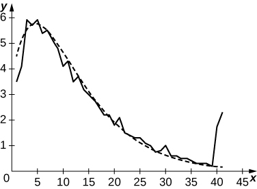
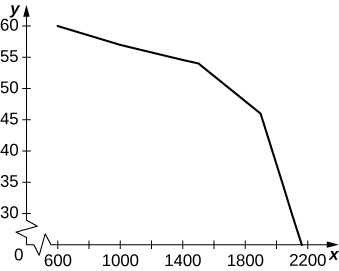
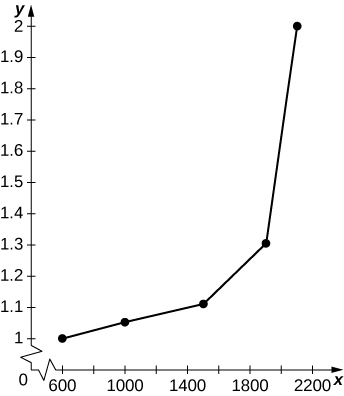
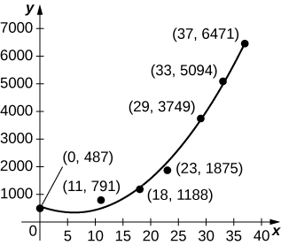
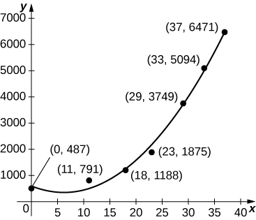
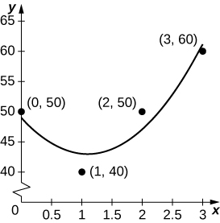
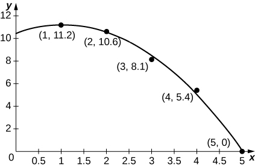
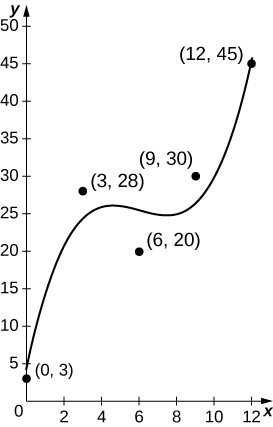
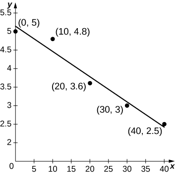

* Apply the basic integration formulas.
* Explain the significance of the net change theorem.
* Use the net change theorem to solve applied problems.
* Apply the integrals of odd and even functions.

In this section, we use some basic integration formulas studied previously to solve some key applied problems. It is important to note that these formulas are presented in terms of *indefinite* integrals. Although definite and indefinite integrals are closely related, there are some key differences to keep in mind. A definite integral is either a number (when the limits of integration are constants) or a single function (when one or both of the limits of integration are variables). An indefinite integral represents a family of functions, all of which differ by a constant. As you become more familiar with integration, you will get a feel for when to use definite integrals and when to use indefinite integrals. You will naturally select the correct approach for a given problem without thinking too much about it. However, until these concepts are cemented in your mind, think carefully about whether you need a definite integral or an indefinite integral and make sure you are using the proper notation based on your choice.

### Basic Integration Formulas

Recall the integration formulas given in the [table in Antiderivatives](/m53621#fs-id1165043092431) and the rule on properties of definite integrals. Let’s look at a few examples of how to apply these rules.

Integrating a Function Using the Power Rule

Use the power rule to integrate the function <math xmlns="http://www.w3.org/1998/Math/MathML"><mrow><mstyle displaystyle="true"><mrow><msubsup><mo>∫</mo><mn>1</mn><mn>4</mn></msubsup><mrow><msqrt><mi>t</mi></msqrt><mrow><mo>(</mo><mrow><mn>1</mn><mo>+</mo><mi>t</mi></mrow><mo>)</mo></mrow><mi>d</mi><mi>t</mi></mrow></mrow></mstyle><mo>.</mo></mrow></math>

The first step is to rewrite the function and simplify it so we can apply the power rule:

<math xmlns="http://www.w3.org/1998/Math/MathML"><mtable><mtr><mtd columnalign="left"><mstyle displaystyle="true"><mrow><msubsup><mo>∫</mo><mn>1</mn><mn>4</mn></msubsup><mrow><msqrt><mi>t</mi></msqrt><mo stretchy="false">(</mo><mn>1</mn><mo>+</mo><mi>t</mi><mo stretchy="false">)</mo><mi>d</mi><mi>t</mi></mrow></mrow></mstyle></mtd><mtd columnalign="left"><mo>=</mo><mstyle displaystyle="true"><mrow><msubsup><mo>∫</mo><mn>1</mn><mn>4</mn></msubsup><mrow><msup><mi>t</mi><mrow><mn>1</mn><mtext>/</mtext><mn>2</mn></mrow></msup><mo stretchy="false">(</mo><mn>1</mn><mo>+</mo><mi>t</mi><mo stretchy="false">)</mo><mi>d</mi><mi>t</mi></mrow></mrow></mstyle></mtd></mtr><mtr /><mtr><mtd /><mtd columnalign="left"><mo>=</mo><mstyle displaystyle="true"><mrow><msubsup><mo>∫</mo><mn>1</mn><mn>4</mn></msubsup><mrow><mrow><mo>(</mo><mrow><msup><mi>t</mi><mrow><mn>1</mn><mtext>/</mtext><mn>2</mn></mrow></msup><mo>+</mo><msup><mi>t</mi><mrow><mn>3</mn><mtext>/</mtext><mn>2</mn></mrow></msup></mrow><mo>)</mo></mrow><mi>d</mi><mi>t</mi></mrow></mrow></mstyle><mo>.</mo></mtd></mtr></mtable></math>

Now apply the power rule:

<math xmlns="http://www.w3.org/1998/Math/MathML"><mtable><mtr><mtd columnalign="left"><mstyle displaystyle="true"><mrow><msubsup><mo>∫</mo><mn>1</mn><mn>4</mn></msubsup><mrow><mrow><mo>(</mo><mrow><msup><mi>t</mi><mrow><mn>1</mn><mtext>/</mtext><mn>2</mn></mrow></msup><mo>+</mo><msup><mi>t</mi><mrow><mn>3</mn><mtext>/</mtext><mn>2</mn></mrow></msup></mrow><mo>)</mo></mrow><mi>d</mi><mi>t</mi></mrow></mrow></mstyle></mtd><mtd columnalign="left"><mo>=</mo><msubsup><mrow><mrow><mrow><mo>(</mo><mrow><mfrac><mn>2</mn><mn>3</mn></mfrac><msup><mi>t</mi><mrow><mn>3</mn><mtext>/</mtext><mn>2</mn></mrow></msup><mo>+</mo><mfrac><mn>2</mn><mn>5</mn></mfrac><msup><mi>t</mi><mrow><mn>5</mn><mtext>/</mtext><mn>2</mn></mrow></msup></mrow><mo>)</mo></mrow></mrow><mo>\|</mo></mrow><mn>1</mn><mn>4</mn></msubsup></mtd></mtr><mtr><mtd /><mtd columnalign="left"><mo>=</mo><mrow><mo>[</mo><mrow><mfrac><mn>2</mn><mn>3</mn></mfrac><msup><mrow><mo stretchy="false">(</mo><mn>4</mn><mo stretchy="false">)</mo></mrow><mrow><mn>3</mn><mtext>/</mtext><mn>2</mn></mrow></msup><mo>+</mo><mfrac><mn>2</mn><mn>5</mn></mfrac><msup><mrow><mo stretchy="false">(</mo><mn>4</mn><mo stretchy="false">)</mo></mrow><mrow><mn>5</mn><mtext>/</mtext><mn>2</mn></mrow></msup></mrow><mo>]</mo></mrow><mo>−</mo><mrow><mo>[</mo><mrow><mfrac><mn>2</mn><mn>3</mn></mfrac><msup><mrow><mo stretchy="false">(</mo><mn>1</mn><mo stretchy="false">)</mo></mrow><mrow><mn>3</mn><mtext>/</mtext><mn>2</mn></mrow></msup><mo>+</mo><mfrac><mn>2</mn><mn>5</mn></mfrac><msup><mrow><mo stretchy="false">(</mo><mn>1</mn><mo stretchy="false">)</mo></mrow><mrow><mn>5</mn><mtext>/</mtext><mn>2</mn></mrow></msup></mrow><mo>]</mo></mrow></mtd></mtr><mtr><mtd /><mtd columnalign="left"><mo>=</mo><mfrac><mrow><mn>256</mn></mrow><mrow><mn>15</mn></mrow></mfrac><mo>.</mo></mtd></mtr></mtable></math>

Find the definite integral of <math xmlns="http://www.w3.org/1998/Math/MathML"><mrow><mi>f</mi><mrow><mo>(</mo><mi>x</mi><mo>)</mo></mrow><mo>=</mo><msup><mi>x</mi><mn>2</mn></msup><mo>−</mo><mn>3</mn><mi>x</mi></mrow></math>

 over the interval <math xmlns="http://www.w3.org/1998/Math/MathML"><mrow><mrow><mo>[</mo><mrow><mn>1</mn><mo>,</mo><mn>3</mn></mrow><mo>]</mo></mrow><mo>.</mo></mrow></math>

<math xmlns="http://www.w3.org/1998/Math/MathML"><mrow><mo>−</mo><mfrac><mrow><mn>10</mn></mrow><mn>3</mn></mfrac></mrow></math>

Hint

Follow the process from [[link]](#fs-id1170571609338) to solve the problem.

### The Net Change Theorem

The **net change theorem**{: data-type="term"} considers the integral of a ***rate of change***{: data-type="term" .no-emphasis}. It says that when a quantity changes, the new value equals the initial value plus the integral of the rate of change of that quantity. The formula can be expressed in two ways. The second is more familiar; it is simply the definite integral.

Net Change Theorem

The new value of a changing quantity equals the initial value plus the integral of the rate of change:

<math xmlns="http://www.w3.org/1998/Math/MathML"><mrow><mtable><mtr /><mtr /><mtr><mtd columnalign="left"><mi>F</mi><mrow><mo>(</mo><mi>b</mi><mo>)</mo></mrow><mo>=</mo><mi>F</mi><mrow><mo>(</mo><mi>a</mi><mo>)</mo></mrow><mo>+</mo><mstyle displaystyle="true"><mrow><msubsup><mo>∫</mo><mi>a</mi><mi>b</mi></msubsup><mrow><mi>F</mi><mo>'</mo><mrow><mo>(</mo><mi>x</mi><mo>)</mo></mrow><mi>d</mi><mi>x</mi></mrow></mrow></mstyle></mtd></mtr><mtr><mtd columnalign="center"><mtext>or</mtext></mtd></mtr><mtr><mtd columnalign="left"><mstyle displaystyle="true"><mrow><msubsup><mo>∫</mo><mi>a</mi><mi>b</mi></msubsup><mrow><mi>F</mi><mo>'</mo><mrow><mo>(</mo><mi>x</mi><mo>)</mo></mrow><mi>d</mi><mi>x</mi><mo>=</mo><mi>F</mi><mrow><mo>(</mo><mi>b</mi><mo>)</mo></mrow><mo>−</mo><mi>F</mi><mrow><mo>(</mo><mi>a</mi><mo>)</mo></mrow></mrow></mrow></mstyle><mo>.</mo></mtd></mtr></mtable></mrow></math>

Subtracting <math xmlns="http://www.w3.org/1998/Math/MathML"><mrow><mi>F</mi><mrow><mo>(</mo><mi>a</mi><mo>)</mo></mrow></mrow></math>

 from both sides of the first equation yields the second equation. Since they are equivalent formulas, which one we use depends on the application.

The significance of the net change theorem lies in the results. Net change can be applied to area, distance, and volume, to name only a few applications. Net change accounts for negative quantities automatically without having to write more than one integral. To illustrate, let’s apply the net change theorem to a **velocity**{: data-type="term" .no-emphasis} function in which the result is **displacement**{: data-type="term" .no-emphasis}.

We looked at a simple example of this in [The Definite Integral](/m53631){: .target-chapter}. Suppose a car is moving due north (the positive direction) at 40 mph between 2 p.m. and 4 p.m., then the car moves south at 30 mph between 4 p.m. and 5 p.m. We can graph this motion as shown in [\[link\]](#CNX_Calc_Figure_05_04_001).

 ![A graph with the x axis marked as t and the y axis marked normally. The lines y=40 and y=-30 are drawn over \[2,4\] and \[4,5\], respectively.The areas between the lines and the x axis are shaded.](../resources/CNX_Calc_Figure_05_04_002.jpg "The graph shows speed versus time for the given motion of a car."){: #CNX_Calc_Figure_05_04_001}

Just as we did before, we can use definite integrals to calculate the net displacement as well as the total distance traveled. The net displacement is given by

<math xmlns="http://www.w3.org/1998/Math/MathML"><mtable><mtr><mtd columnalign="left"><mstyle displaystyle="true"><mrow><msubsup><mo>∫</mo><mn>2</mn><mn>5</mn></msubsup><mi>v</mi></mrow></mstyle><mo stretchy="false">(</mo><mi>t</mi><mo stretchy="false">)</mo><mi>d</mi><mi>t</mi></mtd><mtd columnalign="left"><mo>=</mo><mstyle displaystyle="true"><mrow><msubsup><mo>∫</mo><mn>2</mn><mn>4</mn></msubsup><mn>4</mn></mrow></mstyle><mn>0</mn><mi>d</mi><mi>t</mi><mo>+</mo><mstyle displaystyle="true"><mrow><msubsup><mo>∫</mo><mn>4</mn><mn>5</mn></msubsup></mrow></mstyle><mn>−30</mn><mi>d</mi><mi>t</mi></mtd></mtr><mtr><mtd /><mtd columnalign="left"><mo>=</mo><mn>80</mn><mo>−</mo><mn>30</mn></mtd></mtr><mtr><mtd /><mtd columnalign="left"><mo>=</mo><mn>50</mn><mo>.</mo></mtd></mtr></mtable></math>

Thus, at 5 p.m. the car is 50 mi north of its starting position. The total distance traveled is given by

<math xmlns="http://www.w3.org/1998/Math/MathML"><mtable><mtr /><mtr /><mtr><mtd columnalign="left"><msubsup><mstyle mathsize="140%" displaystyle="true"><mo>∫</mo></mstyle><mn>2</mn><mn>5</mn></msubsup><mrow><mo>\|</mo><mrow><mi>v</mi><mo stretchy="false">(</mo><mi>t</mi><mo stretchy="false">)</mo></mrow><mo>\|</mo></mrow><mi>d</mi><mi>t</mi></mtd><mtd columnalign="left"><mo>=</mo><mstyle displaystyle="true"><mrow><msubsup><mo>∫</mo><mn>2</mn><mn>4</mn></msubsup><mn>4</mn></mrow></mstyle><mn>0</mn><mi>d</mi><mi>t</mi><mo>+</mo><msubsup><mstyle mathsize="140%" displaystyle="true"><mo>∫</mo></mstyle><mn>4</mn><mn>5</mn></msubsup><mn>30</mn><mi>d</mi><mi>t</mi></mtd></mtr><mtr><mtd /><mtd columnalign="left"><mo>=</mo><mn>80</mn><mo>+</mo><mn>30</mn></mtd></mtr><mtr><mtd /><mtd columnalign="left"><mo>=</mo><mn>110</mn><mo>.</mo></mtd></mtr></mtable></math>

Therefore, between 2 p.m. and 5 p.m., the car traveled a total of 110 mi.

To summarize, net displacement may include both positive and negative values. In other words, the velocity function accounts for both forward distance and backward distance. To find net displacement, integrate the velocity function over the interval. Total distance traveled, on the other hand, is always positive. To find the total distance traveled by an object, regardless of direction, we need to integrate the absolute value of the velocity function.

Finding Net Displacement

Given a velocity function <math xmlns="http://www.w3.org/1998/Math/MathML"><mrow><mi>v</mi><mrow><mo>(</mo><mi>t</mi><mo>)</mo></mrow><mo>=</mo><mn>3</mn><mi>t</mi><mo>−</mo><mn>5</mn></mrow></math>

 (in meters per second) for a particle in motion from time <math xmlns="http://www.w3.org/1998/Math/MathML"><mrow><mi>t</mi><mo>=</mo><mn>0</mn></mrow></math>

 to time <math xmlns="http://www.w3.org/1998/Math/MathML"><mrow><mi>t</mi><mo>=</mo><mn>3</mn><mo>,</mo></mrow></math>

 find the net displacement of the particle.

Applying the net change theorem, we have

<math xmlns="http://www.w3.org/1998/Math/MathML"><mtable columnalign="left"><mtr><mtd columnalign="left"><mstyle displaystyle="true"><mrow><msubsup><mo stretchy="true">∫</mo><mn>0</mn><mn>3</mn></msubsup><mrow><mrow><mo>(</mo><mrow><mn>3</mn><mi>t</mi><mo>−</mo><mn>5</mn></mrow><mo>)</mo></mrow><mi>d</mi><mi>t</mi></mrow></mrow></mstyle></mtd><mtd columnalign="left"><mo>=</mo><mfrac><mrow><mn>3</mn><msup><mi>t</mi><mn>2</mn></msup></mrow><mn>2</mn></mfrac><mo>−</mo><mn>5</mn><mi>t</mi><mrow><msubsup><mo>\|</mo><mrow><mn>0</mn></mrow><mn>3</mn></msubsup></mrow></mtd></mtr><mtr /><mtr><mtd /><mtd columnalign="left"><mo>=</mo><mrow><mo>[</mo><mrow><mfrac><mrow><mn>3</mn><msup><mrow><mrow><mo>(</mo><mn>3</mn><mo>)</mo></mrow></mrow><mn>2</mn></msup></mrow><mn>2</mn></mfrac><mo>−</mo><mn>5</mn><mrow><mo>(</mo><mn>3</mn><mo>)</mo></mrow></mrow><mo>]</mo></mrow><mo>−</mo><mn>0</mn></mtd></mtr><mtr><mtd /><mtd columnalign="left"><mo>=</mo><mfrac><mrow><mn>27</mn></mrow><mn>2</mn></mfrac><mo>−</mo><mn>15</mn></mtd></mtr><mtr><mtd /><mtd columnalign="left"><mo>=</mo><mfrac><mrow><mn>27</mn></mrow><mn>2</mn></mfrac><mo>−</mo><mfrac><mrow><mn>30</mn></mrow><mn>2</mn></mfrac></mtd></mtr><mtr><mtd /><mtd columnalign="left"><mo>=</mo><mo>−</mo><mfrac><mn>3</mn><mn>2</mn></mfrac><mo>.</mo></mtd></mtr></mtable></math>

The net displacement is <math xmlns="http://www.w3.org/1998/Math/MathML"><mrow><mo>−</mo><mfrac><mn>3</mn><mn>2</mn></mfrac></mrow></math>

 m ([[link]](#CNX_Calc_Figure_05_04_002)).

![A graph of the line v(t) = 3t &#x2013; 5, which goes through points (0, -5) and (5/3, 0). The area over the line and under the x axis in the interval \[0, 5/3\] is shaded. The area under the line and above the x axis in the interval \[5/3, 3\] is shaded.](../resources/CNX_Calc_Figure_05_04_003.jpg "The graph shows velocity versus time for a particle moving with a linear velocity function."){: #CNX_Calc_Figure_05_04_002}

Finding the Total Distance Traveled

Use [[link]](#fs-id1170572229863) to find the total distance traveled by a particle according to the velocity function <math xmlns="http://www.w3.org/1998/Math/MathML"><mrow><mi>v</mi><mrow><mo>(</mo><mi>t</mi><mo>)</mo></mrow><mo>=</mo><mn>3</mn><mi>t</mi><mo>−</mo><mn>5</mn></mrow></math>

 m/sec over a time interval <math xmlns="http://www.w3.org/1998/Math/MathML"><mrow><mrow><mo>[</mo><mrow><mn>0</mn><mo>,</mo><mn>3</mn></mrow><mo>]</mo></mrow><mo>.</mo></mrow></math>

The total distance traveled includes both the positive and the negative values. Therefore, we must integrate the absolute value of the velocity function to find the total distance traveled.

To continue with the example, use two integrals to find the total distance. First, find the *t*-intercept of the function, since that is where the division of the interval occurs. Set the equation equal to zero and solve for *t*. Thus,

<math xmlns="http://www.w3.org/1998/Math/MathML"><mtable><mtr><mtd columnalign="left"><mn>3</mn><mi>t</mi><mo>−</mo><mn>5</mn></mtd><mtd columnalign="left"><mo>=</mo></mtd><mtd columnalign="left"><mn>0</mn></mtd></mtr><mtr><mtd columnalign="right"><mn>3</mn><mi>t</mi></mtd><mtd columnalign="left"><mo>=</mo></mtd><mtd columnalign="left"><mn>5</mn></mtd></mtr><mtr><mtd columnalign="right"><mi>t</mi></mtd><mtd columnalign="left"><mo>=</mo></mtd><mtd columnalign="left"><mfrac><mn>5</mn><mn>3</mn></mfrac><mo>.</mo></mtd></mtr></mtable></math>

The two subintervals are <math xmlns="http://www.w3.org/1998/Math/MathML"><mrow><mrow><mo>[</mo><mrow><mn>0</mn><mo>,</mo><mfrac><mn>5</mn><mn>3</mn></mfrac></mrow><mo>]</mo></mrow></mrow></math>

 and <math xmlns="http://www.w3.org/1998/Math/MathML"><mrow><mrow><mo>[</mo><mrow><mfrac><mn>5</mn><mn>3</mn></mfrac><mo>,</mo><mn>3</mn></mrow><mo>]</mo></mrow><mo>.</mo></mrow></math>

 To find the total distance traveled, integrate the absolute value of the function. Since the function is negative over the interval <math xmlns="http://www.w3.org/1998/Math/MathML"><mrow><mrow><mo>[</mo><mrow><mn>0</mn><mo>,</mo><mfrac><mn>5</mn><mn>3</mn></mfrac></mrow><mo>]</mo></mrow><mo>,</mo></mrow></math>

 we have <math xmlns="http://www.w3.org/1998/Math/MathML"><mrow><mrow><mo>\|</mo><mrow><mi>v</mi><mrow><mo>(</mo><mi>t</mi><mo>)</mo></mrow></mrow><mo>\|</mo></mrow><mo>=</mo><mtext>−</mtext><mi>v</mi><mrow><mo>(</mo><mi>t</mi><mo>)</mo></mrow></mrow></math>

 over that interval. Over <math xmlns="http://www.w3.org/1998/Math/MathML"><mrow><mrow><mo>[</mo><mrow><mfrac><mn>5</mn><mn>3</mn></mfrac><mo>,</mo><mn>3</mn></mrow><mo>]</mo></mrow><mo>,</mo></mrow></math>

 the function is positive, so <math xmlns="http://www.w3.org/1998/Math/MathML"><mrow><mrow><mo>\|</mo><mrow><mi>v</mi><mo stretchy="false">(</mo><mi>t</mi><mo stretchy="false">)</mo></mrow><mo>\|</mo></mrow><mo>=</mo><mi>v</mi><mo stretchy="false">(</mo><mi>t</mi><mo stretchy="false">)</mo><mo>.</mo></mrow></math>

 Thus, we have

<math xmlns="http://www.w3.org/1998/Math/MathML"><mtable><mtr /><mtr /><mtr><mtd columnalign="left"><mstyle displaystyle="true"><mrow><msubsup><mo>∫</mo><mn>0</mn><mn>3</mn></msubsup><mrow><mrow><mo>\|</mo><mrow><mi>v</mi><mrow><mo>(</mo><mi>t</mi><mo>)</mo></mrow></mrow><mo>\|</mo></mrow><mi>d</mi><mi>t</mi></mrow></mrow></mstyle></mtd><mtd columnalign="left"><mo>=</mo><mstyle displaystyle="true"><mrow><msubsup><mo>∫</mo><mn>0</mn><mrow><mn>5</mn><mtext>/</mtext><mn>3</mn></mrow></msubsup><mrow><mtext>−</mtext><mi>v</mi><mo stretchy="false">(</mo><mi>t</mi><mo stretchy="false">)</mo><mi>d</mi><mi>t</mi><mo>+</mo><mstyle displaystyle="true"><mrow><msubsup><mo>∫</mo><mrow><mn>5</mn><mtext>/</mtext><mn>3</mn></mrow><mn>3</mn></msubsup><mi>v</mi></mrow></mstyle><mo stretchy="false">(</mo><mi>t</mi><mo stretchy="false">)</mo><mi>d</mi><mi>t</mi></mrow></mrow></mstyle></mtd></mtr><mtr /><mtr><mtd /><mtd columnalign="left"><mo>=</mo><mstyle displaystyle="true"><mrow><msubsup><mo>∫</mo><mn>0</mn><mrow><mn>5</mn><mtext>/</mtext><mn>3</mn></mrow></msubsup><mn>5</mn></mrow></mstyle><mo>−</mo><mn>3</mn><mi>t</mi><mi>d</mi><mi>t</mi><mo>+</mo><mstyle displaystyle="true"><mrow><msubsup><mo>∫</mo><mrow><mn>5</mn><mtext>/</mtext><mn>3</mn></mrow><mn>3</mn></msubsup><mn>3</mn></mrow></mstyle><mi>t</mi><mo>−</mo><mn>5</mn><mi>d</mi><mi>t</mi></mtd></mtr><mtr><mtd /><mtd columnalign="left"><mo>=</mo><msubsup><mrow><mrow><mrow><mo>(</mo><mrow><mn>5</mn><mi>t</mi><mo>−</mo><mfrac><mrow><mn>3</mn><msup><mi>t</mi><mn>2</mn></msup></mrow><mn>2</mn></mfrac></mrow><mo>)</mo></mrow></mrow><mo>\|</mo></mrow><mn>0</mn><mrow><mn>5</mn><mtext>/</mtext><mn>3</mn></mrow></msubsup><mo>+</mo><msubsup><mrow><mrow><mrow><mo>(</mo><mrow><mfrac><mrow><mn>3</mn><msup><mi>t</mi><mn>2</mn></msup></mrow><mn>2</mn></mfrac><mo>−</mo><mn>5</mn><mi>t</mi></mrow><mo>)</mo></mrow></mrow><mo>\|</mo></mrow><mrow><mn>5</mn><mtext>/</mtext><mn>3</mn></mrow><mn>3</mn></msubsup></mtd></mtr><mtr><mtd /><mtd columnalign="left"><mo>=</mo><mrow><mo>[</mo><mrow><mn>5</mn><mrow><mo>(</mo><mrow><mfrac><mn>5</mn><mn>3</mn></mfrac></mrow><mo>)</mo></mrow><mo>−</mo><mfrac><mrow><mn>3</mn><msup><mrow><mrow><mo>(</mo><mrow><mn>5</mn><mtext>/</mtext><mn>3</mn></mrow><mo>)</mo></mrow></mrow><mn>2</mn></msup></mrow><mn>2</mn></mfrac></mrow><mo>]</mo></mrow><mo>−</mo><mn>0</mn><mo>+</mo><mrow><mo>[</mo><mrow><mfrac><mrow><mn>27</mn></mrow><mn>2</mn></mfrac><mo>−</mo><mn>15</mn></mrow><mo>]</mo></mrow><mo>−</mo><mrow><mo>[</mo><mrow><mfrac><mrow><mn>3</mn><msup><mrow><mrow><mo>(</mo><mrow><mn>5</mn><mtext>/</mtext><mn>3</mn></mrow><mo>)</mo></mrow></mrow><mn>2</mn></msup></mrow><mn>2</mn></mfrac><mo>−</mo><mfrac><mrow><mn>25</mn></mrow><mn>3</mn></mfrac></mrow><mo>]</mo></mrow></mtd></mtr><mtr><mtd /><mtd columnalign="left"><mo>=</mo><mfrac><mrow><mn>25</mn></mrow><mn>3</mn></mfrac><mo>−</mo><mfrac><mrow><mn>25</mn></mrow><mn>6</mn></mfrac><mo>+</mo><mfrac><mrow><mn>27</mn></mrow><mn>2</mn></mfrac><mo>−</mo><mn>15</mn><mo>−</mo><mfrac><mrow><mn>25</mn></mrow><mn>6</mn></mfrac><mo>+</mo><mfrac><mrow><mn>25</mn></mrow><mn>3</mn></mfrac></mtd></mtr><mtr><mtd /><mtd columnalign="left"><mo>=</mo><mfrac><mrow><mn>41</mn></mrow><mn>6</mn></mfrac><mo>.</mo></mtd></mtr></mtable></math>

So, the total distance traveled is <math xmlns="http://www.w3.org/1998/Math/MathML"><mrow><mfrac><mrow><mn>14</mn></mrow><mn>6</mn></mfrac></mrow></math>

 m.

Find the net displacement and total distance traveled in meters given the velocity function <math xmlns="http://www.w3.org/1998/Math/MathML"><mrow><mi>f</mi><mrow><mo>(</mo><mi>t</mi><mo>)</mo></mrow><mo>=</mo><mfrac><mn>1</mn><mn>2</mn></mfrac><msup><mi>e</mi><mi>t</mi></msup><mo>−</mo><mn>2</mn></mrow></math>

 over the interval <math xmlns="http://www.w3.org/1998/Math/MathML"><mrow><mrow><mo>[</mo><mrow><mn>0</mn><mo>,</mo><mn>2</mn></mrow><mo>]</mo></mrow><mo>.</mo></mrow></math>

Net displacement: <math xmlns="http://www.w3.org/1998/Math/MathML"><mrow><mfrac><mrow><msup><mi>e</mi><mn>2</mn></msup><mo>−</mo><mn>9</mn></mrow><mn>2</mn></mfrac><mo>≈</mo><mo>−</mo><mn>0.8055</mn><mspace width="0.2em" /><mtext>m;</mtext></mrow></math>

 total distance traveled: <math xmlns="http://www.w3.org/1998/Math/MathML"><mrow><mn>4</mn><mspace width="0.1em" /><mtext>ln</mtext><mspace width="0.1em" /><mn>4</mn><mo>−</mo><mn>7.5</mn><mo>+</mo><mfrac><mrow><msup><mi>e</mi><mn>2</mn></msup></mrow><mn>2</mn></mfrac><mo>≈</mo><mn>1.740</mn></mrow></math>

 m

Hint

Follow the procedures from [[link]](#fs-id1170572229863) and [[link]](#fs-id1170572247866). Note that <math xmlns="http://www.w3.org/1998/Math/MathML"><mrow><mi>f</mi><mrow><mo>(</mo><mi>t</mi><mo>)</mo></mrow><mo>≤</mo><mn>0</mn></mrow></math>

 for <math xmlns="http://www.w3.org/1998/Math/MathML"><mrow><mi>t</mi><mo>≤</mo><mtext>ln</mtext><mspace width="0.1em" /><mn>4</mn><mo>,</mo></mrow></math>

 and <math xmlns="http://www.w3.org/1998/Math/MathML"><mrow><mi>f</mi><mrow><mo>(</mo><mi>t</mi><mo>)</mo></mrow><mo>≥</mo><mn>0</mn></mrow></math>

 for <math xmlns="http://www.w3.org/1998/Math/MathML"><mrow><mi>t</mi><mo>≥</mo><mtext>ln</mtext><mspace width="0.1em" /><mn>4</mn><mo>.</mo></mrow></math>

### Applying the Net Change Theorem

The net change theorem can be applied to the flow and consumption of fluids, as shown in [\[link\]](#fs-id1170571542385).

How Many Gallons of Gasoline Are Consumed?

If the motor on a motorboat is started at <math xmlns="http://www.w3.org/1998/Math/MathML"><mrow><mi>t</mi><mo>=</mo><mn>0</mn></mrow></math>

 and the boat consumes gasoline at the rate of <math xmlns="http://www.w3.org/1998/Math/MathML"><mrow><mn>5</mn><mo>−</mo><msup><mi>t</mi><mn>3</mn></msup></mrow></math>

 gal/hr, how much gasoline is used in the first 2 hours?

Express the problem as a definite integral, integrate, and evaluate using the Fundamental Theorem of Calculus. The limits of integration are the endpoints of the interval <math xmlns="http://www.w3.org/1998/Math/MathML"><mrow><mrow><mo>[</mo><mrow><mn>0</mn><mo>,</mo><mn>2</mn></mrow><mo>]</mo></mrow><mo>.</mo></mrow></math>

 We have

<math xmlns="http://www.w3.org/1998/Math/MathML"><mtable><mtr><mtd columnalign="left"><mstyle displaystyle="true"><mrow><msubsup><mo stretchy="true">∫</mo><mn>0</mn><mn>2</mn></msubsup><mrow><mrow><mo>(</mo><mrow><mn>5</mn><mo>−</mo><msup><mi>t</mi><mn>3</mn></msup></mrow><mo>)</mo></mrow><mi>d</mi><mi>t</mi></mrow></mrow></mstyle></mtd><mtd columnalign="left"><mo>=</mo><mrow><mo>(</mo><mrow><mn>5</mn><mi>t</mi><mo>−</mo><mfrac><mrow><msup><mi>t</mi><mn>4</mn></msup></mrow><mn>4</mn></mfrac></mrow><mo>)</mo></mrow><mrow><msubsup><mo>\|</mo><mrow><mn>0</mn></mrow><mn>2</mn></msubsup></mrow></mtd></mtr><mtr /><mtr /><mtr><mtd /><mtd columnalign="left"><mo>=</mo><mrow><mo>[</mo><mrow><mn>5</mn><mrow><mo>(</mo><mn>2</mn><mo>)</mo></mrow><mo>−</mo><mfrac><mrow><msup><mrow><mrow><mo>(</mo><mn>2</mn><mo>)</mo></mrow></mrow><mn>4</mn></msup></mrow><mn>4</mn></mfrac></mrow><mo>]</mo></mrow><mo>−</mo><mn>0</mn></mtd></mtr><mtr><mtd /><mtd columnalign="left"><mo>=</mo><mn>10</mn><mo>−</mo><mfrac><mrow><mn>16</mn></mrow><mn>4</mn></mfrac></mtd></mtr><mtr><mtd /><mtd columnalign="left"><mo>=</mo><mn>6</mn><mo>.</mo></mtd></mtr></mtable></math>

Thus, the motorboat uses 6 gal of gas in 2 hours.

Chapter Opener: Iceboats

"){: #CNX_Calc_Figure_05_04_005}

As we saw at the beginning of the chapter, top **iceboat**{: data-type="term" .no-emphasis} racers ([[link]](/m53623#CNX_BMath_Figure_05_00_001)) can attain speeds of up to five times the wind speed. Andrew is an intermediate iceboater, though, so he attains speeds equal to only twice the wind speed. Suppose Andrew takes his iceboat out one morning when a light 5-mph breeze has been blowing all morning. As Andrew gets his iceboat set up, though, the wind begins to pick up. During his first half hour of iceboating, the wind speed increases according to the function <math xmlns="http://www.w3.org/1998/Math/MathML"><mrow><mi>v</mi><mrow><mo>(</mo><mi>t</mi><mo>)</mo></mrow><mo>=</mo><mn>20</mn><mi>t</mi><mo>+</mo><mn>5</mn><mo>.</mo></mrow></math>

 For the second half hour of Andrew’s outing, the wind remains steady at 15 mph. In other words, the wind speed is given by

<math xmlns="http://www.w3.org/1998/Math/MathML"><mrow><mi>v</mi><mrow><mo>(</mo><mi>t</mi><mo>)</mo></mrow><mo>=</mo><mrow><mo>{</mo><mtable columnalign="left"><mtr><mtd columnalign="left"><mn>20</mn><mi>t</mi><mo>+</mo><mn>5</mn></mtd><mtd columnalign="left"><mtext>for</mtext></mtd><mtd columnalign="left"><mn>0</mn><mo>≤</mo><mi>t</mi><mo>≤</mo><mfrac><mn>1</mn><mn>2</mn></mfrac></mtd></mtr><mtr><mtd columnalign="left"><mn>15</mn></mtd><mtd columnalign="left"><mtext>for</mtext></mtd><mtd columnalign="left"><mfrac><mn>1</mn><mn>2</mn></mfrac><mo>≤</mo><mi>t</mi><mo>≤</mo><mn>1</mn><mo>.</mo></mtd></mtr></mtable></mrow></mrow></math>

Recalling that Andrew’s iceboat travels at twice the wind speed, and assuming he moves in a straight line away from his starting point, how far is Andrew from his starting point after 1 hour?

To figure out how far Andrew has traveled, we need to integrate his velocity, which is twice the wind speed. Then

Distance <math xmlns="http://www.w3.org/1998/Math/MathML"><mrow><mo>=</mo><mstyle displaystyle="true"><mrow><msubsup><mo>∫</mo><mn>0</mn><mn>1</mn></msubsup><mrow><mn>2</mn><mi>v</mi><mrow><mo>(</mo><mi>t</mi><mo>)</mo></mrow><mi>d</mi><mi>t</mi></mrow></mrow></mstyle><mo>.</mo></mrow></math>

Substituting the expressions we were given for <math xmlns="http://www.w3.org/1998/Math/MathML"><mrow><mi>v</mi><mrow><mo>(</mo><mi>t</mi><mo>)</mo></mrow><mo>,</mo></mrow></math>

 we get

<math xmlns="http://www.w3.org/1998/Math/MathML"><mtable><mtr><mtd columnalign="left"><mstyle displaystyle="true"><mrow><msubsup><mo>∫</mo><mn>0</mn><mn>1</mn></msubsup><mrow><mn>2</mn><mi>v</mi><mrow><mo>(</mo><mi>t</mi><mo>)</mo></mrow><mi>d</mi><mi>t</mi></mrow></mrow></mstyle></mtd><mtd columnalign="left"><mo>=</mo><mstyle displaystyle="true"><mrow><msubsup><mo>∫</mo><mn>0</mn><mrow><mn>1</mn><mtext>/</mtext><mn>2</mn></mrow></msubsup><mrow><mn>2</mn><mi>v</mi><mrow><mo>(</mo><mi>t</mi><mo>)</mo></mrow><mi>d</mi><mi>t</mi><mo>+</mo><mstyle displaystyle="true"><mrow><msubsup><mo>∫</mo><mrow><mn>1</mn><mtext>/</mtext><mn>2</mn></mrow><mn>1</mn></msubsup><mrow><mn>2</mn><mi>v</mi><mrow><mo>(</mo><mi>t</mi><mo>)</mo></mrow><mi>d</mi><mi>t</mi></mrow></mrow></mstyle></mrow></mrow></mstyle></mtd></mtr><mtr><mtd /><mtd columnalign="left"><mo>=</mo><mstyle displaystyle="true"><mrow><msubsup><mo>∫</mo><mn>0</mn><mrow><mn>1</mn><mtext>/</mtext><mn>2</mn></mrow></msubsup><mrow><mn>2</mn><mrow><mo>(</mo><mrow><mn>20</mn><mi>t</mi><mo>+</mo><mn>5</mn></mrow><mo>)</mo></mrow><mi>d</mi><mi>t</mi><mo>+</mo><mstyle displaystyle="true"><mrow><msubsup><mo>∫</mo><mrow><mn>1</mn><mtext>/</mtext><mn>3</mn></mrow><mn>1</mn></msubsup><mrow><mn>2</mn><mrow><mo>(</mo><mrow><mn>15</mn></mrow><mo>)</mo></mrow><mi>d</mi><mi>t</mi></mrow></mrow></mstyle></mrow></mrow></mstyle></mtd></mtr><mtr><mtd /><mtd columnalign="left"><mo>=</mo><mstyle displaystyle="true"><mrow><msubsup><mo>∫</mo><mn>0</mn><mrow><mn>1</mn><mtext>/</mtext><mn>2</mn></mrow></msubsup><mrow><mrow><mo>(</mo><mrow><mn>40</mn><mi>t</mi><mo>+</mo><mn>10</mn></mrow><mo>)</mo></mrow><mi>d</mi><mi>t</mi><mo>+</mo><mstyle displaystyle="true"><mrow><msubsup><mo>∫</mo><mrow><mn>1</mn><mtext>/</mtext><mn>2</mn></mrow><mn>1</mn></msubsup><mrow><mn>30</mn><mi>d</mi><mi>t</mi></mrow></mrow></mstyle></mrow></mrow></mstyle></mtd></mtr><mtr><mtd /><mtd columnalign="left"><mo>=</mo><mrow><mo>[</mo><mrow><mn>20</mn><msup><mi>t</mi><mn>2</mn></msup><mo>+</mo><mn>10</mn><mi>t</mi></mrow><mo>]</mo></mrow><mrow><msubsup><mo>\|</mo><mrow><mn>0</mn></mrow><mrow><mn>1</mn><mtext>/</mtext><mn>2</mn></mrow></msubsup><mo>+</mo><mrow><mo>[</mo><mrow><mn>30</mn><mi>t</mi></mrow><mo>]</mo></mrow><msubsup><mo>\|</mo><mrow><mn>1</mn><mtext>/</mtext><mn>2</mn></mrow><mn>1</mn></msubsup></mrow></mtd></mtr><mtr><mtd /><mtd columnalign="left"><mo>=</mo><mrow><mo>(</mo><mrow><mfrac><mrow><mn>20</mn></mrow><mn>4</mn></mfrac><mo>+</mo><mn>5</mn></mrow><mo>)</mo></mrow><mo>−</mo><mn>0</mn><mo>+</mo><mrow><mo>(</mo><mrow><mn>30</mn><mo>−</mo><mn>15</mn></mrow><mo>)</mo></mrow></mtd></mtr><mtr><mtd /><mtd columnalign="left"><mo>=</mo><mn>25.</mn></mtd></mtr></mtable></math>

Andrew is 25 mi from his starting point after 1 hour.

Suppose that, instead of remaining steady during the second half hour of Andrew’s outing, the wind starts to die down according to the function <math xmlns="http://www.w3.org/1998/Math/MathML"><mrow><mi>v</mi><mrow><mo>(</mo><mi>t</mi><mo>)</mo></mrow><mo>=</mo><mn>−10</mn><mi>t</mi><mo>+</mo><mn>15</mn><mo>.</mo></mrow></math>

 In other words, the wind speed is given by

<math xmlns="http://www.w3.org/1998/Math/MathML"><mrow><mi>v</mi><mrow><mo>(</mo><mi>t</mi><mo>)</mo></mrow><mo>=</mo><mrow><mo>{</mo><mtable columnalign="left"><mtr><mtd columnalign="left"><mn>20</mn><mi>t</mi><mo>+</mo><mn>5</mn></mtd><mtd columnalign="left"><mtext>for</mtext></mtd><mtd columnalign="left"><mn>0</mn><mo>≤</mo><mi>t</mi><mo>≤</mo><mfrac><mn>1</mn><mn>2</mn></mfrac></mtd></mtr><mtr><mtd columnalign="left"><mo>−</mo><mn>10</mn><mi>t</mi><mo>+</mo><mn>15</mn></mtd><mtd columnalign="left"><mtext>for</mtext></mtd><mtd columnalign="left"><mfrac><mn>1</mn><mn>2</mn></mfrac><mo>≤</mo><mi>t</mi><mo>≤</mo><mn>1</mn><mo>.</mo></mtd></mtr></mtable></mrow></mrow></math>

Under these conditions, how far from his starting point is Andrew after 1 hour?

17\.5 mi

Hint

Don’t forget that Andrew’s iceboat moves twice as fast as the wind.

### Integrating Even and Odd Functions

We saw in [Functions and Graphs](/m53472){: .target-chapter} that an **even function**{: data-type="term" .no-emphasis} is a function in which <math xmlns="http://www.w3.org/1998/Math/MathML"><mrow><mi>f</mi><mrow><mo>(</mo><mrow><mtext>−</mtext><mi>x</mi></mrow><mo>)</mo></mrow><mo>=</mo><mi>f</mi><mrow><mo>(</mo><mi>x</mi><mo>)</mo></mrow></mrow></math>

 for all *x* in the domain—that is, the graph of the curve is unchanged when *x* is replaced with −*x*. The graphs of even functions are symmetric about the *y*-axis. An **odd function**{: data-type="term" .no-emphasis} is one in which <math xmlns="http://www.w3.org/1998/Math/MathML"><mrow><mi>f</mi><mrow><mo>(</mo><mrow><mtext>−</mtext><mi>x</mi></mrow><mo>)</mo></mrow><mo>=</mo><mtext>−</mtext><mi>f</mi><mrow><mo>(</mo><mi>x</mi><mo>)</mo></mrow></mrow></math>

 for all *x* in the domain, and the graph of the function is symmetric about the origin.

Integrals of even functions, when the limits of integration are from −*a* to *a*, involve two equal areas, because they are symmetric about the *y*-axis. Integrals of odd functions, when the limits of integration are similarly <math xmlns="http://www.w3.org/1998/Math/MathML"><mrow><mrow><mo>[</mo><mrow><mtext>−</mtext><mi>a</mi><mo>,</mo><mi>a</mi></mrow><mo>]</mo></mrow><mo>,</mo></mrow></math>

 evaluate to zero because the areas above and below the *x*-axis are equal.

Rule: Integrals of Even and Odd Functions

For continuous even functions such that <math xmlns="http://www.w3.org/1998/Math/MathML"><mrow><mi>f</mi><mrow><mo>(</mo><mrow><mtext>−</mtext><mi>x</mi></mrow><mo>)</mo></mrow><mo>=</mo><mi>f</mi><mrow><mo>(</mo><mi>x</mi><mo>)</mo></mrow><mo>,</mo></mrow></math>

<math xmlns="http://www.w3.org/1998/Math/MathML"><mrow><mstyle displaystyle="true"><mrow><msubsup><mo stretchy="true">∫</mo><mrow><mtext>−</mtext><mi>a</mi></mrow><mi>a</mi></msubsup><mrow><mi>f</mi><mrow><mo>(</mo><mi>x</mi><mo>)</mo></mrow><mi>d</mi><mi>x</mi><mo>=</mo><mn>2</mn><mstyle displaystyle="true"><mrow><msubsup><mo stretchy="true">∫</mo><mn>0</mn><mi>a</mi></msubsup><mrow><mi>f</mi><mrow><mo>(</mo><mi>x</mi><mo>)</mo></mrow><mi>d</mi><mi>x</mi></mrow></mrow></mstyle></mrow></mrow></mstyle><mo>.</mo></mrow></math>

For continuous odd functions such that <math xmlns="http://www.w3.org/1998/Math/MathML"><mrow><mi>f</mi><mrow><mo>(</mo><mrow><mtext>−</mtext><mi>x</mi></mrow><mo>)</mo></mrow><mo>=</mo><mtext>−</mtext><mi>f</mi><mrow><mo>(</mo><mi>x</mi><mo>)</mo></mrow><mo>,</mo></mrow></math>

<math xmlns="http://www.w3.org/1998/Math/MathML"><mrow><mstyle displaystyle="true"><mrow><msubsup><mo stretchy="true">∫</mo><mrow><mtext>−</mtext><mi>a</mi></mrow><mi>a</mi></msubsup><mrow><mi>f</mi><mrow><mo>(</mo><mi>x</mi><mo>)</mo></mrow><mi>d</mi><mi>x</mi><mo>=</mo><mn>0</mn></mrow></mrow></mstyle><mo>.</mo></mrow></math>

Integrating an Even Function

Integrate the even function <math xmlns="http://www.w3.org/1998/Math/MathML"><mrow><mstyle displaystyle="true"><mrow><msubsup><mo stretchy="true">∫</mo><mrow><mn>−2</mn></mrow><mn>2</mn></msubsup><mrow><mrow><mo>(</mo><mrow><mn>3</mn><msup><mi>x</mi><mn>8</mn></msup><mo>−</mo><mn>2</mn></mrow><mo>)</mo></mrow><mi>d</mi><mi>x</mi></mrow></mrow></mstyle></mrow></math>

 and verify that the integration formula for even functions holds.

The symmetry appears in the graphs in [[link]](#CNX_Calc_Figure_05_04_003). Graph (a) shows the region below the curve and above the *x*-axis. We have to zoom in to this graph by a huge amount to see the region. Graph (b) shows the region above the curve and below the *x*-axis. The signed area of this region is negative. Both views illustrate the symmetry about the *y*-axis of an even function. We have

<math xmlns="http://www.w3.org/1998/Math/MathML"><mtable columnalign="left"><mtr><mtd columnalign="left"><mstyle displaystyle="true"><mrow><msubsup><mo stretchy="true">∫</mo><mrow><mn>−2</mn></mrow><mn>2</mn></msubsup><mrow><mrow><mo>(</mo><mrow><mn>3</mn><msup><mi>x</mi><mn>8</mn></msup><mo>−</mo><mn>2</mn></mrow><mo>)</mo></mrow><mi>d</mi><mi>x</mi></mrow></mrow></mstyle></mtd><mtd columnalign="left"><mo>=</mo><mrow><mo>(</mo><mrow><mfrac><mrow><msup><mi>x</mi><mn>9</mn></msup></mrow><mn>3</mn></mfrac><mo>−</mo><mn>2</mn><mi>x</mi></mrow><mo>)</mo></mrow><mrow><msubsup><mo>\|</mo><mrow><mn>−2</mn></mrow><mn>2</mn></msubsup></mrow></mtd></mtr><mtr /><mtr /><mtr><mtd /><mtd columnalign="left"><mo>=</mo><mrow><mo>[</mo><mrow><mfrac><mrow><msup><mrow><mrow><mo>(</mo><mn>2</mn><mo>)</mo></mrow></mrow><mn>9</mn></msup></mrow><mn>3</mn></mfrac><mo>−</mo><mn>2</mn><mrow><mo>(</mo><mn>2</mn><mo>)</mo></mrow></mrow><mo>]</mo></mrow><mo>−</mo><mrow><mo>[</mo><mrow><mfrac><mrow><msup><mrow><mrow><mo>(</mo><mrow><mn>−2</mn></mrow><mo>)</mo></mrow></mrow><mn>9</mn></msup></mrow><mn>3</mn></mfrac><mo>−</mo><mn>2</mn><mrow><mo>(</mo><mrow><mn>−2</mn></mrow><mo>)</mo></mrow></mrow><mo>]</mo></mrow></mtd></mtr><mtr><mtd /><mtd columnalign="left"><mo>=</mo><mrow><mo>(</mo><mrow><mfrac><mrow><mn>512</mn></mrow><mn>3</mn></mfrac><mo>−</mo><mn>4</mn></mrow><mo>)</mo></mrow><mo>−</mo><mrow><mo>(</mo><mrow><mo>−</mo><mfrac><mrow><mn>512</mn></mrow><mn>3</mn></mfrac><mo>+</mo><mn>4</mn></mrow><mo>)</mo></mrow></mtd></mtr><mtr><mtd /><mtd columnalign="left"><mo>=</mo><mfrac><mrow><mn>1000</mn></mrow><mn>3</mn></mfrac><mo>.</mo></mtd></mtr></mtable></math>

To verify the integration formula for even functions, we can calculate the integral from 0 to 2 and double it, then check to make sure we get the same answer.

<math xmlns="http://www.w3.org/1998/Math/MathML"><mtable columnalign="left"><mtr><mtd columnalign="left"><mstyle displaystyle="true"><mrow><msubsup><mo stretchy="true">∫</mo><mn>0</mn><mn>2</mn></msubsup><mrow><mrow><mo>(</mo><mrow><mn>3</mn><msup><mi>x</mi><mn>8</mn></msup><mo>−</mo><mn>2</mn></mrow><mo>)</mo></mrow><mi>d</mi><mi>x</mi></mrow></mrow></mstyle></mtd><mtd columnalign="left"><mo>=</mo><mrow><mo>(</mo><mrow><mfrac><mrow><msup><mi>x</mi><mn>9</mn></msup></mrow><mn>3</mn></mfrac><mo>−</mo><mn>2</mn><mi>x</mi></mrow><mo>)</mo></mrow><mrow><msubsup><mo>\|</mo><mrow><mn>0</mn></mrow><mn>2</mn></msubsup></mrow></mtd></mtr><mtr /><mtr><mtd /><mtd columnalign="left"><mo>=</mo><mfrac><mrow><mn>512</mn></mrow><mn>3</mn></mfrac><mo>−</mo><mn>4</mn></mtd></mtr><mtr><mtd /><mtd columnalign="left"><mo>=</mo><mfrac><mrow><mn>500</mn></mrow><mn>3</mn></mfrac></mtd></mtr></mtable></math>

Since <math xmlns="http://www.w3.org/1998/Math/MathML"><mrow><mn>2</mn><mo>·</mo><mfrac><mrow><mn>500</mn></mrow><mn>3</mn></mfrac><mo>=</mo><mfrac><mrow><mn>1000</mn></mrow><mn>3</mn></mfrac><mo>,</mo></mrow></math>

 we have verified the formula for even functions in this particular example.

![Two graphs of the same function f(x) = 3x^8 &#x2013; 2, side by side. It is symmetric about the y axis, has x-intercepts at (-1,0) and (1,0), and has a y-intercept at (0,-2). The function decreases rapidly as x increases until about -.5, where it levels off at -2. Then, at about .5, it increases rapidly as a mirror image. The first graph is zoomed-out and shows the positive area between the curve and the x axis over \[-2,-1\] and \[1,2\]. The second is zoomed-in and shows the negative area between the curve and the x-axis over \[-1,1\].](../resources/CNX_Calc_Figure_05_04_005.jpg "Graph (a) shows the positive area between the curve and the x-axis, whereas graph (b) shows the negative area between the curve and the x-axis. Both views show the symmetry about the y-axis."){: #CNX_Calc_Figure_05_04_003}

Integrating an Odd Function

Evaluate the definite integral of the odd function <math xmlns="http://www.w3.org/1998/Math/MathML"><mrow><mn>−5</mn><mspace width="0.1em" /><mtext>sin</mtext><mspace width="0.1em" /><mi>x</mi></mrow></math>

 over the interval <math xmlns="http://www.w3.org/1998/Math/MathML"><mrow><mrow><mo>[</mo><mrow><mtext>−</mtext><mi>π</mi><mo>,</mo><mi>π</mi></mrow><mo>]</mo></mrow><mo>.</mo></mrow></math>

The graph is shown in [[link]](#CNX_Calc_Figure_05_04_004). We can see the symmetry about the origin by the positive area above the *x*-axis over <math xmlns="http://www.w3.org/1998/Math/MathML"><mrow><mrow><mo>[</mo><mrow><mtext>−</mtext><mi>π</mi><mo>,</mo><mn>0</mn></mrow><mo>]</mo></mrow><mo>,</mo></mrow></math>

 and the negative area below the *x*-axis over <math xmlns="http://www.w3.org/1998/Math/MathML"><mrow><mrow><mo>[</mo><mrow><mn>0</mn><mo>,</mo><mi>π</mi></mrow><mo>]</mo></mrow><mo>.</mo></mrow></math>

 We have

<math xmlns="http://www.w3.org/1998/Math/MathML"><mtable columnalign="left"><mtr><mtd columnalign="left"><mstyle displaystyle="true"><mrow><msubsup><mo stretchy="true">∫</mo><mrow><mtext>−</mtext><mi>π</mi></mrow><mi>π</mi></msubsup><mrow><mn>−5</mn><mspace width="0.1em" /><mtext>sin</mtext><mspace width="0.1em" /><mi>x</mi><mi>d</mi><mi>x</mi></mrow></mrow></mstyle></mtd><mtd columnalign="left"><mo>=</mo><mn>−5</mn><mrow><mo>(</mo><mrow><mtext>−</mtext><mtext>cos</mtext><mspace width="0.1em" /><mi>x</mi></mrow><mo>)</mo></mrow><mrow><msubsup><mo>\|</mo><mrow><mtext>−</mtext><mi>π</mi></mrow><mi>π</mi></msubsup></mrow></mtd></mtr><mtr /><mtr /><mtr><mtd /><mtd columnalign="left"><mo>=</mo><mn>5</mn><mspace width="0.1em" /><mtext>cos</mtext><mspace width="0.1em" /><mi>x</mi><mrow><msubsup><mo>\|</mo><mrow><mtext>−</mtext><mi>π</mi></mrow><mi>π</mi></msubsup></mrow></mtd></mtr><mtr><mtd /><mtd columnalign="left"><mo>=</mo><mrow><mo>[</mo><mrow><mn>5</mn><mspace width="0.1em" /><mtext>cos</mtext><mspace width="0.1em" /><mi>π</mi></mrow><mo>]</mo></mrow><mo>−</mo><mrow><mo>[</mo><mrow><mn>5</mn><mspace width="0.1em" /><mtext>cos</mtext><mrow><mo>(</mo><mrow><mtext>−</mtext><mi>π</mi></mrow><mo>)</mo></mrow></mrow><mo>]</mo></mrow></mtd></mtr><mtr><mtd /><mtd columnalign="left"><mo>=</mo><mn>−5</mn><mo>−</mo><mrow><mo>(</mo><mrow><mn>−5</mn></mrow><mo>)</mo></mrow></mtd></mtr><mtr><mtd /><mtd columnalign="left"><mo>=</mo><mn>0</mn><mo>.</mo></mtd></mtr></mtable></math>

![A graph of the given function f(x) = -5 sin(x). The area under the function but above the x axis is shaded over \[-pi, 0\], and the area above the function and under the x axis is shaded over \[0, pi\].](../resources/CNX_Calc_Figure_05_04_006.jpg "The graph shows areas between a curve and the x-axis for an odd function."){: #CNX_Calc_Figure_05_04_004}

Integrate the function <math xmlns="http://www.w3.org/1998/Math/MathML"><mrow><mstyle displaystyle="true"><mrow><msubsup><mo stretchy="true">∫</mo><mrow><mn>−2</mn></mrow><mn>2</mn></msubsup><mrow><msup><mi>x</mi><mn>4</mn></msup><mi>d</mi><mi>x</mi></mrow></mrow></mstyle><mo>.</mo></mrow></math>

<math xmlns="http://www.w3.org/1998/Math/MathML"><mrow><mfrac><mrow><mn>64</mn></mrow><mn>5</mn></mfrac></mrow></math>

Hint

Integrate an even function.

### Key Concepts

* The net change theorem states that when a quantity changes, the final value equals the initial value plus the integral of the rate of change. Net change can be a positive number, a negative number, or zero.
* The area under an even function over a symmetric interval can be calculated by doubling the area over the positive *x*-axis. For an odd function, the integral over a symmetric interval equals zero, because half the area is negative.
{: data-bullet-style="bullet"}

### Key Equations

* **Net Change Theorem**
  * * *
  {: data-type="newline"}
  
  <math xmlns="http://www.w3.org/1998/Math/MathML"><mrow><mi>F</mi><mrow><mo>(</mo><mi>b</mi><mo>)</mo></mrow><mo>=</mo><mi>F</mi><mrow><mo>(</mo><mi>a</mi><mo>)</mo></mrow><mo>+</mo><mstyle displaystyle="true"><mrow><msubsup><mo>∫</mo><mi>a</mi><mi>b</mi></msubsup><mrow><mi>F</mi><mo>'</mo><mrow><mo>(</mo><mi>x</mi><mo>)</mo></mrow><mi>d</mi><mi>x</mi></mrow></mrow></mstyle></mrow></math>
  
  or
  <math xmlns="http://www.w3.org/1998/Math/MathML"><mrow><mstyle displaystyle="true"><mrow><msubsup><mo>∫</mo><mi>a</mi><mi>b</mi></msubsup><mrow><mi>F</mi><mo>'</mo><mrow><mo>(</mo><mi>x</mi><mo>)</mo></mrow><mi>d</mi><mi>x</mi><mo>=</mo><mi>F</mi><mrow><mo>(</mo><mi>b</mi><mo>)</mo></mrow><mo>−</mo><mi>F</mi><mrow><mo>(</mo><mi>a</mi><mo>)</mo></mrow></mrow></mrow></mstyle></mrow></math>
{: data-bullet-style="bullet"}

<section data-depth="1" class="section-exercises" markdown="1">
Use basic integration formulas to compute the following antiderivatives.

<math xmlns="http://www.w3.org/1998/Math/MathML"><mrow><mstyle displaystyle="true"><mrow><mo stretchy="true">∫</mo><mrow><mrow><mo>(</mo><mrow><msqrt><mi>x</mi></msqrt><mo>−</mo><mfrac><mn>1</mn><mrow><msqrt><mi>x</mi></msqrt></mrow></mfrac></mrow><mo>)</mo></mrow><mi>d</mi><mi>x</mi></mrow></mrow></mstyle></mrow></math>

<math xmlns="http://www.w3.org/1998/Math/MathML"><mrow><mstyle displaystyle="true"><mrow><mo stretchy="true">∫</mo><mrow><mrow><mo>(</mo><mrow><msqrt><mi>x</mi></msqrt><mo>−</mo><mfrac><mn>1</mn><mrow><msqrt><mi>x</mi></msqrt></mrow></mfrac></mrow><mo>)</mo></mrow><mi>d</mi><mi>x</mi></mrow></mrow></mstyle><mo>=</mo><mstyle displaystyle="true"><mrow><mo stretchy="true">∫</mo><mrow><msup><mi>x</mi><mrow><mn>1</mn><mtext>/</mtext><mn>2</mn></mrow></msup><mi>d</mi><mi>x</mi><mo>−</mo><mstyle displaystyle="true"><mrow><mo stretchy="true">∫</mo><mrow><msup><mi>x</mi><mrow><mn>−1</mn><mtext>/</mtext><mn>2</mn></mrow></msup><mi>d</mi><mi>x</mi></mrow></mrow></mstyle></mrow></mrow></mstyle><mo>=</mo><mfrac><mn>2</mn><mn>3</mn></mfrac><msup><mi>x</mi><mrow><mn>3</mn><mtext>/</mtext><mn>2</mn></mrow></msup><mo>+</mo><msub><mi>C</mi><mn>1</mn></msub><mo>−</mo><mn>2</mn><msup><mi>x</mi><mrow><mn>1</mn><mtext>/</mtext><mn>2</mn></mrow></msup><mo>+</mo><msub><mi>C</mi><mn>2</mn></msub><mo>=</mo><mfrac><mn>2</mn><mn>3</mn></mfrac><msup><mi>x</mi><mrow><mn>3</mn><mtext>/</mtext><mn>2</mn></mrow></msup><mo>−</mo><mn>2</mn><msup><mi>x</mi><mrow><mn>1</mn><mtext>/</mtext><mn>2</mn></mrow></msup><mo>+</mo><mi>C</mi></mrow></math>

<math xmlns="http://www.w3.org/1998/Math/MathML"><mrow><mstyle displaystyle="true"><mrow><mo stretchy="true">∫</mo><mrow><mrow><mo>(</mo><mrow><msup><mi>e</mi><mrow><mn>2</mn><mi>x</mi></mrow></msup><mo>−</mo><mfrac><mn>1</mn><mn>2</mn></mfrac><msup><mi>e</mi><mrow><mi>x</mi><mtext>/</mtext><mn>2</mn></mrow></msup></mrow><mo>)</mo></mrow><mi>d</mi><mi>x</mi></mrow></mrow></mstyle></mrow></math>

<math xmlns="http://www.w3.org/1998/Math/MathML"><mrow><mstyle displaystyle="true"><mrow><mo stretchy="true">∫</mo><mrow><mfrac><mrow><mi>d</mi><mi>x</mi></mrow><mrow><mn>2</mn><mi>x</mi></mrow></mfrac></mrow></mrow></mstyle></mrow></math>

<math xmlns="http://www.w3.org/1998/Math/MathML"><mrow><mstyle displaystyle="true"><mrow><mo stretchy="true">∫</mo><mrow><mfrac><mrow><mi>d</mi><mi>x</mi></mrow><mrow><mn>2</mn><mi>x</mi></mrow></mfrac><mo>=</mo><mfrac><mn>1</mn><mn>2</mn></mfrac><mtext>ln</mtext><mrow><mo>\|</mo><mi>x</mi><mo>\|</mo></mrow><mo>+</mo><mi>C</mi></mrow></mrow></mstyle></mrow></math>

<math xmlns="http://www.w3.org/1998/Math/MathML"><mrow><mstyle displaystyle="true"><mrow><mo stretchy="true">∫</mo><mrow><mfrac><mrow><mi>x</mi><mo>−</mo><mn>1</mn></mrow><mrow><msup><mi>x</mi><mn>2</mn></msup></mrow></mfrac><mi>d</mi><mi>x</mi></mrow></mrow></mstyle></mrow></math>

<math xmlns="http://www.w3.org/1998/Math/MathML"><mrow><mstyle displaystyle="true"><mrow><msubsup><mo>∫</mo><mn>0</mn><mi>π</mi></msubsup><mrow><mrow><mo>(</mo><mrow><mtext>sin</mtext><mspace width="0.1em" /><mi>x</mi><mo>−</mo><mtext>cos</mtext><mspace width="0.1em" /><mi>x</mi></mrow><mo>)</mo></mrow><mi>d</mi><mi>x</mi></mrow></mrow></mstyle></mrow></math>

<math xmlns="http://www.w3.org/1998/Math/MathML"><mrow><mstyle displaystyle="true"><mrow><msubsup><mo>∫</mo><mn>0</mn><mi>π</mi></msubsup><mrow><mtext>sin</mtext><mspace width="0.1em" /><mi>x</mi><mi>d</mi><mi>x</mi><mo>−</mo><mstyle displaystyle="true"><mrow><msubsup><mo>∫</mo><mn>0</mn><mi>π</mi></msubsup><mrow><mtext>cos</mtext><mspace width="0.1em" /><mi>x</mi><mi>d</mi><mi>x</mi></mrow></mrow></mstyle></mrow></mrow></mstyle><mo>=</mo><mtext>−</mtext><mtext>cos</mtext><mspace width="0.1em" /><mi>x</mi><mrow><msubsup><mo>\|</mo><mrow><mn>0</mn></mrow><mi>π</mi></msubsup><mo>−</mo><mrow><mo>(</mo><mrow><mtext>sin</mtext><mspace width="0.1em" /><mi>x</mi></mrow><mo>)</mo></mrow><mrow><msubsup><mo>\|</mo><mrow><mn>0</mn></mrow><mi>π</mi></msubsup></mrow></mrow><mo>=</mo><mrow><mo>(</mo><mrow><mtext>−</mtext><mrow><mo>(</mo><mrow><mn>−1</mn></mrow><mo>)</mo></mrow><mo>+</mo><mn>1</mn></mrow><mo>)</mo></mrow><mo>−</mo><mrow><mo>(</mo><mrow><mn>0</mn><mo>−</mo><mn>0</mn></mrow><mo>)</mo></mrow><mo>=</mo><mn>2</mn></mrow></math>

<math xmlns="http://www.w3.org/1998/Math/MathML"><mrow><mstyle displaystyle="true"><mrow><msubsup><mo>∫</mo><mn>0</mn><mrow><mi>π</mi><mtext>/</mtext><mn>2</mn></mrow></msubsup><mrow><mrow><mo>(</mo><mrow><mi>x</mi><mo>−</mo><mtext>sin</mtext><mspace width="0.1em" /><mi>x</mi></mrow><mo>)</mo></mrow><mi>d</mi><mi>x</mi></mrow></mrow></mstyle></mrow></math>

Write an integral that expresses the increase in the perimeter <math xmlns="http://www.w3.org/1998/Math/MathML"><mrow><mi>P</mi><mrow><mo>(</mo><mi>s</mi><mo>)</mo></mrow></mrow></math>

 of a square when its side length *s* increases from 2 units to 4 units and evaluate the integral.

<math xmlns="http://www.w3.org/1998/Math/MathML"><mrow><mi>P</mi><mrow><mo>(</mo><mi>s</mi><mo>)</mo></mrow><mo>=</mo><mn>4</mn><mi>s</mi><mo>,</mo></mrow></math>

 so <math xmlns="http://www.w3.org/1998/Math/MathML"><mrow><mfrac><mrow><mi>d</mi><mi>P</mi></mrow><mrow><mi>d</mi><mi>s</mi></mrow></mfrac><mo>=</mo><mn>4</mn></mrow></math>

 and <math xmlns="http://www.w3.org/1998/Math/MathML"><mrow><mstyle displaystyle="true"><mrow><msubsup><mo>∫</mo><mn>2</mn><mn>4</mn></msubsup><mrow><mn>4</mn><mi>d</mi><mi>s</mi><mo>=</mo><mn>8</mn></mrow></mrow></mstyle><mo>.</mo></mrow></math>

Write an integral that quantifies the change in the area <math xmlns="http://www.w3.org/1998/Math/MathML"><mrow><mi>A</mi><mrow><mo>(</mo><mi>s</mi><mo>)</mo></mrow><mo>=</mo><msup><mi>s</mi><mn>2</mn></msup></mrow></math>

 of a square when the side length doubles from *S* units to 2*S* units and evaluate the integral.

A regular *N*-gon (an *N*-sided polygon with sides that have equal length *s*, such as a pentagon or hexagon) has perimeter *Ns*. Write an integral that expresses the increase in perimeter of a regular *N*-gon when the length of each side increases from 1 unit to 2 units and evaluate the integral.

<math xmlns="http://www.w3.org/1998/Math/MathML"><mrow><mstyle displaystyle="true"><mrow><msubsup><mo>∫</mo><mn>1</mn><mn>2</mn></msubsup><mrow><mi>N</mi><mi>d</mi><mi>s</mi><mo>=</mo><mi>N</mi></mrow></mrow></mstyle></mrow></math>

The area of a regular pentagon with side length <math xmlns="http://www.w3.org/1998/Math/MathML"><mrow><mi>a</mi><mo>&gt;</mo><mn>0</mn></mrow></math>

 is *pa*2 with <math xmlns="http://www.w3.org/1998/Math/MathML"><mrow><mi>p</mi><mo>=</mo><mfrac><mn>1</mn><mn>4</mn></mfrac><msqrt><mrow><mn>5</mn><mo>+</mo><msqrt><mrow><mn>5</mn><mo>+</mo><mn>2</mn><msqrt><mn>5</mn></msqrt></mrow></msqrt></mrow></msqrt><mo>.</mo></mrow></math>

 The Pentagon in Washington, DC, has inner sides of length 360 ft and outer sides of length 920 ft. Write an integral to express the area of the roof of the Pentagon according to these dimensions and evaluate this area.

A dodecahedron is a Platonic solid with a surface that consists of 12 pentagons, each of equal area. By how much does the surface area of a dodecahedron increase as the side length of each pentagon doubles from 1 unit to 2 units?

With *p* as in the previous exercise, each of the 12 pentagons increases in area from 2*p* to 4*p* units so the net increase in the area of the dodecahedron is 36*p* units.

An icosahedron is a Platonic solid with a surface that consists of 20 equilateral triangles. By how much does the surface area of an icosahedron increase as the side length of each triangle doubles from *a* unit to 2*a* units?

Write an integral that quantifies the change in the area of the surface of a cube when its side length doubles from *s* unit to 2*s* units and evaluate the integral.

<math xmlns="http://www.w3.org/1998/Math/MathML"><mrow><mn>18</mn><msup><mi>s</mi><mn>2</mn></msup><mo>=</mo><mn>6</mn><mstyle displaystyle="true"><mrow><msubsup><mo>∫</mo><mi>s</mi><mrow><mn>2</mn><mi>s</mi></mrow></msubsup><mrow><mn>2</mn><mi>x</mi><mi>d</mi><mi>x</mi></mrow></mrow></mstyle></mrow></math>

Write an integral that quantifies the increase in the volume of a cube when the side length doubles from *s* unit to 2*s* units and evaluate the integral.

Write an integral that quantifies the increase in the surface area of a sphere as its radius doubles from *R* unit to 2*R* units and evaluate the integral.

<math xmlns="http://www.w3.org/1998/Math/MathML"><mrow><mn>12</mn><mi>π</mi><msup><mi>R</mi><mn>2</mn></msup><mo>=</mo><mn>8</mn><mi>π</mi><mstyle displaystyle="true"><mrow><msubsup><mo>∫</mo><mi>R</mi><mrow><mn>2</mn><mi>R</mi></mrow></msubsup><mrow><mi>r</mi><mi>d</mi><mi>r</mi></mrow></mrow></mstyle></mrow></math>

Write an integral that quantifies the increase in the volume of a sphere as its radius doubles from *R* unit to 2*R* units and evaluate the integral.

Suppose that a particle moves along a straight line with velocity <math xmlns="http://www.w3.org/1998/Math/MathML"><mrow><mi>v</mi><mrow><mo>(</mo><mi>t</mi><mo>)</mo></mrow><mo>=</mo><mn>4</mn><mo>−</mo><mn>2</mn><mi>t</mi><mo>,</mo></mrow></math>

 where <math xmlns="http://www.w3.org/1998/Math/MathML"><mrow><mn>0</mn><mo>≤</mo><mi>t</mi><mo>≤</mo><mn>2</mn></mrow></math>

 (in meters per second). Find the displacement at time *t* and the total distance traveled up to <math xmlns="http://www.w3.org/1998/Math/MathML"><mrow><mi>t</mi><mo>=</mo><mn>2</mn><mo>.</mo></mrow></math>

<math xmlns="http://www.w3.org/1998/Math/MathML"><mrow><mi>d</mi><mrow><mo>(</mo><mi>t</mi><mo>)</mo></mrow><mo>=</mo><mstyle displaystyle="true"><mrow><msubsup><mo>∫</mo><mn>0</mn><mi>t</mi></msubsup><mrow><mi>v</mi><mrow><mo>(</mo><mi>s</mi><mo>)</mo></mrow><mi>d</mi><mi>s</mi><mo>=</mo><mn>4</mn><mi>t</mi><mo>−</mo><msup><mi>t</mi><mn>2</mn></msup></mrow></mrow></mstyle><mo>.</mo></mrow></math>

 The total distance is <math xmlns="http://www.w3.org/1998/Math/MathML"><mrow><mi>d</mi><mo stretchy="false">(</mo><mn>2</mn><mo stretchy="false">)</mo><mo>=</mo><mn>4</mn><mspace width="0.2em" /><mtext>m</mtext><mtext>.</mtext></mrow></math>

Suppose that a particle moves along a straight line with velocity defined by <math xmlns="http://www.w3.org/1998/Math/MathML"><mrow><mi>v</mi><mrow><mo>(</mo><mi>t</mi><mo>)</mo></mrow><mo>=</mo><msup><mi>t</mi><mn>2</mn></msup><mo>−</mo><mn>3</mn><mi>t</mi><mo>−</mo><mn>18</mn><mo>,</mo></mrow></math>

 where <math xmlns="http://www.w3.org/1998/Math/MathML"><mrow><mn>0</mn><mo>≤</mo><mi>t</mi><mo>≤</mo><mn>6</mn></mrow></math>

 (in meters per second). Find the displacement at time *t* and the total distance traveled up to <math xmlns="http://www.w3.org/1998/Math/MathML"><mrow><mi>t</mi><mo>=</mo><mn>6</mn><mo>.</mo></mrow></math>

Suppose that a particle moves along a straight line with velocity defined by <math xmlns="http://www.w3.org/1998/Math/MathML"><mrow><mi>v</mi><mrow><mo>(</mo><mi>t</mi><mo>)</mo></mrow><mo>=</mo><mrow><mo>\|</mo><mrow><mn>2</mn><mi>t</mi><mo>−</mo><mn>6</mn></mrow><mo>\|</mo></mrow><mo>,</mo></mrow></math>

 where <math xmlns="http://www.w3.org/1998/Math/MathML"><mrow><mn>0</mn><mo>≤</mo><mi>t</mi><mo>≤</mo><mn>6</mn></mrow></math>

 (in meters per second). Find the displacement at time *t* and the total distance traveled up to <math xmlns="http://www.w3.org/1998/Math/MathML"><mrow><mi>t</mi><mo>=</mo><mn>6</mn><mo>.</mo></mrow></math>

<math xmlns="http://www.w3.org/1998/Math/MathML"><mrow><mi>d</mi><mrow><mo>(</mo><mi>t</mi><mo>)</mo></mrow><mo>=</mo><mstyle displaystyle="true"><mrow><msubsup><mo>∫</mo><mn>0</mn><mi>t</mi></msubsup><mrow><mi>v</mi><mrow><mo>(</mo><mi>s</mi><mo>)</mo></mrow><mi>d</mi><mi>s</mi></mrow></mrow></mstyle><mo>.</mo></mrow></math>

 For <math xmlns="http://www.w3.org/1998/Math/MathML"><mrow><mi>t</mi><mo>&lt;</mo><mn>3</mn><mo>,</mo><mi>d</mi><mrow><mo>(</mo><mi>t</mi><mo>)</mo></mrow><mo>=</mo><mstyle displaystyle="true"><mrow><msubsup><mo>∫</mo><mn>0</mn><mi>t</mi></msubsup><mrow><mrow><mo>(</mo><mrow><mn>6</mn><mo>−</mo><mn>2</mn><mi>t</mi></mrow><mo>)</mo></mrow><mi>d</mi><mi>t</mi><mo>=</mo><mn>6</mn><mi>t</mi><mo>−</mo><msup><mi>t</mi><mn>2</mn></msup></mrow></mrow></mstyle><mo>.</mo></mrow></math>

 For <math xmlns="http://www.w3.org/1998/Math/MathML"><mrow><mi>t</mi><mo>&gt;</mo><mn>3</mn><mo>,</mo><mi>d</mi><mo stretchy="false">(</mo><mi>t</mi><mo stretchy="false">)</mo><mo>=</mo><mi>d</mi><mo stretchy="false">(</mo><mn>3</mn><mo stretchy="false">)</mo><mo>+</mo><mstyle displaystyle="true"><mrow><msubsup><mo>∫</mo><mn>3</mn><mi>t</mi></msubsup><mrow><mo stretchy="false">(</mo><mn>2</mn><mi>t</mi><mo>−</mo><mn>6</mn><mo stretchy="false">)</mo><mi>d</mi><mi>t</mi></mrow></mrow></mstyle><mo>=</mo><mn>9</mn><mo>+</mo><mo stretchy="false">(</mo><msup><mi>t</mi><mn>2</mn></msup><mo>−</mo><mn>6</mn><mi>t</mi><mo stretchy="false">)</mo><mo>.</mo></mrow></math>

 The total distance is <math xmlns="http://www.w3.org/1998/Math/MathML"><mrow><mi>d</mi><mo stretchy="false">(</mo><mn>6</mn><mo stretchy="false">)</mo><mo>=</mo><mn>9</mn><mspace width="0.2em" /><mtext>m</mtext><mtext>.</mtext></mrow></math>

Suppose that a particle moves along a straight line with acceleration defined by <math xmlns="http://www.w3.org/1998/Math/MathML"><mrow><mi>a</mi><mrow><mo>(</mo><mi>t</mi><mo>)</mo></mrow><mo>=</mo><mi>t</mi><mo>−</mo><mn>3</mn><mo>,</mo></mrow></math>

 where <math xmlns="http://www.w3.org/1998/Math/MathML"><mrow><mn>0</mn><mo>≤</mo><mi>t</mi><mo>≤</mo><mn>6</mn></mrow></math>

 (in meters per second). Find the velocity and displacement at time *t* and the total distance traveled up to <math xmlns="http://www.w3.org/1998/Math/MathML"><mrow><mi>t</mi><mo>=</mo><mn>6</mn></mrow></math>

 if <math xmlns="http://www.w3.org/1998/Math/MathML"><mrow><mi>v</mi><mrow><mo>(</mo><mn>0</mn><mo>)</mo></mrow><mo>=</mo><mn>3</mn></mrow></math>

 and <math xmlns="http://www.w3.org/1998/Math/MathML"><mrow><mi>d</mi><mrow><mo>(</mo><mn>0</mn><mo>)</mo></mrow><mo>=</mo><mn>0</mn><mo>.</mo></mrow></math>

A ball is thrown upward from a height of 1.5 m at an initial speed of 40 m/sec. Acceleration resulting from gravity is −9.8 m/sec2. Neglecting air resistance, solve for the velocity <math xmlns="http://www.w3.org/1998/Math/MathML"><mrow><mi>v</mi><mrow><mo>(</mo><mi>t</mi><mo>)</mo></mrow></mrow></math>

 and the height <math xmlns="http://www.w3.org/1998/Math/MathML"><mrow><mi>h</mi><mrow><mo>(</mo><mi>t</mi><mo>)</mo></mrow></mrow></math>

 of the ball *t* seconds after it is thrown and before it returns to the ground.

<math xmlns="http://www.w3.org/1998/Math/MathML"><mrow><mi>v</mi><mrow><mo>(</mo><mi>t</mi><mo>)</mo></mrow><mo>=</mo><mn>40</mn><mo>−</mo><mn>9.8</mn><mi>t</mi><mo>;</mo><mi>h</mi><mrow><mo>(</mo><mi>t</mi><mo>)</mo></mrow><mo>=</mo><mn>1.5</mn><mo>+</mo><mn>40</mn><mi>t</mi><mo>−</mo><mn>4.9</mn><msup><mi>t</mi><mn>2</mn></msup></mrow></math>

 m/s

A ball is thrown upward from a height of 3 m at an initial speed of 60 m/sec. Acceleration resulting from gravity is −9.8 m/sec2. Neglecting air resistance, solve for the velocity <math xmlns="http://www.w3.org/1998/Math/MathML"><mrow><mi>v</mi><mrow><mo>(</mo><mi>t</mi><mo>)</mo></mrow></mrow></math>

 and the height <math xmlns="http://www.w3.org/1998/Math/MathML"><mrow><mi>h</mi><mrow><mo>(</mo><mi>t</mi><mo>)</mo></mrow></mrow></math>

 of the ball *t* seconds after it is thrown and before it returns to the ground.

The area <math xmlns="http://www.w3.org/1998/Math/MathML"><mrow><mi>A</mi><mrow><mo>(</mo><mi>t</mi><mo>)</mo></mrow></mrow></math>

 of a circular shape is growing at a constant rate. If the area increases from 4*π* units to 9*π* units between times <math xmlns="http://www.w3.org/1998/Math/MathML"><mrow><mi>t</mi><mo>=</mo><mn>2</mn></mrow></math>

 and <math xmlns="http://www.w3.org/1998/Math/MathML"><mrow><mi>t</mi><mo>=</mo><mn>3</mn><mo>,</mo></mrow></math>

 find the net change in the radius during that time.

The net increase is 1 unit.

A spherical balloon is being inflated at a constant rate. If the volume of the balloon changes from 36*π* in.3 to 288*π* in.3 between time <math xmlns="http://www.w3.org/1998/Math/MathML"><mrow><mi>t</mi><mo>=</mo><mn>30</mn></mrow></math>

 and <math xmlns="http://www.w3.org/1998/Math/MathML"><mrow><mi>t</mi><mo>=</mo><mn>60</mn></mrow></math>

 seconds, find the net change in the radius of the balloon during that time.

Water flows into a conical tank with cross-sectional area *πx*2 at height *x* and volume <math xmlns="http://www.w3.org/1998/Math/MathML"><mrow><mfrac><mrow><mi>π</mi><msup><mi>x</mi><mn>3</mn></msup></mrow><mn>3</mn></mfrac></mrow></math>

 up to height *x*. If water flows into the tank at a rate of 1 m3/min, find the height of water in the tank after 5 min. Find the change in height between 5 min and 10 min.

At <math xmlns="http://www.w3.org/1998/Math/MathML"><mrow><mi>t</mi><mo>=</mo><mn>5</mn><mo>,</mo></mrow></math>

 the height of water is <math xmlns="http://www.w3.org/1998/Math/MathML"><mrow><mi>x</mi><mo>=</mo><msup><mrow><mrow><mo>(</mo><mrow><mfrac><mrow><mn>15</mn></mrow><mi>π</mi></mfrac></mrow><mo>)</mo></mrow></mrow><mrow><mn>1</mn><mtext>/</mtext><mn>3</mn></mrow></msup><mspace width="0.2em" /><mtext>m</mtext><mtext>.</mtext><mo>.</mo></mrow></math>

 The net change in height from <math xmlns="http://www.w3.org/1998/Math/MathML"><mrow><mi>t</mi><mo>=</mo><mn>5</mn></mrow></math>

 to <math xmlns="http://www.w3.org/1998/Math/MathML"><mrow><mi>t</mi><mo>=</mo><mn>10</mn></mrow></math>

 is <math xmlns="http://www.w3.org/1998/Math/MathML"><mrow><msup><mrow><mrow><mo>(</mo><mrow><mfrac><mrow><mn>30</mn></mrow><mi>π</mi></mfrac></mrow><mo>)</mo></mrow></mrow><mrow><mn>1</mn><mtext>/</mtext><mn>3</mn></mrow></msup><mo>−</mo><msup><mrow><mrow><mo>(</mo><mrow><mfrac><mrow><mn>15</mn></mrow><mi>π</mi></mfrac></mrow><mo>)</mo></mrow></mrow><mrow><mn>1</mn><mtext>/</mtext><mn>3</mn></mrow></msup></mrow></math>

 m.

A horizontal cylindrical tank has cross-sectional area <math xmlns="http://www.w3.org/1998/Math/MathML"><mrow><mi>A</mi><mrow><mo>(</mo><mi>x</mi><mo>)</mo></mrow><mo>=</mo><mn>4</mn><mrow><mo>(</mo><mrow><mn>6</mn><mi>x</mi><mo>−</mo><msup><mi>x</mi><mn>2</mn></msup></mrow><mo>)</mo></mrow><msup><mi>m</mi><mn>2</mn></msup></mrow></math>

 at height *x* meters above the bottom when <math xmlns="http://www.w3.org/1998/Math/MathML"><mrow><mi>x</mi><mo>≤</mo><mn>3</mn><mo>.</mo></mrow></math>

1.  The volume *V* between heights *a* and *b* is
    <math xmlns="http://www.w3.org/1998/Math/MathML"><mrow><mstyle displaystyle="true"><mrow><msubsup><mo>∫</mo><mi>a</mi><mi>b</mi></msubsup><mrow><mi>A</mi><mrow><mo>(</mo><mi>x</mi><mo>)</mo></mrow><mi>d</mi><mi>x</mi></mrow></mrow></mstyle><mo>.</mo></mrow></math>
    
    Find the volume at heights between 2 m and 3 m.
2.  Suppose that oil is being pumped into the tank at a rate of 50 L/min. Using the chain rule,
    <math xmlns="http://www.w3.org/1998/Math/MathML"><mrow><mfrac><mrow><mi>d</mi><mi>x</mi></mrow><mrow><mi>d</mi><mi>t</mi></mrow></mfrac><mo>=</mo><mfrac><mrow><mi>d</mi><mi>x</mi></mrow><mrow><mi>d</mi><mi>V</mi></mrow></mfrac><mspace width="0.2em" /><mfrac><mrow><mi>d</mi><mi>V</mi></mrow><mrow><mi>d</mi><mi>t</mi></mrow></mfrac><mo>,</mo></mrow></math>
    
    at how many meters per minute is the height of oil in the tank changing, expressed in terms of *x*, when the height is at *x* meters?
3.  How long does it take to fill the tank to 3 m starting from a fill level of 2 m?
{: type="a"}

The following table lists the electrical power in gigawatts—the rate at which energy is consumed—used in a certain city for different hours of the day, in a typical 24-hour period, with hour 1 corresponding to midnight to 1 a.m.

| Hour | Power | Hour | Power |
{: valign="top"}|----------
| 1 | 28 | 13 | 48 |
{: valign="top"}| 2 | 25 | 14 | 49 |
{: valign="top"}| 3 | 24 | 15 | 49 |
{: valign="top"}| 4 | 23 | 16 | 50 |
{: valign="top"}| 5 | 24 | 17 | 50 |
{: valign="top"}| 6 | 27 | 18 | 50 |
{: valign="top"}| 7 | 29 | 19 | 46 |
{: valign="top"}| 8 | 32 | 20 | 43 |
{: valign="top"}| 9 | 34 | 21 | 42 |
{: valign="top"}| 10 | 39 | 22 | 40 |
{: valign="top"}| 11 | 42 | 23 | 37 |
{: valign="top"}| 12 | 46 | 24 | 34 |
{: valign="top"}{: .unnumbered summary="A table with four columns and thirteen rows. The first column has the label &#x201C;Hour&#x201D; and the values 1 through 12. The second column has the label &#x201C;Power&#x201D; and the values 28, 25, 24, 23, 24, 27, 29, 32, 34, 39, 42, and 46. The third column has the label &#x201C;Hour&#x201D; and the values 13 through 24. The fourth column has the label &#x201C;Power&#x201D; and the values 48, 49, 49, 50, 50, 50, 46, 43, 42, 40, 37, and 34." data-label=""}

Find the total amount of power in gigawatt-hours (gW-h) consumed by the city in a typical 24-hour period.

The total daily power consumption is estimated as the sum of the hourly power rates, or 911 gW-h.

The average residential electrical power use (in hundreds of watts) per hour is given in the following table.

| Hour | Power | Hour | Power |
{: valign="top"}|----------
| 1 | 8 | 13 | 12 |
{: valign="top"}| 2 | 6 | 14 | 13 |
{: valign="top"}| 3 | 5 | 15 | 14 |
{: valign="top"}| 4 | 4 | 16 | 15 |
{: valign="top"}| 5 | 5 | 17 | 17 |
{: valign="top"}| 6 | 6 | 18 | 19 |
{: valign="top"}| 7 | 7 | 19 | 18 |
{: valign="top"}| 8 | 8 | 20 | 17 |
{: valign="top"}| 9 | 9 | 21 | 16 |
{: valign="top"}| 10 | 10 | 22 | 16 |
{: valign="top"}| 11 | 10 | 23 | 13 |
{: valign="top"}| 12 | 11 | 24 | 11 |
{: valign="top"}{: .unnumbered summary="A table with four columns and thirteen rows. The first column has the label &#x201C;Hour&#x201D; and the values 1 through 12. The second column has the label &#x201C;Power&#x201D; and the values 8, 6, 5, 4, 5, 6, 7, 8, 9, 10, 10, and 11. The third column has the label &#x201C;Hour&#x201D; and the values 13 through 24. The fourth column has the label &#x201C;Power&#x201D; and the values 12, 13, 14, 15, 17, 19, 18, 17, 16, 16, 13, and 11." data-label=""}

1.  Compute the average total energy used in a day in kilowatt-hours (kWh).
2.  If a ton of coal generates 1842 kWh, how long does it take for an average residence to burn a ton of coal?
3.  Explain why the data might fit a plot of the form
    <math xmlns="http://www.w3.org/1998/Math/MathML"><mrow><mi>p</mi><mrow><mo>(</mo><mi>t</mi><mo>)</mo></mrow><mo>=</mo><mn>11.5</mn><mo>−</mo><mn>7.5</mn><mspace width="0.1em" /><mtext>sin</mtext><mrow><mo>(</mo><mrow><mfrac><mrow><mi>π</mi><mi>t</mi></mrow><mrow><mn>12</mn></mrow></mfrac></mrow><mo>)</mo></mrow><mo>.</mo></mrow></math>
{: type="a"}

The data in the following table are used to estimate the average power output produced by Peter Sagan for each of the last 18 sec of Stage 1 of the 2012 **Tour de France**{: data-type="term" .no-emphasis}.

<table summary="A table with ten rows and four columns. The first column contains the label &#x201C;Second&#x201D; and the values 1 through 9. The second column contains the label &#x201C;Watts&#x201D; and the values 600, 500, 575, 1050, 925, 950, 1050, 950, and 1100. The third column contains the label &#x201C;Second&#x201D; and the values 10 through 18. The fourth column contains the label &#x201C;Watts&#x201D; and the values 1200, 1170, 1125, 1100, 1075, 1000, 950, 900, and 780."><caption>Average Power Output<em>Source</em>: sportsexercisengineering.com</caption><thead>
<tr valign="top">
<th data-align="left">Second</th>
<th data-align="left">Watts</th>
<th data-align="left">Second</th>
<th data-align="left">Watts</th>
</tr>
</thead><tbody>
<tr valign="top">
<td data-align="left">1</td>
<td data-align="left">600</td>
<td data-align="left">10</td>
<td data-align="left">1200</td>
</tr>
<tr valign="top">
<td data-align="left">2</td>
<td data-align="left">500</td>
<td data-align="left">11</td>
<td data-align="left">1170</td>
</tr>
<tr valign="top">
<td data-align="left">3</td>
<td data-align="left">575</td>
<td data-align="left">12</td>
<td data-align="left">1125</td>
</tr>
<tr valign="top">
<td data-align="left">4</td>
<td data-align="left">1050</td>
<td data-align="left">13</td>
<td data-align="left">1100</td>
</tr>
<tr valign="top">
<td data-align="left">5</td>
<td data-align="left">925</td>
<td data-align="left">14</td>
<td data-align="left">1075</td>
</tr>
<tr valign="top">
<td data-align="left">6</td>
<td data-align="left">950</td>
<td data-align="left">15</td>
<td data-align="left">1000</td>
</tr>
<tr valign="top">
<td data-align="left">7</td>
<td data-align="left">1050</td>
<td data-align="left">16</td>
<td data-align="left">950</td>
</tr>
<tr valign="top">
<td data-align="left">8</td>
<td data-align="left">950</td>
<td data-align="left">17</td>
<td data-align="left">900</td>
</tr>
<tr valign="top">
<td data-align="left">9</td>
<td data-align="left">1100</td>
<td data-align="left">18</td>
<td data-align="left">780</td>
</tr>
</tbody></table>
Estimate the net energy used in kilojoules (kJ), noting that 1W = 1 J/s, and the average power output by Sagan during this time interval.

17 kJ

The data in the following table are used to estimate the average power output produced by Peter Sagan for each 15-min interval of Stage 1 of the 2012 Tour de France.

<table summary="A table with eleven rows and four columns. The first column has the label &#x201C;Minutes&#x201D; and the values 15, 30, 45, 60, 75, 90, 105, 120, 135, and 150. The second column has the label &#x201C;Watts&#x201D; and the values 200, 180, 190, 230, 240, 210, 210, 220, 210, and 150. The third column has the label &#x201C;Minutes&#x201D; and the values 165, 180, 195, 210, 225, 240, 255, 270, 285, and 300. The fourth column has the label &#x201C;Watts&#x201D; and the values 170, 220, 140, 225, 170, 210, 200, 220, 250, and 400."><caption>Average Power Output<em>Source</em>: sportsexercisengineering.com</caption><thead>
<tr valign="top">
<th data-align="left">Minutes</th>
<th data-align="left">Watts</th>
<th data-align="left">Minutes</th>
<th data-align="left">Watts</th>
</tr>
</thead><tbody>
<tr valign="top">
<td data-align="left">15</td>
<td data-align="left">200</td>
<td data-align="left">165</td>
<td data-align="left">170</td>
</tr>
<tr valign="top">
<td data-align="left">30</td>
<td data-align="left">180</td>
<td data-align="left">180</td>
<td data-align="left">220</td>
</tr>
<tr valign="top">
<td data-align="left">45</td>
<td data-align="left">190</td>
<td data-align="left">195</td>
<td data-align="left">140</td>
</tr>
<tr valign="top">
<td data-align="left">60</td>
<td data-align="left">230</td>
<td data-align="left">210</td>
<td data-align="left">225</td>
</tr>
<tr valign="top">
<td data-align="left">75</td>
<td data-align="left">240</td>
<td data-align="left">225</td>
<td data-align="left">170</td>
</tr>
<tr valign="top">
<td data-align="left">90</td>
<td data-align="left">210</td>
<td data-align="left">240</td>
<td data-align="left">210</td>
</tr>
<tr valign="top">
<td data-align="left">105</td>
<td data-align="left">210</td>
<td data-align="left">255</td>
<td data-align="left">200</td>
</tr>
<tr valign="top">
<td data-align="left">120</td>
<td data-align="left">220</td>
<td data-align="left">270</td>
<td data-align="left">220</td>
</tr>
<tr valign="top">
<td data-align="left">135</td>
<td data-align="left">210</td>
<td data-align="left">285</td>
<td data-align="left">250</td>
</tr>
<tr valign="top">
<td data-align="left">150</td>
<td data-align="left">150</td>
<td data-align="left">300</td>
<td data-align="left">400</td>
</tr>
</tbody></table>
Estimate the net energy used in kilojoules, noting that 1W = 1 J/s.

The distribution of incomes as of 2012 in the United States in $5000 increments is given in the following table. The *k*th row denotes the percentage of households with incomes between <math xmlns="http://www.w3.org/1998/Math/MathML"><mrow><mn>$5000</mn><mi>x</mi><mi>k</mi></mrow></math>

 and <math xmlns="http://www.w3.org/1998/Math/MathML"><mrow><mn>5000</mn><mi>x</mi><mi>k</mi><mo>+</mo><mn>4999</mn><mo>.</mo></mrow></math>

 The row <math xmlns="http://www.w3.org/1998/Math/MathML"><mrow><mi>k</mi><mo>=</mo><mn>40</mn></mrow></math>

 contains all households with income between $200,000 and $250,000 and <math xmlns="http://www.w3.org/1998/Math/MathML"><mrow><mi>k</mi><mo>=</mo><mn>41</mn></mrow></math>

 accounts for all households with income exceeding $250,000.

<table summary="A table with 21 rows and four columns. The first column has the values 0 through 20. The second column has the values 3.5, 4.1, 5.9, 5.7, 5.9, 5.4, 5.5, 5.1, 4.8, 4.1, 4.3, 3.5, 3.7, 3.2, 3.0, 2.8, 2.5, 2.2, 2.2, 1.8, and 2.1. The third column has the values 21 through 41. The fourth column has the values 1.5, 1.4, 1.3, 1.3, 1.1, 1.0, 0.75, 0.8, 1.0, 0.6, 0.6, 0.5, 0.5, 0.4, 0.3, 0.3, 0.3, 0.2, 1.8, and 2.3."><caption>Income Distributions<em>Source</em>: http://www.census.gov/prod/2013pubs/p60-245.pdf</caption><tbody>
<tr valign="top">
<td data-align="left">0</td>
<td data-align="left">3.5</td>
<td data-align="left">21</td>
<td data-align="left">1.5</td>
</tr>
<tr valign="top">
<td data-align="left">1</td>
<td data-align="left">4.1</td>
<td data-align="left">22</td>
<td data-align="left">1.4</td>
</tr>
<tr valign="top">
<td data-align="left">2</td>
<td data-align="left">5.9</td>
<td data-align="left">23</td>
<td data-align="left">1.3</td>
</tr>
<tr valign="top">
<td data-align="left">3</td>
<td data-align="left">5.7</td>
<td data-align="left">24</td>
<td data-align="left">1.3</td>
</tr>
<tr valign="top">
<td data-align="left">4</td>
<td data-align="left">5.9</td>
<td data-align="left">25</td>
<td data-align="left">1.1</td>
</tr>
<tr valign="top">
<td data-align="left">5</td>
<td data-align="left">5.4</td>
<td data-align="left">26</td>
<td data-align="left">1.0</td>
</tr>
<tr valign="top">
<td data-align="left">6</td>
<td data-align="left">5.5</td>
<td data-align="left">27</td>
<td data-align="left">0.75</td>
</tr>
<tr valign="top">
<td data-align="left">7</td>
<td data-align="left">5.1</td>
<td data-align="left">28</td>
<td data-align="left">0.8</td>
</tr>
<tr valign="top">
<td data-align="left">8</td>
<td data-align="left">4.8</td>
<td data-align="left">29</td>
<td data-align="left">1.0</td>
</tr>
<tr valign="top">
<td data-align="left">9</td>
<td data-align="left">4.1</td>
<td data-align="left">30</td>
<td data-align="left">0.6</td>
</tr>
<tr valign="top">
<td data-align="left">10</td>
<td data-align="left">4.3</td>
<td data-align="left">31</td>
<td data-align="left">0.6</td>
</tr>
<tr valign="top">
<td data-align="left">11</td>
<td data-align="left">3.5</td>
<td data-align="left">32</td>
<td data-align="left">0.5</td>
</tr>
<tr valign="top">
<td data-align="left">12</td>
<td data-align="left">3.7</td>
<td data-align="left">33</td>
<td data-align="left">0.5</td>
</tr>
<tr valign="top">
<td data-align="left">13</td>
<td data-align="left">3.2</td>
<td data-align="left">34</td>
<td data-align="left">0.4</td>
</tr>
<tr valign="top">
<td data-align="left">14</td>
<td data-align="left">3.0</td>
<td data-align="left">35</td>
<td data-align="left">0.3</td>
</tr>
<tr valign="top">
<td data-align="left">15</td>
<td data-align="left">2.8</td>
<td data-align="left">36</td>
<td data-align="left">0.3</td>
</tr>
<tr valign="top">
<td data-align="left">16</td>
<td data-align="left">2.5</td>
<td data-align="left">37</td>
<td data-align="left">0.3</td>
</tr>
<tr valign="top">
<td data-align="left">17</td>
<td data-align="left">2.2</td>
<td data-align="left">38</td>
<td data-align="left">0.2</td>
</tr>
<tr valign="top">
<td data-align="left">18</td>
<td data-align="left">2.2</td>
<td data-align="left">39</td>
<td data-align="left">1.8</td>
</tr>
<tr valign="top">
<td data-align="left">19</td>
<td data-align="left">1.8</td>
<td data-align="left">40</td>
<td data-align="left">2.3</td>
</tr>
<tr valign="top">
<td data-align="left">20</td>
<td data-align="left">2.1</td>
<td data-align="left">41</td>
<td data-align="left" />
</tr>
</tbody></table>
1.  Estimate the percentage of U.S. households in 2012 with incomes less than $55,000.
2.  What percentage of households had incomes exceeding $85,000?
3.  Plot the data and try to fit its shape to that of a graph of the form
    <math xmlns="http://www.w3.org/1998/Math/MathML"><mrow><mi>a</mi><mrow><mo>(</mo><mrow><mi>x</mi><mo>+</mo><mi>c</mi></mrow><mo>)</mo></mrow><msup><mi>e</mi><mrow><mtext>−</mtext><mi>b</mi><mrow><mo>(</mo><mrow><mi>x</mi><mo>+</mo><mi>e</mi></mrow><mo>)</mo></mrow></mrow></msup></mrow></math>
    
    for suitable
    <math xmlns="http://www.w3.org/1998/Math/MathML"><mrow><mi>a</mi><mo>,</mo><mi>b</mi><mo>,</mo><mi>c</mi><mo>.</mo></mrow></math>
{: type="a"}

a. 54.3%; b. 27.00%; c. The curve in the following plot is <math xmlns="http://www.w3.org/1998/Math/MathML"><mrow><mn>2.35</mn><mrow><mo>(</mo><mrow><mi>t</mi><mo>+</mo><mn>3</mn></mrow><mo>)</mo></mrow><msup><mi>e</mi><mrow><mn>−0.15</mn><mrow><mo>(</mo><mrow><mi>t</mi><mo>+</mo><mn>3</mn></mrow><mo>)</mo></mrow></mrow></msup><mo>.</mo></mrow></math>

* * *
{: data-type="newline"}

  

Newton’s law of gravity states that the gravitational force exerted by an object of mass *M* and one of mass *m* with centers that are separated by a distance *r* is <math xmlns="http://www.w3.org/1998/Math/MathML"><mrow><mi>F</mi><mo>=</mo><mi>G</mi><mfrac><mrow><mi>m</mi><mi>M</mi></mrow><mrow><msup><mi>r</mi><mn>2</mn></msup></mrow></mfrac><mo>,</mo></mrow></math>

 with *G* an empirical constant <math xmlns="http://www.w3.org/1998/Math/MathML"><mrow><mi>G</mi><mo>=</mo><mn>6.67</mn><mi>x</mi><msup><mrow><mn>10</mn></mrow><mrow><mn>−11</mn></mrow></msup><mspace width="0.2em" /><msup><mi>m</mi><mn>3</mn></msup><mtext>/</mtext><mrow><mo>(</mo><mrow><mi>k</mi><mi>g</mi><mo>·</mo><msup><mi>s</mi><mn>2</mn></msup></mrow><mo>)</mo></mrow><mo>.</mo></mrow></math>

 The work done by a variable force over an interval <math xmlns="http://www.w3.org/1998/Math/MathML"><mrow><mrow><mo>[</mo><mrow><mi>a</mi><mo>,</mo><mi>b</mi></mrow><mo>]</mo></mrow></mrow></math>

 is defined as <math xmlns="http://www.w3.org/1998/Math/MathML"><mrow><mi>W</mi><mo>=</mo><mstyle displaystyle="true"><mrow><msubsup><mo>∫</mo><mi>a</mi><mi>b</mi></msubsup><mrow><mi>F</mi><mrow><mo>(</mo><mi>x</mi><mo>)</mo></mrow><mi>d</mi><mi>x</mi></mrow></mrow></mstyle><mo>.</mo></mrow></math>

 If Earth has mass <math xmlns="http://www.w3.org/1998/Math/MathML"><mrow><mn>5.97219</mn><mspace width="0.2em" /><mo>×</mo><mspace width="0.2em" /><msup><mrow><mn>10</mn></mrow><mrow><mn>24</mn></mrow></msup></mrow></math>

 and radius 6371 km, compute the amount of work to elevate a polar weather satellite of mass 1400 kg to its orbiting altitude of 850 km above Earth.

For a given motor vehicle, the maximum achievable **deceleration**{: data-type="term" .no-emphasis} from braking is approximately 7 m/sec2 on dry concrete. On wet asphalt, it is approximately 2.5 m/sec2. Given that 1 mph corresponds to 0.447 m/sec, find the total distance that a car travels in meters on dry concrete after the brakes are applied until it comes to a complete stop if the initial velocity is 67 mph (30 m/sec) or if the initial braking velocity is 56 mph (25 m/sec). Find the corresponding distances if the surface is slippery wet asphalt.

In dry conditions, with initial velocity <math xmlns="http://www.w3.org/1998/Math/MathML"><mrow><msub><mi>v</mi><mn>0</mn></msub><mo>=</mo><mn>30</mn></mrow></math>

 m/s, <math xmlns="http://www.w3.org/1998/Math/MathML"><mrow><mi>D</mi><mo>=</mo><mn>64.3</mn></mrow></math>

 and, if <math xmlns="http://www.w3.org/1998/Math/MathML"><mrow><msub><mi>v</mi><mn>0</mn></msub><mo>=</mo><mn>25</mn><mo>,</mo><mi>D</mi><mo>=</mo><mn>44.64</mn><mo>.</mo></mrow></math>

 In wet conditions, if <math xmlns="http://www.w3.org/1998/Math/MathML"><mrow><msub><mi>v</mi><mn>0</mn></msub><mo>=</mo><mn>30</mn><mo>,</mo></mrow></math>

 and <math xmlns="http://www.w3.org/1998/Math/MathML"><mrow><mi>D</mi><mo>=</mo><mn>180</mn></mrow></math>

 and if <math xmlns="http://www.w3.org/1998/Math/MathML"><mrow><msub><mi>v</mi><mn>0</mn></msub><mo>=</mo><mn>25</mn><mo>,</mo><mi>D</mi><mo>=</mo><mn>125</mn><mo>.</mo></mrow></math>

John is a 25-year old man who weighs 160 lb. He burns <math xmlns="http://www.w3.org/1998/Math/MathML"><mrow><mn>500</mn><mo>−</mo><mn>50</mn><mi>t</mi></mrow></math>

 calories/hr while riding his bike for *t* hours. If an oatmeal cookie has 55 cal and John eats 4*t* cookies during the *t*th hour, how many net calories has he lost after 3 hours riding his bike?

Sandra is a 25-year old woman who weighs 120 lb. She burns <math xmlns="http://www.w3.org/1998/Math/MathML"><mrow><mn>300</mn><mo>−</mo><mn>50</mn><mi>t</mi></mrow></math>

 cal/hr while walking on her treadmill. Her caloric intake from drinking Gatorade is 100*t* calories during the *t*th hour. What is her net decrease in calories after walking for 3 hours?

225 cal

A motor vehicle has a maximum efficiency of 33 mpg at a cruising speed of 40 mph. The efficiency drops at a rate of 0.1 mpg/mph between 40 mph and 50 mph, and at a rate of 0.4 mpg/mph between 50 mph and 80 mph. What is the efficiency in miles per gallon if the car is cruising at 50 mph? What is the efficiency in miles per gallon if the car is cruising at 80 mph? If gasoline costs $3.50/gal, what is the cost of fuel to drive 50 mi at 40 mph, at 50 mph, and at 80 mph?

Although some engines are more efficient at given a horsepower than others, on average, fuel efficiency decreases with horsepower at a rate of <math xmlns="http://www.w3.org/1998/Math/MathML"><mrow><mn>1</mn><mtext>/</mtext><mn>25</mn></mrow></math>

 mpg/horsepower. If a typical 50-horsepower engine has an average fuel efficiency of 32 mpg, what is the average fuel efficiency of an engine with the following horsepower: 150, 300, 450?

<math xmlns="http://www.w3.org/1998/Math/MathML"><mrow><mi>E</mi><mrow><mo>(</mo><mrow><mn>150</mn></mrow><mo>)</mo></mrow><mo>=</mo><mn>28</mn><mo>,</mo><mi>E</mi><mrow><mo>(</mo><mrow><mn>300</mn></mrow><mo>)</mo></mrow><mo>=</mo><mn>22</mn><mo>,</mo><mi>E</mi><mrow><mo>(</mo><mrow><mn>450</mn></mrow><mo>)</mo></mrow><mo>=</mo><mn>16</mn></mrow></math>

**[T]** The following table lists the 2013 schedule of **federal income tax**{: data-type="term" .no-emphasis} versus taxable income.

<table summary="A table with three columns and eight rows. The first column has the label &#x201C;Taxable Income Range&#x201D; and the values $0&#x2013;$8925, $8925&#x2013;$36,250, $36,250&#x2013;$87,850, $87,850&#x2013;$183,250, $183,250&#x2013;$398,350, $398,350&#x2013;$400,000, and &gt; $400,000. The second column has the label &#x201C;The Tax Is&#x2026;&#x201D; and the values 10%, $892.50 + 15%, $4,991.25 + 25%, $1,891.25 + 28%, $44,603.25 + 33%, $115,586.25 + 35%, and $116,163.75 + 39.6%. The third column has the label &#x201C;&#x2026;Of the Amount Over&#x201D; and the values $0, $8925, $36,250, $87,850, $183,250, $398,350, and $400,000."><caption>Federal Income Tax Versus Taxable Income<em>Source</em>: http://www.irs.gov/pub/irs-prior/i1040tt--2013.pdf.</caption><thead>
<tr valign="top">
<th data-align="left">Taxable Income Range</th>
<th data-align="left">The Tax Is …</th>
<th data-align="left">… Of the Amount Over</th>
</tr>
</thead><tbody>
<tr valign="top">
<td data-align="left">$0–$8925</td>
<td data-align="left">10%</td>
<td data-align="left">$0</td>
</tr>
<tr valign="top">
<td data-align="left">$8925–$36,250</td>
<td data-align="left">$892.50 + 15%</td>
<td data-align="left">$8925</td>
</tr>
<tr valign="top">
<td data-align="left">$36,250–$87,850</td>
<td data-align="left">$4,991.25 + 25%</td>
<td data-align="left">$36,250</td>
</tr>
<tr valign="top">
<td data-align="left">$87,850–$183,250</td>
<td data-align="left">$17,891.25 + 28%</td>
<td data-align="left">$87,850</td>
</tr>
<tr valign="top">
<td data-align="left">$183,250–$398,350</td>
<td data-align="left">$44,603.25 + 33%</td>
<td data-align="left">$183,250</td>
</tr>
<tr valign="top">
<td data-align="left">$398,350–$400,000</td>
<td data-align="left">$115,586.25 + 35%</td>
<td data-align="left">$398,350</td>
</tr>
<tr valign="top">
<td data-align="left">&gt; $400,000</td>
<td data-align="left">$116,163.75 + 39.6%</td>
<td data-align="left">$400,000</td>
</tr>
</tbody></table>
Suppose that Steve just received a $10,000 raise. How much of this raise is left after federal taxes if Steve’s salary before receiving the raise was $40,000? If it was $90,000? If it was $385,000?

**[T]** The following table provides hypothetical data regarding the level of service for a certain highway.

| Highway Speed Range (mph) | Vehicles per Hour per Lane | Density Range (vehicles/mi) |
{: valign="top"}|----------
| &gt; 60 | &lt; 600 | &lt; 10 |
{: valign="top"}| 60–57 | 600–1000 | 10–20 |
{: valign="top"}| 57–54 | 1000–1500 | 20–30 |
{: valign="top"}| 54–46 | 1500–1900 | 30–45 |
{: valign="top"}| 46–30 | 1900**–**2100 | 45–70 |
{: valign="top"}| &lt;30 | Unstable | 70–200 |
{: valign="top"}{: summary="A table with three columns and seven rows. The first column has the label &#x201C;Highway Speed Range (mph)&#x201D; and the values &gt;60, 60-57, 57-54, 54-46, 46-30, and &lt;30. The second column has the label &#x201C;Vehicles per Hour per Lane&#x201D; and the values &lt;600, 600-1000, 1000-1500, 1500-1900, 1900-2100, and unstable. The third column has the label &#x201C;Density Range (vehicles / mi)&#x201D; and values &lt;10, 10-20, 20-30, 30-45, 45-70, and 70-200." data-label=""}

1.  Plot vehicles per hour per lane on the *x*-axis and highway speed on the *y*-axis.
2.  Compute the average decrease in speed (in miles per hour) per unit increase in congestion (vehicles per hour per lane) as the latter increases from 600 to 1000, from 1000 to 1500, and from 1500 to 2100. Does the decrease in miles per hour depend linearly on the increase in vehicles per hour per lane?
3.  Plot minutes per mile (60 times the reciprocal of miles per hour) as a function of vehicles per hour per lane. Is this function linear?
{: type="a"}

a.* * *
{: data-type="newline"}

  
* * *
{: data-type="newline"}

 b. Between 600 and 1000 the average decrease in vehicles per hour per lane is −0.0075. Between 1000 and 1500 it is −0.006 per vehicles per hour per lane, and between 1500 and 2100 it is −0.04 vehicles per hour per lane. c.* * *
{: data-type="newline"}

  
* * *
{: data-type="newline"}

 The graph is nonlinear, with minutes per mile increasing dramatically as vehicles per hour per lane reach 2000.

For the next two exercises use the data in the following table, which displays **bald eagle**{: data-type="term" .no-emphasis} populations from 1963 to 2000 in the continental United States.

<table summary="A table with two columns and eight rows. The first column has the label &#x201C;Year&#x201D; and the values 1963, 1974, 1981, 1986, 1992, 1996, and 2000. The second column has the label &#x201C;Population of Breeding Pairs of Bald Eagles&#x201D; and the values 487, 791, 1188, 1875, 3749, 5094, and 6471."><caption>Population of Breeding Bald Eagle Pairs<em>Source</em>: http://www.fws.gov/Midwest/eagle/population/chtofprs.html.</caption><thead>
<tr valign="top">
<th data-align="left">Year</th>
<th data-align="left">Population of Breeding Pairs of Bald Eagles</th>
</tr>
</thead><tbody>
<tr valign="top">
<td data-align="left">1963</td>
<td data-align="left">487</td>
</tr>
<tr valign="top">
<td data-align="left">1974</td>
<td data-align="left">791</td>
</tr>
<tr valign="top">
<td data-align="left">1981</td>
<td data-align="left">1188</td>
</tr>
<tr valign="top">
<td data-align="left">1986</td>
<td data-align="left">1875</td>
</tr>
<tr valign="top">
<td data-align="left">1992</td>
<td data-align="left">3749</td>
</tr>
<tr valign="top">
<td data-align="left">1996</td>
<td data-align="left">5094</td>
</tr>
<tr valign="top">
<td data-align="left">2000</td>
<td data-align="left">6471</td>
</tr>
</tbody></table>

**[T]** The graph below plots the quadratic <math xmlns="http://www.w3.org/1998/Math/MathML"><mrow><mi>p</mi><mrow><mo>(</mo><mi>t</mi><mo>)</mo></mrow><mo>=</mo><mn>6.48</mn><msup><mi>t</mi><mn>2</mn></msup><mo>−</mo><mn>80.3</mn></mrow><mspace width="0.2em" /><mrow><mn>1</mn><mi>t</mi><mo>+</mo><mn>585.69</mn></mrow></math>

 against the data in preceding table, normalized so that <math xmlns="http://www.w3.org/1998/Math/MathML"><mrow><mi>t</mi><mo>=</mo><mn>0</mn></mrow></math>

 corresponds to 1963. Estimate the average number of bald eagles per year present for the 37 years by computing the average value of *p* over <math xmlns="http://www.w3.org/1998/Math/MathML"><mrow><mrow><mo>[</mo><mrow><mn>0</mn><mo>,</mo><mn>37</mn></mrow><mo>]</mo></mrow><mo>.</mo></mrow></math>

  

**[T]** The graph below plots the cubic <math xmlns="http://www.w3.org/1998/Math/MathML"><mrow><mi>p</mi><mrow><mo>(</mo><mi>t</mi><mo>)</mo></mrow><mo>=</mo><mn>0.07</mn><msup><mi>t</mi><mn>3</mn></msup><mo>+</mo><mn>2.42</mn><msup><mi>t</mi><mn>2</mn></msup><mo>−</mo><mn>25.63</mn><mi>t</mi><mo>+</mo><mn>521.23</mn></mrow></math>

 against the data in the preceding table, normalized so that <math xmlns="http://www.w3.org/1998/Math/MathML"><mrow><mi>t</mi><mo>=</mo><mn>0</mn></mrow></math>

 corresponds to 1963. Estimate the average number of bald eagles per year present for the 37 years by computing the average value of *p* over <math xmlns="http://www.w3.org/1998/Math/MathML"><mrow><mrow><mo>[</mo><mrow><mn>0</mn><mo>,</mo><mn>37</mn></mrow><mo>]</mo></mrow><mo>.</mo></mrow></math>

  

<math xmlns="http://www.w3.org/1998/Math/MathML"><mrow><mfrac><mn>1</mn><mrow><mn>37</mn></mrow></mfrac><mstyle displaystyle="true"><mrow><msubsup><mo stretchy="true">∫</mo><mn>0</mn><mrow><mn>37</mn></mrow></msubsup><mrow><mi>p</mi><mrow><mo>(</mo><mi>t</mi><mo>)</mo></mrow><mi>d</mi><mi>t</mi><mo>=</mo></mrow></mrow></mstyle><mfrac><mrow><mn>0.07</mn><msup><mrow><mrow><mo>(</mo><mrow><mn>37</mn></mrow><mo>)</mo></mrow></mrow><mn>3</mn></msup></mrow><mn>4</mn></mfrac><mo>+</mo><mfrac><mrow><mn>2.42</mn><msup><mrow><mrow><mo>(</mo><mrow><mn>37</mn></mrow><mo>)</mo></mrow></mrow><mn>2</mn></msup></mrow><mn>3</mn></mfrac><mo>−</mo><mfrac><mrow><mn>25.63</mn><mrow><mo>(</mo><mrow><mn>37</mn></mrow><mo>)</mo></mrow></mrow><mn>2</mn></mfrac><mo>+</mo><mn>521.23</mn><mo>≈</mo><mn>2037</mn></mrow></math>

**[T]** Suppose you go on a road trip and record your speed at every half hour, as compiled in the following table. The best quadratic fit to the data is <math xmlns="http://www.w3.org/1998/Math/MathML"><mrow><mi>q</mi><mrow><mo>(</mo><mi>t</mi><mo>)</mo></mrow><mo>=</mo><mn>5</mn><msup><mi>x</mi><mn>2</mn></msup><mo>−</mo><mn>11</mn><mi>x</mi><mo>+</mo><mn>49</mn><mtext>,</mtext></mrow></math>

 shown in the accompanying graph. Integrate *q* to estimate the total distance driven over the 3 hours.

| Time (hr) | Speed (mph) |
{: valign="top"}|----------
| 0 (start) | 50 |
{: valign="top"}| 1 | 40 |
{: valign="top"}| 2 | 50 |
{: valign="top"}| 3 | 60 |
{: valign="top"}{: .unnumbered summary="A table with two columns and five rows. The first column has the label &#x201C;Time (hr)&#x201D; and the values 0 (start), 1, 2, and 3. The second column has the label &#x201C;Speed (mph)&#x201D; and the values 50, 40, 50, and 60." data-label=""}

  

As a car accelerates, it does not accelerate at a constant rate; rather, the acceleration is variable. For the following exercises, use the following table, which contains the acceleration measured at every second as a driver merges onto a freeway.

| Time (sec) | Acceleration (mph/sec) |
{: valign="top"}|----------
| 1 | 11.2 |
{: valign="top"}| 2 | 10.6 |
{: valign="top"}| 3 | 8.1 |
{: valign="top"}| 4 | 5.4 |
{: valign="top"}| 5 | 0 |
{: valign="top"}{: .unnumbered summary="A table with two columns and six rows. The first column has the label &#x201C;Time (sec)&#x201D; and values 1, 2, 3, 4, and 5. The second column has the label &#x201C;Acceleration (mph/sec)&#x201D; and the values 11.2, 10.6, 8.1, 5.4, and 0." data-label=""}

**[T]** The accompanying graph plots the best quadratic fit, <math xmlns="http://www.w3.org/1998/Math/MathML"><mrow><mi>a</mi><mrow><mo>(</mo><mi>t</mi><mo>)</mo></mrow><mo>=</mo><mn>−0.70</mn><msup><mi>t</mi><mn>2</mn></msup><mo>+</mo><mn>1.44</mn><mi>t</mi><mo>+</mo><mn>10.44</mn><mo>,</mo></mrow></math>

 to the data from the preceding table. Compute the average value of <math xmlns="http://www.w3.org/1998/Math/MathML"><mrow><mi>a</mi><mrow><mo>(</mo><mi>t</mi><mo>)</mo></mrow></mrow></math>

 to estimate the average acceleration between <math xmlns="http://www.w3.org/1998/Math/MathML"><mrow><mi>t</mi><mo>=</mo><mn>0</mn></mrow></math>

 and <math xmlns="http://www.w3.org/1998/Math/MathML"><mrow><mi>t</mi><mo>=</mo><mn>5</mn><mo>.</mo></mrow></math>

  

Average acceleration is <math xmlns="http://www.w3.org/1998/Math/MathML"><mrow><mi>A</mi><mo>=</mo><mfrac><mn>1</mn><mn>5</mn></mfrac><mstyle displaystyle="true"><mrow><msubsup><mo stretchy="true">∫</mo><mn>0</mn><mn>5</mn></msubsup><mrow><mi>a</mi><mrow><mo>(</mo><mi>t</mi><mo>)</mo></mrow><mi>d</mi><mi>t</mi><mo>=</mo></mrow></mrow></mstyle><mo>−</mo><mfrac><mrow><mn>0.7</mn><mrow><mo>(</mo><mrow><msup><mn>5</mn><mn>2</mn></msup></mrow><mo>)</mo></mrow></mrow><mn>3</mn></mfrac><mo>+</mo><mfrac><mrow><mn>1.44</mn><mrow><mo>(</mo><mn>5</mn><mo>)</mo></mrow></mrow><mn>2</mn></mfrac><mo>+</mo><mn>10.44</mn><mo>≈</mo><mn>8.2</mn></mrow></math>

 mph/s

**[T]** Using your acceleration equation from the previous exercise, find the corresponding velocity equation. Assuming the final velocity is 0 mph, find the velocity at time <math xmlns="http://www.w3.org/1998/Math/MathML"><mrow><mi>t</mi><mo>=</mo><mn>0</mn><mo>.</mo></mrow></math>

**[T]** Using your velocity equation from the previous exercise, find the corresponding distance equation, assuming your initial distance is 0 mi. How far did you travel while you accelerated your car? (*Hint:* You will need to convert time units.)

<math xmlns="http://www.w3.org/1998/Math/MathML"><mrow><mi>d</mi><mrow><mo>(</mo><mi>t</mi><mo>)</mo></mrow><mo>=</mo><mstyle displaystyle="true"><mrow><msubsup><mo stretchy="true">∫</mo><mn>0</mn><mn>1</mn></msubsup><mrow><mrow><mo>\|</mo><mrow><mi>v</mi><mrow><mo>(</mo><mi>t</mi><mo>)</mo></mrow></mrow><mo>\|</mo></mrow><mi>d</mi><mi>t</mi><mo>=</mo></mrow></mrow></mstyle><mstyle displaystyle="true"><mrow><msubsup><mo stretchy="true">∫</mo><mn>0</mn><mi>t</mi></msubsup><mrow><mrow><mo>(</mo><mrow><mfrac><mn>7</mn><mrow><mn>30</mn></mrow></mfrac><msup><mi>t</mi><mn>3</mn></msup><mo>−</mo><mn>0.72</mn><msup><mi>t</mi><mn>2</mn></msup><mo>−</mo><mn>10.44</mn><mi>t</mi><mo>+</mo><mn>41.033</mn></mrow><mo>)</mo></mrow><mi>d</mi><mi>t</mi><mo>=</mo><mfrac><mn>7</mn><mrow><mn>120</mn></mrow></mfrac><msup><mi>t</mi><mn>4</mn></msup><mo>−</mo><mn>0.24</mn><msup><mi>t</mi><mn>3</mn></msup><mo>−</mo><mn>5.22</mn><msup><mi>t</mi><mn>3</mn></msup><mo>+</mo><mn>41.033</mn><mi>t</mi></mrow></mrow></mstyle><mo>.</mo></mrow></math>

 Then, <math xmlns="http://www.w3.org/1998/Math/MathML"><mrow><mi>d</mi><mrow><mo>(</mo><mn>5</mn><mo>)</mo></mrow><mo>≈</mo><mn>81.12</mn></mrow></math>

 mph <math xmlns="http://www.w3.org/1998/Math/MathML"><mrow><mspace width="0.2em" /><mo>×</mo><mspace width="0.2em" /><mtext>sec</mtext><mo>≈</mo><mn>119</mn></mrow></math>

 feet.

**[T]** The number of hamburgers sold at a restaurant throughout the day is given in the following table, with the accompanying graph plotting the best cubic fit to the data, <math xmlns="http://www.w3.org/1998/Math/MathML"><mrow><mi>b</mi><mrow><mo>(</mo><mi>t</mi><mo>)</mo></mrow><mo>=</mo><mn>0.12</mn><msup><mi>t</mi><mn>3</mn></msup><mo>−</mo><mn>2.13</mn><msup><mi>t</mi><mn>3</mn></msup><mo>+</mo><mn>12.13</mn><mi>t</mi><mo>+</mo><mn>3.91</mn><mo>,</mo></mrow></math>

 with <math xmlns="http://www.w3.org/1998/Math/MathML"><mrow><mi>t</mi><mo>=</mo><mn>0</mn></mrow></math>

 corresponding to 9 a.m. and <math xmlns="http://www.w3.org/1998/Math/MathML"><mrow><mi>t</mi><mo>=</mo><mn>12</mn></mrow></math>

 corresponding to 9 p.m. Compute the average value of <math xmlns="http://www.w3.org/1998/Math/MathML"><mrow><mi>b</mi><mrow><mo>(</mo><mi>t</mi><mo>)</mo></mrow></mrow></math>

 to estimate the average number of hamburgers sold per hour.

| Hours Past Midnight | No. of Burgers Sold |
{: valign="top"}|----------
| 9 | 3 |
{: valign="top"}| 12 | 28 |
{: valign="top"}| 15 | 20 |
{: valign="top"}| 18 | 30 |
{: valign="top"}| 21 | 45 |
{: valign="top"}{: .unnumbered summary="A table with two columns and six rows. The first column has the label &#x201C;Hours Past Midnight&#x201D; and values 9, 12, 15, 18, and 21. The second column has the label &#x201C;No. of Burgers Sold&#x201D; and values 3, 28, 20, 30, and 45." data-label=""}

  

**[T]** An athlete runs by a motion detector, which records her speed, as displayed in the following table. The best linear fit to this data, <math xmlns="http://www.w3.org/1998/Math/MathML"><mrow><mi>ℓ</mi><mrow><mo>(</mo><mi>t</mi><mo>)</mo></mrow><mo>=</mo><mn>−0.068</mn><mi>t</mi><mo>+</mo><mn>5.14</mn><mtext>,</mtext></mrow></math>

 is shown in the accompanying graph. Use the average value of <math xmlns="http://www.w3.org/1998/Math/MathML"><mrow><mi>ℓ</mi><mo stretchy="false">(</mo><mi>t</mi><mo stretchy="false">)</mo></mrow></math>

 between <math xmlns="http://www.w3.org/1998/Math/MathML"><mrow><mi>t</mi><mo>=</mo><mn>0</mn></mrow></math>

 and <math xmlns="http://www.w3.org/1998/Math/MathML"><mrow><mi>t</mi><mo>=</mo><mn>40</mn></mrow></math>

 to estimate the runner’s average speed.

| Minutes | Speed (m/sec) |
{: valign="top"}|----------
| 0 | 5 |
{: valign="top"}| 10 | 4.8 |
{: valign="top"}| 20 | 3.6 |
{: valign="top"}| 30 | 3.0 |
{: valign="top"}| 40 | 2.5 |
{: valign="top"}{: .unnumbered summary="A table with two columns and six rows. The first column has the label &#x201C;Minutes&#x201D; and the values 0, 10, 20, 30, and 40. The second column has the label &#x201C;Speed (m/sec)&#x201D; and the values 5, 4.8, 3.6, 3.0, and 2.5." data-label=""}

  

<math xmlns="http://www.w3.org/1998/Math/MathML"><mrow><mfrac><mn>1</mn><mrow><mn>40</mn></mrow></mfrac><mstyle displaystyle="true"><mrow><msubsup><mo stretchy="true">∫</mo><mn>0</mn><mrow><mn>40</mn></mrow></msubsup><mrow><mrow><mo>(</mo><mrow><mn>−0.068</mn><mi>t</mi><mo>+</mo><mn>5.14</mn></mrow><mo>)</mo></mrow><mi>d</mi><mi>t</mi></mrow></mrow></mstyle><mo>=</mo><mo>−</mo><mfrac><mrow><mn>0.068</mn><mo stretchy="false">(</mo><mn>40</mn><mo stretchy="false">)</mo></mrow><mn>2</mn></mfrac><mo>+</mo><mn>5.14</mn><mo>=</mo><mn>3.78</mn></mrow></math>

</section>

### Glossary
{: data-type="glossary-title"}

net change theorem
: if we know the rate of change of a quantity, the net change theorem says the future quantity is equal to the initial quantity plus the integral of the rate of change of the quantity

