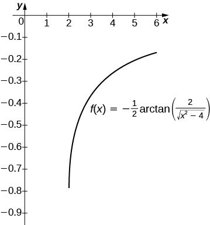

* Integrate functions resulting in inverse trigonometric functions

In this section we focus on integrals that result in inverse trigonometric functions. We have worked with these functions before. Recall from [Functions and Graphs](/m53472){: .target-chapter} that trigonometric functions are not one-to-one unless the domains are restricted. When working with inverses of trigonometric functions, we always need to be careful to take these restrictions into account. Also in [Derivatives](/m53494){: .target-chapter}, we developed formulas for derivatives of inverse trigonometric functions. The formulas developed there give rise directly to integration formulas involving inverse trigonometric functions.

### Integrals that Result in Inverse Sine Functions

Let us begin this last section of the chapter with the three formulas. Along with these formulas, we use substitution to evaluate the integrals. We prove the formula for the inverse sine integral.

Rule: Integration Formulas Resulting in Inverse Trigonometric Functions

The following integration formulas yield inverse trigonometric functions:

1.  * * *
    {: data-type="newline"}
    
    

    <math xmlns="http://www.w3.org/1998/Math/MathML"><mrow><mstyle displaystyle="true"><mrow><mo stretchy="true">∫</mo><mrow><mfrac><mrow><mi>d</mi><mi>u</mi></mrow><mrow><msqrt><mrow><msup><mi>a</mi><mn>2</mn></msup><mo>−</mo><msup><mi>u</mi><mn>2</mn></msup></mrow></msqrt></mrow></mfrac></mrow></mrow></mstyle><mo>=</mo><msup><mrow><mtext>sin</mtext></mrow><mrow><mn>−1</mn></mrow></msup><mfrac><mi>u</mi><mi>a</mi></mfrac><mo>+</mo><mi>C</mi></mrow></math>
    

2.  * * *
    {: data-type="newline"}
    
    

    <math xmlns="http://www.w3.org/1998/Math/MathML"><mrow><mstyle displaystyle="true"><mrow><mo stretchy="true">∫</mo><mrow><mfrac><mrow><mi>d</mi><mi>u</mi></mrow><mrow><msup><mi>a</mi><mn>2</mn></msup><mo>+</mo><msup><mi>u</mi><mn>2</mn></msup></mrow></mfrac></mrow></mrow></mstyle><mo>=</mo><mfrac><mn>1</mn><mi>a</mi></mfrac><mspace width="0.05em" /><msup><mrow><mtext>tan</mtext></mrow><mrow><mn>−1</mn></mrow></msup><mfrac><mi>u</mi><mi>a</mi></mfrac><mo>+</mo><mi>C</mi></mrow></math>
    

3.  * * *
    {: data-type="newline"}
    
    

    <math xmlns="http://www.w3.org/1998/Math/MathML"><mrow><mstyle displaystyle="true"><mrow><mo stretchy="true">∫</mo><mrow><mfrac><mrow><mi>d</mi><mi>u</mi></mrow><mrow><mi>u</mi><msqrt><mrow><msup><mi>u</mi><mn>2</mn></msup><mo>−</mo><msup><mi>a</mi><mn>2</mn></msup></mrow></msqrt></mrow></mfrac></mrow></mrow></mstyle><mo>=</mo><mfrac><mn>1</mn><mi>a</mi></mfrac><mspace width="0.05em" /><msup><mrow><mtext>sec</mtext></mrow><mrow><mn>−1</mn></mrow></msup><mfrac><mi>u</mi><mi>a</mi></mfrac><mo>+</mo><mi>C</mi></mrow></math>
    

{: type="1"}

#### Proof

Let <math xmlns="http://www.w3.org/1998/Math/MathML"><mrow><mi>y</mi><mo>=</mo><msup><mrow><mtext>sin</mtext></mrow><mrow><mn>−1</mn></mrow></msup><mfrac><mi>x</mi><mi>a</mi></mfrac><mo>.</mo></mrow></math>

 Then <math xmlns="http://www.w3.org/1998/Math/MathML"><mrow><mi>a</mi><mspace width="0.1em" /><mtext>sin</mtext><mspace width="0.1em" /><mi>y</mi><mo>=</mo><mi>x</mi><mo>.</mo></mrow></math>

 Now let’s use implicit differentiation. We obtain

<math xmlns="http://www.w3.org/1998/Math/MathML"><mtable><mtr><mtd columnalign="right"><mfrac><mi>d</mi><mrow><mi>d</mi><mi>x</mi></mrow></mfrac><mspace width="0.2em" /><mrow><mo>(</mo><mrow><mi>a</mi><mspace width="0.1em" /><mtext>sin</mtext><mspace width="0.1em" /><mi>y</mi></mrow><mo>)</mo></mrow></mtd><mtd columnalign="left"><mo>=</mo></mtd><mtd columnalign="left"><mfrac><mi>d</mi><mrow><mi>d</mi><mi>x</mi></mrow></mfrac><mspace width="0.2em" /><mrow><mo>(</mo><mi>x</mi><mo>)</mo></mrow></mtd></mtr><mtr /><mtr><mtd columnalign="right"><mi>a</mi><mspace width="0.1em" /><mtext>cos</mtext><mspace width="0.1em" /><mi>y</mi><mspace width="0.2em" /><mfrac><mrow><mi>d</mi><mi>y</mi></mrow><mrow><mi>d</mi><mi>x</mi></mrow></mfrac></mtd><mtd columnalign="left"><mo>=</mo></mtd><mtd columnalign="left"><mn>1</mn></mtd></mtr><mtr><mtd columnalign="right"><mfrac><mrow><mi>d</mi><mi>y</mi></mrow><mrow><mi>d</mi><mi>x</mi></mrow></mfrac></mtd><mtd columnalign="left"><mo>=</mo></mtd><mtd columnalign="left"><mfrac><mn>1</mn><mrow><mi>a</mi><mspace width="0.1em" /><mtext>cos</mtext><mspace width="0.1em" /><mi>y</mi></mrow></mfrac><mo>.</mo></mtd></mtr></mtable></math>

For <math xmlns="http://www.w3.org/1998/Math/MathML"><mrow><mo>−</mo><mfrac><mi>π</mi><mn>2</mn></mfrac><mo>≤</mo><mi>y</mi><mo>≤</mo><mfrac><mi>π</mi><mn>2</mn></mfrac><mo>,</mo><mtext>cos</mtext><mspace width="0.1em" /><mi>y</mi><mo>≥</mo><mn>0</mn><mo>.</mo></mrow></math>

 Thus, applying the Pythagorean identity <math xmlns="http://www.w3.org/1998/Math/MathML"><mrow><msup><mrow><mtext>sin</mtext></mrow><mn>2</mn></msup><mi>y</mi><mo>+</mo><msup><mrow><mtext>cos</mtext></mrow><mn>2</mn></msup><mi>y</mi><mo>=</mo><mn>1</mn><mo>,</mo></mrow></math>

 we have <math xmlns="http://www.w3.org/1998/Math/MathML"><mrow><mtext>cos</mtext><mspace width="0.1em" /><mi>y</mi><mo>=</mo><msqrt><mrow><mn>1</mn><mo>–</mo><msup><mrow><mtext>sin</mtext></mrow><mn>2</mn></msup><mi>y</mi></mrow></msqrt><mo>.</mo></mrow></math>

 This gives

<math xmlns="http://www.w3.org/1998/Math/MathML"><mtable><mtr><mtd columnalign="left"><mfrac><mn>1</mn><mrow><mi>a</mi><mspace width="0.1em" /><mtext>cos</mtext><mspace width="0.1em" /><mi>y</mi></mrow></mfrac></mtd><mtd columnalign="left"><mo>=</mo><mfrac><mn>1</mn><mrow><mi>a</mi><msqrt><mrow><mn>1</mn><mo>−</mo><msup><mrow><mtext>sin</mtext></mrow><mn>2</mn></msup><mi>y</mi></mrow></msqrt></mrow></mfrac></mtd></mtr><mtr /><mtr><mtd /><mtd columnalign="left"><mo>=</mo><mfrac><mn>1</mn><mrow><msqrt><mrow><msup><mi>a</mi><mn>2</mn></msup><mo>−</mo><msup><mi>a</mi><mn>2</mn></msup><msup><mrow><mtext>sin</mtext></mrow><mn>2</mn></msup><mi>y</mi></mrow></msqrt></mrow></mfrac></mtd></mtr><mtr><mtd /><mtd columnalign="left"><mo>=</mo><mfrac><mn>1</mn><mrow><msqrt><mrow><msup><mi>a</mi><mn>2</mn></msup><mo>−</mo><msup><mi>x</mi><mn>2</mn></msup></mrow></msqrt></mrow></mfrac><mo>.</mo></mtd></mtr></mtable></math>

Then for <math xmlns="http://www.w3.org/1998/Math/MathML"><mrow><mtext>−</mtext><mi>a</mi><mo>≤</mo><mi>x</mi><mo>≤</mo><mi>a</mi><mo>,</mo></mrow></math>

 we have

<math xmlns="http://www.w3.org/1998/Math/MathML"><mrow><mstyle displaystyle="true"><mrow><mo stretchy="true">∫</mo><mrow><mfrac><mn>1</mn><mrow><msqrt><mrow><msup><mi>a</mi><mn>2</mn></msup><mo>−</mo><msup><mi>u</mi><mn>2</mn></msup></mrow></msqrt></mrow></mfrac><mi>d</mi><mi>u</mi><mo>=</mo><msup><mrow><mtext>sin</mtext></mrow><mrow><mn>−1</mn></mrow></msup></mrow></mrow></mstyle><mrow><mo>(</mo><mrow><mfrac><mi>u</mi><mi>a</mi></mfrac></mrow><mo>)</mo></mrow><mo>+</mo><mi>C</mi><mo>.</mo></mrow></math>

□

Evaluating a Definite Integral Using Inverse Trigonometric Functions

Evaluate the definite integral <math xmlns="http://www.w3.org/1998/Math/MathML"><mrow><mstyle displaystyle="true"><mrow><msubsup><mo stretchy="true">∫</mo><mn>0</mn><mn>1</mn></msubsup><mrow><mfrac><mrow><mi>d</mi><mi>x</mi></mrow><mrow><msqrt><mrow><mn>1</mn><mo>−</mo><msup><mi>x</mi><mn>2</mn></msup></mrow></msqrt></mrow></mfrac><mo>.</mo></mrow></mrow></mstyle></mrow></math>

We can go directly to the formula for the antiderivative in the rule on integration formulas resulting in inverse trigonometric functions, and then evaluate the definite integral. We have

<math xmlns="http://www.w3.org/1998/Math/MathML"><mtable><mtr /><mtr /><mtr><mtd columnalign="left"><mstyle displaystyle="true"><mrow><msubsup><mo stretchy="true">∫</mo><mn>0</mn><mn>1</mn></msubsup><mrow><mfrac><mrow><mi>d</mi><mi>x</mi></mrow><mrow><msqrt><mrow><mn>1</mn><mo>−</mo><msup><mi>x</mi><mn>2</mn></msup></mrow></msqrt></mrow></mfrac></mrow></mrow></mstyle></mtd><mtd columnalign="left"><mo>=</mo><msup><mtext>sin</mtext><mrow><mn>−1</mn></mrow></msup><mi>x</mi><mrow><msubsup><mo>\|</mo><mrow><mn>0</mn></mrow><mn>1</mn></msubsup></mrow></mtd></mtr><mtr><mtd /><mtd columnalign="left"><mo>=</mo><msup><mtext>sin</mtext><mrow><mn>−1</mn></mrow></msup><mn>1</mn><mo>−</mo><msup><mtext>sin</mtext><mrow><mn>−1</mn></mrow></msup><mn>0</mn></mtd></mtr><mtr><mtd /><mtd columnalign="left"><mo>=</mo><mfrac><mi>π</mi><mn>2</mn></mfrac><mo>−</mo><mn>0</mn></mtd></mtr><mtr><mtd /><mtd columnalign="left"><mo>=</mo><mfrac><mi>π</mi><mn>2</mn></mfrac><mo>.</mo></mtd></mtr></mtable></math>

Find the antiderivative of <math xmlns="http://www.w3.org/1998/Math/MathML"><mrow><mstyle displaystyle="true"><mrow><mo stretchy="true">∫</mo><mrow><mfrac><mrow><mi>d</mi><mi>x</mi></mrow><mrow><msqrt><mrow><mn>1</mn><mo>−</mo><mn>16</mn><msup><mi>x</mi><mn>2</mn></msup></mrow></msqrt></mrow></mfrac></mrow></mrow></mstyle><mo>.</mo></mrow></math>

<math xmlns="http://www.w3.org/1998/Math/MathML"><mrow><mfrac><mn>1</mn><mn>4</mn></mfrac><mspace width="0.05em" /><msup><mrow><mtext>sin</mtext></mrow><mrow><mn>−1</mn></mrow></msup><mrow><mo>(</mo><mrow><mn>4</mn><mi>x</mi></mrow><mo>)</mo></mrow><mo>+</mo><mi>C</mi></mrow></math>

Hint

Substitute <math xmlns="http://www.w3.org/1998/Math/MathML"><mrow><mi>u</mi><mo>=</mo><mn>4</mn><mi>x</mi></mrow></math>

Finding an Antiderivative Involving an Inverse Trigonometric Function

Evaluate the integral <math xmlns="http://www.w3.org/1998/Math/MathML"><mrow><mstyle displaystyle="true"><mrow><mo stretchy="true">∫</mo><mrow><mfrac><mrow><mi>d</mi><mi>x</mi></mrow><mrow><msqrt><mrow><mn>4</mn><mo>−</mo><mn>9</mn><msup><mi>x</mi><mn>2</mn></msup></mrow></msqrt></mrow></mfrac></mrow></mrow></mstyle><mo>.</mo></mrow></math>

Substitute <math xmlns="http://www.w3.org/1998/Math/MathML"><mrow><mi>u</mi><mo>=</mo><mn>3</mn><mi>x</mi><mo>.</mo></mrow></math>

 Then <math xmlns="http://www.w3.org/1998/Math/MathML"><mrow><mi>d</mi><mi>u</mi><mo>=</mo><mn>3</mn><mi>d</mi><mi>x</mi></mrow></math>

 and we have

<math xmlns="http://www.w3.org/1998/Math/MathML"><mrow><mstyle displaystyle="true"><mrow><mo stretchy="true">∫</mo><mrow><mfrac><mrow><mi>d</mi><mi>x</mi></mrow><mrow><msqrt><mrow><mn>4</mn><mo>−</mo><mn>9</mn><msup><mi>x</mi><mn>2</mn></msup></mrow></msqrt></mrow></mfrac></mrow></mrow></mstyle><mo>=</mo><mfrac><mn>1</mn><mn>3</mn></mfrac><mstyle displaystyle="true"><mrow><mo stretchy="true">∫</mo><mrow><mfrac><mrow><mi>d</mi><mi>u</mi></mrow><mrow><msqrt><mrow><mn>4</mn><mo>−</mo><msup><mi>u</mi><mn>2</mn></msup></mrow></msqrt></mrow></mfrac></mrow></mrow></mstyle><mo>.</mo></mrow></math>

Applying the formula with <math xmlns="http://www.w3.org/1998/Math/MathML"><mrow><mi>a</mi><mo>=</mo><mn>2</mn><mo>,</mo></mrow></math>

 we obtain

<math xmlns="http://www.w3.org/1998/Math/MathML"><mtable><mtr><mtd columnalign="left"><mstyle displaystyle="true"><mrow><mo stretchy="true">∫</mo><mrow><mfrac><mrow><mi>d</mi><mi>x</mi></mrow><mrow><msqrt><mrow><mn>4</mn><mo>−</mo><mn>9</mn><msup><mi>x</mi><mn>2</mn></msup></mrow></msqrt></mrow></mfrac></mrow></mrow></mstyle></mtd><mtd columnalign="left"><mo>=</mo><mfrac><mn>1</mn><mn>3</mn></mfrac><mstyle displaystyle="true"><mrow><mo stretchy="true">∫</mo><mrow><mfrac><mrow><mi>d</mi><mi>u</mi></mrow><mrow><msqrt><mrow><mn>4</mn><mo>−</mo><msup><mi>u</mi><mn>2</mn></msup></mrow></msqrt></mrow></mfrac></mrow></mrow></mstyle></mtd></mtr><mtr /><mtr><mtd /><mtd columnalign="left"><mo>=</mo><mfrac><mn>1</mn><mn>3</mn></mfrac><msup><mtext>sin</mtext><mrow><mn>−1</mn></mrow></msup><mrow><mo>(</mo><mrow><mfrac><mi>u</mi><mn>2</mn></mfrac></mrow><mo>)</mo></mrow><mo>+</mo><mi>C</mi></mtd></mtr><mtr><mtd /><mtd columnalign="left"><mo>=</mo><mfrac><mn>1</mn><mn>3</mn></mfrac><msup><mtext>sin</mtext><mrow><mn>−1</mn></mrow></msup><mrow><mo>(</mo><mrow><mfrac><mrow><mn>3</mn><mi>x</mi></mrow><mn>2</mn></mfrac></mrow><mo>)</mo></mrow><mo>+</mo><mi>C</mi><mo>.</mo></mtd></mtr></mtable></math>

Find the indefinite integral using an inverse trigonometric function and substitution for <math xmlns="http://www.w3.org/1998/Math/MathML"><mrow><mstyle displaystyle="true"><mrow><mo stretchy="true">∫</mo><mrow><mfrac><mrow><mi>d</mi><mi>x</mi></mrow><mrow><msqrt><mrow><mn>9</mn><mo>−</mo><msup><mi>x</mi><mn>2</mn></msup></mrow></msqrt></mrow></mfrac></mrow></mrow></mstyle><mo>.</mo></mrow></math>

<math xmlns="http://www.w3.org/1998/Math/MathML"><mrow><msup><mrow><mtext>sin</mtext></mrow><mrow><mn>−1</mn></mrow></msup><mrow><mo>(</mo><mrow><mfrac><mi>x</mi><mn>3</mn></mfrac></mrow><mo>)</mo></mrow><mo>+</mo><mi>C</mi></mrow></math>

Hint

Use the formula in the rule on integration formulas resulting in inverse trigonometric functions.

Evaluating a Definite Integral

Evaluate the definite integral <math xmlns="http://www.w3.org/1998/Math/MathML"><mrow><mstyle displaystyle="true"><mrow><msubsup><mo>∫</mo><mn>0</mn><mrow><msqrt><mn>3</mn></msqrt><mtext>/</mtext><mn>2</mn></mrow></msubsup><mrow><mfrac><mrow><mi>d</mi><mi>u</mi></mrow><mrow><msqrt><mrow><mn>1</mn><mo>−</mo><msup><mi>u</mi><mn>2</mn></msup></mrow></msqrt></mrow></mfrac><mo>.</mo></mrow></mrow></mstyle></mrow></math>

The format of the problem matches the inverse sine formula. Thus,

<math xmlns="http://www.w3.org/1998/Math/MathML"><mtable><mtr /><mtr /><mtr><mtd columnalign="left"><mstyle displaystyle="true"><mrow><msubsup><mo stretchy="true">∫</mo><mn>0</mn><mrow><msqrt><mn>3</mn></msqrt><mtext>/</mtext><mn>2</mn></mrow></msubsup><mrow><mfrac><mrow><mi>d</mi><mi>u</mi></mrow><mrow><msqrt><mrow><mn>1</mn><mo>−</mo><msup><mi>u</mi><mn>2</mn></msup></mrow></msqrt></mrow></mfrac></mrow></mrow></mstyle></mtd><mtd columnalign="left"><mo>=</mo><msup><mtext>sin</mtext><mrow><mn>−1</mn></mrow></msup><mi>u</mi><mrow><msubsup><mo>\|</mo><mrow><mn>0</mn></mrow><mrow><msqrt><mn>3</mn></msqrt><mtext>/</mtext><mn>2</mn></mrow></msubsup></mrow></mtd></mtr><mtr><mtd /><mtd columnalign="left"><mo>=</mo><mrow><mo>[</mo><mrow><msup><mrow><mtext>sin</mtext></mrow><mrow><mn>−1</mn></mrow></msup><mrow><mo>(</mo><mrow><mfrac><mrow><msqrt><mn>3</mn></msqrt></mrow><mn>2</mn></mfrac></mrow><mo>)</mo></mrow></mrow><mo>]</mo></mrow><mo>−</mo><mrow><mo>[</mo><mrow><msup><mrow><mtext>sin</mtext></mrow><mrow><mn>−1</mn></mrow></msup><mrow><mo>(</mo><mn>0</mn><mo>)</mo></mrow></mrow><mo>]</mo></mrow></mtd></mtr><mtr><mtd /><mtd columnalign="left"><mo>=</mo><mfrac><mi>π</mi><mn>3</mn></mfrac><mo>.</mo></mtd></mtr></mtable></math>

### Integrals Resulting in Other Inverse Trigonometric Functions

There are six inverse trigonometric functions. However, only three integration formulas are noted in the rule on integration formulas resulting in inverse trigonometric functions because the remaining three are negative versions of the ones we use. The only difference is whether the integrand is positive or negative. Rather than memorizing three more formulas, if the integrand is negative, simply factor out −1 and evaluate the integral using one of the formulas already provided. To close this section, we examine one more formula: the integral resulting in the inverse tangent function.

Finding an Antiderivative Involving the Inverse Tangent Function

Find an antiderivative of <math xmlns="http://www.w3.org/1998/Math/MathML"><mrow><mstyle displaystyle="true"><mrow><mo stretchy="true">∫</mo><mrow><mfrac><mn>1</mn><mrow><mn>1</mn><mo>+</mo><mn>4</mn><msup><mi>x</mi><mn>2</mn></msup></mrow></mfrac><mi>d</mi><mi>x</mi><mo>.</mo></mrow></mrow></mstyle></mrow></math>

Comparing this problem with the formulas stated in the rule on integration formulas resulting in inverse trigonometric functions, the integrand looks similar to the formula for <math xmlns="http://www.w3.org/1998/Math/MathML"><mrow><msup><mrow><mtext>tan</mtext></mrow><mrow><mn>−1</mn></mrow></msup><mi>u</mi><mo>+</mo><mi>C</mi><mo>.</mo></mrow></math>

 So we use substitution, letting <math xmlns="http://www.w3.org/1998/Math/MathML"><mrow><mi>u</mi><mo>=</mo><mn>2</mn><mi>x</mi><mo>,</mo></mrow></math>

 then <math xmlns="http://www.w3.org/1998/Math/MathML"><mrow><mi>d</mi><mi>u</mi><mo>=</mo><mn>2</mn><mi>d</mi><mi>x</mi></mrow></math>

 and <math xmlns="http://www.w3.org/1998/Math/MathML"><mrow><mrow><mn>1</mn><mtext>/</mtext><mn>2</mn></mrow><mi>d</mi><mi>u</mi><mo>=</mo><mi>d</mi><mi>x</mi><mo>.</mo></mrow></math>

 Then, we have

<math xmlns="http://www.w3.org/1998/Math/MathML"><mrow><mfrac><mn>1</mn><mn>2</mn></mfrac><mstyle displaystyle="true"><mrow><mo stretchy="true">∫</mo><mrow><mfrac><mn>1</mn><mrow><mn>1</mn><mo>+</mo><msup><mi>u</mi><mn>2</mn></msup></mrow></mfrac><mi>d</mi><mi>u</mi><mo>=</mo><mfrac><mn>1</mn><mn>2</mn></mfrac><mspace width="0.05em" /><msup><mrow><mtext>tan</mtext></mrow><mrow><mn>−1</mn></mrow></msup><mi>u</mi><mo>+</mo><mi>C</mi></mrow></mrow></mstyle><mo>=</mo><mfrac><mn>1</mn><mn>2</mn></mfrac><mspace width="0.05em" /><msup><mrow><mtext>tan</mtext></mrow><mrow><mn>−1</mn></mrow></msup><mrow><mo>(</mo><mrow><mn>2</mn><mi>x</mi></mrow><mo>)</mo></mrow><mo>+</mo><mi>C</mi><mo>.</mo></mrow></math>

Use substitution to find the antiderivative of <math xmlns="http://www.w3.org/1998/Math/MathML"><mrow><mstyle displaystyle="true"><mrow><mo stretchy="true">∫</mo><mrow><mfrac><mrow><mi>d</mi><mi>x</mi></mrow><mrow><mn>25</mn><mo>+</mo><mn>4</mn><msup><mi>x</mi><mn>2</mn></msup></mrow></mfrac><mo>.</mo></mrow></mrow></mstyle></mrow></math>

<math xmlns="http://www.w3.org/1998/Math/MathML"><mrow><mfrac><mn>1</mn><mrow><mn>10</mn></mrow></mfrac><mspace width="0.05em" /><msup><mrow><mtext>tan</mtext></mrow><mrow><mn>−1</mn></mrow></msup><mrow><mo>(</mo><mrow><mfrac><mrow><mn>2</mn><mi>x</mi></mrow><mn>5</mn></mfrac></mrow><mo>)</mo></mrow><mo>+</mo><mi>C</mi></mrow></math>

Hint

Use the solving strategy from [[link]](#fs-id1170572206423) and the rule on integration formulas resulting in inverse trigonometric functions.

Applying the Integration Formulas

Find the antiderivative of <math xmlns="http://www.w3.org/1998/Math/MathML"><mrow><mstyle displaystyle="true"><mrow><mo stretchy="true">∫</mo><mrow><mfrac><mn>1</mn><mrow><mn>9</mn><mo>+</mo><msup><mi>x</mi><mn>2</mn></msup></mrow></mfrac><mi>d</mi><mi>x</mi><mo>.</mo></mrow></mrow></mstyle></mrow></math>

Apply the formula with <math xmlns="http://www.w3.org/1998/Math/MathML"><mrow><mi>a</mi><mo>=</mo><mn>3</mn><mo>.</mo></mrow></math>

 Then,

<math xmlns="http://www.w3.org/1998/Math/MathML"><mrow><mstyle displaystyle="true"><mrow><mo stretchy="true">∫</mo><mrow><mfrac><mrow><mi>d</mi><mi>x</mi></mrow><mrow><mn>9</mn><mo>+</mo><msup><mi>x</mi><mn>2</mn></msup></mrow></mfrac></mrow></mrow></mstyle><mo>=</mo><mfrac><mn>1</mn><mn>3</mn></mfrac><mspace width="0.05em" /><msup><mrow><mtext>tan</mtext></mrow><mrow><mn>−1</mn></mrow></msup><mrow><mo>(</mo><mrow><mfrac><mi>x</mi><mn>3</mn></mfrac></mrow><mo>)</mo></mrow><mo>+</mo><mi>C</mi><mo>.</mo></mrow></math>

Find the antiderivative of <math xmlns="http://www.w3.org/1998/Math/MathML"><mrow><mstyle displaystyle="true"><mrow><mo stretchy="true">∫</mo><mrow><mfrac><mrow><mi>d</mi><mi>x</mi></mrow><mrow><mn>16</mn><mo>+</mo><msup><mi>x</mi><mn>2</mn></msup></mrow></mfrac><mo>.</mo></mrow></mrow></mstyle></mrow></math>

<math xmlns="http://www.w3.org/1998/Math/MathML"><mrow><mfrac><mn>1</mn><mn>4</mn></mfrac><mspace width="0.05em" /><msup><mrow><mtext>tan</mtext></mrow><mrow><mn>−1</mn></mrow></msup><mrow><mo>(</mo><mrow><mfrac><mi>x</mi><mn>4</mn></mfrac></mrow><mo>)</mo></mrow><mo>+</mo><mi>C</mi></mrow></math>

Hint

Follow the steps in [[link]](#fs-id1170572350769).

Evaluating a Definite Integral

Evaluate the definite integral <math xmlns="http://www.w3.org/1998/Math/MathML"><mrow><mstyle displaystyle="true"><mrow><msubsup><mo stretchy="true">∫</mo><mrow><msqrt><mn>3</mn></msqrt><mtext>/</mtext><mn>3</mn></mrow><mrow><msqrt><mn>3</mn></msqrt></mrow></msubsup><mrow><mfrac><mrow><mi>d</mi><mi>x</mi></mrow><mrow><mn>1</mn><mo>+</mo><msup><mi>x</mi><mn>2</mn></msup></mrow></mfrac><mo>.</mo></mrow></mrow></mstyle></mrow></math>

Use the formula for the inverse tangent. We have

<math xmlns="http://www.w3.org/1998/Math/MathML"><mtable><mtr /><mtr /><mtr><mtd columnalign="left"><mstyle displaystyle="true"><mrow><msubsup><mo stretchy="true">∫</mo><mrow><msqrt><mn>3</mn></msqrt><mtext>/</mtext><mn>3</mn></mrow><mrow><msqrt><mn>3</mn></msqrt></mrow></msubsup><mrow><mfrac><mrow><mi>d</mi><mi>x</mi></mrow><mrow><mn>1</mn><mo>+</mo><msup><mi>x</mi><mn>2</mn></msup></mrow></mfrac></mrow></mrow></mstyle></mtd><mtd columnalign="left"><mo>=</mo><msup><mtext>tan</mtext><mrow><mn>−1</mn></mrow></msup><mi>x</mi><mrow><msubsup><mo>\|</mo><mrow><msqrt><mn>3</mn></msqrt><mtext>/</mtext><mn>3</mn></mrow><mrow><msqrt><mn>3</mn></msqrt></mrow></msubsup></mrow></mtd></mtr><mtr><mtd /><mtd columnalign="left"><mo>=</mo><mrow><mo>[</mo><mrow><msup><mrow><mtext>tan</mtext></mrow><mrow><mn>−1</mn></mrow></msup><mrow><mo>(</mo><mrow><msqrt><mn>3</mn></msqrt></mrow><mo>)</mo></mrow></mrow><mo>]</mo></mrow><mo>−</mo><mrow><mo>[</mo><mrow><msup><mrow><mtext>tan</mtext></mrow><mrow><mn>−1</mn></mrow></msup><mrow><mo>(</mo><mrow><mfrac><mrow><msqrt><mn>3</mn></msqrt></mrow><mn>3</mn></mfrac></mrow><mo>)</mo></mrow></mrow><mo>]</mo></mrow></mtd></mtr><mtr><mtd /><mtd columnalign="left"><mo>=</mo><mfrac><mi>π</mi><mn>6</mn></mfrac><mo>.</mo></mtd></mtr></mtable></math>

Evaluate the definite integral <math xmlns="http://www.w3.org/1998/Math/MathML"><mrow><mstyle displaystyle="true"><mrow><msubsup><mo stretchy="true">∫</mo><mn>0</mn><mn>2</mn></msubsup><mrow><mfrac><mrow><mi>d</mi><mi>x</mi></mrow><mrow><mn>4</mn><mo>+</mo><msup><mi>x</mi><mn>2</mn></msup></mrow></mfrac></mrow></mrow></mstyle><mo>.</mo></mrow></math>

<math xmlns="http://www.w3.org/1998/Math/MathML"><mrow><mfrac><mi>π</mi><mn>8</mn></mfrac></mrow></math>

Hint

Follow the procedures from [[link]](#fs-id1170571714255) to solve the problem.

### Key Concepts

* Formulas for derivatives of inverse trigonometric functions developed in [Derivatives of Exponential and Logarithmic Functions](/m53584){: .target-chapter} lead directly to integration formulas involving inverse trigonometric functions.
* Use the formulas listed in the rule on integration formulas resulting in inverse trigonometric functions to match up the correct format and make alterations as necessary to solve the problem.
* Substitution is often required to put the integrand in the correct form.
{: data-bullet-style="bullet"}

### Key Equations

* **Integrals That Produce Inverse Trigonometric Functions**
  * * *
  {: data-type="newline"}
  
  <math xmlns="http://www.w3.org/1998/Math/MathML"><mrow><mstyle displaystyle="true"><mrow><mo stretchy="true">∫</mo><mrow><mfrac><mrow><mi>d</mi><mi>u</mi></mrow><mrow><msqrt><mrow><msup><mi>a</mi><mn>2</mn></msup><mo>−</mo><msup><mi>u</mi><mn>2</mn></msup></mrow></msqrt></mrow></mfrac><mo>=</mo><msup><mrow><mtext>sin</mtext></mrow><mrow><mn>−1</mn></mrow></msup><mrow><mo>(</mo><mrow><mfrac><mi>u</mi><mi>a</mi></mfrac></mrow><mo>)</mo></mrow><mo>+</mo><mi>C</mi></mrow></mrow></mstyle></mrow></math>
  
  * * *
  {: data-type="newline"}
  
  <math xmlns="http://www.w3.org/1998/Math/MathML"><mrow><mstyle displaystyle="true"><mrow><mo stretchy="true">∫</mo><mrow><mfrac><mrow><mi>d</mi><mi>u</mi></mrow><mrow><msup><mi>a</mi><mn>2</mn></msup><mo>+</mo><msup><mi>u</mi><mn>2</mn></msup></mrow></mfrac><mo>=</mo><mfrac><mn>1</mn><mi>a</mi></mfrac><mspace width="0.05em" /><msup><mrow><mtext>tan</mtext></mrow><mrow><mn>−1</mn></mrow></msup><mrow><mo>(</mo><mrow><mfrac><mi>u</mi><mi>a</mi></mfrac></mrow><mo>)</mo></mrow><mo>+</mo><mi>C</mi></mrow></mrow></mstyle></mrow></math>
  
  * * *
  {: data-type="newline"}
  
  <math xmlns="http://www.w3.org/1998/Math/MathML"><mrow><mstyle displaystyle="true"><mrow><mo stretchy="true">∫</mo><mrow><mfrac><mrow><mi>d</mi><mi>u</mi></mrow><mrow><mi>u</mi><msqrt><mrow><msup><mi>u</mi><mn>2</mn></msup><mo>−</mo><msup><mi>a</mi><mn>2</mn></msup></mrow></msqrt></mrow></mfrac><mo>=</mo><mfrac><mn>1</mn><mi>a</mi></mfrac><mspace width="0.05em" /><msup><mrow><mtext>sec</mtext></mrow><mrow><mn>−1</mn></mrow></msup><mrow><mo>(</mo><mrow><mfrac><mi>u</mi><mi>a</mi></mfrac></mrow><mo>)</mo></mrow><mo>+</mo><mi>C</mi></mrow></mrow></mstyle></mrow></math>
{: data-bullet-style="bullet"}

<section data-depth="1" class="section-exercises" markdown="1">
In the following exercises, evaluate each integral in terms of an inverse trigonometric function.

<math xmlns="http://www.w3.org/1998/Math/MathML"><mrow><mstyle displaystyle="true"><mrow><msubsup><mo stretchy="true">∫</mo><mn>0</mn><mrow><msqrt><mn>3</mn></msqrt><mtext>/</mtext><mn>2</mn></mrow></msubsup><mrow><mfrac><mrow><mi>d</mi><mi>x</mi></mrow><mrow><msqrt><mrow><mn>1</mn><mo>−</mo><msup><mi>x</mi><mn>2</mn></msup></mrow></msqrt></mrow></mfrac></mrow></mrow></mstyle></mrow></math>

<math xmlns="http://www.w3.org/1998/Math/MathML"><mrow><msup><mrow><mtext>sin</mtext></mrow><mrow><mn>−1</mn></mrow></msup><mi>x</mi><mrow><msubsup><mo>\|</mo><mrow><mn>0</mn></mrow><mrow><msqrt><mn>3</mn></msqrt><mtext>/</mtext><mn>2</mn></mrow></msubsup></mrow><mo>=</mo><mfrac><mi>π</mi><mn>3</mn></mfrac></mrow></math>

<math xmlns="http://www.w3.org/1998/Math/MathML"><mrow><mstyle displaystyle="true"><mrow><msubsup><mo stretchy="true">∫</mo><mrow><mn>−1</mn><mtext>/</mtext><mn>2</mn></mrow><mrow><mn>1</mn><mtext>/</mtext><mn>2</mn></mrow></msubsup><mrow><mfrac><mrow><mi>d</mi><mi>x</mi></mrow><mrow><msqrt><mrow><mn>1</mn><mo>−</mo><msup><mi>x</mi><mn>2</mn></msup></mrow></msqrt></mrow></mfrac></mrow></mrow></mstyle></mrow></math>

<math xmlns="http://www.w3.org/1998/Math/MathML"><mrow><mstyle displaystyle="true"><mrow><msubsup><mo stretchy="true">∫</mo><mrow><msqrt><mn>3</mn></msqrt></mrow><mn>1</mn></msubsup><mrow><mfrac><mrow><mi>d</mi><mi>x</mi></mrow><mrow><msqrt><mrow><mn>1</mn><mo>+</mo><msup><mi>x</mi><mn>2</mn></msup></mrow></msqrt></mrow></mfrac></mrow></mrow></mstyle></mrow></math>

<math xmlns="http://www.w3.org/1998/Math/MathML"><mrow><msup><mrow><mtext>tan</mtext></mrow><mrow><mn>−1</mn></mrow></msup><mi>x</mi><mrow><msubsup><mo>\|</mo><mrow><msqrt><mn>3</mn></msqrt></mrow><mn>1</mn></msubsup></mrow><mo>=</mo><mo>−</mo><mfrac><mi>π</mi><mrow><mn>12</mn></mrow></mfrac></mrow></math>

<math xmlns="http://www.w3.org/1998/Math/MathML"><mrow><mstyle displaystyle="true"><mrow><msubsup><mo stretchy="true">∫</mo><mrow><mn>1</mn><mtext>/</mtext><msqrt><mn>3</mn></msqrt></mrow><mrow><msqrt><mn>3</mn></msqrt></mrow></msubsup><mrow><mfrac><mrow><mi>d</mi><mi>x</mi></mrow><mrow><mn>1</mn><mo>+</mo><msup><mi>x</mi><mn>2</mn></msup></mrow></mfrac></mrow></mrow></mstyle></mrow></math>

<math xmlns="http://www.w3.org/1998/Math/MathML"><mrow><mstyle displaystyle="true"><mrow><msubsup><mo stretchy="true">∫</mo><mn>1</mn><mrow><msqrt><mn>2</mn></msqrt></mrow></msubsup><mrow><mfrac><mrow><mi>d</mi><mi>x</mi></mrow><mrow><mrow><mo>\|</mo><mi>x</mi><mo>\|</mo></mrow><msqrt><mrow><msup><mi>x</mi><mn>2</mn></msup><mo>−</mo><mn>1</mn></mrow></msqrt></mrow></mfrac></mrow></mrow></mstyle></mrow></math>

<math xmlns="http://www.w3.org/1998/Math/MathML"><mrow><msup><mrow><mtext>sec</mtext></mrow><mrow><mn>−1</mn></mrow></msup><mi>x</mi><mrow><msubsup><mo>\|</mo><mrow><mn>1</mn></mrow><mrow><msqrt><mn>2</mn></msqrt></mrow></msubsup></mrow><mo>=</mo><mfrac><mi>π</mi><mn>4</mn></mfrac></mrow></math>

<math xmlns="http://www.w3.org/1998/Math/MathML"><mrow><mstyle displaystyle="true"><mrow><msubsup><mo stretchy="true">∫</mo><mn>1</mn><mrow><mn>2</mn><mtext>/</mtext><msqrt><mn>3</mn></msqrt></mrow></msubsup><mrow><mfrac><mrow><mi>d</mi><mi>x</mi></mrow><mrow><mrow><mo>\|</mo><mi>x</mi><mo>\|</mo></mrow><msqrt><mrow><msup><mi>x</mi><mn>2</mn></msup><mo>−</mo><mn>1</mn></mrow></msqrt></mrow></mfrac></mrow></mrow></mstyle></mrow></math>

In the following exercises, find each indefinite integral, using appropriate substitutions.

<math xmlns="http://www.w3.org/1998/Math/MathML"><mrow><mstyle displaystyle="true"><mrow><mo stretchy="true">∫</mo><mrow><mfrac><mrow><mi>d</mi><mi>x</mi></mrow><mrow><msqrt><mrow><mn>9</mn><mo>−</mo><msup><mi>x</mi><mn>2</mn></msup></mrow></msqrt></mrow></mfrac></mrow></mrow></mstyle></mrow></math>

<math xmlns="http://www.w3.org/1998/Math/MathML"><mrow><msup><mrow><mtext>sin</mtext></mrow><mrow><mn>−1</mn></mrow></msup><mrow><mo>(</mo><mrow><mfrac><mi>x</mi><mn>3</mn></mfrac></mrow><mo>)</mo></mrow><mo>+</mo><mi>C</mi></mrow></math>

<math xmlns="http://www.w3.org/1998/Math/MathML"><mrow><mstyle displaystyle="true"><mrow><mo stretchy="true">∫</mo><mrow><mfrac><mrow><mi>d</mi><mi>x</mi></mrow><mrow><msqrt><mrow><mn>1</mn><mo>−</mo><mn>16</mn><msup><mi>x</mi><mn>2</mn></msup></mrow></msqrt></mrow></mfrac></mrow></mrow></mstyle></mrow></math>

<math xmlns="http://www.w3.org/1998/Math/MathML"><mrow><mstyle displaystyle="true"><mrow><mo stretchy="true">∫</mo><mrow><mfrac><mrow><mi>d</mi><mi>x</mi></mrow><mrow><mn>9</mn><mo>+</mo><msup><mi>x</mi><mn>2</mn></msup></mrow></mfrac></mrow></mrow></mstyle></mrow></math>

<math xmlns="http://www.w3.org/1998/Math/MathML"><mrow><mfrac><mn>1</mn><mn>3</mn></mfrac><mspace width="0.05em" /><msup><mrow><mtext>tan</mtext></mrow><mrow><mn>−1</mn></mrow></msup><mrow><mo>(</mo><mrow><mfrac><mi>x</mi><mn>3</mn></mfrac></mrow><mo>)</mo></mrow><mo>+</mo><mi>C</mi></mrow></math>

<math xmlns="http://www.w3.org/1998/Math/MathML"><mrow><mstyle displaystyle="true"><mrow><mo stretchy="true">∫</mo><mrow><mfrac><mrow><mi>d</mi><mi>x</mi></mrow><mrow><mn>25</mn><mo>+</mo><mn>16</mn><msup><mi>x</mi><mn>2</mn></msup></mrow></mfrac></mrow></mrow></mstyle></mrow></math>

<math xmlns="http://www.w3.org/1998/Math/MathML"><mrow><mstyle displaystyle="true"><mrow><mo stretchy="true">∫</mo><mrow><mfrac><mrow><mi>d</mi><mi>x</mi></mrow><mrow><mrow><mo>\|</mo><mi>x</mi><mo>\|</mo></mrow><msqrt><mrow><msup><mi>x</mi><mn>2</mn></msup><mo>−</mo><mn>9</mn></mrow></msqrt></mrow></mfrac></mrow></mrow></mstyle></mrow></math>

<math xmlns="http://www.w3.org/1998/Math/MathML"><mrow><mfrac><mn>1</mn><mn>3</mn></mfrac><mspace width="0.05em" /><msup><mrow><mtext>sec</mtext></mrow><mrow><mn>−1</mn></mrow></msup><mrow><mo>(</mo><mrow><mfrac><mi>x</mi><mn>3</mn></mfrac></mrow><mo>)</mo></mrow><mo>+</mo><mi>C</mi></mrow></math>

<math xmlns="http://www.w3.org/1998/Math/MathML"><mrow><mstyle displaystyle="true"><mrow><mo stretchy="true">∫</mo><mrow><mfrac><mrow><mi>d</mi><mi>x</mi></mrow><mrow><mrow><mo>\|</mo><mi>x</mi><mo>\|</mo></mrow><msqrt><mrow><mn>4</mn><msup><mi>x</mi><mn>2</mn></msup><mo>−</mo><mn>16</mn></mrow></msqrt></mrow></mfrac></mrow></mrow></mstyle></mrow></math>

Explain the relationship <math xmlns="http://www.w3.org/1998/Math/MathML"><mrow><mtext>−</mtext><msup><mrow><mtext>cos</mtext></mrow><mrow><mn>−1</mn></mrow></msup><mi>t</mi><mo>+</mo><mi>C</mi><mo>=</mo><mstyle displaystyle="true"><mrow><mo stretchy="true">∫</mo><mrow><mfrac><mrow><mi>d</mi><mi>t</mi></mrow><mrow><msqrt><mrow><mn>1</mn><mo>−</mo><msup><mi>t</mi><mn>2</mn></msup></mrow></msqrt></mrow></mfrac><mo>=</mo><msup><mrow><mtext>sin</mtext></mrow><mrow><mn>−1</mn></mrow></msup><mi>t</mi><mo>+</mo><mi>C</mi><mo>.</mo></mrow></mrow></mstyle></mrow></math>

 Is it true, in general, that <math xmlns="http://www.w3.org/1998/Math/MathML"><mrow><msup><mrow><mtext>cos</mtext></mrow><mrow><mn>−1</mn></mrow></msup><mi>t</mi><mo>=</mo><mtext>−</mtext><msup><mrow><mtext>sin</mtext></mrow><mrow><mn>−1</mn></mrow></msup><mi>t</mi><mo>?</mo></mrow></math>

<math xmlns="http://www.w3.org/1998/Math/MathML"><mrow><mtext>cos</mtext><mrow><mo>(</mo><mrow><mfrac><mi>π</mi><mn>2</mn></mfrac><mo>−</mo><mi>θ</mi></mrow><mo>)</mo></mrow><mo>=</mo><mtext>sin</mtext><mspace width="0.1em" /><mi>θ</mi><mo>.</mo></mrow></math>

 So, <math xmlns="http://www.w3.org/1998/Math/MathML"><mrow><msup><mrow><mtext>sin</mtext></mrow><mrow><mn>−1</mn></mrow></msup><mi>t</mi><mo>=</mo><mfrac><mi>π</mi><mn>2</mn></mfrac><mo>−</mo><msup><mrow><mtext>cos</mtext></mrow><mrow><mn>−1</mn></mrow></msup><mi>t</mi><mo>.</mo></mrow></math>

 They differ by a constant.

Explain the relationship <math xmlns="http://www.w3.org/1998/Math/MathML"><mrow><msup><mrow><mtext>sec</mtext></mrow><mrow><mn>−1</mn></mrow></msup><mi>t</mi><mo>+</mo><mi>C</mi><mo>=</mo><mstyle displaystyle="true"><mrow><mo stretchy="true">∫</mo><mrow><mfrac><mrow><mi>d</mi><mi>t</mi></mrow><mrow><mrow><mo>\|</mo><mi>t</mi><mo>\|</mo></mrow><msqrt><mrow><msup><mi>t</mi><mn>2</mn></msup><mo>−</mo><mn>1</mn></mrow></msqrt></mrow></mfrac><mo>=</mo><mtext>−</mtext><msup><mrow><mtext>csc</mtext></mrow><mrow><mn>−1</mn></mrow></msup><mi>t</mi><mo>+</mo><mi>C</mi><mo>.</mo></mrow></mrow></mstyle></mrow></math>

 Is it true, in general, that <math xmlns="http://www.w3.org/1998/Math/MathML"><mrow><msup><mrow><mtext>sec</mtext></mrow><mrow><mn>−1</mn></mrow></msup><mi>t</mi><mo>=</mo><mtext>−</mtext><msup><mrow><mtext>csc</mtext></mrow><mrow><mn>−1</mn></mrow></msup><mi>t</mi><mo>?</mo></mrow></math>

Explain what is wrong with the following integral: <math xmlns="http://www.w3.org/1998/Math/MathML"><mrow><mstyle displaystyle="true"><mrow><msubsup><mo stretchy="true">∫</mo><mn>1</mn><mn>2</mn></msubsup><mrow><mfrac><mrow><mi>d</mi><mi>t</mi></mrow><mrow><msqrt><mrow><mn>1</mn><mo>−</mo><msup><mi>t</mi><mn>2</mn></msup></mrow></msqrt></mrow></mfrac><mo>.</mo></mrow></mrow></mstyle></mrow></math>

<math xmlns="http://www.w3.org/1998/Math/MathML"><mrow><msqrt><mrow><mn>1</mn><mo>−</mo><msup><mi>t</mi><mn>2</mn></msup></mrow></msqrt></mrow></math>

 is not defined as a real number when <math xmlns="http://www.w3.org/1998/Math/MathML"><mrow><mi>t</mi><mo>&gt;</mo><mn>1</mn><mo>.</mo></mrow></math>

Explain what is wrong with the following integral: <math xmlns="http://www.w3.org/1998/Math/MathML"><mrow><mstyle displaystyle="true"><mrow><msubsup><mo stretchy="true">∫</mo><mrow><mn>−1</mn></mrow><mn>1</mn></msubsup><mrow><mfrac><mrow><mi>d</mi><mi>t</mi></mrow><mrow><mrow><mo>\|</mo><mi>t</mi><mo>\|</mo></mrow><msqrt><mrow><msup><mi>t</mi><mn>2</mn></msup><mo>−</mo><mn>1</mn></mrow></msqrt></mrow></mfrac><mo>.</mo></mrow></mrow></mstyle></mrow></math>

In the following exercises, solve for the antiderivative <math xmlns="http://www.w3.org/1998/Math/MathML"><mrow><mstyle displaystyle="true"><mrow><mo>∫</mo><mi>f</mi></mrow></mstyle></mrow></math>

 of *f* with <math xmlns="http://www.w3.org/1998/Math/MathML"><mrow><mi>C</mi><mo>=</mo><mn>0</mn><mo>,</mo></mrow></math>

 then use a calculator to graph *f* and the antiderivative over the given interval <math xmlns="http://www.w3.org/1998/Math/MathML"><mrow><mrow><mo>[</mo><mrow><mi>a</mi><mo>,</mo><mi>b</mi></mrow><mo>]</mo></mrow><mo>.</mo></mrow></math>

 Identify a value of *C* such that adding *C* to the antiderivative recovers the definite integral <math xmlns="http://www.w3.org/1998/Math/MathML"><mrow><mi>F</mi><mrow><mo>(</mo><mi>x</mi><mo>)</mo></mrow><mo>=</mo><mstyle displaystyle="true"><mrow><msubsup><mo stretchy="true">∫</mo><mi>a</mi><mi>x</mi></msubsup><mrow><mi>f</mi><mrow><mo>(</mo><mi>t</mi><mo>)</mo></mrow><mi>d</mi><mi>t</mi><mo>.</mo></mrow></mrow></mstyle></mrow></math>

**[T]** <math xmlns="http://www.w3.org/1998/Math/MathML"><mrow><mstyle displaystyle="true"><mrow><mo stretchy="true">∫</mo><mrow><mfrac><mn>1</mn><mrow><msqrt><mrow><mn>9</mn><mo>−</mo><msup><mi>x</mi><mn>2</mn></msup></mrow></msqrt></mrow></mfrac><mi>d</mi><mi>x</mi></mrow></mrow></mstyle></mrow></math>

 over <math xmlns="http://www.w3.org/1998/Math/MathML"><mrow><mrow><mo>[</mo><mrow><mn>−3</mn><mo>,</mo><mn>3</mn></mrow><mo>]</mo></mrow></mrow></math>

* * *
{: data-type="newline"}

  
* * *
{: data-type="newline"}

 The antiderivative is <math xmlns="http://www.w3.org/1998/Math/MathML"><mrow><msup><mrow><mtext>sin</mtext></mrow><mrow><mn>−1</mn></mrow></msup><mrow><mo>(</mo><mrow><mfrac><mi>x</mi><mn>3</mn></mfrac></mrow><mo>)</mo></mrow><mo>+</mo><mi>C</mi><mo>.</mo></mrow></math>

 Taking <math xmlns="http://www.w3.org/1998/Math/MathML"><mrow><mi>C</mi><mo>=</mo><mfrac><mi>π</mi><mn>2</mn></mfrac></mrow></math>

 recovers the definite integral.

**[T]** <math xmlns="http://www.w3.org/1998/Math/MathML"><mrow><mstyle displaystyle="true"><mrow><mo stretchy="true">∫</mo><mrow><mfrac><mn>9</mn><mrow><mn>9</mn><mo>+</mo><msup><mi>x</mi><mn>2</mn></msup></mrow></mfrac><mi>d</mi><mi>x</mi></mrow></mrow></mstyle></mrow></math>

 over <math xmlns="http://www.w3.org/1998/Math/MathML"><mrow><mrow><mo>[</mo><mrow><mn>−6</mn><mo>,</mo><mn>6</mn></mrow><mo>]</mo></mrow></mrow></math>

**[T]** <math xmlns="http://www.w3.org/1998/Math/MathML"><mrow><mstyle displaystyle="true"><mrow><mo stretchy="true">∫</mo><mrow><mfrac><mrow><mtext>cos</mtext><mspace width="0.1em" /><mi>x</mi></mrow><mrow><mn>4</mn><mo>+</mo><msup><mrow><mtext>sin</mtext></mrow><mn>2</mn></msup><mi>x</mi></mrow></mfrac><mi>d</mi><mi>x</mi></mrow></mrow></mstyle></mrow></math>

 over <math xmlns="http://www.w3.org/1998/Math/MathML"><mrow><mrow><mo>[</mo><mrow><mn>−6</mn><mo>,</mo><mn>6</mn></mrow><mo>]</mo></mrow></mrow></math>

* * *
{: data-type="newline"}

 ![Two graphs. The first shows the function f(x) = cos(x) / (4 + sin(x)^2). It is an oscillating function over \[-6, 6\] with turning points at roughly (-3, -2.5), (0, .25), and (3, -2.5), where (0,.25) is a local max and the others are local mins. The second shows the function F(x) = .5 \* arctan(.5\*sin(x)), which also oscillates over \[-6,6\]. It has turning points at roughly (-4.5, .25), (-1.5, -.25), (1.5, .25), and (4.5, -.25).](../resources/CNX_Calc_Figure_05_07_203.jpg) 
* * *
{: data-type="newline"}

 The antiderivative is <math xmlns="http://www.w3.org/1998/Math/MathML"><mrow><mfrac><mn>1</mn><mn>2</mn></mfrac><mspace width="0.05em" /><msup><mrow><mtext>tan</mtext></mrow><mrow><mn>−1</mn></mrow></msup><mrow><mo>(</mo><mrow><mfrac><mrow><mtext>sin</mtext><mspace width="0.1em" /><mi>x</mi></mrow><mn>2</mn></mfrac></mrow><mo>)</mo></mrow><mo>+</mo><mi>C</mi><mo>.</mo></mrow></math>

 Taking <math xmlns="http://www.w3.org/1998/Math/MathML"><mrow><mi>C</mi><mo>=</mo><mfrac><mn>1</mn><mn>2</mn></mfrac><mspace width="0.05em" /><msup><mrow><mtext>tan</mtext></mrow><mrow><mn>−1</mn></mrow></msup><mrow><mo>(</mo><mrow><mfrac><mrow><mtext>sin</mtext><mrow><mo>(</mo><mn>6</mn><mo>)</mo></mrow></mrow><mn>2</mn></mfrac></mrow><mo>)</mo></mrow></mrow></math>

 recovers the definite integral.

**[T]** <math xmlns="http://www.w3.org/1998/Math/MathML"><mrow><mstyle displaystyle="true"><mrow><mo stretchy="true">∫</mo><mrow><mfrac><mrow><msup><mi>e</mi><mi>x</mi></msup></mrow><mrow><mn>1</mn><mo>+</mo><msup><mi>e</mi><mrow><mn>2</mn><mi>x</mi></mrow></msup></mrow></mfrac><mi>d</mi><mi>x</mi></mrow></mrow></mstyle></mrow></math>

 over <math xmlns="http://www.w3.org/1998/Math/MathML"><mrow><mrow><mo>[</mo><mrow><mn>−6</mn><mo>,</mo><mn>6</mn></mrow><mo>]</mo></mrow></mrow></math>

In the following exercises, compute the antiderivative using appropriate substitutions.

<math xmlns="http://www.w3.org/1998/Math/MathML"><mrow><mstyle displaystyle="true"><mrow><mo stretchy="true">∫</mo><mrow><mfrac><mrow><msup><mrow><mtext>sin</mtext></mrow><mrow><mn>−1</mn></mrow></msup><mi>t</mi><mi>d</mi><mi>t</mi></mrow><mrow><msqrt><mrow><mn>1</mn><mo>−</mo><msup><mi>t</mi><mn>2</mn></msup></mrow></msqrt></mrow></mfrac></mrow></mrow></mstyle></mrow></math>

<math xmlns="http://www.w3.org/1998/Math/MathML"><mrow><mfrac><mn>1</mn><mn>2</mn></mfrac><msup><mrow><mrow><mo>(</mo><mrow><msup><mrow><mtext>sin</mtext></mrow><mrow><mn>−1</mn></mrow></msup><mi>t</mi></mrow><mo>)</mo></mrow></mrow><mn>2</mn></msup><mo>+</mo><mi>C</mi></mrow></math>

<math xmlns="http://www.w3.org/1998/Math/MathML"><mrow><mstyle displaystyle="true"><mrow><mo stretchy="true">∫</mo><mrow><mfrac><mrow><mi>d</mi><mi>t</mi></mrow><mrow><msup><mrow><mtext>sin</mtext></mrow><mrow><mn>−1</mn></mrow></msup><mi>t</mi><msqrt><mrow><mn>1</mn><mo>−</mo><msup><mi>t</mi><mn>2</mn></msup></mrow></msqrt></mrow></mfrac></mrow></mrow></mstyle></mrow></math>

<math xmlns="http://www.w3.org/1998/Math/MathML"><mrow><mstyle displaystyle="true"><mrow><mo stretchy="true">∫</mo><mrow><mfrac><mrow><msup><mrow><mtext>tan</mtext></mrow><mrow><mn>−1</mn></mrow></msup><mrow><mo>(</mo><mrow><mn>2</mn><mi>t</mi></mrow><mo>)</mo></mrow></mrow><mrow><mn>1</mn><mo>+</mo><mn>4</mn><msup><mi>t</mi><mn>2</mn></msup></mrow></mfrac><mi>d</mi><mi>t</mi></mrow></mrow></mstyle></mrow></math>

<math xmlns="http://www.w3.org/1998/Math/MathML"><mrow><mfrac><mn>1</mn><mn>4</mn></mfrac><msup><mrow><mrow><mo>(</mo><mrow><msup><mrow><mtext>tan</mtext></mrow><mrow><mn>−1</mn></mrow></msup><mrow><mo>(</mo><mrow><mn>2</mn><mi>t</mi></mrow><mo>)</mo></mrow></mrow><mo>)</mo></mrow></mrow><mn>2</mn></msup></mrow></math>

<math xmlns="http://www.w3.org/1998/Math/MathML"><mrow><mstyle displaystyle="true"><mrow><mo stretchy="true">∫</mo><mrow><mfrac><mrow><mi>t</mi><msup><mrow><mtext>tan</mtext></mrow><mrow><mn>−1</mn></mrow></msup><mrow><mo>(</mo><mrow><msup><mi>t</mi><mn>2</mn></msup></mrow><mo>)</mo></mrow></mrow><mrow><mn>1</mn><mo>+</mo><msup><mi>t</mi><mn>4</mn></msup></mrow></mfrac><mi>d</mi><mi>t</mi></mrow></mrow></mstyle></mrow></math>

<math xmlns="http://www.w3.org/1998/Math/MathML"><mrow><mstyle displaystyle="true"><mrow><mo stretchy="true">∫</mo><mrow><mfrac><mrow><msup><mrow><mtext>sec</mtext></mrow><mrow><mn>−1</mn></mrow></msup><mrow><mo>(</mo><mrow><mfrac><mi>t</mi><mn>2</mn></mfrac></mrow><mo>)</mo></mrow></mrow><mrow><mrow><mo>\|</mo><mi>t</mi><mo>\|</mo></mrow><msqrt><mrow><msup><mi>t</mi><mn>2</mn></msup><mo>−</mo><mn>4</mn></mrow></msqrt></mrow></mfrac><mi>d</mi><mi>t</mi></mrow></mrow></mstyle></mrow></math>

<math xmlns="http://www.w3.org/1998/Math/MathML"><mrow><mfrac><mn>1</mn><mn>4</mn></mfrac><mrow><mo>(</mo><mrow><msup><mrow><mtext>sec</mtext></mrow><mrow><mn>−1</mn></mrow></msup><msup><mrow><mrow><mo>(</mo><mrow><mfrac><mi>t</mi><mn>2</mn></mfrac></mrow><mo>)</mo></mrow></mrow><mn>2</mn></msup></mrow><mo>)</mo></mrow><mo>+</mo><mi>C</mi></mrow></math>

<math xmlns="http://www.w3.org/1998/Math/MathML"><mrow><mstyle displaystyle="true"><mrow><mo stretchy="true">∫</mo><mrow><mfrac><mrow><mi>t</mi><msup><mrow><mtext>sec</mtext></mrow><mrow><mn>−1</mn></mrow></msup><mrow><mo>(</mo><mrow><msup><mi>t</mi><mn>2</mn></msup></mrow><mo>)</mo></mrow></mrow><mrow><msup><mi>t</mi><mn>2</mn></msup><msqrt><mrow><msup><mi>t</mi><mn>4</mn></msup><mo>−</mo><mn>1</mn></mrow></msqrt></mrow></mfrac><mi>d</mi><mi>t</mi></mrow></mrow></mstyle></mrow></math>

In the following exercises, use a calculator to graph the antiderivative <math xmlns="http://www.w3.org/1998/Math/MathML"><mrow><mstyle displaystyle="true"><mrow><mo>∫</mo><mi>f</mi></mrow></mstyle></mrow></math>

 with <math xmlns="http://www.w3.org/1998/Math/MathML"><mrow><mi>C</mi><mo>=</mo><mn>0</mn></mrow></math>

 over the given interval <math xmlns="http://www.w3.org/1998/Math/MathML"><mrow><mrow><mo>[</mo><mrow><mi>a</mi><mo>,</mo><mi>b</mi></mrow><mo>]</mo></mrow><mo>.</mo></mrow></math>

 Approximate a value of *C*, if possible, such that adding *C* to the antiderivative gives the same value as the definite integral <math xmlns="http://www.w3.org/1998/Math/MathML"><mrow><mi>F</mi><mrow><mo>(</mo><mi>x</mi><mo>)</mo></mrow><mo>=</mo><mstyle displaystyle="true"><mrow><msubsup><mo stretchy="true">∫</mo><mi>a</mi><mi>x</mi></msubsup><mrow><mi>f</mi><mrow><mo>(</mo><mi>t</mi><mo>)</mo></mrow><mi>d</mi><mi>t</mi><mo>.</mo></mrow></mrow></mstyle></mrow></math>

**[T]** <math xmlns="http://www.w3.org/1998/Math/MathML"><mrow><mstyle displaystyle="true"><mrow><mo stretchy="true">∫</mo><mrow><mfrac><mn>1</mn><mrow><mi>x</mi><msqrt><mrow><msup><mi>x</mi><mn>2</mn></msup><mo>−</mo><mn>4</mn></mrow></msqrt></mrow></mfrac><mi>d</mi><mi>x</mi></mrow></mrow></mstyle></mrow></math>

 over <math xmlns="http://www.w3.org/1998/Math/MathML"><mrow><mrow><mo>[</mo><mrow><mn>2</mn><mo>,</mo><mn>6</mn></mrow><mo>]</mo></mrow></mrow></math>

* * *
{: data-type="newline"}

  
* * *
{: data-type="newline"}

 The antiderivative is <math xmlns="http://www.w3.org/1998/Math/MathML"><mrow><mfrac><mn>1</mn><mn>2</mn></mfrac><mspace width="0.05em" /><msup><mrow><mtext>sec</mtext></mrow><mrow><mn>−1</mn></mrow></msup><mrow><mo>(</mo><mrow><mfrac><mi>x</mi><mn>2</mn></mfrac></mrow><mo>)</mo></mrow><mo>+</mo><mi>C</mi><mo>.</mo></mrow></math>

 Taking <math xmlns="http://www.w3.org/1998/Math/MathML"><mrow><mi>C</mi><mo>=</mo><mn>0</mn></mrow></math>

 recovers the definite integral over <math xmlns="http://www.w3.org/1998/Math/MathML"><mrow><mrow><mo>[</mo><mrow><mn>2</mn><mo>,</mo><mn>6</mn></mrow><mo>]</mo></mrow><mo>.</mo></mrow></math>

**[T]** <math xmlns="http://www.w3.org/1998/Math/MathML"><mrow><mstyle displaystyle="true"><mrow><mo stretchy="true">∫</mo><mrow><mfrac><mn>1</mn><mrow><mrow><mo>(</mo><mrow><mn>2</mn><mi>x</mi><mo>+</mo><mn>2</mn></mrow><mo>)</mo></mrow><msqrt><mi>x</mi></msqrt></mrow></mfrac><mi>d</mi><mi>x</mi></mrow></mrow></mstyle></mrow></math>

 over <math xmlns="http://www.w3.org/1998/Math/MathML"><mrow><mrow><mo>[</mo><mrow><mn>0</mn><mo>,</mo><mn>6</mn></mrow><mo>]</mo></mrow></mrow></math>

**[T]** <math xmlns="http://www.w3.org/1998/Math/MathML"><mrow><mstyle displaystyle="true"><mrow><mo stretchy="true">∫</mo><mrow><mfrac><mrow><mrow><mo>(</mo><mrow><mtext>sin</mtext><mspace width="0.1em" /><mi>x</mi><mo>+</mo><mi>x</mi><mspace width="0.1em" /><mtext>cos</mtext><mspace width="0.1em" /><mi>x</mi></mrow><mo>)</mo></mrow></mrow><mrow><mn>1</mn><mo>+</mo><msup><mi>x</mi><mn>2</mn></msup><msup><mrow><mtext>sin</mtext></mrow><mn>2</mn></msup><mi>x</mi></mrow></mfrac><mi>d</mi><mi>x</mi></mrow></mrow></mstyle></mrow></math>

 over <math xmlns="http://www.w3.org/1998/Math/MathML"><mrow><mrow><mo>[</mo><mrow><mn>−6</mn><mo>,</mo><mn>6</mn></mrow><mo>]</mo></mrow></mrow></math>

* * *
{: data-type="newline"}

 ![The graph of f(x) = arctan(x sin(x)) over \[-6,6\]. It has five turning points at roughly (-5, -1.5), (-2,1), (0,0), (2,1), and (5,-1.5).](../resources/CNX_Calc_Figure_05_07_207.jpg) 
* * *
{: data-type="newline"}

 The general antiderivative is <math xmlns="http://www.w3.org/1998/Math/MathML"><mrow><msup><mrow><mtext>tan</mtext></mrow><mrow><mn>−1</mn></mrow></msup><mrow><mo>(</mo><mrow><mi>x</mi><mspace width="0.1em" /><mtext>sin</mtext><mspace width="0.1em" /><mi>x</mi></mrow><mo>)</mo></mrow><mo>+</mo><mi>C</mi><mo>.</mo></mrow></math>

 Taking <math xmlns="http://www.w3.org/1998/Math/MathML"><mrow><mi>C</mi><mo>=</mo><mtext>−</mtext><msup><mrow><mtext>tan</mtext></mrow><mrow><mn>−1</mn></mrow></msup><mo stretchy="false">(</mo><mn>6</mn><mspace width="0.1em" /><mtext>sin</mtext><mrow><mo>(</mo><mn>6</mn><mo>)</mo></mrow><mo stretchy="false">)</mo></mrow></math>

 recovers the definite integral.

**[T]** <math xmlns="http://www.w3.org/1998/Math/MathML"><mrow><mstyle displaystyle="true"><mrow><mo stretchy="true">∫</mo><mrow><mfrac><mrow><mn>2</mn><msup><mi>e</mi><mrow><mn>−2</mn><mi>x</mi></mrow></msup></mrow><mrow><msqrt><mrow><mn>1</mn><mo>−</mo><msup><mi>e</mi><mrow><mn>−4</mn><mi>x</mi></mrow></msup></mrow></msqrt></mrow></mfrac><mi>d</mi><mi>x</mi></mrow></mrow></mstyle></mrow></math>

 over <math xmlns="http://www.w3.org/1998/Math/MathML"><mrow><mrow><mo>[</mo><mrow><mn>0</mn><mo>,</mo><mn>2</mn></mrow><mo>]</mo></mrow></mrow></math>

**[T]** <math xmlns="http://www.w3.org/1998/Math/MathML"><mrow><mstyle displaystyle="true"><mrow><mo stretchy="true">∫</mo><mrow><mfrac><mn>1</mn><mrow><mi>x</mi><mo>+</mo><mi>x</mi><msup><mrow><mtext>ln</mtext></mrow><mn>2</mn></msup><mi>x</mi></mrow></mfrac></mrow></mrow></mstyle></mrow></math>

 over <math xmlns="http://www.w3.org/1998/Math/MathML"><mrow><mrow><mo>[</mo><mrow><mn>0</mn><mo>,</mo><mn>2</mn></mrow><mo>]</mo></mrow></mrow></math>

* * *
{: data-type="newline"}

 ![A graph of the function f(x) = arctan(ln(x)) over (0, 2\]. It is an increasing curve with x-intercept at (1,0).](../resources/CNX_Calc_Figure_05_07_209.jpg) 
* * *
{: data-type="newline"}

 The general antiderivative is <math xmlns="http://www.w3.org/1998/Math/MathML"><mrow><msup><mrow><mtext>tan</mtext></mrow><mrow><mn>−1</mn></mrow></msup><mrow><mo>(</mo><mrow><mtext>ln</mtext><mspace width="0.1em" /><mi>x</mi></mrow><mo>)</mo></mrow><mo>+</mo><mi>C</mi><mo>.</mo></mrow></math>

 Taking <math xmlns="http://www.w3.org/1998/Math/MathML"><mrow><mi>C</mi><mo>=</mo><mfrac><mi>π</mi><mn>2</mn></mfrac><mo>=</mo><msup><mrow><mtext>tan</mtext></mrow><mrow><mn>−1</mn></mrow></msup><mi>∞</mi></mrow></math>

 recovers the definite integral.

**[T]** <math xmlns="http://www.w3.org/1998/Math/MathML"><mrow><mstyle displaystyle="true"><mrow><mo stretchy="true">∫</mo><mrow><mfrac><mrow><msup><mrow><mtext>sin</mtext></mrow><mrow><mn>−1</mn></mrow></msup><mi>x</mi></mrow><mrow><msqrt><mrow><mn>1</mn><mo>−</mo><msup><mi>x</mi><mn>2</mn></msup></mrow></msqrt></mrow></mfrac></mrow></mrow></mstyle></mrow></math>

 over <math xmlns="http://www.w3.org/1998/Math/MathML"><mrow><mrow><mo>[</mo><mrow><mn>−1</mn><mo>,</mo><mn>1</mn></mrow><mo>]</mo></mrow></mrow></math>

In the following exercises, compute each integral using appropriate substitutions.

<math xmlns="http://www.w3.org/1998/Math/MathML"><mrow><mstyle displaystyle="true"><mrow><mo stretchy="true">∫</mo><mrow><mfrac><mrow><msup><mi>e</mi><mi>x</mi></msup></mrow><mrow><msqrt><mrow><mn>1</mn><mo>−</mo><msup><mi>e</mi><mrow><mn>2</mn><mi>t</mi></mrow></msup></mrow></msqrt></mrow></mfrac><mi>d</mi><mi>t</mi></mrow></mrow></mstyle></mrow></math>

<math xmlns="http://www.w3.org/1998/Math/MathML"><mrow><msup><mrow><mtext>sin</mtext></mrow><mrow><mn>−1</mn></mrow></msup><mrow><mo>(</mo><mrow><msup><mi>e</mi><mi>t</mi></msup></mrow><mo>)</mo></mrow><mo>+</mo><mi>C</mi></mrow></math>

<math xmlns="http://www.w3.org/1998/Math/MathML"><mrow><mstyle displaystyle="true"><mrow><mo stretchy="true">∫</mo><mrow><mfrac><mrow><msup><mi>e</mi><mi>t</mi></msup></mrow><mrow><mn>1</mn><mo>+</mo><msup><mi>e</mi><mrow><mn>2</mn><mi>t</mi></mrow></msup></mrow></mfrac><mi>d</mi><mi>t</mi></mrow></mrow></mstyle></mrow></math>

<math xmlns="http://www.w3.org/1998/Math/MathML"><mrow><mstyle displaystyle="true"><mrow><mo stretchy="true">∫</mo><mrow><mfrac><mrow><mi>d</mi><mi>t</mi></mrow><mrow><mi>t</mi><msqrt><mrow><mn>1</mn><mo>−</mo><msup><mrow><mtext>ln</mtext></mrow><mn>2</mn></msup><mi>t</mi></mrow></msqrt></mrow></mfrac></mrow></mrow></mstyle></mrow></math>

<math xmlns="http://www.w3.org/1998/Math/MathML"><mrow><msup><mrow><mtext>sin</mtext></mrow><mrow><mn>−1</mn></mrow></msup><mrow><mo>(</mo><mrow><mtext>ln</mtext><mspace width="0.1em" /><mi>t</mi></mrow><mo>)</mo></mrow><mo>+</mo><mi>C</mi></mrow></math>

<math xmlns="http://www.w3.org/1998/Math/MathML"><mrow><mstyle displaystyle="true"><mrow><mo stretchy="true">∫</mo><mrow><mfrac><mrow><mi>d</mi><mi>t</mi></mrow><mrow><mi>t</mi><mrow><mo>(</mo><mrow><mn>1</mn><mo>+</mo><msup><mrow><mtext>ln</mtext></mrow><mn>2</mn></msup><mi>t</mi></mrow><mo>)</mo></mrow></mrow></mfrac></mrow></mrow></mstyle></mrow></math>

<math xmlns="http://www.w3.org/1998/Math/MathML"><mrow><mstyle displaystyle="true"><mrow><mo stretchy="true">∫</mo><mrow><mfrac><mrow><msup><mrow><mtext>cos</mtext></mrow><mrow><mn>−1</mn></mrow></msup><mrow><mo>(</mo><mrow><mn>2</mn><mi>t</mi></mrow><mo>)</mo></mrow></mrow><mrow><msqrt><mrow><mn>1</mn><mo>−</mo><mn>4</mn><msup><mi>t</mi><mn>2</mn></msup></mrow></msqrt></mrow></mfrac><mi>d</mi><mi>t</mi></mrow></mrow></mstyle></mrow></math>

<math xmlns="http://www.w3.org/1998/Math/MathML"><mrow><mo>−</mo><mfrac><mn>1</mn><mn>2</mn></mfrac><msup><mrow><mrow><mo>(</mo><mrow><msup><mrow><mtext>cos</mtext></mrow><mrow><mn>−1</mn></mrow></msup><mrow><mo>(</mo><mrow><mn>2</mn><mi>t</mi></mrow><mo>)</mo></mrow></mrow><mo>)</mo></mrow></mrow><mn>2</mn></msup><mo>+</mo><mi>C</mi></mrow></math>

<math xmlns="http://www.w3.org/1998/Math/MathML"><mrow><mstyle displaystyle="true"><mrow><mo stretchy="true">∫</mo><mrow><mfrac><mrow><msup><mi>e</mi><mi>t</mi></msup><msup><mrow><mtext>cos</mtext></mrow><mrow><mn>−1</mn></mrow></msup><mrow><mo>(</mo><mrow><msup><mi>e</mi><mi>t</mi></msup></mrow><mo>)</mo></mrow></mrow><mrow><msqrt><mrow><mn>1</mn><mo>−</mo><msup><mi>e</mi><mrow><mn>2</mn><mi>t</mi></mrow></msup></mrow></msqrt></mrow></mfrac><mi>d</mi><mi>t</mi></mrow></mrow></mstyle></mrow></math>

In the following exercises, compute each definite integral.

<math xmlns="http://www.w3.org/1998/Math/MathML"><mrow><mstyle displaystyle="true"><mrow><msubsup><mo stretchy="true">∫</mo><mn>0</mn><mrow><mn>1</mn><mtext>/</mtext><mn>2</mn></mrow></msubsup><mrow><mfrac><mrow><mtext>tan</mtext><mrow><mo>(</mo><mrow><msup><mrow><mtext>sin</mtext></mrow><mrow><mn>−1</mn></mrow></msup><mi>t</mi></mrow><mo>)</mo></mrow></mrow><mrow><msqrt><mrow><mn>1</mn><mo>−</mo><msup><mi>t</mi><mn>2</mn></msup></mrow></msqrt></mrow></mfrac><mi>d</mi><mi>t</mi></mrow></mrow></mstyle></mrow></math>

<math xmlns="http://www.w3.org/1998/Math/MathML"><mrow><mfrac><mn>1</mn><mn>2</mn></mfrac><mtext>ln</mtext><mrow><mo>(</mo><mrow><mfrac><mn>4</mn><mn>3</mn></mfrac></mrow><mo>)</mo></mrow></mrow></math>

<math xmlns="http://www.w3.org/1998/Math/MathML"><mrow><mstyle displaystyle="true"><mrow><msubsup><mo stretchy="true">∫</mo><mrow><mn>1</mn><mtext>/</mtext><mn>4</mn></mrow><mrow><mn>1</mn><mtext>/</mtext><mn>2</mn></mrow></msubsup><mrow><mfrac><mrow><mtext>tan</mtext><mrow><mo>(</mo><mrow><msup><mrow><mtext>cos</mtext></mrow><mrow><mn>−1</mn></mrow></msup><mi>t</mi></mrow><mo>)</mo></mrow></mrow><mrow><msqrt><mrow><mn>1</mn><mo>−</mo><msup><mi>t</mi><mn>2</mn></msup></mrow></msqrt></mrow></mfrac><mi>d</mi><mi>t</mi></mrow></mrow></mstyle></mrow></math>

<math xmlns="http://www.w3.org/1998/Math/MathML"><mrow><mstyle displaystyle="true"><mrow><msubsup><mo stretchy="true">∫</mo><mn>0</mn><mrow><mn>1</mn><mtext>/</mtext><mn>2</mn></mrow></msubsup><mrow><mfrac><mrow><mtext>sin</mtext><mrow><mo>(</mo><mrow><msup><mrow><mtext>tan</mtext></mrow><mrow><mn>−1</mn></mrow></msup><mi>t</mi></mrow><mo>)</mo></mrow></mrow><mrow><mn>1</mn><mo>+</mo><msup><mi>t</mi><mn>2</mn></msup></mrow></mfrac><mi>d</mi><mi>t</mi></mrow></mrow></mstyle></mrow></math>

<math xmlns="http://www.w3.org/1998/Math/MathML"><mrow><mn>1</mn><mo>−</mo><mfrac><mn>2</mn><mrow><msqrt><mn>5</mn></msqrt></mrow></mfrac></mrow></math>

<math xmlns="http://www.w3.org/1998/Math/MathML"><mrow><mstyle displaystyle="true"><mrow><msubsup><mo stretchy="true">∫</mo><mn>0</mn><mrow><mn>1</mn><mtext>/</mtext><mn>2</mn></mrow></msubsup><mrow><mfrac><mrow><mtext>cos</mtext><mrow><mo>(</mo><mrow><msup><mrow><mtext>tan</mtext></mrow><mrow><mn>−1</mn></mrow></msup><mi>t</mi></mrow><mo>)</mo></mrow></mrow><mrow><mn>1</mn><mo>+</mo><msup><mi>t</mi><mn>2</mn></msup></mrow></mfrac><mi>d</mi><mi>t</mi></mrow></mrow></mstyle></mrow></math>

For <math xmlns="http://www.w3.org/1998/Math/MathML"><mrow><mi>A</mi><mo>&gt;</mo><mn>0</mn><mo>,</mo></mrow></math>

 compute <math xmlns="http://www.w3.org/1998/Math/MathML"><mrow><mi>I</mi><mrow><mo>(</mo><mi>A</mi><mo>)</mo></mrow><mo>=</mo><mstyle displaystyle="true"><mrow><msubsup><mo stretchy="true">∫</mo><mrow><mtext>−</mtext><mi>A</mi></mrow><mi>A</mi></msubsup><mrow><mfrac><mrow><mi>d</mi><mi>t</mi></mrow><mrow><mn>1</mn><mo>+</mo><msup><mi>t</mi><mn>2</mn></msup></mrow></mfrac></mrow></mrow></mstyle></mrow></math>

 and evaluate <math xmlns="http://www.w3.org/1998/Math/MathML"><mrow><munder><mrow><mtext>lim</mtext></mrow><mrow><mi>a</mi><mo stretchy="false">→</mo><mi>∞</mi></mrow></munder><mi>I</mi><mrow><mo>(</mo><mi>A</mi><mo>)</mo></mrow><mo>,</mo></mrow></math>

 the area under the graph of <math xmlns="http://www.w3.org/1998/Math/MathML"><mrow><mfrac><mn>1</mn><mrow><mn>1</mn><mo>+</mo><msup><mi>t</mi><mn>2</mn></msup></mrow></mfrac></mrow></math>

 on <math xmlns="http://www.w3.org/1998/Math/MathML"><mrow><mrow><mo>[</mo><mrow><mtext>−</mtext><mi>∞</mi><mo>,</mo><mi>∞</mi></mrow><mo>]</mo></mrow><mo>.</mo></mrow></math>

<math xmlns="http://www.w3.org/1998/Math/MathML"><mrow><mn>2</mn><msup><mrow><mtext>tan</mtext></mrow><mrow><mn>−1</mn></mrow></msup><mrow><mo>(</mo><mi>A</mi><mo>)</mo></mrow><mo stretchy="false">→</mo><mi>π</mi></mrow></math>

 as <math xmlns="http://www.w3.org/1998/Math/MathML"><mrow><mi>A</mi><mo stretchy="false">→</mo><mi>∞</mi></mrow></math>

For <math xmlns="http://www.w3.org/1998/Math/MathML"><mrow><mn>1</mn><mo>&lt;</mo><mi>B</mi><mo>&lt;</mo><mi>∞</mi><mo>,</mo></mrow></math>

 compute <math xmlns="http://www.w3.org/1998/Math/MathML"><mrow><mi>I</mi><mo stretchy="false">(</mo><mi>B</mi><mo stretchy="false">)</mo><mo>=</mo><mstyle displaystyle="true"><mrow><msubsup><mo stretchy="true">∫</mo><mn>1</mn><mi>B</mi></msubsup><mrow><mfrac><mrow><mi>d</mi><mi>t</mi></mrow><mrow><mi>t</mi><msqrt><mrow><msup><mi>t</mi><mn>2</mn></msup><mo>−</mo><mn>1</mn></mrow></msqrt></mrow></mfrac></mrow></mrow></mstyle></mrow></math>

 and evaluate <math xmlns="http://www.w3.org/1998/Math/MathML"><mrow><munder><mrow><mtext>lim</mtext></mrow><mrow><mi>B</mi><mo stretchy="false">→</mo><mi>∞</mi></mrow></munder><mi>I</mi><mo stretchy="false">(</mo><mi>B</mi><mo stretchy="false">)</mo><mo>,</mo></mrow></math>

 the area under the graph of <math xmlns="http://www.w3.org/1998/Math/MathML"><mrow><mfrac><mn>1</mn><mrow><mi>t</mi><msqrt><mrow><msup><mi>t</mi><mn>2</mn></msup><mo>−</mo><mn>1</mn></mrow></msqrt></mrow></mfrac></mrow></math>

 over <math xmlns="http://www.w3.org/1998/Math/MathML"><mrow><mo stretchy="false">[</mo><mn>1</mn><mo>,</mo><mi>∞</mi><mo stretchy="false">)</mo><mo>.</mo></mrow></math>

Use the substitution <math xmlns="http://www.w3.org/1998/Math/MathML"><mrow><mi>u</mi><mo>=</mo><msqrt><mn>2</mn></msqrt><mspace width="0.2em" /><mtext>cot</mtext><mspace width="0.1em" /><mi>x</mi></mrow></math>

 and the identity <math xmlns="http://www.w3.org/1998/Math/MathML"><mrow><mn>1</mn><mo>+</mo><msup><mrow><mtext>cot</mtext></mrow><mn>2</mn></msup><mi>x</mi><mo>=</mo><msup><mrow><mtext>csc</mtext></mrow><mn>2</mn></msup><mi>x</mi></mrow></math>

 to evaluate <math xmlns="http://www.w3.org/1998/Math/MathML"><mrow><mstyle displaystyle="true"><mrow><mo stretchy="true">∫</mo><mrow><mfrac><mrow><mi>d</mi><mi>x</mi></mrow><mrow><mn>1</mn><mo>+</mo><msup><mrow><mtext>cos</mtext></mrow><mn>2</mn></msup><mi>x</mi></mrow></mfrac><mo>.</mo></mrow></mrow></mstyle></mrow></math>

 (*Hint:* Multiply the top and bottom of the integrand by <math xmlns="http://www.w3.org/1998/Math/MathML"><mrow><msup><mrow><mtext>csc</mtext></mrow><mn>2</mn></msup><mi>x</mi><mo>.</mo><mtext>)</mtext></mrow></math>

Using the hint, one has <math xmlns="http://www.w3.org/1998/Math/MathML"><mrow><mstyle displaystyle="true"><mrow><mo stretchy="true">∫</mo><mrow><mfrac><mrow><msup><mrow><mtext>csc</mtext></mrow><mn>2</mn></msup><mi>x</mi></mrow><mrow><msup><mrow><mtext>csc</mtext></mrow><mn>2</mn></msup><mi>x</mi><mo>+</mo><msup><mrow><mtext>cot</mtext></mrow><mn>2</mn></msup><mi>x</mi></mrow></mfrac></mrow></mrow></mstyle><mi>d</mi><mi>x</mi><mo>=</mo><mstyle displaystyle="true"><mrow><mo stretchy="true">∫</mo><mrow><mfrac><mrow><msup><mrow><mtext>csc</mtext></mrow><mn>2</mn></msup><mi>x</mi></mrow><mrow><mn>1</mn><mo>+</mo><mn>2</mn><msup><mrow><mtext>cot</mtext></mrow><mn>2</mn></msup><mi>x</mi></mrow></mfrac></mrow></mrow></mstyle><mi>d</mi><mi>x</mi><mo>.</mo></mrow></math>

 Set <math xmlns="http://www.w3.org/1998/Math/MathML"><mrow><mi>u</mi><mo>=</mo><msqrt><mn>2</mn></msqrt><mtext>cot</mtext><mspace width="0.1em" /><mi>x</mi><mo>.</mo></mrow></math>

 Then, <math xmlns="http://www.w3.org/1998/Math/MathML"><mrow><mi>d</mi><mi>u</mi><mo>=</mo><mtext>−</mtext><msqrt><mn>2</mn></msqrt><msup><mrow><mtext>csc</mtext></mrow><mn>2</mn></msup><mi>x</mi></mrow></math>

 and the integral is <math xmlns="http://www.w3.org/1998/Math/MathML"><mrow><mo>−</mo><mfrac><mn>1</mn><mrow><msqrt><mn>2</mn></msqrt></mrow></mfrac><mstyle displaystyle="true"><mrow><mo stretchy="true">∫</mo><mrow><mfrac><mrow><mi>d</mi><mi>u</mi></mrow><mrow><mn>1</mn><mo>+</mo><msup><mi>u</mi><mn>2</mn></msup></mrow></mfrac><mo>=</mo><mo>−</mo><mfrac><mn>1</mn><mrow><msqrt><mn>2</mn></msqrt></mrow></mfrac></mrow></mrow></mstyle><msup><mrow><mtext>tan</mtext></mrow><mrow><mn>−1</mn></mrow></msup><mi>u</mi><mo>+</mo><mi>C</mi><mo>=</mo><mfrac><mn>1</mn><mrow><msqrt><mn>2</mn></msqrt></mrow></mfrac><mspace width="0.05em" /><msup><mrow><mtext>tan</mtext></mrow><mrow><mn>−1</mn></mrow></msup><mrow><mo>(</mo><mrow><msqrt><mn>2</mn></msqrt><mtext>cot</mtext><mspace width="0.1em" /><mi>x</mi></mrow><mo>)</mo></mrow><mo>+</mo><mi>C</mi><mo>.</mo></mrow></math>

 If one uses the identity <math xmlns="http://www.w3.org/1998/Math/MathML"><mrow><msup><mrow><mtext>tan</mtext></mrow><mrow><mn>−1</mn></mrow></msup><mi>s</mi><mo>+</mo><msup><mrow><mtext>tan</mtext></mrow><mrow><mn>−1</mn></mrow></msup><mrow><mo>(</mo><mrow><mfrac><mn>1</mn><mi>s</mi></mfrac></mrow><mo>)</mo></mrow><mo>=</mo><mfrac><mi>π</mi><mn>2</mn></mfrac><mo>,</mo></mrow></math>

 then this can also be written <math xmlns="http://www.w3.org/1998/Math/MathML"><mrow><mfrac><mn>1</mn><mrow><msqrt><mn>2</mn></msqrt></mrow></mfrac><mspace width="0.05em" /><msup><mrow><mtext>tan</mtext></mrow><mrow><mn>−1</mn></mrow></msup><mrow><mo>(</mo><mrow><mfrac><mrow><mtext>tan</mtext><mspace width="0.1em" /><mi>x</mi></mrow><mrow><msqrt><mn>2</mn></msqrt></mrow></mfrac></mrow><mo>)</mo></mrow><mo>+</mo><mi>C</mi><mo>.</mo></mrow></math>

**[T]** Approximate the points at which the graphs of <math xmlns="http://www.w3.org/1998/Math/MathML"><mrow><mi>f</mi><mo stretchy="false">(</mo><mi>x</mi><mo stretchy="false">)</mo><mo>=</mo><mn>2</mn><msup><mi>x</mi><mn>2</mn></msup><mo>−</mo><mn>1</mn></mrow></math>

 and <math xmlns="http://www.w3.org/1998/Math/MathML"><mrow><mi>g</mi><mrow><mo>(</mo><mi>x</mi><mo>)</mo></mrow><mo>=</mo><msup><mrow><mrow><mo>(</mo><mrow><mn>1</mn><mo>+</mo><mn>4</mn><msup><mi>x</mi><mn>2</mn></msup></mrow><mo>)</mo></mrow></mrow><mrow><mn>−3</mn><mtext>/</mtext><mn>2</mn></mrow></msup></mrow></math>

 intersect, and approximate the area between their graphs accurate to three decimal places.

47\. **[T]** Approximate the points at which the graphs of <math xmlns="http://www.w3.org/1998/Math/MathML"><mrow><mi>f</mi><mo stretchy="false">(</mo><mi>x</mi><mo stretchy="false">)</mo><mo>=</mo><msup><mi>x</mi><mn>2</mn></msup><mo>−</mo><mn>1</mn></mrow></math>

 and <math xmlns="http://www.w3.org/1998/Math/MathML"><mrow><mi>f</mi><mo stretchy="false">(</mo><mi>x</mi><mo stretchy="false">)</mo><mo>=</mo><msup><mi>x</mi><mn>2</mn></msup><mo>−</mo><mn>1</mn></mrow></math>

 intersect, and approximate the area between their graphs accurate to three decimal places.

<math xmlns="http://www.w3.org/1998/Math/MathML"><mrow><mi>x</mi><mo>≈</mo><mo>±</mo><mn>1.13525</mn><mo>.</mo></mrow></math>

 The left endpoint estimate with <math xmlns="http://www.w3.org/1998/Math/MathML"><mrow><mi>N</mi><mo>=</mo><mn>100</mn></mrow></math>

 is 2.796 and these decimals persist for <math xmlns="http://www.w3.org/1998/Math/MathML"><mrow><mi>N</mi><mo>=</mo><mn>500</mn><mo>.</mo></mrow></math>

Use the following graph to prove that <math xmlns="http://www.w3.org/1998/Math/MathML"><mrow><mstyle displaystyle="true"><mrow><msubsup><mo stretchy="true">∫</mo><mn>0</mn><mi>x</mi></msubsup><mrow><msqrt><mrow><mn>1</mn><mo>−</mo><msup><mi>t</mi><mn>2</mn></msup></mrow></msqrt><mi>d</mi><mi>t</mi><mo>=</mo><mfrac><mn>1</mn><mn>2</mn></mfrac><mi>x</mi><msqrt><mrow><mn>1</mn><mo>−</mo><msup><mi>x</mi><mn>2</mn></msup></mrow></msqrt><mo>+</mo><mfrac><mn>1</mn><mn>2</mn></mfrac><mspace width="0.05em" /><msup><mrow><mtext>sin</mtext></mrow><mrow><mn>−1</mn></mrow></msup><mi>x</mi></mrow></mrow></mstyle><mo>.</mo></mrow></math>

* * *
{: data-type="newline"}

  

</section>

### Chapter Review Exercises

*True or False.* Justify your answer with a proof or a counterexample. Assume all functions <math xmlns="http://www.w3.org/1998/Math/MathML"><mi>f</mi></math>

 and <math xmlns="http://www.w3.org/1998/Math/MathML"><mi>g</mi></math>

 are continuous over their domains.

If <math xmlns="http://www.w3.org/1998/Math/MathML"><mrow><mi>f</mi><mo stretchy="false">(</mo><mi>x</mi><mo stretchy="false">)</mo><mo>&gt;</mo><mn>0</mn><mo>,</mo><msup><mi>f</mi><mo>′</mo></msup><mtext>(</mtext><mi>x</mi><mo stretchy="false">)</mo><mo>&gt;</mo><mn>0</mn></mrow></math>

 for all <math xmlns="http://www.w3.org/1998/Math/MathML"><mrow><mi>x</mi><mo>,</mo></mrow></math>

 then the right-hand rule underestimates the integral <math xmlns="http://www.w3.org/1998/Math/MathML"><mrow><mstyle displaystyle="true"><mrow><msubsup><mo>∫</mo><mi>a</mi><mi>b</mi></msubsup><mrow><mi>f</mi><mo stretchy="false">(</mo><mi>x</mi><mo stretchy="false">)</mo></mrow></mrow></mstyle><mo>.</mo></mrow></math>

 Use a graph to justify your answer.

False

<math xmlns="http://www.w3.org/1998/Math/MathML"><mrow><mstyle displaystyle="true"><mrow><msubsup><mo>∫</mo><mi>a</mi><mi>b</mi></msubsup><mrow><mi>f</mi><msup><mrow><mo stretchy="false">(</mo><mi>x</mi><mo stretchy="false">)</mo></mrow><mn>2</mn></msup><mi>d</mi><mi>x</mi><mo>=</mo></mrow></mrow></mstyle><mstyle displaystyle="true"><mrow><msubsup><mo>∫</mo><mi>a</mi><mi>b</mi></msubsup><mrow><mi>f</mi><mo stretchy="false">(</mo><mi>x</mi><mo stretchy="false">)</mo><mi>d</mi><mi>x</mi></mrow></mrow></mstyle><mstyle displaystyle="true"><mrow><msubsup><mo>∫</mo><mi>a</mi><mi>b</mi></msubsup><mrow><mi>f</mi><mo stretchy="false">(</mo><mi>x</mi><mo stretchy="false">)</mo><mi>d</mi><mi>x</mi></mrow></mrow></mstyle></mrow></math>

If <math xmlns="http://www.w3.org/1998/Math/MathML"><mrow><mi>f</mi><mrow><mo>(</mo><mi>x</mi><mo>)</mo></mrow><mo>≤</mo><mi>g</mi><mrow><mo>(</mo><mi>x</mi><mo>)</mo></mrow></mrow></math>

 for all <math xmlns="http://www.w3.org/1998/Math/MathML"><mrow><mi>x</mi><mo>∈</mo><mrow><mo>[</mo><mrow><mi>a</mi><mo>,</mo><mi>b</mi></mrow><mo>]</mo></mrow><mo>,</mo></mrow></math>

 then <math xmlns="http://www.w3.org/1998/Math/MathML"><mrow><mstyle displaystyle="true"><mrow><msubsup><mo>∫</mo><mi>a</mi><mi>b</mi></msubsup><mrow><mi>f</mi><mrow><mo>(</mo><mi>x</mi><mo>)</mo></mrow></mrow></mrow></mstyle><mo>≤</mo><mstyle displaystyle="true"><mrow><msubsup><mo>∫</mo><mi>a</mi><mi>b</mi></msubsup><mrow><mi>g</mi><mrow><mo>(</mo><mi>x</mi><mo>)</mo></mrow></mrow></mrow></mstyle><mo>.</mo></mrow></math>

True

All continuous functions have an antiderivative.

Evaluate the Riemann sums <math xmlns="http://www.w3.org/1998/Math/MathML"><mrow><msub><mi>L</mi><mn>4</mn></msub><mspace width="0.2em" /><mtext>and</mtext><mspace width="0.2em" /><msub><mi>R</mi><mn>4</mn></msub></mrow></math>

 for the following functions over the specified interval. Compare your answer with the exact answer, when possible, or use a calculator to determine the answer.

<math xmlns="http://www.w3.org/1998/Math/MathML"><mrow><mi>y</mi><mo>=</mo><mn>3</mn><msup><mi>x</mi><mn>2</mn></msup><mo>−</mo><mn>2</mn><mi>x</mi><mo>+</mo><mn>1</mn></mrow></math>

 over <math xmlns="http://www.w3.org/1998/Math/MathML"><mrow><mrow><mo>[</mo><mrow><mn>−1</mn><mo>,</mo><mn>1</mn></mrow><mo>]</mo></mrow></mrow></math>

<math xmlns="http://www.w3.org/1998/Math/MathML"><mrow><msub><mi>L</mi><mn>4</mn></msub><mo>=</mo><mn>5.25</mn><mo>,</mo><msub><mi>R</mi><mn>4</mn></msub><mo>=</mo><mn>3.25</mn><mo>,</mo></mrow></math>

 exact answer: 4

<math xmlns="http://www.w3.org/1998/Math/MathML"><mrow><mi>y</mi><mo>=</mo><mtext>ln</mtext><mrow><mo>(</mo><mrow><msup><mi>x</mi><mn>2</mn></msup><mo>+</mo><mn>1</mn></mrow><mo>)</mo></mrow></mrow></math>

 over <math xmlns="http://www.w3.org/1998/Math/MathML"><mrow><mrow><mo>[</mo><mrow><mn>0</mn><mo>,</mo><mi>e</mi></mrow><mo>]</mo></mrow></mrow></math>

<math xmlns="http://www.w3.org/1998/Math/MathML"><mrow><mi>y</mi><mo>=</mo><msup><mi>x</mi><mn>2</mn></msup><mtext>sin</mtext><mspace width="0.1em" /><mi>x</mi></mrow></math>

 over <math xmlns="http://www.w3.org/1998/Math/MathML"><mrow><mrow><mo>[</mo><mrow><mn>0</mn><mo>,</mo><mi>π</mi></mrow><mo>]</mo></mrow></mrow></math>

<math xmlns="http://www.w3.org/1998/Math/MathML"><mrow><msub><mi>L</mi><mn>4</mn></msub><mo>=</mo><mn>5.364</mn><mo>,</mo><msub><mi>R</mi><mn>4</mn></msub><mo>=</mo><mn>5.364</mn><mo>,</mo></mrow></math>

 exact answer: 5.870

<math xmlns="http://www.w3.org/1998/Math/MathML"><mrow><mi>y</mi><mo>=</mo><msqrt><mi>x</mi></msqrt><mo>+</mo><mfrac><mn>1</mn><mi>x</mi></mfrac></mrow></math>

 over <math xmlns="http://www.w3.org/1998/Math/MathML"><mrow><mrow><mo>[</mo><mrow><mn>1</mn><mo>,</mo><mn>4</mn></mrow><mo>]</mo></mrow></mrow></math>

Evaluate the following integrals.

<math xmlns="http://www.w3.org/1998/Math/MathML"><mrow><mstyle displaystyle="true"><mrow><msubsup><mo>∫</mo><mrow><mn>−1</mn></mrow><mn>1</mn></msubsup><mrow><mrow><mo>(</mo><mrow><msup><mi>x</mi><mn>3</mn></msup><mo>−</mo><mn>2</mn><msup><mi>x</mi><mn>2</mn></msup><mo>+</mo><mn>4</mn><mi>x</mi></mrow><mo>)</mo></mrow><mi>d</mi><mi>x</mi></mrow></mrow></mstyle></mrow></math>

<math xmlns="http://www.w3.org/1998/Math/MathML"><mrow><mo>−</mo><mfrac><mn>4</mn><mn>3</mn></mfrac></mrow></math>

<math xmlns="http://www.w3.org/1998/Math/MathML"><mrow><mstyle displaystyle="true"><mrow><msubsup><mo stretchy="true">∫</mo><mn>0</mn><mn>4</mn></msubsup><mrow><mfrac><mrow><mn>3</mn><mi>t</mi></mrow><mrow><msqrt><mrow><mn>1</mn><mo>+</mo><mn>6</mn><msup><mi>t</mi><mn>2</mn></msup></mrow></msqrt></mrow></mfrac><mi>d</mi><mi>t</mi></mrow></mrow></mstyle></mrow></math>

<math xmlns="http://www.w3.org/1998/Math/MathML"><mrow><mstyle displaystyle="true"><mrow><msubsup><mo>∫</mo><mrow><mrow><mi>π</mi><mtext>/</mtext><mn>3</mn></mrow></mrow><mrow><mrow><mi>π</mi><mtext>/</mtext><mn>2</mn></mrow></mrow></msubsup><mrow><mn>2</mn><mspace width="0.1em" /><mtext>sec</mtext><mrow><mo>(</mo><mrow><mn>2</mn><mi>θ</mi></mrow><mo>)</mo></mrow></mrow></mrow></mstyle><mtext>tan</mtext><mrow><mo>(</mo><mrow><mn>2</mn><mi>θ</mi></mrow><mo>)</mo></mrow><mi>d</mi><mi>θ</mi></mrow></math>

1

<math xmlns="http://www.w3.org/1998/Math/MathML"><mrow><mstyle displaystyle="true"><mrow><msubsup><mo>∫</mo><mn>0</mn><mrow><mrow><mi>π</mi><mtext>/</mtext><mn>4</mn></mrow></mrow></msubsup><mrow><msup><mi>e</mi><mrow><msup><mrow><mtext>cos</mtext></mrow><mn>2</mn></msup><mi>x</mi></mrow></msup></mrow></mrow></mstyle><mtext>sin</mtext><mspace width="0.1em" /><mi>x</mi><mspace width="0.1em" /><mtext>cos</mtext><mspace width="0.1em" /><mi>d</mi><mi>x</mi></mrow></math>

Find the antiderivative.

<math xmlns="http://www.w3.org/1998/Math/MathML"><mrow><mstyle displaystyle="true"><mrow><mo stretchy="true">∫</mo><mrow><mfrac><mrow><mi>d</mi><mi>x</mi></mrow><mrow><msup><mrow><mrow><mo>(</mo><mrow><mi>x</mi><mo>+</mo><mn>4</mn></mrow><mo>)</mo></mrow></mrow><mn>3</mn></msup></mrow></mfrac></mrow></mrow></mstyle></mrow></math>

<math xmlns="http://www.w3.org/1998/Math/MathML"><mrow><mo>−</mo><mfrac><mn>1</mn><mrow><mn>2</mn><msup><mrow><mrow><mo>(</mo><mrow><mi>x</mi><mo>+</mo><mn>4</mn></mrow><mo>)</mo></mrow></mrow><mn>2</mn></msup></mrow></mfrac><mo>+</mo><mi>C</mi></mrow></math>

<math xmlns="http://www.w3.org/1998/Math/MathML"><mrow><mstyle displaystyle="true"><mrow><mo>∫</mo><mrow><mi>x</mi><mspace width="0.1em" /><mtext>ln</mtext><mrow><mo>(</mo><mrow><msup><mi>x</mi><mn>2</mn></msup></mrow><mo>)</mo></mrow><mi>d</mi><mi>x</mi></mrow></mrow></mstyle></mrow></math>

<math xmlns="http://www.w3.org/1998/Math/MathML"><mrow><mstyle displaystyle="true"><mrow><mo stretchy="true">∫</mo><mrow><mfrac><mrow><mn>4</mn><msup><mi>x</mi><mn>2</mn></msup></mrow><mrow><msqrt><mrow><mn>1</mn><mo>−</mo><msup><mi>x</mi><mn>6</mn></msup></mrow></msqrt></mrow></mfrac><mi>d</mi><mi>x</mi></mrow></mrow></mstyle></mrow></math>

<math xmlns="http://www.w3.org/1998/Math/MathML"><mrow><mfrac><mn>4</mn><mn>3</mn></mfrac><mspace width="0.05em" /><msup><mrow><mtext>sin</mtext></mrow><mrow><mn>−1</mn></mrow></msup><mrow><mo>(</mo><mrow><msup><mi>x</mi><mn>3</mn></msup></mrow><mo>)</mo></mrow><mo>+</mo><mi>C</mi></mrow></math>

<math xmlns="http://www.w3.org/1998/Math/MathML"><mrow><mstyle displaystyle="true"><mrow><mo stretchy="true">∫</mo><mrow><mfrac><mrow><msup><mi>e</mi><mrow><mn>2</mn><mi>x</mi></mrow></msup></mrow><mrow><mn>1</mn><mo>+</mo><msup><mi>e</mi><mrow><mn>4</mn><mi>x</mi></mrow></msup></mrow></mfrac><mi>d</mi><mi>x</mi></mrow></mrow></mstyle></mrow></math>

Find the derivative.

<math xmlns="http://www.w3.org/1998/Math/MathML"><mrow><mfrac><mi>d</mi><mrow><mi>d</mi><mi>t</mi></mrow></mfrac><mstyle displaystyle="true"><mrow><msubsup><mo stretchy="true">∫</mo><mn>0</mn><mi>t</mi></msubsup><mrow><mfrac><mrow><mtext>sin</mtext><mspace width="0.1em" /><mi>x</mi></mrow><mrow><msqrt><mrow><mn>1</mn><mo>+</mo><msup><mi>x</mi><mn>2</mn></msup></mrow></msqrt></mrow></mfrac><mi>d</mi><mi>x</mi></mrow></mrow></mstyle></mrow></math>

<math xmlns="http://www.w3.org/1998/Math/MathML"><mrow><mfrac><mrow><mtext>sin</mtext><mspace width="0.1em" /><mi>t</mi></mrow><mrow><msqrt><mrow><mn>1</mn><mo>+</mo><msup><mi>t</mi><mn>2</mn></msup></mrow></msqrt></mrow></mfrac></mrow></math>

<math xmlns="http://www.w3.org/1998/Math/MathML"><mrow><mfrac><mi>d</mi><mrow><mi>d</mi><mi>x</mi></mrow></mfrac><mstyle displaystyle="true"><mrow><msubsup><mo>∫</mo><mn>1</mn><mrow><msup><mi>x</mi><mn>3</mn></msup></mrow></msubsup><mrow><msqrt><mrow><mn>4</mn><mo>−</mo><msup><mi>t</mi><mn>2</mn></msup></mrow></msqrt><mi>d</mi><mi>t</mi></mrow></mrow></mstyle></mrow></math>

<math xmlns="http://www.w3.org/1998/Math/MathML"><mrow><mfrac><mi>d</mi><mrow><mi>d</mi><mi>x</mi></mrow></mfrac><mstyle displaystyle="true"><mrow><msubsup><mo>∫</mo><mn>1</mn><mrow><mtext>ln</mtext><mrow><mo>(</mo><mi>x</mi><mo>)</mo></mrow></mrow></msubsup><mrow><mrow><mo>(</mo><mrow><mn>4</mn><mi>t</mi><mo>+</mo><msup><mi>e</mi><mi>t</mi></msup></mrow><mo>)</mo></mrow><mi>d</mi><mi>t</mi></mrow></mrow></mstyle></mrow></math>

<math xmlns="http://www.w3.org/1998/Math/MathML"><mrow><mn>4</mn><mfrac><mrow><mtext>ln</mtext><mspace width="0.1em" /><mi>x</mi></mrow><mi>x</mi></mfrac><mo>+</mo><mn>1</mn></mrow></math>

<math xmlns="http://www.w3.org/1998/Math/MathML"><mrow><mfrac><mi>d</mi><mrow><mi>d</mi><mi>x</mi></mrow></mfrac><mstyle displaystyle="true"><mrow><msubsup><mo>∫</mo><mn>0</mn><mrow><mtext>cos</mtext><mspace width="0.1em" /><mi>x</mi></mrow></msubsup><mrow><msup><mi>e</mi><mrow><msup><mi>t</mi><mn>2</mn></msup></mrow></msup></mrow></mrow></mstyle><mi>d</mi><mi>t</mi></mrow></math>

The following problems consider the historic average cost per gigabyte of RAM on a computer.

| Year | 5-Year Change ($) |
{: valign="top"}|----------
| 1980 | 0 |
{: valign="top"}| 1985 | −5,468,750 |
{: valign="top"}| 1990 | **−**755,495 |
{: valign="top"}| 1995 | −73,005 |
{: valign="top"}| 2000 | −29,768 |
{: valign="top"}| 2005 | −918 |
{: valign="top"}| 2010 | −177 |
{: valign="top"}{: .unnumbered summary="A table with two columns and eight rows. The first column has the label &#x201C;Year&#x201D; and the values 1980, 1985, 1990, 1995, 2000, 2005, and 2010. The second column has the label &#x201C;5-Tear Change ($)&#x201D; and the values 0, -5,468,750, -755,495, -73,005, -29,768, -918, and -177." data-label=""}

If the average cost per gigabyte of RAM in 2010 is $12, find the average cost per gigabyte of RAM in 1980.

$6,328,113

The average cost per gigabyte of RAM can be approximated by the function <math xmlns="http://www.w3.org/1998/Math/MathML"><mrow><mi>C</mi><mrow><mo>(</mo><mi>t</mi><mo>)</mo></mrow><mo>=</mo><mn>8</mn><mo>,</mo><mn>500</mn><mo>,</mo><mn>000</mn><msup><mrow><mrow><mo>(</mo><mrow><mn>0.65</mn></mrow><mo>)</mo></mrow></mrow><mi>t</mi></msup><mo>,</mo></mrow></math>

 where <math xmlns="http://www.w3.org/1998/Math/MathML"><mi>t</mi></math>

 is measured in years since 1980, and <math xmlns="http://www.w3.org/1998/Math/MathML"><mi>C</mi></math>

 is cost in US$. Find the average cost per gigabyte of RAM for 1980 to 2010.

Find the average cost of 1GB RAM for 2005 to 2010.

$73.36

The velocity of a bullet from a rifle can be approximated by <math xmlns="http://www.w3.org/1998/Math/MathML"><mrow><mi>v</mi><mrow><mo>(</mo><mi>t</mi><mo>)</mo></mrow><mo>=</mo><mn>6400</mn><msup><mi>t</mi><mn>2</mn></msup><mo>−</mo><mn>6505</mn><mi>t</mi><mo>+</mo><mn>2686</mn><mo>,</mo></mrow></math>

 where <math xmlns="http://www.w3.org/1998/Math/MathML"><mi>t</mi></math>

 is seconds after the shot and <math xmlns="http://www.w3.org/1998/Math/MathML"><mi>v</mi></math>

 is the velocity measured in feet per second. This equation only models the velocity for the first half-second after the shot: <math xmlns="http://www.w3.org/1998/Math/MathML"><mrow><mn>0</mn><mo>≤</mo><mi>t</mi><mo>≤</mo><mn>0.5</mn><mo>.</mo></mrow></math>

 What is the total distance the bullet travels in 0.5 sec?

What is the average velocity of the bullet for the first half-second?

<math xmlns="http://www.w3.org/1998/Math/MathML"><mrow><mfrac><mrow><mn>19117</mn></mrow><mrow><mn>12</mn></mrow></mfrac><mtext>ft/sec</mtext><mo>,</mo><mtext>or</mtext><mspace width="0.2em" /><mn>1593</mn><mspace width="0.2em" /><mtext>ft/sec</mtext></mrow></math>

