

* Identify a cylinder as a type of three-dimensional surface.
* Recognize the main features of ellipsoids, paraboloids, and hyperboloids.
* Use traces to draw the intersections of quadric surfaces with the coordinate planes.

We have been exploring vectors and vector operations in three-dimensional space, and we have developed equations to describe lines, planes, and spheres. In this section, we use our knowledge of planes and spheres, which are examples of three-dimensional figures called *surfaces*, to explore a variety of other surfaces that can be graphed in a three-dimensional coordinate system.

### Identifying Cylinders

The first surface we’ll examine is the cylinder. Although most people immediately think of a hollow pipe or a soda straw when they hear the word *cylinder*, here we use the broad mathematical meaning of the term. As we have seen, cylindrical surfaces don’t have to be circular. A rectangular heating duct is a cylinder, as is a rolled-up yoga mat, the cross-section of which is a spiral shape.

In the two-dimensional coordinate plane, the equation <math xmlns="http://www.w3.org/1998/Math/MathML"><mrow><msup><mi>x</mi><mn>2</mn></msup><mo>+</mo><msup><mi>y</mi><mn>2</mn></msup><mo>=</mo><mn>9</mn></mrow></math>

 describes a circle centered at the origin with radius <math xmlns="http://www.w3.org/1998/Math/MathML"><mn>3</mn><mo>.</mo></math>

 In three-dimensional space, this same equation represents a surface. Imagine copies of a circle stacked on top of each other centered on the *z*-axis ([\[link\]](#CNX_Calc_Figure_12_06_001)), forming a hollow tube. We can then construct a cylinder from the set of lines parallel to the *z*-axis passing through circle <math xmlns="http://www.w3.org/1998/Math/MathML"><mrow><msup><mi>x</mi><mn>2</mn></msup><mo>+</mo><msup><mi>y</mi><mn>2</mn></msup><mo>=</mo><mn>9</mn></mrow></math>

 in the *xy*-plane, as shown in the figure. In this way, any curve in one of the coordinate planes can be extended to become a surface.

 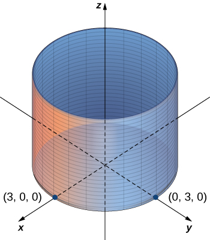{: #CNX_Calc_Figure_12_06_001}

Definition

A set of lines parallel to a given line passing through a given curve is known as a cylindrical surface, or **cylinder**{: data-type="term"}. The parallel lines are called **rulings**{: data-type="term"}.

From this definition, we can see that we still have a cylinder in three-dimensional space, even if the curve is not a circle. Any curve can form a cylinder, and the rulings that compose the cylinder may be parallel to any given line ([\[link\]](#CNX_Calc_Figure_12_06_002)).

 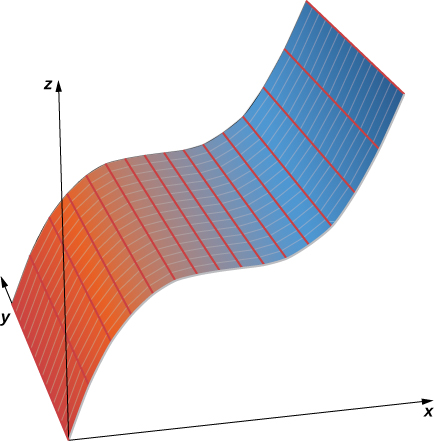{: #CNX_Calc_Figure_12_06_002}

Graphing Cylindrical Surfaces

Sketch the graphs of the following cylindrical surfaces.

1.  <math xmlns="http://www.w3.org/1998/Math/MathML"><mrow><msup><mi>x</mi><mn>2</mn></msup><mo>+</mo><msup><mi>z</mi><mn>2</mn></msup><mo>=</mo><mn>25</mn></mrow></math>

2.  <math xmlns="http://www.w3.org/1998/Math/MathML"><mrow><mi>z</mi><mo>=</mo><mn>2</mn><msup><mi>x</mi><mn>2</mn></msup><mo>−</mo><mi>y</mi></mrow></math>

3.  <math xmlns="http://www.w3.org/1998/Math/MathML"><mrow><mi>y</mi><mo>=</mo><mtext>sin</mtext><mspace width="0.2em" /><mi>x</mi></mrow></math>
{: data-number-style="lower-alpha"}

1.  The variable
    <math xmlns="http://www.w3.org/1998/Math/MathML"><mi>y</mi></math>
    
    can take on any value without limit. Therefore, the lines ruling this surface are parallel to the *y*-axis. The intersection of this surface with the *xz*-plane forms a circle centered at the origin with radius
    <math xmlns="http://www.w3.org/1998/Math/MathML"><mn>5</mn></math>
    
    (see the following figure).
    * * *
    {: data-type="newline"}
    
    {: #CNX_Calc_Figure_12_06_003}

2.  In this case, the equation contains all three variables
    <math xmlns="http://www.w3.org/1998/Math/MathML"><mrow><mo>—</mo><mi>x</mi><mo>,</mo><mi>y</mi><mo>,</mo></mrow></math>
    
    and
    <math xmlns="http://www.w3.org/1998/Math/MathML"><mrow><mi>z</mi><mo>—</mo></mrow></math>
    
    so none of the variables can vary arbitrarily. The easiest way to visualize this surface is to use a computer graphing utility (see the following figure).
    * * *
    {: data-type="newline"}
    
    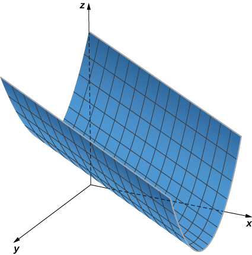{: #CNX_Calc_Figure_12_06_004}

3.  In this equation, the variable *z* can take on any value without limit. Therefore, the lines composing this surface are parallel to the *z*-axis. The intersection of this surface with the *yz*-plane outlines curve
    <math xmlns="http://www.w3.org/1998/Math/MathML"><mrow><mi>y</mi><mo>=</mo><mspace width="0.2em" /><mtext>sin</mtext><mspace width="0.2em" /><mi>x</mi></mrow></math>
    
    (see the following figure).
    * * *
    {: data-type="newline"}
    
    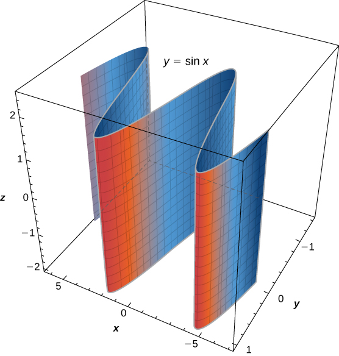{: #CNX_Calc_Figure_12_06_005}

{: data-number-style="lower-alpha"}

Sketch or use a graphing tool to view the graph of the cylindrical surface defined by equation <math xmlns="http://www.w3.org/1998/Math/MathML"><mrow><mi>z</mi><mo>=</mo><msup><mi>y</mi><mn>2</mn></msup><mo>.</mo></mrow></math>

* * *
{: data-type="newline"}

 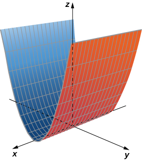 

Hint

The variable <math xmlns="http://www.w3.org/1998/Math/MathML"><mi>x</mi></math>

 can take on any value without limit.

When sketching surfaces, we have seen that it is useful to sketch the intersection of the surface with a plane parallel to one of the coordinate planes. These curves are called traces. We can see them in the plot of the cylinder in [\[link\]](#CNX_Calc_Figure_12_06_007).

Definition

The **traces**{: data-type="term"} of a surface are the cross-sections created when the surface intersects a plane parallel to one of the coordinate planes.

  This is one view of the graph of equation z=sinx. (b) To find the trace of the graph in the xz-plane, set y=0. The trace is simply a two-dimensional sine wave."){: #CNX_Calc_Figure_12_06_007}

Traces are useful in sketching cylindrical surfaces. For a cylinder in three dimensions, though, only one set of traces is useful. Notice, in [\[link\]](#CNX_Calc_Figure_12_06_007), that the trace of the graph of <math xmlns="http://www.w3.org/1998/Math/MathML"><mrow><mi>z</mi><mo>=</mo><mtext>sin</mtext><mspace width="0.2em" /><mi>x</mi></mrow></math>

 in the *xz*-plane is useful in constructing the graph. The trace in the *xy*-plane, though, is just a series of parallel lines, and the trace in the *yz*-plane is simply one line.

Cylindrical surfaces are formed by a set of parallel lines. Not all surfaces in three dimensions are constructed so simply, however. We now explore more complex surfaces, and traces are an important tool in this investigation.

### Quadric Surfaces

We have learned about surfaces in three dimensions described by first-order equations; these are planes. Some other common types of surfaces can be described by second-order equations. We can view these surfaces as three-dimensional extensions of the conic sections we discussed earlier: the ellipse, the parabola, and the hyperbola. We call these graphs quadric surfaces.

Definition

**Quadric surfaces**{: data-type="term"} are the graphs of equations that can be expressed in the form

<math xmlns="http://www.w3.org/1998/Math/MathML"><mrow><mi>A</mi><msup><mi>x</mi><mn>2</mn></msup><mo>+</mo><mi>B</mi><msup><mi>y</mi><mn>2</mn></msup><mo>+</mo><mi>C</mi><msup><mi>z</mi><mn>2</mn></msup><mo>+</mo><mi>D</mi><mi>x</mi><mi>y</mi><mo>+</mo><mi>E</mi><mi>x</mi><mi>z</mi><mo>+</mo><mi>F</mi><mi>y</mi><mi>z</mi><mo>+</mo><mi>G</mi><mi>x</mi><mo>+</mo><mi>H</mi><mi>y</mi><mo>+</mo><mi>J</mi><mi>z</mi><mo>+</mo><mi>K</mi><mo>=</mo><mn>0</mn><mo>.</mo></mrow></math>

When a quadric surface intersects a coordinate plane, the trace is a conic section.

An **ellipsoid**{: data-type="term"} is a surface described by an equation of the form <math xmlns="http://www.w3.org/1998/Math/MathML"><mrow><mfrac><mrow><msup><mi>x</mi><mn>2</mn></msup></mrow><mrow><msup><mi>a</mi><mn>2</mn></msup></mrow></mfrac><mo>+</mo><mfrac><mrow><msup><mi>y</mi><mn>2</mn></msup></mrow><mrow><msup><mi>b</mi><mn>2</mn></msup></mrow></mfrac><mo>+</mo><mfrac><mrow><msup><mi>z</mi><mn>2</mn></msup></mrow><mrow><msup><mi>c</mi><mn>2</mn></msup></mrow></mfrac><mo>=</mo><mn>1</mn><mo>.</mo></mrow></math>

 Set <math xmlns="http://www.w3.org/1998/Math/MathML"><mrow><mi>x</mi><mo>=</mo><mn>0</mn></mrow></math>

 to see the trace of the ellipsoid in the *yz*-plane. To see the traces in the *y*- and *xz*-planes, set <math xmlns="http://www.w3.org/1998/Math/MathML"><mrow><mi>z</mi><mo>=</mo><mn>0</mn></mrow></math>

 and <math xmlns="http://www.w3.org/1998/Math/MathML"><mrow><mi>y</mi><mo>=</mo><mn>0</mn><mo>,</mo></mrow></math>

 respectively. Notice that, if <math xmlns="http://www.w3.org/1998/Math/MathML"><mrow><mi>a</mi><mo>=</mo><mi>b</mi><mo>,</mo></mrow></math>

 the trace in the *xy*-plane is a circle. Similarly, if <math xmlns="http://www.w3.org/1998/Math/MathML"><mrow><mi>a</mi><mo>=</mo><mi>c</mi><mo>,</mo></mrow></math>

 the trace in the *xz*-plane is a circle and, if <math xmlns="http://www.w3.org/1998/Math/MathML"><mrow><mi>b</mi><mo>=</mo><mi>c</mi><mo>,</mo></mrow></math>

 then the trace in the *yz*-plane is a circle. A sphere, then, is an ellipsoid with <math xmlns="http://www.w3.org/1998/Math/MathML"><mrow><mi>a</mi><mo>=</mo><mi>b</mi><mo>=</mo><mi>c</mi><mo>.</mo></mrow></math>

Sketching an Ellipsoid

Sketch the ellipsoid <math xmlns="http://www.w3.org/1998/Math/MathML"><mrow><mfrac><mrow><msup><mi>x</mi><mn>2</mn></msup></mrow><mrow><msup><mn>2</mn><mn>2</mn></msup></mrow></mfrac><mo>+</mo><mfrac><mrow><msup><mi>y</mi><mn>2</mn></msup></mrow><mrow><msup><mn>3</mn><mn>2</mn></msup></mrow></mfrac><mo>+</mo><mfrac><mrow><msup><mi>z</mi><mn>2</mn></msup></mrow><mrow><msup><mn>5</mn><mn>2</mn></msup></mrow></mfrac><mo>=</mo><mn>1</mn><mo>.</mo></mrow></math>

Start by sketching the traces. To find the trace in the *xy*-plane, set <math xmlns="http://www.w3.org/1998/Math/MathML"><mrow><mi>z</mi><mo>=</mo><mn>0</mn><mtext>:</mtext></mrow></math>

 <math xmlns="http://www.w3.org/1998/Math/MathML"><mrow><mfrac><mrow><msup><mi>x</mi><mn>2</mn></msup></mrow><mrow><msup><mn>2</mn><mn>2</mn></msup></mrow></mfrac><mo>+</mo><mfrac><mrow><msup><mi>y</mi><mn>2</mn></msup></mrow><mrow><msup><mn>3</mn><mn>2</mn></msup></mrow></mfrac><mo>=</mo><mn>1</mn></mrow></math>

 (see [[link]](#CNX_Calc_Figure_12_06_008)). To find the other traces, first set <math xmlns="http://www.w3.org/1998/Math/MathML"><mrow><mi>y</mi><mo>=</mo><mn>0</mn></mrow></math>

 and then set <math xmlns="http://www.w3.org/1998/Math/MathML"><mrow><mi>x</mi><mo>=</mo><mn>0</mn><mo>.</mo></mrow></math>

![This figure has three images. The first image is an oval centered around the origin of the rectangular coordinate system. It intersects the x axis at -2 and 2. It intersects the y-axis at -3 and 3. The second image is an oval centered around the origin of the rectangular coordinate system. It intersects the x-axis at -2 and 2 and the y-axis at -5 and 5. The third image is an oval centered around the origin of the rectangular coordinate system. It intersects the x-axis at -3 and 3 and the y-axis at -5 and 5.](../resources/CNX_Calc_Figure_12_06_008.jpg "(a) This graph represents the trace of equation x222+y232+z252=1 in the xy-plane, when we set z=0. (b) When we set y=0, we get the trace of the ellipsoid in the xz-plane, which is an ellipse. (c) When we set x=0, we get the trace of the ellipsoid in the yz-plane, which is also an ellipse."){: #CNX_Calc_Figure_12_06_008}

Now that we know what traces of this solid look like, we can sketch the surface in three dimensions ([[link]](#CNX_Calc_Figure_12_06_009)).

 The traces provide a framework for the surface. (b) The center of this ellipsoid is the origin."){: #CNX_Calc_Figure_12_06_009}

The trace of an ellipsoid is an ellipse in each of the coordinate planes. However, this does not have to be the case for all quadric surfaces. Many quadric surfaces have traces that are different kinds of conic sections, and this is usually indicated by the name of the surface. For example, if a surface can be described by an equation of the form <math xmlns="http://www.w3.org/1998/Math/MathML"><mrow><mfrac><mrow><msup><mi>x</mi><mn>2</mn></msup></mrow><mrow><msup><mi>a</mi><mn>2</mn></msup></mrow></mfrac><mo>+</mo><mfrac><mrow><msup><mi>y</mi><mn>2</mn></msup></mrow><mrow><msup><mi>b</mi><mn>2</mn></msup></mrow></mfrac><mo>=</mo><mfrac><mi>z</mi><mi>c</mi></mfrac><mo>,</mo></mrow></math>

 then we call that surface an **elliptic paraboloid**{: data-type="term"}. The trace in the *xy*-plane is an ellipse, but the traces in the *xz*-plane and *yz*-plane are parabolas ([\[link\]](#CNX_Calc_Figure_12_06_010)). Other elliptic paraboloids can have other orientations simply by interchanging the variables to give us a different variable in the linear term of the equation <math xmlns="http://www.w3.org/1998/Math/MathML"><mrow><mfrac><mrow><msup><mi>x</mi><mn>2</mn></msup></mrow><mrow><msup><mi>a</mi><mn>2</mn></msup></mrow></mfrac><mo>+</mo><mfrac><mrow><msup><mi>z</mi><mn>2</mn></msup></mrow><mrow><msup><mi>c</mi><mn>2</mn></msup></mrow></mfrac><mo>=</mo><mfrac><mi>y</mi><mi>b</mi></mfrac></mrow></math>

 or <math xmlns="http://www.w3.org/1998/Math/MathML"><mrow><mfrac><mrow><msup><mi>y</mi><mn>2</mn></msup></mrow><mrow><msup><mi>b</mi><mn>2</mn></msup></mrow></mfrac><mo>+</mo><mfrac><mrow><msup><mi>z</mi><mn>2</mn></msup></mrow><mrow><msup><mi>c</mi><mn>2</mn></msup></mrow></mfrac><mo>=</mo><mfrac><mi>x</mi><mi>a</mi></mfrac><mo>.</mo></mrow></math>

 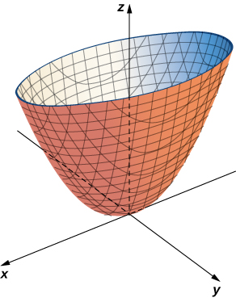{: #CNX_Calc_Figure_12_06_010}

Identifying Traces of Quadric Surfaces

Describe the traces of the elliptic paraboloid <math xmlns="http://www.w3.org/1998/Math/MathML"><mrow><msup><mi>x</mi><mn>2</mn></msup><mo>+</mo><mfrac><mrow><msup><mi>y</mi><mn>2</mn></msup></mrow><mrow><msup><mn>2</mn><mn>2</mn></msup></mrow></mfrac><mo>=</mo><mfrac><mi>z</mi><mn>5</mn></mfrac><mo>.</mo></mrow></math>

To find the trace in the *xy*-plane, set <math xmlns="http://www.w3.org/1998/Math/MathML"><mrow><mi>z</mi><mo>=</mo><mn>0</mn><mtext>:</mtext></mrow></math>

 <math xmlns="http://www.w3.org/1998/Math/MathML"><mrow><msup><mi>x</mi><mn>2</mn></msup><mo>+</mo><mfrac><mrow><msup><mi>y</mi><mn>2</mn></msup></mrow><mrow><msup><mn>2</mn><mn>2</mn></msup></mrow></mfrac><mo>=</mo><mn>0</mn><mo>.</mo></mrow></math>

 The trace in the plane <math xmlns="http://www.w3.org/1998/Math/MathML"><mrow><mi>z</mi><mo>=</mo><mn>0</mn></mrow></math>

 is simply one point, the origin. Since a single point does not tell us what the shape is, we can move up the *z*-axis to an arbitrary plane to find the shape of other traces of the figure.

The trace in plane <math xmlns="http://www.w3.org/1998/Math/MathML"><mrow><mi>z</mi><mo>=</mo><mn>5</mn></mrow></math>

 is the graph of equation <math xmlns="http://www.w3.org/1998/Math/MathML"><mrow><msup><mi>x</mi><mn>2</mn></msup><mo>+</mo><mfrac><mrow><msup><mi>y</mi><mn>2</mn></msup></mrow><mrow><msup><mn>2</mn><mn>2</mn></msup></mrow></mfrac><mo>=</mo><mn>1</mn><mo>,</mo></mrow></math>

 which is an ellipse. In the *xz*-plane, the equation becomes <math xmlns="http://www.w3.org/1998/Math/MathML"><mrow><mi>z</mi><mo>=</mo><mn>5</mn><msup><mi>x</mi><mn>2</mn></msup><mo>.</mo></mrow></math>

 The trace is a parabola in this plane and in any plane with the equation <math xmlns="http://www.w3.org/1998/Math/MathML"><mrow><mi>y</mi><mo>=</mo><mi>b</mi><mo>.</mo></mrow></math>

In planes parallel to the *yz*-plane, the traces are also parabolas, as we can see in the following figure.

![This figure has four images. The first image is the image of a surface. It is in the 3-dimensional coordinate system on top of the origin. A cross section of this surface parallel to the x y plane would be an ellipse. A cross section parallel to the x z plane would be a parabola. A cross section of the surface parallel to the y z plane would be a parabola. The second image is the cross section parallel to the x y plane and is an ellipse. The third image is the cross section parallel to the x z plane and is a parabola. The fourth image is the cross section parallel to the y z plane and is a parabola.](../resources/CNX_Calc_Figure_12_06_011.jpg "(a) The paraboloid x2+y222=z5. (b) The trace in plane z=5. (c) The trace in the xz-plane. (d) The trace in the yz-plane."){: #CNX_Calc_Figure_12_06_011}

A hyperboloid of one sheet is any surface that can be described with an equation of the form <math xmlns="http://www.w3.org/1998/Math/MathML"><mrow><mfrac><mrow><msup><mi>x</mi><mn>2</mn></msup></mrow><mrow><msup><mi>a</mi><mn>2</mn></msup></mrow></mfrac><mo>+</mo><mfrac><mrow><msup><mi>y</mi><mn>2</mn></msup></mrow><mrow><msup><mi>b</mi><mn>2</mn></msup></mrow></mfrac><mo>−</mo><mfrac><mrow><msup><mi>z</mi><mn>2</mn></msup></mrow><mrow><msup><mi>c</mi><mn>2</mn></msup></mrow></mfrac><mo>=</mo><mn>1</mn><mo>.</mo></mrow></math>

 Describe the traces of the hyperboloid of one sheet given by equation <math xmlns="http://www.w3.org/1998/Math/MathML"><mrow><mfrac><mrow><msup><mi>x</mi><mn>2</mn></msup></mrow><mrow><msup><mn>3</mn><mn>2</mn></msup></mrow></mfrac><mo>+</mo><mfrac><mrow><msup><mi>y</mi><mn>2</mn></msup></mrow><mrow><msup><mn>2</mn><mn>2</mn></msup></mrow></mfrac><mo>−</mo><mfrac><mrow><msup><mi>z</mi><mn>2</mn></msup></mrow><mrow><msup><mn>5</mn><mn>2</mn></msup></mrow></mfrac><mo>=</mo><mn>1</mn><mo>.</mo></mrow></math>

The traces parallel to the *xy*-plane are ellipses and the traces parallel to the *xz*- and *yz*-planes are hyperbolas. Specifically, the trace in the *xy*-plane is ellipse <math xmlns="http://www.w3.org/1998/Math/MathML"><mrow><mfrac><mrow><msup><mi>x</mi><mn>2</mn></msup></mrow><mrow><msup><mn>3</mn><mn>2</mn></msup></mrow></mfrac><mo>+</mo><mfrac><mrow><msup><mi>y</mi><mn>2</mn></msup></mrow><mrow><msup><mn>2</mn><mn>2</mn></msup></mrow></mfrac><mo>=</mo><mn>1</mn><mo>,</mo></mrow></math>

 the trace in the *xz*-plane is hyperbola <math xmlns="http://www.w3.org/1998/Math/MathML"><mrow><mfrac><mrow><msup><mi>x</mi><mn>2</mn></msup></mrow><mrow><msup><mn>3</mn><mn>2</mn></msup></mrow></mfrac><mo>−</mo><mfrac><mrow><msup><mi>z</mi><mn>2</mn></msup></mrow><mrow><msup><mn>5</mn><mn>2</mn></msup></mrow></mfrac><mo>=</mo><mn>1</mn><mo>,</mo></mrow></math>

 and the trace in the *yz*-plane is hyperbola <math xmlns="http://www.w3.org/1998/Math/MathML"><mrow><mfrac><mrow><msup><mi>y</mi><mn>2</mn></msup></mrow><mrow><msup><mn>2</mn><mn>2</mn></msup></mrow></mfrac><mo>−</mo><mfrac><mrow><msup><mi>z</mi><mn>2</mn></msup></mrow><mrow><msup><mn>5</mn><mn>2</mn></msup></mrow></mfrac><mo>=</mo><mn>1</mn></mrow></math>

 (see the following figure).* * *
{: data-type="newline"}

 ![This figure has four images. The first image is an ellipse centered at the origin of a rectangular coordinate system. It intersects the x axis at -3 and 3. It intersects the y axis at -2 and 2. The second image is the graph of a hyperbola. It is two curves one opening in the negative x direction and a symmetric one in the positive x direction. The third image is the graph of a hyperbola in the y z plane. It is opening in the negative y direction and a symmetric curve opening in the positive y direction. The fourth image is a 3-dimensional surface. It top and bottom cross sections would be circular. A vertical intersection would be a hyperbola.](../resources/CNX_Calc_Figure_12_06_012.jpg) 

Hint

To find the traces in the coordinate planes, set each variable to zero individually.

Hyperboloids of one sheet have some fascinating properties. For example, they can be constructed using straight lines, such as in the sculpture in [\[link\]](#CNX_Calc_Figure_12_06_013)(a). In fact, cooling towers for nuclear power plants are often constructed in the shape of a hyperboloid. The builders are able to use straight steel beams in the construction, which makes the towers very strong while using relatively little material ([\[link\]](#CNX_Calc_Figure_12_06_013)(b)).

  A sculpture in the shape of a hyperboloid can be constructed of straight lines. (b) Cooling towers for nuclear power plants are often built in the shape of a hyperboloid."){: #CNX_Calc_Figure_12_06_013}

Chapter Opener: Finding the Focus of a Parabolic Reflector

Energy hitting the surface of a parabolic reflector is concentrated at the focal point of the reflector ([[link]](#CNX_Calc_Figure_12_06_014)). If the surface of a parabolic reflector is described by equation <math xmlns="http://www.w3.org/1998/Math/MathML"><mrow><mfrac><mrow><msup><mi>x</mi><mn>2</mn></msup></mrow><mrow><mn>100</mn></mrow></mfrac><mo>+</mo><mfrac><mrow><msup><mi>y</mi><mn>2</mn></msup></mrow><mrow><mn>100</mn></mrow></mfrac><mo>=</mo><mfrac><mi>z</mi><mn>4</mn></mfrac><mo>,</mo></mrow></math>

 where is the focal point of the reflector?

![This figure has two images. The first image is a picture of satellite dishes with parabolic reflectors. The second image is a parabolic curve on a line segment. The bottom of the curve is at point V. There is a line segment perpendicular to the other line segment through V. There is a point on this line segment labeled F. There are 3 lines from F to the parabola, intersecting at P sub 1, P sub 2, and P sub 3. There are also three vertical lines from P sub 1 to Q sub 1, from P sub 2 to Q sub 2, and from P sub 3 to Q sub 3.](../resources/CNX_Calc_Figure_12_06_021.jpg "Energy reflects off of the parabolic reflector and is collected at the focal point. (credit: modification of CGP Grey, Wikimedia Commons)"){: #CNX_Calc_Figure_12_06_014}

Since *z* is the first-power variable, the axis of the reflector corresponds to the *z*-axis. The coefficients of <math xmlns="http://www.w3.org/1998/Math/MathML"><mrow><msup><mi>x</mi><mn>2</mn></msup></mrow></math>

 and <math xmlns="http://www.w3.org/1998/Math/MathML"><mrow><msup><mi>y</mi><mn>2</mn></msup></mrow></math>

 are equal, so the cross-section of the paraboloid perpendicular to the *z*-axis is a circle. We can consider a trace in the *xz*-plane or the *yz*-plane; the result is the same. Setting <math xmlns="http://www.w3.org/1998/Math/MathML"><mrow><mi>y</mi><mo>=</mo><mn>0</mn><mo>,</mo></mrow></math>

 the trace is a parabola opening up along the *z*-axis, with standard equation <math xmlns="http://www.w3.org/1998/Math/MathML"><mrow><msup><mi>x</mi><mn>2</mn></msup><mo>=</mo><mn>4</mn><mi>p</mi><mi>z</mi><mo>,</mo></mrow></math>

 where <math xmlns="http://www.w3.org/1998/Math/MathML"><mi>p</mi></math>

 is the focal length of the parabola. In this case, this equation becomes <math xmlns="http://www.w3.org/1998/Math/MathML"><mrow><msup><mi>x</mi><mn>2</mn></msup><mo>=</mo><mn>100</mn><mo>·</mo><mfrac><mi>z</mi><mn>4</mn></mfrac><mo>=</mo><mn>4</mn><mi>p</mi><mi>z</mi></mrow></math>

 or <math xmlns="http://www.w3.org/1998/Math/MathML"><mrow><mn>25</mn><mo>=</mo><mn>4</mn><mi>p</mi><mo>.</mo></mrow></math>

 So *p* is <math xmlns="http://www.w3.org/1998/Math/MathML"><mrow><mn>6.25</mn></mrow></math>

 m, which tells us that the focus of the paraboloid is <math xmlns="http://www.w3.org/1998/Math/MathML"><mrow><mn>6.25</mn></mrow></math>

 m up the axis from the vertex. Because the vertex of this surface is the origin, the focal point is <math xmlns="http://www.w3.org/1998/Math/MathML"><mrow><mrow><mo>(</mo><mrow><mn>0</mn><mo>,</mo><mn>0</mn><mo>,</mo><mn>6.25</mn></mrow><mo>)</mo></mrow><mo>.</mo></mrow></math>

Seventeen standard quadric surfaces can be derived from the general equation

<math xmlns="http://www.w3.org/1998/Math/MathML"><mrow><mi>A</mi><msup><mi>x</mi><mn>2</mn></msup><mo>+</mo><mi>B</mi><msup><mi>y</mi><mn>2</mn></msup><mo>+</mo><mi>C</mi><msup><mi>z</mi><mn>2</mn></msup><mo>+</mo><mi>D</mi><mi>x</mi><mi>y</mi><mo>+</mo><mi>E</mi><mi>x</mi><mi>z</mi><mo>+</mo><mi>F</mi><mi>y</mi><mi>z</mi><mo>+</mo><mi>G</mi><mi>x</mi><mo>+</mo><mi>H</mi><mi>y</mi><mo>+</mo><mi>J</mi><mi>z</mi><mo>+</mo><mi>K</mi><mo>=</mo><mn>0</mn><mo>.</mo></mrow></math>

The following figures summarizes the most important ones.

 ![This figure is of a table with two columns and three rows. The three rows represent the first 6 quadric surfaces: ellipsoid, hyperboloid of one sheet, and hyperboloid of two sheets. The equations and traces are in the first column. The second column has the graphs of the surfaces. The ellipsoid graph is a vertical oblong round shape. The hyperboloid of one sheet is circular on the top and the bottom and narrow in the middle. The hyperboloid in two sheets has two parabolic domes opposite of each other.](../resources/CNX_Calc_Figure_12_06_022.jpg "Characteristics of Common Quadratic Surfaces: Ellipsoid, Hyperboloid of One Sheet, Hyperboloid of Two Sheets."){: #CNX_Calc_Figure_12_06_022}

{: #CNX_Calc_Figure_12_06_023}

Identifying Equations of Quadric Surfaces

Identify the surfaces represented by the given equations.

1.  <math xmlns="http://www.w3.org/1998/Math/MathML"><mrow><mn>16</mn><msup><mi>x</mi><mn>2</mn></msup><mo>+</mo><mn>9</mn><msup><mi>y</mi><mn>2</mn></msup><mo>+</mo><mn>16</mn><msup><mi>z</mi><mn>2</mn></msup><mo>=</mo><mn>144</mn></mrow></math>

2.  <math xmlns="http://www.w3.org/1998/Math/MathML"><mrow><mn>9</mn><msup><mi>x</mi><mn>2</mn></msup><mo>−</mo><mn>18</mn><mi>x</mi><mo>+</mo><mn>4</mn><msup><mi>y</mi><mn>2</mn></msup><mo>+</mo><mn>16</mn><mi>y</mi><mo>−</mo><mn>36</mn><mi>z</mi><mo>+</mo><mn>25</mn><mo>=</mo><mn>0</mn></mrow></math>
{: data-number-style="lower-alpha"}

1.  The
    <math xmlns="http://www.w3.org/1998/Math/MathML"><mrow><mi>x</mi><mo>,</mo><mi>y</mi><mo>,</mo></mrow></math>
    
    and
    <math xmlns="http://www.w3.org/1998/Math/MathML"><mi>z</mi></math>
    
    terms are all squared, and are all positive, so this is probably an ellipsoid. However, let’s put the equation into the standard form for an ellipsoid just to be sure. We have
    * * *
    {: data-type="newline"}
    
    

    <math xmlns="http://www.w3.org/1998/Math/MathML"><mrow><mn>16</mn><msup><mi>x</mi><mn>2</mn></msup><mo>+</mo><mn>9</mn><msup><mi>y</mi><mn>2</mn></msup><mo>+</mo><mn>16</mn><msup><mi>z</mi><mn>2</mn></msup><mo>=</mo><mn>144</mn><mo>.</mo></mrow></math>
    

    
    * * *
    {: data-type="newline"}
    
    Dividing through by 144 gives
    * * *
    {: data-type="newline"}
    
    

    <math xmlns="http://www.w3.org/1998/Math/MathML"><mrow><mfrac><mrow><msup><mi>x</mi><mn>2</mn></msup></mrow><mn>9</mn></mfrac><mo>+</mo><mfrac><mrow><msup><mi>y</mi><mn>2</mn></msup></mrow><mrow><mn>16</mn></mrow></mfrac><mo>+</mo><mfrac><mrow><msup><mi>z</mi><mn>2</mn></msup></mrow><mn>9</mn></mfrac><mo>=</mo><mn>1</mn><mo>.</mo></mrow></math>
    

    
    * * *
    {: data-type="newline"}
    
    So, this is, in fact, an ellipsoid, centered at the origin.
2.  We first notice that the
    <math xmlns="http://www.w3.org/1998/Math/MathML"><mi>z</mi></math>
    
    term is raised only to the first power, so this is either an elliptic paraboloid or a hyperbolic paraboloid. We also note there are
    <math xmlns="http://www.w3.org/1998/Math/MathML"><mi>x</mi></math>
    
    terms and
    <math xmlns="http://www.w3.org/1998/Math/MathML"><mi>y</mi></math>
    
    terms that are not squared, so this quadric surface is not centered at the origin. We need to complete the square to put this equation in one of the standard forms. We have
    * * *
    {: data-type="newline"}
    
    

    <math xmlns="http://www.w3.org/1998/Math/MathML"><mtable><mtr /><mtr><mtd columnalign="right"><mn>9</mn><msup><mi>x</mi><mn>2</mn></msup><mo>−</mo><mn>18</mn><mi>x</mi><mo>+</mo><mn>4</mn><msup><mi>y</mi><mn>2</mn></msup><mo>+</mo><mn>16</mn><mi>y</mi><mo>−</mo><mn>36</mn><mi>z</mi><mo>+</mo><mn>25</mn></mtd><mtd columnalign="left"><mo>=</mo></mtd><mtd columnalign="left"><mn>0</mn></mtd></mtr><mtr><mtd columnalign="right"><mn>9</mn><msup><mi>x</mi><mn>2</mn></msup><mo>−</mo><mn>18</mn><mi>x</mi><mo>+</mo><mn>4</mn><msup><mi>y</mi><mn>2</mn></msup><mo>+</mo><mn>16</mn><mi>y</mi><mo>+</mo><mn>25</mn></mtd><mtd columnalign="left"><mo>=</mo></mtd><mtd columnalign="left"><mn>36</mn><mi>z</mi></mtd></mtr><mtr><mtd columnalign="right"><mn>9</mn><mrow><mo>(</mo><mrow><msup><mi>x</mi><mn>2</mn></msup><mo>−</mo><mn>2</mn><mi>x</mi></mrow><mo>)</mo></mrow><mo>+</mo><mn>4</mn><mrow><mo>(</mo><mrow><msup><mi>y</mi><mn>2</mn></msup><mo>+</mo><mn>4</mn><mi>y</mi></mrow><mo>)</mo></mrow><mo>+</mo><mn>25</mn></mtd><mtd columnalign="left"><mo>=</mo></mtd><mtd columnalign="left"><mn>36</mn><mi>z</mi></mtd></mtr><mtr><mtd columnalign="right"><mn>9</mn><mrow><mo>(</mo><mrow><msup><mi>x</mi><mn>2</mn></msup><mo>−</mo><mn>2</mn><mi>x</mi><mo>+</mo><mn>1</mn><mo>−</mo><mn>1</mn></mrow><mo>)</mo></mrow><mo>+</mo><mn>4</mn><mrow><mo>(</mo><mrow><msup><mi>y</mi><mn>2</mn></msup><mo>+</mo><mn>4</mn><mi>y</mi><mo>+</mo><mn>4</mn><mo>−</mo><mn>4</mn></mrow><mo>)</mo></mrow><mo>+</mo><mn>25</mn></mtd><mtd columnalign="left"><mo>=</mo></mtd><mtd columnalign="left"><mn>36</mn><mi>z</mi></mtd></mtr><mtr><mtd columnalign="right"><mn>9</mn><msup><mrow><mo>(</mo><mrow><mi>x</mi><mo>−</mo><mn>1</mn></mrow><mo>)</mo></mrow><mn>2</mn></msup><mo>−</mo><mn>9</mn><mo>+</mo><mn>4</mn><msup><mrow><mo>(</mo><mrow><mi>y</mi><mo>+</mo><mn>2</mn></mrow><mo>)</mo></mrow><mn>2</mn></msup><mo>−</mo><mn>16</mn><mo>+</mo><mn>25</mn></mtd><mtd columnalign="left"><mo>=</mo></mtd><mtd columnalign="left"><mn>36</mn><mi>z</mi></mtd></mtr><mtr><mtd columnalign="right"><mn>9</mn><msup><mrow><mo>(</mo><mrow><mi>x</mi><mo>−</mo><mn>1</mn></mrow><mo>)</mo></mrow><mn>2</mn></msup><mo>+</mo><mn>4</mn><msup><mrow><mo>(</mo><mrow><mi>y</mi><mo>+</mo><mn>2</mn></mrow><mo>)</mo></mrow><mn>2</mn></msup></mtd><mtd columnalign="left"><mo>=</mo></mtd><mtd columnalign="left"><mn>36</mn><mi>z</mi></mtd></mtr><mtr><mtd columnalign="right"><mfrac><mrow><msup><mrow><mrow><mo>(</mo><mrow><mi>x</mi><mo>−</mo><mn>1</mn></mrow><mo>)</mo></mrow></mrow><mn>2</mn></msup></mrow><mn>4</mn></mfrac><mo>+</mo><mfrac><mrow><msup><mrow><mrow><mo>(</mo><mrow><mi>y</mi><mo>−</mo><mn>2</mn></mrow><mo>)</mo></mrow></mrow><mn>2</mn></msup></mrow><mn>9</mn></mfrac></mtd><mtd columnalign="left"><mo>=</mo></mtd><mtd columnalign="left"><mi>z</mi><mo>.</mo></mtd></mtr></mtable></math>
    

    
    * * *
    {: data-type="newline"}
    
    This is an elliptic paraboloid centered at
    <math xmlns="http://www.w3.org/1998/Math/MathML"><mrow><mrow><mo>(</mo><mrow><mn>1</mn><mo>,</mo><mn>2</mn><mo>,</mo><mn>0</mn></mrow><mo>)</mo></mrow><mo>.</mo></mrow></math>
{: data-number-style="lower-alpha"}

Identify the surface represented by equation <math xmlns="http://www.w3.org/1998/Math/MathML"><mrow><mn>9</mn><msup><mi>x</mi><mn>2</mn></msup><mo>+</mo><msup><mi>y</mi><mn>2</mn></msup><mo>−</mo><msup><mi>z</mi><mn>2</mn></msup><mo>+</mo><mn>2</mn><mi>z</mi><mo>−</mo><mn>10</mn><mo>=</mo><mn>0</mn><mo>.</mo></mrow></math>

Hyperboloid of one sheet, centered at <math xmlns="http://www.w3.org/1998/Math/MathML"><mrow><mrow><mo>(</mo><mrow><mn>0</mn><mo>,</mo><mn>0</mn><mo>,</mo><mn>1</mn></mrow><mo>)</mo></mrow></mrow></math>

Hint

Look at the signs and powers of the <math xmlns="http://www.w3.org/1998/Math/MathML"><mrow><mi>x</mi><mo>,</mo><mi>y</mi><mo>,</mo><mspace width="0.2em" /><mtext>and</mtext><mspace width="0.2em" /><mi>z</mi></mrow></math>

 terms.

### Key Concepts

* A set of lines parallel to a given line passing through a given curve is called a *cylinder*, or a *cylindrical surface*. The parallel lines are called *rulings*.
* The intersection of a three-dimensional surface and a plane is called a *trace*. To find the trace in the *xy*-, *yz*-, or *xz*-planes, set
  <math xmlns="http://www.w3.org/1998/Math/MathML"><mrow><mi>z</mi><mo>=</mo><mn>0</mn><mo>,</mo><mi>x</mi><mo>=</mo><mn>0</mn><mo>,</mo><mspace width="0.2em" /><mtext>or</mtext><mspace width="0.2em" /><mi>y</mi><mo>=</mo><mn>0</mn><mo>,</mo></mrow></math>
  
  respectively.
* Quadric surfaces are three-dimensional surfaces with traces composed of conic sections. Every quadric surface can be expressed with an equation of the form
  <math xmlns="http://www.w3.org/1998/Math/MathML"><mrow><mi>A</mi><msup><mi>x</mi><mn>2</mn></msup><mo>+</mo><mi>B</mi><msup><mi>y</mi><mn>2</mn></msup><mo>+</mo><mi>C</mi><msup><mi>z</mi><mn>2</mn></msup><mo>+</mo><mi>D</mi><mi>x</mi><mi>y</mi><mo>+</mo><mi>E</mi><mi>x</mi><mi>z</mi><mo>+</mo><mi>F</mi><mi>y</mi><mi>z</mi><mo>+</mo><mi>G</mi><mi>x</mi><mo>+</mo><mi>H</mi><mi>y</mi><mo>+</mo><mi>J</mi><mi>z</mi><mo>+</mo><mi>K</mi><mo>=</mo><mn>0</mn><mo>.</mo></mrow></math>

* To sketch the graph of a quadric surface, start by sketching the traces to understand the framework of the surface.
* Important quadric surfaces are summarized in [\[link\]](#CNX_Calc_Figure_12_06_022) and [\[link\]](#CNX_Calc_Figure_12_06_023).
{: data-bullet-style="bullet"}

<section data-depth="1" class="section-exercises" markdown="1">
For the following exercises, sketch and describe the cylindrical surface of the given equation.

**[T]** <math xmlns="http://www.w3.org/1998/Math/MathML"><mrow><msup><mi>x</mi><mn>2</mn></msup><mo>+</mo><msup><mi>z</mi><mn>2</mn></msup><mo>=</mo><mn>1</mn></mrow></math>

The surface is a cylinder with the rulings parallel to the *y*-axis.* * *
{: data-type="newline"}

 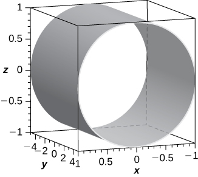 

**[T]** <math xmlns="http://www.w3.org/1998/Math/MathML"><mrow><msup><mi>x</mi><mn>2</mn></msup><mo>+</mo><msup><mi>y</mi><mn>2</mn></msup><mo>=</mo><mn>9</mn></mrow></math>

**[T]** <math xmlns="http://www.w3.org/1998/Math/MathML"><mrow><mi>z</mi><mo>=</mo><mtext>cos</mtext><mrow><mo>(</mo><mrow><mfrac><mi>π</mi><mn>2</mn></mfrac><mo>+</mo><mi>x</mi></mrow><mo>)</mo></mrow></mrow></math>

The surface is a cylinder with rulings parallel to the *y*-axis.* * *
{: data-type="newline"}

 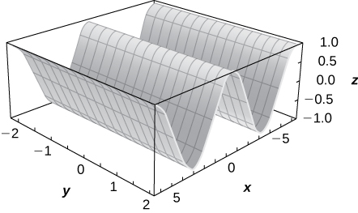 

**[T]** <math xmlns="http://www.w3.org/1998/Math/MathML"><mrow><mi>z</mi><mo>=</mo><msup><mi>e</mi><mi>x</mi></msup></mrow></math>

**[T]** <math xmlns="http://www.w3.org/1998/Math/MathML"><mrow><mi>z</mi><mo>=</mo><mn>9</mn><mo>−</mo><msup><mi>y</mi><mn>2</mn></msup></mrow></math>

The surface is a cylinder with rulings parallel to the *x*-axis.* * *
{: data-type="newline"}

 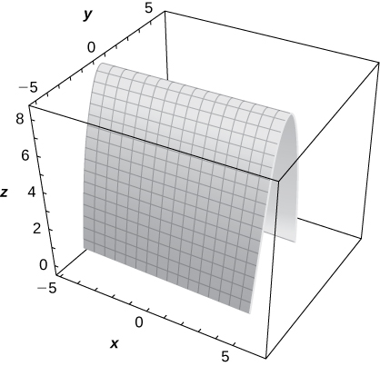 

**[T]** <math xmlns="http://www.w3.org/1998/Math/MathML"><mrow><mi>z</mi><mo>=</mo><mtext>ln</mtext><mrow><mo>(</mo><mi>x</mi><mo>)</mo></mrow></mrow></math>

For the following exercises, the graph of a quadric surface is given.

1.  Specify the name of the quadric surface.
2.  Determine the axis of symmetry of the quadric surface.
{: data-number-style="lower-alpha"}

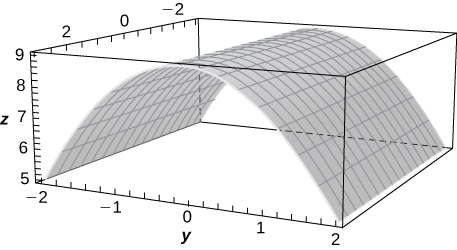

a. Cylinder; b. The *x*-axis

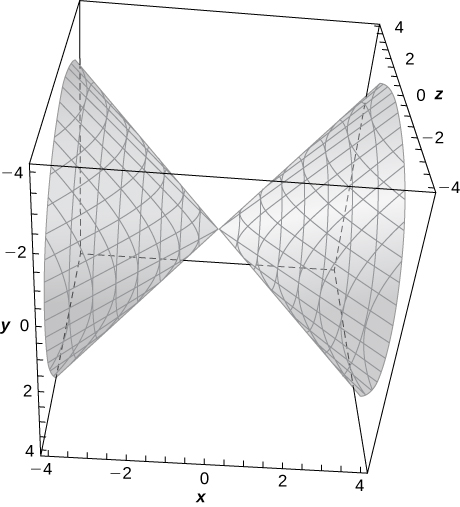

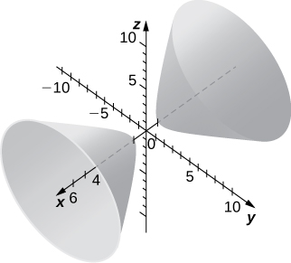

a. Hyperboloid of two sheets; b. The *x*-axis

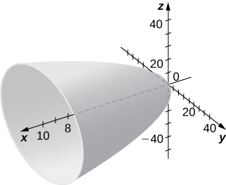

For the following exercises, match the given quadric surface with its corresponding equation in standard form.

1.  <math xmlns="http://www.w3.org/1998/Math/MathML"><mrow><mfrac><mrow><msup><mi>x</mi><mn>2</mn></msup></mrow><mn>4</mn></mfrac><mo>+</mo><mfrac><mrow><msup><mi>y</mi><mn>2</mn></msup></mrow><mn>9</mn></mfrac><mo>−</mo><mfrac><mrow><msup><mi>z</mi><mn>2</mn></msup></mrow><mrow><mn>12</mn></mrow></mfrac><mo>=</mo><mn>1</mn></mrow></math>

2.  <math xmlns="http://www.w3.org/1998/Math/MathML"><mrow><mfrac><mrow><msup><mi>x</mi><mn>2</mn></msup></mrow><mn>4</mn></mfrac><mo>−</mo><mfrac><mrow><msup><mi>y</mi><mn>2</mn></msup></mrow><mn>9</mn></mfrac><mo>−</mo><mfrac><mrow><msup><mi>z</mi><mn>2</mn></msup></mrow><mrow><mn>12</mn></mrow></mfrac><mo>=</mo><mn>1</mn></mrow></math>

3.  <math xmlns="http://www.w3.org/1998/Math/MathML"><mrow><mfrac><mrow><msup><mi>x</mi><mn>2</mn></msup></mrow><mn>4</mn></mfrac><mo>+</mo><mfrac><mrow><msup><mi>y</mi><mn>2</mn></msup></mrow><mn>9</mn></mfrac><mo>+</mo><mfrac><mrow><msup><mi>z</mi><mn>2</mn></msup></mrow><mrow><mn>12</mn></mrow></mfrac><mo>=</mo><mn>1</mn></mrow></math>

4.  <math xmlns="http://www.w3.org/1998/Math/MathML"><mrow><msup><mi>z</mi><mn>2</mn></msup><mo>=</mo><mn>4</mn><msup><mi>x</mi><mn>2</mn></msup><mo>+</mo><mn>3</mn><msup><mi>y</mi><mn>2</mn></msup></mrow></math>

5.  <math xmlns="http://www.w3.org/1998/Math/MathML"><mrow><mi>z</mi><mo>=</mo><mn>4</mn><msup><mi>x</mi><mn>2</mn></msup><mo>−</mo><msup><mi>y</mi><mn>2</mn></msup></mrow></math>

6.  <math xmlns="http://www.w3.org/1998/Math/MathML"><mrow><mn>4</mn><msup><mi>x</mi><mn>2</mn></msup><mo>+</mo><msup><mi>y</mi><mn>2</mn></msup><mo>−</mo><msup><mi>z</mi><mn>2</mn></msup><mo>=</mo><mn>0</mn></mrow></math>
{: data-number-style="lower-alpha"}

Hyperboloid of two sheets

b.

Ellipsoid

Elliptic paraboloid

d.

Hyperbolic paraboloid

Hyperboloid of one sheet

a.

Elliptic cone

For the following exercises, rewrite the given equation of the quadric surface in standard form. Identify the surface.

<math xmlns="http://www.w3.org/1998/Math/MathML"><mrow><mtext>−</mtext><msup><mi>x</mi><mn>2</mn></msup><mo>+</mo><mn>36</mn><msup><mi>y</mi><mn>2</mn></msup><mo>+</mo><mn>36</mn><msup><mi>z</mi><mn>2</mn></msup><mo>=</mo><mn>9</mn></mrow></math>

<math xmlns="http://www.w3.org/1998/Math/MathML"><mrow><mo>−</mo><mfrac><mrow><msup><mi>x</mi><mn>2</mn></msup></mrow><mn>9</mn></mfrac><mo>+</mo><mfrac><mrow><msup><mi>y</mi><mn>2</mn></msup></mrow><mrow><mfrac><mn>1</mn><mn>4</mn></mfrac></mrow></mfrac><mo>+</mo><mfrac><mrow><msup><mi>z</mi><mn>2</mn></msup></mrow><mrow><mfrac><mn>1</mn><mn>4</mn></mfrac></mrow></mfrac><mo>=</mo><mn>1</mn><mo>,</mo></mrow></math>

 hyperboloid of one sheet with the *x*-axis as its axis of symmetry

<math xmlns="http://www.w3.org/1998/Math/MathML"><mrow><mn>−4</mn><msup><mi>x</mi><mn>2</mn></msup><mo>+</mo><mn>25</mn><msup><mi>y</mi><mn>2</mn></msup><mo>+</mo><msup><mi>z</mi><mn>2</mn></msup><mo>=</mo><mn>100</mn></mrow></math>

<math xmlns="http://www.w3.org/1998/Math/MathML"><mrow><mn>−3</mn><msup><mi>x</mi><mn>2</mn></msup><mo>+</mo><mn>5</mn><msup><mi>y</mi><mn>2</mn></msup><mo>−</mo><msup><mi>z</mi><mn>2</mn></msup><mo>=</mo><mn>10</mn></mrow></math>

<math xmlns="http://www.w3.org/1998/Math/MathML"><mrow><mo>−</mo><mfrac><mrow><msup><mi>x</mi><mn>2</mn></msup></mrow><mrow><mfrac><mrow><mn>10</mn></mrow><mn>3</mn></mfrac></mrow></mfrac><mo>+</mo><mfrac><mrow><msup><mi>y</mi><mn>2</mn></msup></mrow><mn>2</mn></mfrac><mo>−</mo><mfrac><mrow><msup><mi>z</mi><mn>2</mn></msup></mrow><mrow><mn>10</mn></mrow></mfrac><mo>=</mo><mn>1</mn><mo>,</mo></mrow></math>

 hyperboloid of two sheets with the *y*-axis as its axis of symmetry

<math xmlns="http://www.w3.org/1998/Math/MathML"><mrow><mn>3</mn><msup><mi>x</mi><mn>2</mn></msup><mo>−</mo><msup><mi>y</mi><mn>2</mn></msup><mo>−</mo><mn>6</mn><msup><mi>z</mi><mn>2</mn></msup><mo>=</mo><mn>18</mn></mrow></math>

<math xmlns="http://www.w3.org/1998/Math/MathML"><mrow><mn>5</mn><mi>y</mi><mo>=</mo><msup><mi>x</mi><mn>2</mn></msup><mo>−</mo><msup><mi>z</mi><mn>2</mn></msup></mrow></math>

<math xmlns="http://www.w3.org/1998/Math/MathML"><mrow><mi>y</mi><mo>=</mo><mo>−</mo><mfrac><mrow><msup><mi>z</mi><mn>2</mn></msup></mrow><mn>5</mn></mfrac><mo>+</mo><mfrac><mrow><msup><mi>x</mi><mn>2</mn></msup></mrow><mn>5</mn></mfrac><mo>,</mo></mrow></math>

 hyperbolic paraboloid with the *y*-axis as its axis of symmetry

<math xmlns="http://www.w3.org/1998/Math/MathML"><mrow><mn>8</mn><msup><mi>x</mi><mn>2</mn></msup><mo>−</mo><mn>5</mn><msup><mi>y</mi><mn>2</mn></msup><mo>−</mo><mn>10</mn><mi>z</mi><mo>=</mo><mn>0</mn></mrow></math>

<math xmlns="http://www.w3.org/1998/Math/MathML"><mrow><msup><mi>x</mi><mn>2</mn></msup><mo>+</mo><mn>5</mn><msup><mi>y</mi><mn>2</mn></msup><mo>+</mo><mn>3</mn><msup><mi>z</mi><mn>2</mn></msup><mo>−</mo><mn>15</mn><mo>=</mo><mn>0</mn></mrow></math>

<math xmlns="http://www.w3.org/1998/Math/MathML"><mrow><mfrac><mrow><msup><mi>x</mi><mn>2</mn></msup></mrow><mrow><mn>15</mn></mrow></mfrac><mo>+</mo><mfrac><mrow><msup><mi>y</mi><mn>2</mn></msup></mrow><mn>3</mn></mfrac><mo>+</mo><mfrac><mrow><msup><mi>z</mi><mn>2</mn></msup></mrow><mn>5</mn></mfrac><mo>=</mo><mn>1</mn><mo>,</mo></mrow></math>

 ellipsoid

<math xmlns="http://www.w3.org/1998/Math/MathML"><mrow><mn>63</mn><msup><mi>x</mi><mn>2</mn></msup><mo>+</mo><mn>7</mn><msup><mi>y</mi><mn>2</mn></msup><mo>+</mo><mn>9</mn><msup><mi>z</mi><mn>2</mn></msup><mo>−</mo><mn>63</mn><mo>=</mo><mn>0</mn></mrow></math>

<math xmlns="http://www.w3.org/1998/Math/MathML"><mrow><msup><mi>x</mi><mn>2</mn></msup><mo>+</mo><mn>5</mn><msup><mi>y</mi><mn>2</mn></msup><mo>−</mo><mn>8</mn><msup><mi>z</mi><mn>2</mn></msup><mo>=</mo><mn>0</mn></mrow></math>

<math xmlns="http://www.w3.org/1998/Math/MathML"><mrow><mfrac><mrow><msup><mi>x</mi><mn>2</mn></msup></mrow><mrow><mn>40</mn></mrow></mfrac><mo>+</mo><mfrac><mrow><msup><mi>y</mi><mn>2</mn></msup></mrow><mn>8</mn></mfrac><mo>−</mo><mfrac><mrow><msup><mi>z</mi><mn>2</mn></msup></mrow><mn>5</mn></mfrac><mo>=</mo><mn>0</mn><mo>,</mo></mrow></math>

 elliptic cone with the *z*-axis as its axis of symmetry

<math xmlns="http://www.w3.org/1998/Math/MathML"><mrow><mn>5</mn><msup><mi>x</mi><mn>2</mn></msup><mo>−</mo><mn>4</mn><msup><mi>y</mi><mn>2</mn></msup><mo>+</mo><mn>20</mn><msup><mi>z</mi><mn>2</mn></msup><mo>=</mo><mn>0</mn></mrow></math>

<math xmlns="http://www.w3.org/1998/Math/MathML"><mrow><mn>6</mn><mi>x</mi><mo>=</mo><mn>3</mn><msup><mi>y</mi><mn>2</mn></msup><mo>+</mo><mn>2</mn><msup><mi>z</mi><mn>2</mn></msup></mrow></math>

<math xmlns="http://www.w3.org/1998/Math/MathML"><mrow><mi>x</mi><mo>=</mo><mfrac><mrow><msup><mi>y</mi><mn>2</mn></msup></mrow><mn>2</mn></mfrac><mo>+</mo><mfrac><mrow><msup><mi>z</mi><mn>2</mn></msup></mrow><mn>3</mn></mfrac><mo>,</mo></mrow></math>

 elliptic paraboloid with the *x*-axis as its axis of symmetry

<math xmlns="http://www.w3.org/1998/Math/MathML"><mrow><mn>49</mn><mi>y</mi><mo>=</mo><msup><mi>x</mi><mn>2</mn></msup><mo>+</mo><mn>7</mn><msup><mi>z</mi><mn>2</mn></msup></mrow></math>

For the following exercises, find the trace of the given quadric surface in the specified plane of coordinates and sketch it.

**[T]** <math xmlns="http://www.w3.org/1998/Math/MathML"><mrow><msup><mi>x</mi><mn>2</mn></msup><mo>+</mo><msup><mi>z</mi><mn>2</mn></msup><mo>+</mo><mn>4</mn><mi>y</mi><mo>=</mo><mn>0</mn><mo>,</mo><mi>z</mi><mo>=</mo><mn>0</mn></mrow></math>

Parabola <math xmlns="http://www.w3.org/1998/Math/MathML"><mrow><mi>y</mi><mo>=</mo><mo>−</mo><mfrac><mrow><msup><mi>x</mi><mn>2</mn></msup></mrow><mn>4</mn></mfrac><mo>,</mo></mrow></math>

* * *
{: data-type="newline"}

 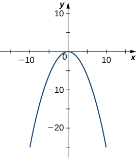 

**[T]** <math xmlns="http://www.w3.org/1998/Math/MathML"><mrow><msup><mi>x</mi><mn>2</mn></msup><mo>+</mo><msup><mi>z</mi><mn>2</mn></msup><mo>+</mo><mn>4</mn><mi>y</mi><mo>=</mo><mn>0</mn><mo>,</mo><mi>x</mi><mo>=</mo><mn>0</mn></mrow></math>

**[T]** <math xmlns="http://www.w3.org/1998/Math/MathML"><mrow><mn>−4</mn><msup><mi>x</mi><mn>2</mn></msup><mo>+</mo><mn>25</mn><msup><mi>y</mi><mn>2</mn></msup><mo>+</mo><msup><mi>z</mi><mn>2</mn></msup><mo>=</mo><mn>100</mn><mo>,</mo><mi>x</mi><mo>=</mo><mn>0</mn></mrow></math>

Ellipse <math xmlns="http://www.w3.org/1998/Math/MathML"><mrow><mfrac><mrow><msup><mi>y</mi><mn>2</mn></msup></mrow><mn>4</mn></mfrac><mo>+</mo><mfrac><mrow><msup><mi>z</mi><mn>2</mn></msup></mrow><mrow><mn>100</mn></mrow></mfrac><mo>=</mo><mn>1</mn><mo>,</mo></mrow></math>

* * *
{: data-type="newline"}

 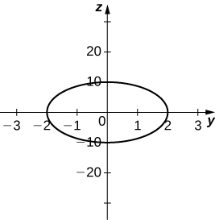 

**[T]** <math xmlns="http://www.w3.org/1998/Math/MathML"><mrow><mn>−4</mn><msup><mi>x</mi><mn>2</mn></msup><mo>+</mo><mn>25</mn><msup><mi>y</mi><mn>2</mn></msup><mo>+</mo><msup><mi>z</mi><mn>2</mn></msup><mo>=</mo><mn>100</mn><mo>,</mo><mi>y</mi><mo>=</mo><mn>0</mn></mrow></math>

**[T]** <math xmlns="http://www.w3.org/1998/Math/MathML"><mrow><msup><mi>x</mi><mn>2</mn></msup><mo>+</mo><mfrac><mrow><msup><mi>y</mi><mn>2</mn></msup></mrow><mn>4</mn></mfrac><mo>+</mo><mfrac><mrow><msup><mi>z</mi><mn>2</mn></msup></mrow><mrow><mn>100</mn></mrow></mfrac><mo>=</mo><mn>1</mn><mo>,</mo><mi>x</mi><mo>=</mo><mn>0</mn></mrow></math>

Ellipse <math xmlns="http://www.w3.org/1998/Math/MathML"><mrow><mfrac><mrow><msup><mi>y</mi><mn>2</mn></msup></mrow><mn>4</mn></mfrac><mo>+</mo><mfrac><mrow><msup><mi>z</mi><mn>2</mn></msup></mrow><mrow><mn>100</mn></mrow></mfrac><mo>=</mo><mn>1</mn><mo>,</mo></mrow></math>

* * *
{: data-type="newline"}

  

**[T]** <math xmlns="http://www.w3.org/1998/Math/MathML"><mrow><msup><mi>x</mi><mn>2</mn></msup><mo>−</mo><mi>y</mi><mo>−</mo><msup><mi>z</mi><mn>2</mn></msup><mo>=</mo><mn>1</mn><mo>,</mo><mi>y</mi><mo>=</mo><mn>0</mn></mrow></math>

Use the graph of the given quadric surface to answer the questions.

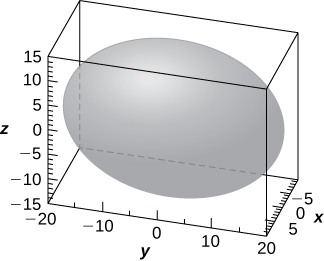

1.  Specify the name of the quadric surface.
2.  Which of the equations—
    <math xmlns="http://www.w3.org/1998/Math/MathML"><mrow><mn>16</mn><msup><mi>x</mi><mn>2</mn></msup><mo>+</mo><mn>9</mn><msup><mi>y</mi><mn>2</mn></msup><mo>+</mo><mn>36</mn><msup><mi>z</mi><mn>2</mn></msup><mo>=</mo><mn>3600</mn><mo>,</mo><mn>9</mn><msup><mi>x</mi><mn>2</mn></msup><mo>+</mo><mn>36</mn><msup><mi>y</mi><mn>2</mn></msup><mo>+</mo><mn>16</mn><msup><mi>z</mi><mn>2</mn></msup><mo>=</mo><mn>3600</mn><mo>,</mo></mrow></math>
    
    or
    <math xmlns="http://www.w3.org/1998/Math/MathML"><mrow><mn>36</mn><msup><mi>x</mi><mn>2</mn></msup><mo>+</mo><mn>9</mn><msup><mi>y</mi><mn>2</mn></msup><mo>+</mo><mn>16</mn><msup><mi>z</mi><mn>2</mn></msup><mo>=</mo><mn>3600</mn></mrow></math>
    
    —corresponds to the graph?
3.  Use b. to write the equation of the quadric surface in standard form.
{: data-number-style="lower-alpha"}

a. Ellipsoid; b. The third equation; c. <math xmlns="http://www.w3.org/1998/Math/MathML"><mrow><mfrac><mrow><msup><mi>x</mi><mn>2</mn></msup></mrow><mrow><mn>100</mn></mrow></mfrac><mo>+</mo><mfrac><mrow><msup><mi>y</mi><mn>2</mn></msup></mrow><mrow><mn>400</mn></mrow></mfrac><mo>+</mo><mfrac><mrow><msup><mi>z</mi><mn>2</mn></msup></mrow><mrow><mn>225</mn></mrow></mfrac><mo>=</mo><mn>1</mn></mrow></math>

Use the graph of the given quadric surface to answer the questions.

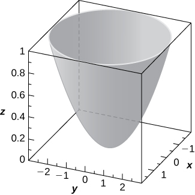

1.  Specify the name of the quadric surface.
2.  Which of the equations—
    <math xmlns="http://www.w3.org/1998/Math/MathML"><mrow><mn>36</mn><mi>z</mi><mo>=</mo><mn>9</mn><msup><mi>x</mi><mn>2</mn></msup><mo>+</mo><msup><mi>y</mi><mn>2</mn></msup><mo>,</mo><mn>9</mn><msup><mi>x</mi><mn>2</mn></msup><mo>+</mo><mn>4</mn><msup><mi>y</mi><mn>2</mn></msup><mo>=</mo><mn>36</mn><mi>z</mi><mo>,</mo><mspace width="0.2em" /><mtext>or</mtext><mspace width="0.2em" /><mo>−</mo><mn>36</mn><mi>z</mi><mo>=</mo><mn>−81</mn><msup><mi>x</mi><mn>2</mn></msup><mo>+</mo><mn>4</mn><msup><mi>y</mi><mn>2</mn></msup></mrow></math>
    
    —corresponds to the graph above?
3.  Use b. to write the equation of the quadric surface in standard form.
{: data-number-style="lower-alpha"}

For the following exercises, the equation of a quadric surface is given.

1.  Use the method of completing the square to write the equation in standard form.
2.  Identify the surface.
{: data-number-style="lower-alpha"}

<math xmlns="http://www.w3.org/1998/Math/MathML"><mrow><msup><mi>x</mi><mn>2</mn></msup><mo>+</mo><mn>2</mn><msup><mi>z</mi><mn>2</mn></msup><mo>+</mo><mn>6</mn><mi>x</mi><mo>−</mo><mn>8</mn><mi>z</mi><mo>+</mo><mn>1</mn><mo>=</mo><mn>0</mn></mrow></math>

a. <math xmlns="http://www.w3.org/1998/Math/MathML"><mrow><mfrac><mrow><msup><mrow><mrow><mo>(</mo><mrow><mi>x</mi><mo>+</mo><mn>3</mn></mrow><mo>)</mo></mrow></mrow><mn>2</mn></msup></mrow><mrow><mn>16</mn></mrow></mfrac><mo>+</mo><mfrac><mrow><msup><mrow><mrow><mo>(</mo><mrow><mi>z</mi><mo>−</mo><mn>2</mn></mrow><mo>)</mo></mrow></mrow><mn>2</mn></msup></mrow><mn>8</mn></mfrac><mo>=</mo><mn>1</mn><mo>;</mo></mrow></math>

 b. Cylinder centered at <math xmlns="http://www.w3.org/1998/Math/MathML"><mrow><mrow><mo>(</mo><mrow><mn>−3</mn><mo>,</mo><mn>2</mn></mrow><mo>)</mo></mrow></mrow></math>

 with rulings parallel to the *y*-axis

<math xmlns="http://www.w3.org/1998/Math/MathML"><mrow><mn>4</mn><msup><mi>x</mi><mn>2</mn></msup><mo>−</mo><msup><mi>y</mi><mn>2</mn></msup><mo>+</mo><msup><mi>z</mi><mn>2</mn></msup><mo>−</mo><mn>8</mn><mi>x</mi><mo>+</mo><mn>2</mn><mi>y</mi><mo>+</mo><mn>2</mn><mi>z</mi><mo>+</mo><mn>3</mn><mo>=</mo><mn>0</mn></mrow></math>

<math xmlns="http://www.w3.org/1998/Math/MathML"><mrow><msup><mi>x</mi><mn>2</mn></msup><mo>+</mo><mn>4</mn><msup><mi>y</mi><mn>2</mn></msup><mo>−</mo><mn>4</mn><msup><mi>z</mi><mn>2</mn></msup><mo>−</mo><mn>6</mn><mi>x</mi><mo>−</mo><mn>16</mn><mi>y</mi><mo>−</mo><mn>16</mn><mi>z</mi><mo>+</mo><mn>5</mn><mo>=</mo><mn>0</mn></mrow></math>

a. <math xmlns="http://www.w3.org/1998/Math/MathML"><mrow><mfrac><mrow><msup><mrow><mrow><mo>(</mo><mrow><mi>x</mi><mo>−</mo><mn>3</mn></mrow><mo>)</mo></mrow></mrow><mn>2</mn></msup></mrow><mn>4</mn></mfrac><mo>+</mo><msup><mrow><mrow><mo>(</mo><mrow><mi>y</mi><mo>−</mo><mn>2</mn></mrow><mo>)</mo></mrow></mrow><mn>2</mn></msup><mo>−</mo><msup><mrow><mrow><mo>(</mo><mrow><mi>z</mi><mo>+</mo><mn>2</mn></mrow><mo>)</mo></mrow></mrow><mn>2</mn></msup><mo>=</mo><mn>1</mn><mo>;</mo></mrow></math>

 b. Hyperboloid of one sheet centered at <math xmlns="http://www.w3.org/1998/Math/MathML"><mrow><mrow><mo>(</mo><mrow><mn>3</mn><mo>,</mo><mn>2</mn><mo>,</mo><mn>−2</mn></mrow><mo>)</mo></mrow><mo>,</mo></mrow></math>

 with the *z*-axis as its axis of symmetry

<math xmlns="http://www.w3.org/1998/Math/MathML"><mrow><msup><mi>x</mi><mn>2</mn></msup><mo>+</mo><msup><mi>z</mi><mn>2</mn></msup><mo>−</mo><mn>4</mn><mi>y</mi><mo>+</mo><mn>4</mn><mo>=</mo><mn>0</mn></mrow></math>

<math xmlns="http://www.w3.org/1998/Math/MathML"><mrow><msup><mi>x</mi><mn>2</mn></msup><mo>+</mo><mfrac><mrow><msup><mi>y</mi><mn>2</mn></msup></mrow><mn>4</mn></mfrac><mo>−</mo><mfrac><mrow><msup><mi>z</mi><mn>2</mn></msup></mrow><mn>3</mn></mfrac><mo>+</mo><mn>6</mn><mi>x</mi><mo>+</mo><mn>9</mn><mo>=</mo><mn>0</mn></mrow></math>

a. <math xmlns="http://www.w3.org/1998/Math/MathML"><mrow><msup><mrow><mrow><mo>(</mo><mrow><mi>x</mi><mo>+</mo><mn>3</mn></mrow><mo>)</mo></mrow></mrow><mn>2</mn></msup><mo>+</mo><mfrac><mrow><msup><mi>y</mi><mn>2</mn></msup></mrow><mn>4</mn></mfrac><mo>−</mo><mfrac><mrow><msup><mi>z</mi><mn>2</mn></msup></mrow><mn>3</mn></mfrac><mo>=</mo><mn>0</mn><mo>;</mo></mrow></math>

 b. Elliptic cone centered at <math xmlns="http://www.w3.org/1998/Math/MathML"><mrow><mrow><mo>(</mo><mrow><mn>−3</mn><mo>,</mo><mn>0</mn><mo>,</mo><mn>0</mn></mrow><mo>)</mo></mrow><mo>,</mo></mrow></math>

 with the *z*-axis as its axis of symmetry

<math xmlns="http://www.w3.org/1998/Math/MathML"><mrow><msup><mi>x</mi><mn>2</mn></msup><mo>−</mo><msup><mi>y</mi><mn>2</mn></msup><mo>+</mo><msup><mi>z</mi><mn>2</mn></msup><mo>−</mo><mn>12</mn><mi>z</mi><mo>+</mo><mn>2</mn><mi>x</mi><mo>+</mo><mn>37</mn><mo>=</mo><mn>0</mn></mrow></math>

Write the standard form of the equation of the ellipsoid centered at the origin that passes through points <math xmlns="http://www.w3.org/1998/Math/MathML"><mrow><mi>A</mi><mrow><mo>(</mo><mrow><mn>2</mn><mo>,</mo><mn>0</mn><mo>,</mo><mn>0</mn></mrow><mo>)</mo></mrow><mo>,</mo><mi>B</mi><mrow><mo>(</mo><mrow><mn>0</mn><mo>,</mo><mn>0</mn><mo>,</mo><mn>1</mn></mrow><mo>)</mo></mrow><mo>,</mo></mrow></math>

 and <math xmlns="http://www.w3.org/1998/Math/MathML"><mrow><mi>C</mi><mrow><mo>(</mo><mrow><mfrac><mn>1</mn><mn>2</mn></mfrac><mo>,</mo><msqrt><mrow><mn>11</mn></mrow></msqrt><mo>,</mo><mfrac><mn>1</mn><mn>2</mn></mfrac></mrow><mo>)</mo></mrow><mo>.</mo></mrow></math>

<math xmlns="http://www.w3.org/1998/Math/MathML"><mrow><mfrac><mrow><msup><mi>x</mi><mn>2</mn></msup></mrow><mn>4</mn></mfrac><mo>+</mo><mfrac><mrow><msup><mi>y</mi><mn>2</mn></msup></mrow><mrow><mn>16</mn></mrow></mfrac><mo>+</mo><msup><mi>z</mi><mn>2</mn></msup><mo>=</mo><mn>1</mn></mrow></math>

Write the standard form of the equation of the ellipsoid centered at point <math xmlns="http://www.w3.org/1998/Math/MathML"><mrow><mi>P</mi><mrow><mo>(</mo><mrow><mn>1</mn><mo>,</mo><mn>1</mn><mo>,</mo><mn>0</mn></mrow><mo>)</mo></mrow></mrow></math>

 that passes through points <math xmlns="http://www.w3.org/1998/Math/MathML"><mrow><mi>A</mi><mrow><mo>(</mo><mrow><mn>6</mn><mo>,</mo><mn>1</mn><mo>,</mo><mn>0</mn></mrow><mo>)</mo></mrow><mo>,</mo><mi>B</mi><mrow><mo>(</mo><mrow><mn>4</mn><mo>,</mo><mn>2</mn><mo>,</mo><mn>0</mn></mrow><mo>)</mo></mrow></mrow></math>

 and <math xmlns="http://www.w3.org/1998/Math/MathML"><mrow><mi>C</mi><mrow><mo>(</mo><mrow><mn>1</mn><mo>,</mo><mn>2</mn><mo>,</mo><mn>1</mn></mrow><mo>)</mo></mrow><mo>.</mo></mrow></math>

Determine the intersection points of elliptic cone <math xmlns="http://www.w3.org/1998/Math/MathML"><mrow><msup><mi>x</mi><mn>2</mn></msup><mo>−</mo><msup><mi>y</mi><mn>2</mn></msup><mo>−</mo><msup><mi>z</mi><mn>2</mn></msup><mo>=</mo><mn>0</mn></mrow></math>

 with the line of symmetric equations <math xmlns="http://www.w3.org/1998/Math/MathML"><mrow><mfrac><mrow><mi>x</mi><mo>−</mo><mn>1</mn></mrow><mn>2</mn></mfrac><mo>=</mo><mfrac><mrow><mi>y</mi><mo>+</mo><mn>1</mn></mrow><mn>3</mn></mfrac><mo>=</mo><mi>z</mi><mo>.</mo></mrow></math>

<math xmlns="http://www.w3.org/1998/Math/MathML"><mrow><mrow><mo>(</mo><mrow><mn>1</mn><mo>,</mo><mn>−1</mn><mo>,</mo><mn>0</mn></mrow><mo>)</mo></mrow></mrow></math>

 and <math xmlns="http://www.w3.org/1998/Math/MathML"><mrow><mrow><mo>(</mo><mrow><mfrac><mrow><mn>13</mn></mrow><mn>3</mn></mfrac><mo>,</mo><mn>4</mn><mo>,</mo><mfrac><mn>5</mn><mn>3</mn></mfrac></mrow><mo>)</mo></mrow></mrow></math>

Determine the intersection points of parabolic hyperboloid <math xmlns="http://www.w3.org/1998/Math/MathML"><mrow><mi>z</mi><mo>=</mo><mn>3</mn><msup><mi>x</mi><mn>2</mn></msup><mo>−</mo><mn>2</mn><msup><mi>y</mi><mn>2</mn></msup></mrow></math>

 with the line of parametric equations <math xmlns="http://www.w3.org/1998/Math/MathML"><mrow><mi>x</mi><mo>=</mo><mn>3</mn><mi>t</mi><mo>,</mo><mi>y</mi><mo>=</mo><mn>2</mn><mi>t</mi><mo>,</mo><mi>z</mi><mo>=</mo><mn>19</mn><mi>t</mi><mo>,</mo></mrow></math>

 where <math xmlns="http://www.w3.org/1998/Math/MathML"><mrow><mi>t</mi><mo>∈</mo><mo>ℝ</mo><mo>.</mo></mrow></math>

Find the equation of the quadric surface with points <math xmlns="http://www.w3.org/1998/Math/MathML"><mrow><mi>P</mi><mrow><mo>(</mo><mrow><mi>x</mi><mo>,</mo><mi>y</mi><mo>,</mo><mi>z</mi></mrow><mo>)</mo></mrow></mrow></math>

 that are equidistant from point <math xmlns="http://www.w3.org/1998/Math/MathML"><mrow><mi>Q</mi><mrow><mo>(</mo><mrow><mn>0</mn><mo>,</mo><mn>−1</mn><mo>,</mo><mn>0</mn></mrow><mo>)</mo></mrow></mrow></math>

 and plane of equation <math xmlns="http://www.w3.org/1998/Math/MathML"><mrow><mi>y</mi><mo>=</mo><mn>1</mn><mo>.</mo></mrow></math>

 Identify the surface.

<math xmlns="http://www.w3.org/1998/Math/MathML"><mrow><msup><mi>x</mi><mn>2</mn></msup><mo>+</mo><msup><mi>z</mi><mn>2</mn></msup><mo>+</mo><mn>4</mn><mi>y</mi><mo>=</mo><mn>0</mn><mo>,</mo></mrow></math>

 elliptic paraboloid

Find the equation of the quadric surface with points <math xmlns="http://www.w3.org/1998/Math/MathML"><mrow><mi>P</mi><mrow><mo>(</mo><mrow><mi>x</mi><mo>,</mo><mi>y</mi><mo>,</mo><mi>z</mi></mrow><mo>)</mo></mrow></mrow></math>

 that are equidistant from point <math xmlns="http://www.w3.org/1998/Math/MathML"><mrow><mi>Q</mi><mrow><mo>(</mo><mrow><mn>0</mn><mo>,</mo><mn>2</mn><mo>,</mo><mn>0</mn></mrow><mo>)</mo></mrow></mrow></math>

 and plane of equation <math xmlns="http://www.w3.org/1998/Math/MathML"><mrow><mi>y</mi><mo>=</mo><mn>−2</mn><mo>.</mo></mrow></math>

 Identify the surface.

If the surface of a parabolic reflector is described by equation <math xmlns="http://www.w3.org/1998/Math/MathML"><mrow><mn>400</mn><mi>z</mi><mo>=</mo><msup><mi>x</mi><mn>2</mn></msup><mo>+</mo><msup><mi>y</mi><mn>2</mn></msup><mo>,</mo></mrow></math>

 find the focal point of the reflector.

<math xmlns="http://www.w3.org/1998/Math/MathML"><mrow><mrow><mo>(</mo><mrow><mn>0</mn><mo>,</mo><mn>0</mn><mo>,</mo><mn>100</mn></mrow><mo>)</mo></mrow></mrow></math>

Consider the parabolic reflector described by equation <math xmlns="http://www.w3.org/1998/Math/MathML"><mrow><mi>z</mi><mo>=</mo><mn>20</mn><msup><mi>x</mi><mn>2</mn></msup><mo>+</mo><mn>20</mn><msup><mi>y</mi><mn>2</mn></msup><mo>.</mo></mrow></math>

 Find its focal point.

Show that quadric surface <math xmlns="http://www.w3.org/1998/Math/MathML"><mrow><msup><mi>x</mi><mn>2</mn></msup><mo>+</mo><msup><mi>y</mi><mn>2</mn></msup><mo>+</mo><msup><mi>z</mi><mn>2</mn></msup><mo>+</mo><mn>2</mn><mi>x</mi><mi>y</mi><mo>+</mo><mn>2</mn><mi>x</mi><mi>z</mi><mo>+</mo><mn>2</mn><mi>y</mi><mi>z</mi><mo>+</mo><mi>x</mi><mo>+</mo><mi>y</mi><mo>+</mo><mi>z</mi><mo>=</mo><mn>0</mn></mrow></math>

 reduces to two parallel planes.

Show that quadric surface <math xmlns="http://www.w3.org/1998/Math/MathML"><mrow><msup><mi>x</mi><mn>2</mn></msup><mo>+</mo><msup><mi>y</mi><mn>2</mn></msup><mo>+</mo><msup><mi>z</mi><mn>2</mn></msup><mo>−</mo><mn>2</mn><mi>x</mi><mi>y</mi><mo>−</mo><mn>2</mn><mi>x</mi><mi>z</mi><mo>+</mo><mn>2</mn><mi>y</mi><mi>z</mi><mo>−</mo><mn>1</mn><mo>=</mo><mn>0</mn></mrow></math>

 reduces to two parallel planes passing.

**[T]** The intersection between cylinder <math xmlns="http://www.w3.org/1998/Math/MathML"><mrow><msup><mrow><mrow><mo>(</mo><mrow><mi>x</mi><mo>−</mo><mn>1</mn></mrow><mo>)</mo></mrow></mrow><mn>2</mn></msup><mo>+</mo><msup><mi>y</mi><mn>2</mn></msup><mo>=</mo><mn>1</mn></mrow></math>

 and sphere <math xmlns="http://www.w3.org/1998/Math/MathML"><mrow><msup><mi>x</mi><mn>2</mn></msup><mo>+</mo><msup><mi>y</mi><mn>2</mn></msup><mo>+</mo><msup><mi>z</mi><mn>2</mn></msup><mo>=</mo><mn>4</mn></mrow></math>

 is called a *Viviani curve*.

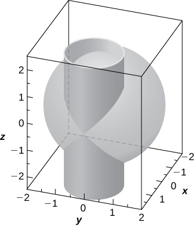

1.  Solve the system consisting of the equations of the surfaces to find the equation of the intersection curve. (*Hint:* Find
    <math xmlns="http://www.w3.org/1998/Math/MathML"><mi>x</mi></math>
    
    and
    <math xmlns="http://www.w3.org/1998/Math/MathML"><mi>y</mi></math>
    
    in terms of
    <math xmlns="http://www.w3.org/1998/Math/MathML"><mrow><mi>z</mi><mo>.</mo><mo stretchy="false">)</mo></mrow></math>

2.  Use a computer algebra system (CAS) to visualize the intersection curve on sphere
    <math xmlns="http://www.w3.org/1998/Math/MathML"><mrow><msup><mi>x</mi><mn>2</mn></msup><mo>+</mo><msup><mi>y</mi><mn>2</mn></msup><mo>+</mo><msup><mi>z</mi><mn>2</mn></msup><mo>=</mo><mn>4</mn><mo>.</mo></mrow></math>
{: data-number-style="lower-alpha"}

a. <math xmlns="http://www.w3.org/1998/Math/MathML"><mrow><mi>x</mi><mo>=</mo><mn>2</mn><mo>−</mo><mfrac><mrow><msup><mi>z</mi><mn>2</mn></msup></mrow><mn>2</mn></mfrac><mo>,</mo><mi>y</mi><mo>=</mo><mo>±</mo><mfrac><mi>z</mi><mn>2</mn></mfrac><msqrt><mrow><mn>4</mn><mo>−</mo><msup><mi>z</mi><mn>2</mn></msup></mrow></msqrt><mo>,</mo></mrow></math>

 where <math xmlns="http://www.w3.org/1998/Math/MathML"><mrow><mi>z</mi><mo>∈</mo><mrow><mo>[</mo><mrow><mn>−2</mn><mo>,</mo><mn>2</mn></mrow><mo>]</mo></mrow><mo>;</mo></mrow></math>

* * *
{: data-type="newline"}

 b.* * *
{: data-type="newline"}

 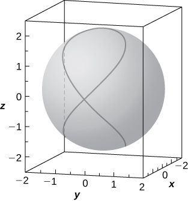 

Hyperboloid of one sheet <math xmlns="http://www.w3.org/1998/Math/MathML"><mrow><mn>25</mn><msup><mi>x</mi><mn>2</mn></msup><mo>+</mo><mn>25</mn><msup><mi>y</mi><mn>2</mn></msup><mo>−</mo><msup><mi>z</mi><mn>2</mn></msup><mo>=</mo><mn>25</mn></mrow></math>

 and elliptic cone <math xmlns="http://www.w3.org/1998/Math/MathML"><mrow><mn>−25</mn><msup><mi>x</mi><mn>2</mn></msup><mo>+</mo><mn>75</mn><msup><mi>y</mi><mn>2</mn></msup><mo>+</mo><msup><mi>z</mi><mn>2</mn></msup><mo>=</mo><mn>0</mn></mrow></math>

 are represented in the following figure along with their intersection curves. Identify the intersection curves and find their equations (*Hint:* Find *y* from the system consisting of the equations of the surfaces.)

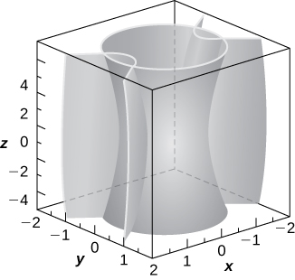

**[T]** Use a CAS to create the intersection between cylinder <math xmlns="http://www.w3.org/1998/Math/MathML"><mrow><mn>9</mn><msup><mi>x</mi><mn>2</mn></msup><mo>+</mo><mn>4</mn><msup><mi>y</mi><mn>2</mn></msup><mo>=</mo><mn>18</mn></mrow></math>

 and ellipsoid <math xmlns="http://www.w3.org/1998/Math/MathML"><mrow><mn>36</mn><msup><mi>x</mi><mn>2</mn></msup><mo>+</mo><mn>16</mn><msup><mi>y</mi><mn>2</mn></msup><mo>+</mo><mn>9</mn><msup><mi>z</mi><mn>2</mn></msup><mo>=</mo><mn>144</mn><mo>,</mo></mrow></math>

 and find the equations of the intersection curves.

* * *
{: data-type="newline"}

 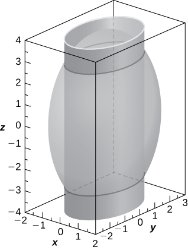 
* * *
{: data-type="newline"}

 two ellipses of equations <math xmlns="http://www.w3.org/1998/Math/MathML"><mrow><mfrac><mrow><msup><mi>x</mi><mn>2</mn></msup></mrow><mn>2</mn></mfrac><mo>+</mo><mfrac><mrow><msup><mi>y</mi><mn>2</mn></msup></mrow><mrow><mfrac><mn>9</mn><mn>2</mn></mfrac></mrow></mfrac><mo>=</mo><mn>1</mn></mrow></math>

 in planes <math xmlns="http://www.w3.org/1998/Math/MathML"><mrow><mi>z</mi><mo>=</mo><mtext>±</mtext><mn>2</mn><msqrt><mn>2</mn></msqrt></mrow></math>

**[T]** A spheroid is an ellipsoid with two equal semiaxes. For instance, the equation of a spheroid with the *z*-axis as its axis of symmetry is given by <math xmlns="http://www.w3.org/1998/Math/MathML"><mrow><mfrac><mrow><msup><mi>x</mi><mn>2</mn></msup></mrow><mrow><msup><mi>a</mi><mn>2</mn></msup></mrow></mfrac><mo>+</mo><mfrac><mrow><msup><mi>y</mi><mn>2</mn></msup></mrow><mrow><msup><mi>a</mi><mn>2</mn></msup></mrow></mfrac><mo>+</mo><mfrac><mrow><msup><mi>z</mi><mn>2</mn></msup></mrow><mrow><msup><mi>c</mi><mn>2</mn></msup></mrow></mfrac><mo>=</mo><mn>1</mn><mo>,</mo></mrow></math>

 where <math xmlns="http://www.w3.org/1998/Math/MathML"><mi>a</mi></math>

 and <math xmlns="http://www.w3.org/1998/Math/MathML"><mi>c</mi></math>

 are positive real numbers. The spheroid is called *oblate* if <math xmlns="http://www.w3.org/1998/Math/MathML"><mrow><mi>c</mi><mo>&lt;</mo><mi>a</mi><mo>,</mo></mrow></math>

 and *prolate* for <math xmlns="http://www.w3.org/1998/Math/MathML"><mrow><mi>c</mi><mo>&gt;</mo><mi>a</mi><mo>.</mo></mrow></math>

1.  The eye cornea is approximated as a prolate spheroid with an axis that is the eye, where
    <math xmlns="http://www.w3.org/1998/Math/MathML"><mrow><mi>a</mi><mo>=</mo><mn>8.7</mn><mspace width="0.2em" /><mtext>mm and</mtext><mspace width="0.2em" /><mi>c</mi><mo>=</mo><mn>9.6</mn><mspace width="0.2em" /><mtext>mm</mtext><mo>.</mo></mrow></math>
    
    Write the equation of the spheroid that models the cornea and sketch the surface.
2.  Give two examples of objects with prolate spheroid shapes.
{: data-number-style="lower-alpha"}

**[T]** In cartography, Earth is approximated by an oblate spheroid rather than a sphere. The radii at the equator and poles are approximately <math xmlns="http://www.w3.org/1998/Math/MathML"><mrow><mn>3963</mn></mrow></math>

 mi and <math xmlns="http://www.w3.org/1998/Math/MathML"><mrow><mn>3950</mn></mrow></math>

 mi, respectively.

1.  Write the equation in standard form of the ellipsoid that represents the shape of Earth. Assume the center of Earth is at the origin and that the trace formed by plane
    <math xmlns="http://www.w3.org/1998/Math/MathML"><mrow><mi>z</mi><mo>=</mo><mn>0</mn></mrow></math>
    
    corresponds to the equator.
2.  Sketch the graph.
3.  Find the equation of the intersection curve of the surface with plane
    <math xmlns="http://www.w3.org/1998/Math/MathML"><mrow><mi>z</mi><mo>=</mo><mn>1000</mn></mrow></math>
    
    that is parallel to the *xy*-plane. The intersection curve is called a *parallel*.
4.  Find the equation of the intersection curve of the surface with plane
    <math xmlns="http://www.w3.org/1998/Math/MathML"><mrow><mi>x</mi><mo>+</mo><mi>y</mi><mo>=</mo><mn>0</mn></mrow></math>
    
    that passes through the *z*-axis. The intersection curve is called a *meridian*.
{: data-number-style="lower-alpha"}

a. <math xmlns="http://www.w3.org/1998/Math/MathML"><mrow><mfrac><mrow><msup><mi>x</mi><mn>2</mn></msup></mrow><mrow><msup><mrow><mn>3963</mn></mrow><mn>2</mn></msup></mrow></mfrac><mo>+</mo><mfrac><mrow><msup><mi>y</mi><mn>2</mn></msup></mrow><mrow><msup><mrow><mn>3963</mn></mrow><mn>2</mn></msup></mrow></mfrac><mo>+</mo><mfrac><mrow><msup><mi>z</mi><mn>2</mn></msup></mrow><mrow><msup><mrow><mn>3950</mn></mrow><mn>2</mn></msup></mrow></mfrac><mo>=</mo><mn>1</mn><mo>;</mo></mrow></math>

* * *
{: data-type="newline"}

 b.* * *
{: data-type="newline"}

 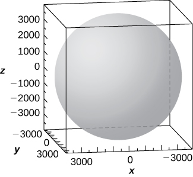 
;* * *
{: data-type="newline"}

 c. The intersection curve is the ellipse of equation <math xmlns="http://www.w3.org/1998/Math/MathML"><mrow><mfrac><mrow><msup><mi>x</mi><mn>2</mn></msup></mrow><mrow><msup><mrow><mn>3963</mn></mrow><mn>2</mn></msup></mrow></mfrac><mo>+</mo><mfrac><mrow><msup><mi>y</mi><mn>2</mn></msup></mrow><mrow><msup><mrow><mn>3963</mn></mrow><mn>2</mn></msup></mrow></mfrac><mo>=</mo><mfrac><mrow><mrow><mo>(</mo><mrow><mn>2950</mn></mrow><mo>)</mo></mrow><mrow><mo>(</mo><mrow><mn>4950</mn></mrow><mo>)</mo></mrow></mrow><mrow><msup><mrow><mn>3950</mn></mrow><mn>2</mn></msup></mrow></mfrac><mo>,</mo></mrow></math>

 and the intersection is an ellipse.; d. The intersection curve is the ellipse of equation <math xmlns="http://www.w3.org/1998/Math/MathML"><mrow><mfrac><mrow><mn>2</mn><msup><mi>y</mi><mn>2</mn></msup></mrow><mrow><msup><mrow><mn>3963</mn></mrow><mn>2</mn></msup></mrow></mfrac><mo>+</mo><mfrac><mrow><msup><mi>z</mi><mn>2</mn></msup></mrow><mrow><msup><mrow><mn>3950</mn></mrow><mn>2</mn></msup></mrow></mfrac><mo>=</mo><mn>1</mn><mo>.</mo></mrow></math>

**[T]** A set of buzzing stunt magnets (or “rattlesnake eggs”) includes two sparkling, polished, superstrong spheroid-shaped magnets well-known for children’s entertainment. Each magnet is <math xmlns="http://www.w3.org/1998/Math/MathML"><mrow><mn>1.625</mn></mrow></math>

 in. long and <math xmlns="http://www.w3.org/1998/Math/MathML"><mrow><mn>0.5</mn></mrow></math>

 in. wide at the middle. While tossing them into the air, they create a buzzing sound as they attract each other.

1.  Write the equation of the prolate spheroid centered at the origin that describes the shape of one of the magnets.
2.  Write the equations of the prolate spheroids that model the shape of the buzzing stunt magnets. Use a CAS to create the graphs.
{: data-number-style="lower-alpha"}

**[T]** A heart-shaped surface is given by equation <math xmlns="http://www.w3.org/1998/Math/MathML"><mrow><msup><mrow><mrow><mo>(</mo><mrow><msup><mi>x</mi><mn>2</mn></msup><mo>+</mo><mfrac><mn>9</mn><mn>4</mn></mfrac><msup><mi>y</mi><mn>2</mn></msup><mo>+</mo><msup><mi>z</mi><mn>2</mn></msup><mo>−</mo><mn>1</mn></mrow><mo>)</mo></mrow></mrow><mn>3</mn></msup><mo>−</mo><msup><mi>x</mi><mn>2</mn></msup><msup><mi>z</mi><mn>3</mn></msup><mo>−</mo><mfrac><mn>9</mn><mrow><mn>80</mn></mrow></mfrac><msup><mi>y</mi><mn>2</mn></msup><msup><mi>z</mi><mn>3</mn></msup><mo>=</mo><mn>0</mn><mo>.</mo></mrow></math>

1.  Use a CAS to graph the surface that models this shape.
2.  Determine and sketch the trace of the heart-shaped surface on the *xz*-plane.
{: data-number-style="lower-alpha"}

a.* * *
{: data-type="newline"}

 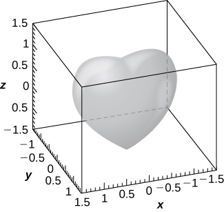 
* * *
{: data-type="newline"}

 b. The intersection curve is <math xmlns="http://www.w3.org/1998/Math/MathML"><mrow><msup><mrow><mrow><mo>(</mo><mrow><msup><mi>x</mi><mn>2</mn></msup><mo>+</mo><msup><mi>z</mi><mn>2</mn></msup><mo>−</mo><mn>1</mn></mrow><mo>)</mo></mrow></mrow><mn>3</mn></msup><mo>−</mo><msup><mi>x</mi><mn>2</mn></msup><msup><mi>z</mi><mn>3</mn></msup><mo>=</mo><mn>0</mn><mo>.</mo></mrow></math>

* * *
{: data-type="newline"}

 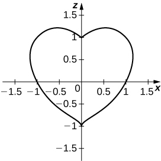 

**[T]** The ring torus symmetric about the *z*-axis is a special type of surface in topology and its equation is given by <math xmlns="http://www.w3.org/1998/Math/MathML"><mrow><msup><mrow><mrow><mo>(</mo><mrow><msup><mi>x</mi><mn>2</mn></msup><mo>+</mo><msup><mi>y</mi><mn>2</mn></msup><mo>+</mo><msup><mi>z</mi><mn>2</mn></msup><mo>+</mo><msup><mi>R</mi><mn>2</mn></msup><mo>−</mo><msup><mi>r</mi><mn>2</mn></msup></mrow><mo>)</mo></mrow></mrow><mn>2</mn></msup><mo>=</mo><mn>4</mn><msup><mi>R</mi><mn>2</mn></msup><mrow><mo>(</mo><mrow><msup><mi>x</mi><mn>2</mn></msup><mo>+</mo><msup><mi>y</mi><mn>2</mn></msup></mrow><mo>)</mo></mrow><mo>,</mo></mrow></math>

 where <math xmlns="http://www.w3.org/1998/Math/MathML"><mrow><mi>R</mi><mo>&gt;</mo><mi>r</mi><mo>&gt;</mo><mn>0</mn><mo>.</mo></mrow></math>

 The numbers <math xmlns="http://www.w3.org/1998/Math/MathML"><mi>R</mi></math>

 and <math xmlns="http://www.w3.org/1998/Math/MathML"><mi>r</mi></math>

 are called are the major and minor radii, respectively, of the surface. The following figure shows a ring torus for which <math xmlns="http://www.w3.org/1998/Math/MathML"><mrow><mi>R</mi><mo>=</mo><mn>2</mn><mspace width="0.2em" /><mtext>and</mtext><mspace width="0.2em" /><mi>r</mi><mo>=</mo><mn>1</mn><mo>.</mo></mrow></math>

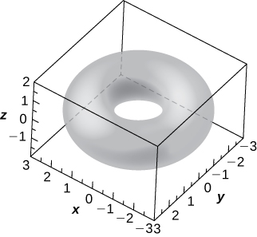

1.  Write the equation of the ring torus with
    <math xmlns="http://www.w3.org/1998/Math/MathML"><mrow><mi>R</mi><mo>=</mo><mn>2</mn><mspace width="0.2em" /><mtext>and</mtext><mspace width="0.2em" /><mi>r</mi><mo>=</mo><mn>1</mn><mo>,</mo></mrow></math>
    
    and use a CAS to graph the surface. Compare the graph with the figure given.
2.  Determine the equation and sketch the trace of the ring torus from a. on the *xy*-plane.
3.  Give two examples of objects with ring torus shapes.
{: data-number-style="lower-alpha"}

</section>

### Glossary
{: data-type="glossary-title"}

cylinder
: a set of lines parallel to a given line passing through a given curve
^

ellipsoid
: a three-dimensional surface described by an equation of the form
  <math xmlns="http://www.w3.org/1998/Math/MathML"><mrow><mfrac><mrow><msup><mi>x</mi><mn>2</mn></msup></mrow><mrow><msup><mi>a</mi><mn>2</mn></msup></mrow></mfrac><mo>+</mo><mfrac><mrow><msup><mi>y</mi><mn>2</mn></msup></mrow><mrow><msup><mi>b</mi><mn>2</mn></msup></mrow></mfrac><mo>+</mo><mfrac><mrow><msup><mi>z</mi><mn>2</mn></msup></mrow><mrow><msup><mi>c</mi><mn>2</mn></msup></mrow></mfrac><mo>=</mo><mn>1</mn><mo>;</mo></mrow></math>
  
  all traces of this surface are ellipses
^

elliptic cone
: a three-dimensional surface described by an equation of the form
  <math xmlns="http://www.w3.org/1998/Math/MathML"><mrow><mfrac><mrow><msup><mi>x</mi><mn>2</mn></msup></mrow><mrow><msup><mi>a</mi><mn>2</mn></msup></mrow></mfrac><mo>+</mo><mfrac><mrow><msup><mi>y</mi><mn>2</mn></msup></mrow><mrow><msup><mi>b</mi><mn>2</mn></msup></mrow></mfrac><mo>−</mo><mfrac><mrow><msup><mi>z</mi><mn>2</mn></msup></mrow><mrow><msup><mi>c</mi><mn>2</mn></msup></mrow></mfrac><mo>=</mo><mn>0</mn><mo>;</mo></mrow></math>
  
  traces of this surface include ellipses and intersecting lines
^

elliptic paraboloid
: a three-dimensional surface described by an equation of the form
  <math xmlns="http://www.w3.org/1998/Math/MathML"><mrow><mi>z</mi><mo>=</mo><mfrac><mrow><msup><mi>x</mi><mn>2</mn></msup></mrow><mrow><msup><mi>a</mi><mn>2</mn></msup></mrow></mfrac><mo>+</mo><mfrac><mrow><msup><mi>y</mi><mn>2</mn></msup></mrow><mrow><msup><mi>b</mi><mn>2</mn></msup></mrow></mfrac><mo>;</mo></mrow></math>
  
  traces of this surface include ellipses and parabolas
^

hyperboloid of one sheet
: a three-dimensional surface described by an equation of the form
  <math xmlns="http://www.w3.org/1998/Math/MathML"><mrow><mfrac><mrow><msup><mi>x</mi><mn>2</mn></msup></mrow><mrow><msup><mi>a</mi><mn>2</mn></msup></mrow></mfrac><mo>+</mo><mfrac><mrow><msup><mi>y</mi><mn>2</mn></msup></mrow><mrow><msup><mi>b</mi><mn>2</mn></msup></mrow></mfrac><mo>−</mo><mfrac><mrow><msup><mi>z</mi><mn>2</mn></msup></mrow><mrow><msup><mi>c</mi><mn>2</mn></msup></mrow></mfrac><mo>=</mo><mn>1</mn><mo>;</mo></mrow></math>
  
  traces of this surface include ellipses and hyperbolas
^

hyperboloid of two sheets
: a three-dimensional surface described by an equation of the form
  <math xmlns="http://www.w3.org/1998/Math/MathML"><mrow><mfrac><mrow><msup><mi>z</mi><mn>2</mn></msup></mrow><mrow><msup><mi>c</mi><mn>2</mn></msup></mrow></mfrac><mo>−</mo><mfrac><mrow><msup><mi>x</mi><mn>2</mn></msup></mrow><mrow><msup><mi>a</mi><mn>2</mn></msup></mrow></mfrac><mo>−</mo><mfrac><mrow><msup><mi>y</mi><mn>2</mn></msup></mrow><mrow><msup><mi>b</mi><mn>2</mn></msup></mrow></mfrac><mo>=</mo><mn>1</mn><mo>;</mo></mrow></math>
  
  traces of this surface include ellipses and hyperbolas
^

quadric surfaces
: surfaces in three dimensions having the property that the traces of the surface are conic sections (ellipses, hyperbolas, and parabolas)
^

rulings
: parallel lines that make up a cylindrical surface
^

trace
: the intersection of a three-dimensional surface with a coordinate plane

